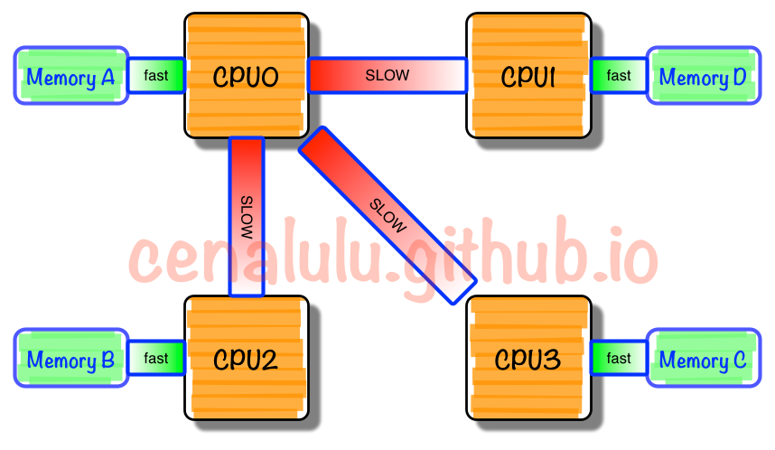

## 摘要

最近在使用戴尔R740服务器时发现这个机器NUMA默认是单双核绑定的，且没有办法更改，在使用时带来了较多的不便，这里主要记录一些关于进程绑定与ID的情报。

<!-- more --> 

## NUMA是什么

摘自http://cenalulu.github.io/linux/numa/

> #### 为什么要有NUMA
>
> 在NUMA架构出现前，CPU欢快的朝着频率越来越高的方向发展。受到物理极限的挑战，又转为核数越来越多的方向发展。如果每个core的工作性质都是share-nothing（类似于map-reduce的node节点的作业属性），那么也许就不会有NUMA。由于所有CPU Core都是通过共享一个北桥来读取内存，随着核数如何的发展，北桥在响应时间上的性能瓶颈越来越明显。于是，聪明的硬件设计师们，先到了把内存控制器（原本北桥中读取内存的部分）也做个拆分，平分到了每个die上。于是NUMA就出现了！
>
> #### NUMA是什么
>
> NUMA中，虽然内存直接attach在CPU上，但是由于内存被平均分配在了各个die上。只有当CPU访问自身直接attach内存对应的物理地址时，才会有较短的响应时间（后称`Local Access`）。而如果需要访问其他CPU attach的内存的数据时，就需要通过inter-connect通道访问，响应时间就相比之前变慢了（后称`Remote Access`）。所以NUMA（Non-Uniform Memory Access）就此得名。
>
> 
>
> #### 我们需要为NUMA做什么
>
> 假设你是Linux教父Linus，对于NUMA架构你会做哪些优化？下面这点是显而易见的：
>
> > 既然CPU只有在Local-Access时响应时间才能有保障，那么我们就尽量把该CPU所要的数据集中在他local的内存中就OK啦~
>
> 没错，事实上Linux识别到NUMA架构后，默认的内存分配方案就是：优先尝试在请求线程当前所处的CPU的Local内存上分配空间。如果local内存不足，优先淘汰local内存中无用的Page（Inactive，Unmapped）。

## 环境

服务器：戴尔 R740双路服务器

CPU： Intel Xeon Gold 6150 CPU @ 2.70GHz （18核）

内存：12通道，24各内存插槽各插有一根8G内存

## 几个重要的命令中CPU编号与物理核的对应关系

### 本文中的定义

#### 物理编号

指同一台物理机上两个CPU的核按顺序编号，即第一个CPU的18个核心标号从0-17，第二个CPU的18个核心编号18-35，在`lscpu`中看到的就是物理编号。

#### 逻辑编号

指在操作系统中看到的CPU的裸机编号，即在`/proc/cpuinfo`中的`processor`编号，和`top`或者`htop`中看到的编号

### `lscpu`

```
Architecture:          x86_64
CPU op-mode(s):        32-bit, 64-bit
Byte Order:            Little Endian
CPU(s):                36
On-line CPU(s) list:   0-35
Thread(s) per core:    1
Core(s) per socket:    18
Socket(s):             2
NUMA node(s):          2
Vendor ID:             GenuineIntel
CPU family:            6
Model:                 85
Model name:            Intel(R) Xeon(R) Gold 6150 CPU @ 2.70GHz
Stepping:              4
CPU MHz:               2700.000
BogoMIPS:              5400.00
Virtualization:        VT-x
L1d cache:             32K
L1i cache:             32K
L2 cache:              1024K
L3 cache:              25344K
NUMA node0 CPU(s):     0,2,4,6,8,10,12,14,16,18,20,22,24,26,28,30,32,34
NUMA node1 CPU(s):     1,3,5,7,9,11,13,15,17,19,21,23,25,27,29,31,33,35
Flags:                 fpu vme de pse tsc msr pae mce cx8 apic sep mtrr pge mca cmov pat pse36 clflush dts acpi mmx fxsr sse sse2 ss ht tm pbe syscall nx pdpe1gb rdtscp lm constant_tsc art arch_perfmon pebs bts rep_good nopl xtopology nonstop_tsc aperfmperf eagerfpu pni pclmulqdq dtes64 monitor ds_cpl vmx smx est tm2 ssse3 sdbg fma cx16 xtpr pdcm pcid dca sse4_1 sse4_2 x2apic movbe popcnt tsc_deadline_timer aes xsave avx f16c rdrand lahf_lm abm 3dnowprefetch epb cat_l3 cdp_l3 intel_ppin intel_pt ssbd mba ibrs ibpb stibp tpr_shadow vnmi flexpriority ept vpid fsgsbase tsc_adjust bmi1 hle avx2 smep bmi2 erms invpcid rtm cqm mpx rdt_a avx512f avx512dq rdseed adx smap clflushopt clwb avx512cd avx512bw avx512vl xsaveopt xsavec xgetbv1 cqm_llc cqm_occup_llc cqm_mbm_total cqm_mbm_local dtherm ida arat pln pts pku ospke spec_ctrl intel_stibp flush_l1d
```

可以从`NUMA node*`中看出，这台机器时单双核绑定的，注意这里编号，是两个CPU计算核心的编号，即第一个CPU中的18个核从0到17编号，第二个CPU的18个核从18-35编号。

### `hwloc-ls -v`

```
  NUMANode L#0 (P#0 local=99292588KB total=99292588KB)
    Package L#0 (P#0 CPUVendor=GenuineIntel CPUFamilyNumber=6 CPUModelNumber=85 CPUModel="Intel(R) Xeon(R) Gold 6150 CPU @ 2.70GHz" CPUStepping=4)
      L3Cache L#0 (size=25344KB linesize=64 ways=11 Inclusive=0)
        L2Cache L#0 (size=1024KB linesize=64 ways=16 Inclusive=0)
          L1dCache L#0 (size=32KB linesize=64 ways=8 Inclusive=0)
            L1iCache L#0 (size=32KB linesize=64 ways=8 Inclusive=0)
              Core L#0 (P#0)
                PU L#0 (P#0)
        L2Cache L#1 (size=1024KB linesize=64 ways=16 Inclusive=0)
          L1dCache L#1 (size=32KB linesize=64 ways=8 Inclusive=0)
            L1iCache L#1 (size=32KB linesize=64 ways=8 Inclusive=0)
              Core L#1 (P#4)
                PU L#1 (P#2)
        L2Cache L#2 (size=1024KB linesize=64 ways=16 Inclusive=0)
          L1dCache L#2 (size=32KB linesize=64 ways=8 Inclusive=0)
            L1iCache L#2 (size=32KB linesize=64 ways=8 Inclusive=0)
              Core L#2 (P#1)
                PU L#2 (P#4)
        L2Cache L#3 (size=1024KB linesize=64 ways=16 Inclusive=0)
          L1dCache L#3 (size=32KB linesize=64 ways=8 Inclusive=0)
            L1iCache L#3 (size=32KB linesize=64 ways=8 Inclusive=0)
              Core L#3 (P#3)
                PU L#3 (P#6)
        L2Cache L#4 (size=1024KB linesize=64 ways=16 Inclusive=0)
          L1dCache L#4 (size=32KB linesize=64 ways=8 Inclusive=0)
            L1iCache L#4 (size=32KB linesize=64 ways=8 Inclusive=0)
              Core L#4 (P#2)
                PU L#4 (P#8)
        L2Cache L#5 (size=1024KB linesize=64 ways=16 Inclusive=0)
          L1dCache L#5 (size=32KB linesize=64 ways=8 Inclusive=0)
            L1iCache L#5 (size=32KB linesize=64 ways=8 Inclusive=0)
              Core L#5 (P#11)
                PU L#5 (P#10)
        L2Cache L#6 (size=1024KB linesize=64 ways=16 Inclusive=0)
          L1dCache L#6 (size=32KB linesize=64 ways=8 Inclusive=0)
            L1iCache L#6 (size=32KB linesize=64 ways=8 Inclusive=0)
              Core L#6 (P#8)
                PU L#6 (P#12)
        L2Cache L#7 (size=1024KB linesize=64 ways=16 Inclusive=0)
          L1dCache L#7 (size=32KB linesize=64 ways=8 Inclusive=0)
            L1iCache L#7 (size=32KB linesize=64 ways=8 Inclusive=0)
              Core L#7 (P#10)
                PU L#7 (P#14)
        L2Cache L#8 (size=1024KB linesize=64 ways=16 Inclusive=0)
          L1dCache L#8 (size=32KB linesize=64 ways=8 Inclusive=0)
            L1iCache L#8 (size=32KB linesize=64 ways=8 Inclusive=0)
              Core L#8 (P#9)
                PU L#8 (P#16)
        L2Cache L#9 (size=1024KB linesize=64 ways=16 Inclusive=0)
          L1dCache L#9 (size=32KB linesize=64 ways=8 Inclusive=0)
            L1iCache L#9 (size=32KB linesize=64 ways=8 Inclusive=0)
              Core L#9 (P#20)
                PU L#9 (P#18)
        L2Cache L#10 (size=1024KB linesize=64 ways=16 Inclusive=0)
          L1dCache L#10 (size=32KB linesize=64 ways=8 Inclusive=0)
            L1iCache L#10 (size=32KB linesize=64 ways=8 Inclusive=0)
              Core L#10 (P#16)
                PU L#10 (P#20)
        L2Cache L#11 (size=1024KB linesize=64 ways=16 Inclusive=0)
          L1dCache L#11 (size=32KB linesize=64 ways=8 Inclusive=0)
            L1iCache L#11 (size=32KB linesize=64 ways=8 Inclusive=0)
              Core L#11 (P#19)
                PU L#11 (P#22)
        L2Cache L#12 (size=1024KB linesize=64 ways=16 Inclusive=0)
          L1dCache L#12 (size=32KB linesize=64 ways=8 Inclusive=0)
            L1iCache L#12 (size=32KB linesize=64 ways=8 Inclusive=0)
              Core L#12 (P#17)
                PU L#12 (P#24)
        L2Cache L#13 (size=1024KB linesize=64 ways=16 Inclusive=0)
          L1dCache L#13 (size=32KB linesize=64 ways=8 Inclusive=0)
            L1iCache L#13 (size=32KB linesize=64 ways=8 Inclusive=0)
              Core L#13 (P#18)
                PU L#13 (P#26)
        L2Cache L#14 (size=1024KB linesize=64 ways=16 Inclusive=0)
          L1dCache L#14 (size=32KB linesize=64 ways=8 Inclusive=0)
            L1iCache L#14 (size=32KB linesize=64 ways=8 Inclusive=0)
              Core L#14 (P#24)
                PU L#14 (P#28)
        L2Cache L#15 (size=1024KB linesize=64 ways=16 Inclusive=0)
          L1dCache L#15 (size=32KB linesize=64 ways=8 Inclusive=0)
            L1iCache L#15 (size=32KB linesize=64 ways=8 Inclusive=0)
              Core L#15 (P#27)
                PU L#15 (P#30)
        L2Cache L#16 (size=1024KB linesize=64 ways=16 Inclusive=0)
          L1dCache L#16 (size=32KB linesize=64 ways=8 Inclusive=0)
            L1iCache L#16 (size=32KB linesize=64 ways=8 Inclusive=0)
              Core L#16 (P#25)
                PU L#16 (P#32)
        L2Cache L#17 (size=1024KB linesize=64 ways=16 Inclusive=0)
          L1dCache L#17 (size=32KB linesize=64 ways=8 Inclusive=0)
            L1iCache L#17 (size=32KB linesize=64 ways=8 Inclusive=0)
              Core L#17 (P#26)
                PU L#17 (P#34)
  NUMANode L#1 (P#1 local=100663296KB total=100663296KB)
    Package L#1 (P#1 CPUVendor=GenuineIntel CPUFamilyNumber=6 CPUModelNumber=85 CPUModel="Intel(R) Xeon(R) Gold 6150 CPU @ 2.70GHz" CPUStepping=4)
      L3Cache L#1 (size=25344KB linesize=64 ways=11 Inclusive=0)
        L2Cache L#18 (size=1024KB linesize=64 ways=16 Inclusive=0)
          L1dCache L#18 (size=32KB linesize=64 ways=8 Inclusive=0)
            L1iCache L#18 (size=32KB linesize=64 ways=8 Inclusive=0)
              Core L#18 (P#0)
                PU L#18 (P#1)
        L2Cache L#19 (size=1024KB linesize=64 ways=16 Inclusive=0)
          L1dCache L#19 (size=32KB linesize=64 ways=8 Inclusive=0)
            L1iCache L#19 (size=32KB linesize=64 ways=8 Inclusive=0)
              Core L#19 (P#4)
                PU L#19 (P#3)
        L2Cache L#20 (size=1024KB linesize=64 ways=16 Inclusive=0)
          L1dCache L#20 (size=32KB linesize=64 ways=8 Inclusive=0)
            L1iCache L#20 (size=32KB linesize=64 ways=8 Inclusive=0)
              Core L#20 (P#1)
                PU L#20 (P#5)
        L2Cache L#21 (size=1024KB linesize=64 ways=16 Inclusive=0)
          L1dCache L#21 (size=32KB linesize=64 ways=8 Inclusive=0)
            L1iCache L#21 (size=32KB linesize=64 ways=8 Inclusive=0)
              Core L#21 (P#3)
                PU L#21 (P#7)
        L2Cache L#22 (size=1024KB linesize=64 ways=16 Inclusive=0)
          L1dCache L#22 (size=32KB linesize=64 ways=8 Inclusive=0)
            L1iCache L#22 (size=32KB linesize=64 ways=8 Inclusive=0)
              Core L#22 (P#2)
                PU L#22 (P#9)
        L2Cache L#23 (size=1024KB linesize=64 ways=16 Inclusive=0)
          L1dCache L#23 (size=32KB linesize=64 ways=8 Inclusive=0)
            L1iCache L#23 (size=32KB linesize=64 ways=8 Inclusive=0)
              Core L#23 (P#11)
                PU L#23 (P#11)
        L2Cache L#24 (size=1024KB linesize=64 ways=16 Inclusive=0)
          L1dCache L#24 (size=32KB linesize=64 ways=8 Inclusive=0)
            L1iCache L#24 (size=32KB linesize=64 ways=8 Inclusive=0)
              Core L#24 (P#8)
                PU L#24 (P#13)
        L2Cache L#25 (size=1024KB linesize=64 ways=16 Inclusive=0)
          L1dCache L#25 (size=32KB linesize=64 ways=8 Inclusive=0)
            L1iCache L#25 (size=32KB linesize=64 ways=8 Inclusive=0)
              Core L#25 (P#10)
                PU L#25 (P#15)
        L2Cache L#26 (size=1024KB linesize=64 ways=16 Inclusive=0)
          L1dCache L#26 (size=32KB linesize=64 ways=8 Inclusive=0)
            L1iCache L#26 (size=32KB linesize=64 ways=8 Inclusive=0)
              Core L#26 (P#9)
                PU L#26 (P#17)
        L2Cache L#27 (size=1024KB linesize=64 ways=16 Inclusive=0)
          L1dCache L#27 (size=32KB linesize=64 ways=8 Inclusive=0)
            L1iCache L#27 (size=32KB linesize=64 ways=8 Inclusive=0)
              Core L#27 (P#20)
                PU L#27 (P#19)
        L2Cache L#28 (size=1024KB linesize=64 ways=16 Inclusive=0)
          L1dCache L#28 (size=32KB linesize=64 ways=8 Inclusive=0)
            L1iCache L#28 (size=32KB linesize=64 ways=8 Inclusive=0)
              Core L#28 (P#16)
                PU L#28 (P#21)
        L2Cache L#29 (size=1024KB linesize=64 ways=16 Inclusive=0)
          L1dCache L#29 (size=32KB linesize=64 ways=8 Inclusive=0)
            L1iCache L#29 (size=32KB linesize=64 ways=8 Inclusive=0)
              Core L#29 (P#19)
                PU L#29 (P#23)
        L2Cache L#30 (size=1024KB linesize=64 ways=16 Inclusive=0)
          L1dCache L#30 (size=32KB linesize=64 ways=8 Inclusive=0)
            L1iCache L#30 (size=32KB linesize=64 ways=8 Inclusive=0)
              Core L#30 (P#17)
                PU L#30 (P#25)
        L2Cache L#31 (size=1024KB linesize=64 ways=16 Inclusive=0)
          L1dCache L#31 (size=32KB linesize=64 ways=8 Inclusive=0)
            L1iCache L#31 (size=32KB linesize=64 ways=8 Inclusive=0)
              Core L#31 (P#18)
                PU L#31 (P#27)
        L2Cache L#32 (size=1024KB linesize=64 ways=16 Inclusive=0)
          L1dCache L#32 (size=32KB linesize=64 ways=8 Inclusive=0)
            L1iCache L#32 (size=32KB linesize=64 ways=8 Inclusive=0)
              Core L#32 (P#24)
                PU L#32 (P#29)
        L2Cache L#33 (size=1024KB linesize=64 ways=16 Inclusive=0)
          L1dCache L#33 (size=32KB linesize=64 ways=8 Inclusive=0)
            L1iCache L#33 (size=32KB linesize=64 ways=8 Inclusive=0)
              Core L#33 (P#27)
                PU L#33 (P#31)
        L2Cache L#34 (size=1024KB linesize=64 ways=16 Inclusive=0)
          L1dCache L#34 (size=32KB linesize=64 ways=8 Inclusive=0)
            L1iCache L#34 (size=32KB linesize=64 ways=8 Inclusive=0)
              Core L#34 (P#25)
                PU L#34 (P#33)
        L2Cache L#35 (size=1024KB linesize=64 ways=16 Inclusive=0)
          L1dCache L#35 (size=32KB linesize=64 ways=8 Inclusive=0)
            L1iCache L#35 (size=32KB linesize=64 ways=8 Inclusive=0)
              Core L#35 (P#26)
                PU L#35 (P#35)
```

## 在使用时观察到的问题

### 区分物理编号和逻辑编号

由于在单双核绑定时，物理编号和逻辑编号就不是一致的了，要注意在使用场景下使用的是物理编号还是逻辑编号，如：在使用OpenMPI进行绑核时，使用的是物理编号，而不是逻辑编号。

### 应用绑核问题

据说由于这样的单双核绑定问题，会影响有些高性能应用的性能，但我没有实践过，姑且放个在这里。（虽然我高度怀疑是因为没有区分对物理编号和逻辑编号导致的绑核错误导致的性能下降）
