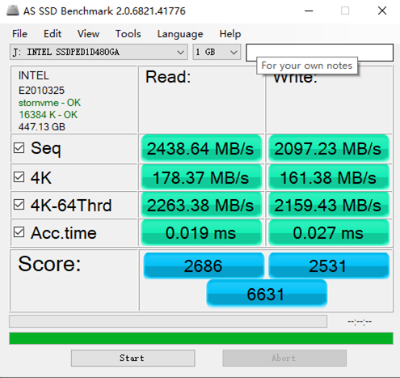
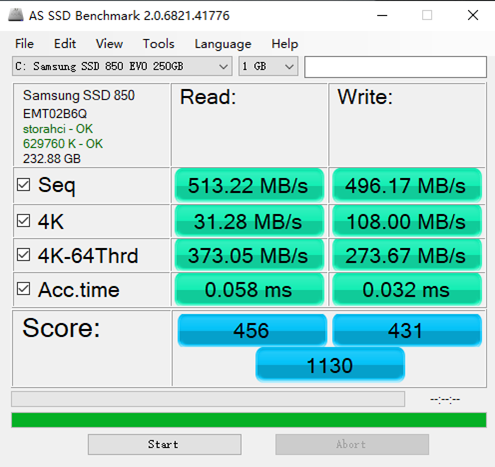
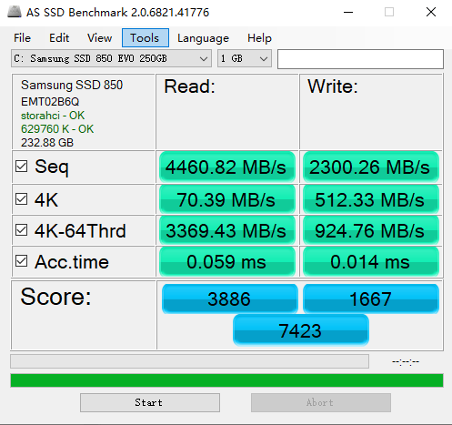
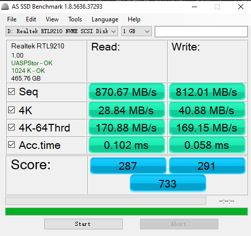
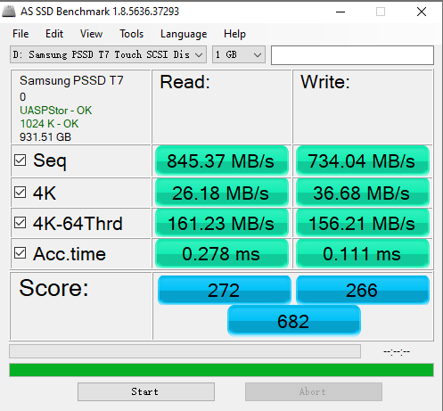
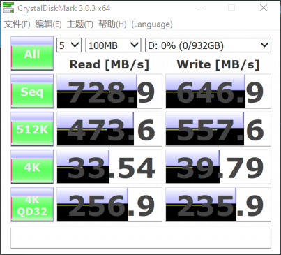
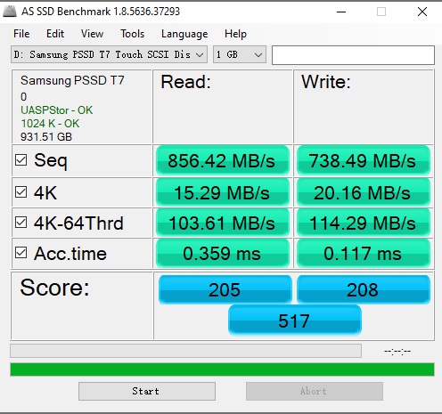
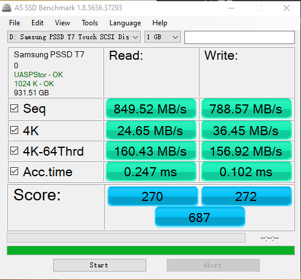

## 摘要

这里是我手头上拥有的一些SSD的测试记录

<!-- more --> 

## Intel 900P

这里是插在了南桥的PCIe插槽上测的

## Samsung EVO 850

### 未开启内存缓存

### 开启内存缓存

## Samsung PM951

## 铠侠 RC10 512G + 奥睿科移动硬盘盒USB3.1

## Samsung T7 Touch

### 银色款

#### 使用USB3.1数据线，Surface pro7 不插电

#### 使用USB3.1数据线，Surface pro7 插电

#### 使用USB3.2数据线，Surface pro7 不插电

#### 使用USB3.2数据线，Surface pro7 插电

可以看出，电脑是否有插电对硬盘的多线程随机读写性能有较大影响，USB3.2(20Gbps)还是USB3.1(10Gbps)的线，对性能能几乎没有影响。

### 黑色款

#### 好USB3.1线

#### 没标着usb3.0的线

## PM983
