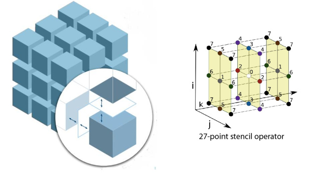
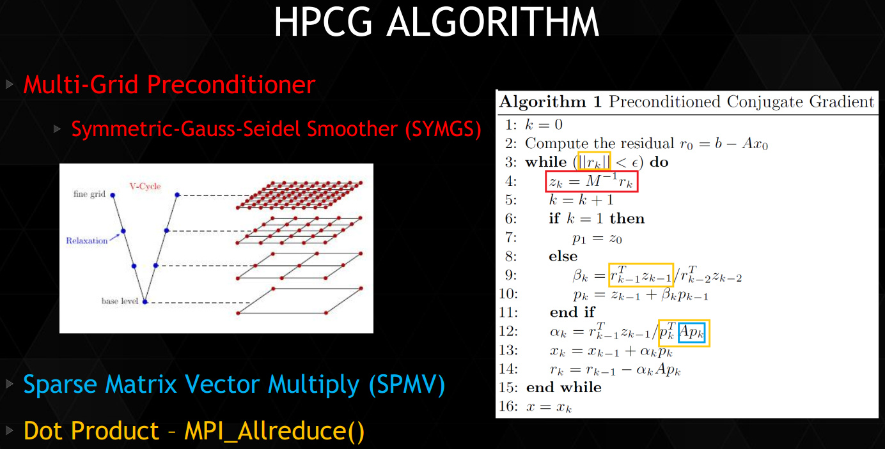

## 摘要

HPCG (High-Performance Conjugate Gradient) 是如今主要的 HPC 系统性能测试基准之一，是一个精简的大型稀疏方程组并行求解器，包含了区域分解（Domain Decomposition）、多重网格（Multigrid）和预条件子（Preconditioner）这些重要的线性方程组求解技术。我在学完 MATH 6644 这门课以及自己动手写了 3D Multigrid 以后，我便一直想看看 HPCG 是如何实现的（虽然我还没学过 DD）。下面的记录是我阅读 HPCG 3.0 官方参考实现的源代码的笔记，源代码参见 [GitHub](https://github.com/hpcg-benchmark/hpcg) .

<!-- more --> 

转自：https://enigmahuang.github.io/2017/12/27/HPCG_3_Notes/

## 数学模型与基本算法

HPCG 求解的目标方程是带 Dirichlet 边界条件的三维热传导偏微分方程。方程使用 27 点 stencil 导出线性方程组，边界条件为 0，求解线性方程组使用的是预条件共轭梯度法（PCG）。方程组使用各分量均为 1 的向量作为精确解并生成对应的右端项（RHS），使用零向量作为初始解。求解的有效性指标是 50 步迭代后相对残差 $\frac{| \vec{b} - A \vec{x}|_2}{|\vec{b}|_2} < 10^{-6}$.

其中，PCG 使用一个四层的 Multigrid V-cycle 求解器作为预条件子。Multigrid V-cycle 每一层使用单步 symmetric Gauss-Seidel 迭代法作为 pre- & post-smoother。Multigrid V-cycle 的限制投影和插值投影算子使用最简单的 injection 方式，即将本层粗网格的部分网格点和下一层细网格的网格点建立直接联系。

## 方程组生成与数据分布

HPCG 首先调用 `GenerateGeometry` 函数根据输入参数构造求解问题的几何尺寸。每个 MPI 进程处理含有 $nx \times ny \times nz$ 个网格点的 local subdomain，在 x, y, z 方向上分别有 $npx, npy, npz$ 个 MPI 进程。如果启动程序的时候不指定，HPCG 会自动计算最合适的 $npx, npy, npz$, 使得这三者尽量相等。因此，x, y, z 方向上全局共有 $gn[x, y, z]= n[x, y, z] \times np[x, y, z]$ 个格点，全局格点 $(igx, igy, igz)$ 的全局编号为 $igz \times gnx \times gny + igy \times gnx + igx$.

[DD and Stencil

上图中左侧是求解区域的区域分解。每一个小立方体为一个 MPI 进程的 local subdomain。圆圈中为 local subdomain 的 halo 示意图。右侧是 27 点 Stencil 的示意图，即格点 $(ix, iy, iz)$ 的计算需要依赖 $(ix+kx, iy+ky, iz+kz), k[x,y,z]= -1, 0, 1$ 这 27 个格点。这样的 stencil 可以由 FDM, FVM 或 FEM 导出，非常常见。

完成问题构建以后，HPCG 会调用 `GenerateProblem` 函数来构造稀疏方程组。HPCG 使用 CSR 格式储存稀疏矩阵，不过不使用数组来记录每一行非零元的偏移，而是直接使用一个指针数组（`double **matrixValues`）指向每一行的第一个非零元。然而实际上，HPCG 为每一行都分配了 27 个非零元的存储空间（GenerateProblem_ref.cpp:67, 104-124），尽管有些行只有 8 个或 12 个非零元（所以很多优化实现都会直接在这里把 CSR 转换成 ELLPACK 或者 S-ELLPACK）。`GenerateProblem` 函数为本 MPI 进程的 local subdomain 中的网格点生成方程组（GenerateProblem_ref.cpp:131-183），非零元先是生成全局坐标编号（`A.mtxIndG`）而并不直接生成本地坐标编号（`A.mtxIndL`）（GenerateProblem_ref.cpp:151, 165），但使用了两个 `std::map` 来保存全局坐标编号和本地坐标编号之间的对应关系（GenerateProblem_ref.cpp:139-145）。全局坐标编号使用 long long 类型，本地坐标编号使用 int 类型。参考实现中生成的方程组主对角线元素为 26，其余非零元素为 -1。

调用 `GenerateProblem` 以后，HPCG 会调用 `SetupHalo` 来初始化与本 MPI 进程的 local subdomain 相邻的其他进程的网格点的设置和将全局坐标编号转换为本地坐标编号。过程如下：

1. `SetupHalo` 首先检查本 MPI 进程的 local subdomain 的所有网格点所需的相邻格点是否在本 local subdomain 内，如果不是则计算出所在的 MPI 进程号并记录下来（SetupHalo_ref.cpp:80-94）。
2. `SetupHalo` 遍历每一个需要通信的 MPI 邻居（SetupHalo_ref.cpp:127），再遍历与这个邻居收发的 local subdomain 格点（SetupHalo_ref.cpp:132-138）。对于要从邻居接受的格点，`SetupHalo` 会为其按顺序分配一个本地坐标编号，这个编号值会大于 local domain 的值，一直递增，保存在 `externalToLocalMap` 这个 `std::map` 中（SetupHalo_ref.cpp:133）。对于要发送给邻居的格点，则会给予一个本地发送编号 `sendEntryCount`，并记录其本地坐标编号（SetupHalo_ref.cpp:137）。这里值得注意的是，对于一对邻居进程，由于其遍历它们相邻平面的时候的顺序是相同的，所以发送方将本进程所需发送的格点添加到队列中的顺序，和接受方将对方进程发送给自己的格点添加到队列中的顺序，也是相同的。因此排好以后，只需发送方维护 `elementsToSend` 这个数组以标识自己需要发送的 local subdomain 网格点的本地坐标编号即可（SetupHalo_ref.cpp:137）。
3. `SetupHalo` 会根据 `GenerateProblem` 生成的 local subdomain 网格的本地坐标与全局坐标关系（`A.globalToLocalMap`）以及 `externalToLocalMap` 生成 `A.mtxIndL`. （顺带一提他们原来的实现里有个 type mismatched 的小 bug，由于基本上都是 64 位平台跑所以应该一直没有出现实际的问题，但是代码本身是有 Bug 的。）

随后，HPCG 会调用 `GenerateCoarseProblem` 来为 Multigrid V-cycle 生成第 2, 3, 4 层的系数矩阵和投影算子。生成粗网格的系数矩阵时，`GenerateCoarseProblem` 会将 local domain 的三维尺寸缩小为原来一半，然后以此为参数直接调用 `GenerateProblem` 来生成粗网格系数矩阵和 `SetupHalo` 来构建粗网格 subdomain 之间的边界关系，也就是使用 rediscretization on coarse grid 方法。至于投影算子，则相当简单粗暴：粗网格的 $(clix, cliy, cliz)$ 对应细网格的 $(clix \times 2, cliy \times 2, cliz \times 2)$, 并且这里使用的是本地坐标编号，因为投影算子的操作是本地的，不需要与相邻的 subdomain 发生联系。这个关系被保存在 `A.MGData->f2c` 数组（fine to coarse）中（GenerateCoarseProblem.cpp:71-82）。虽然这个实现在收敛速度上不如 Galerkin coarse method 和 full-weighted operator，但是胜在足够简单，不需要引入复杂的计算。

HPCG 会进行 symmetric test 和 spectral test 以确保生成的方程组是正确可解的以及用户优化实现是正确的。此部分我们忽略。

## 主要计算函数与过程

[HPCG Algorithm

上图是 HPCG 所使用的 PCG 算法。实际上，红框内的 Multigrid Preconditioner 也需要蓝色的 SpMV，而 SpMV 和 SYMGS 所需的与相邻 subdomain 的通信 `ExchangeHalo` 未被列出。下表列出了 HPCG 中主要的计算函数及其作用。

| 函数                | 作用                                                         | 所需 MPI 通信 |
| :------------------ | :----------------------------------------------------------- | :------------ |
| ComputeDotProduct   | 计算两个稠密向量的点积                                       | MPI_Allreduce |
| ComputeWAXBY        | 计算两个稠密向量缩放之和 w = a * x + b * y                   | 本地计算      |
| ComputeMG           | 计算多重网格 V 循环预条件子，调用下面的四个函数以及循环调用自身 | 取决于子函数  |
| ComputeSpMV         | 计算稀疏矩阵-稠密向量乘法（SpMV）                            | ExchangeHalo  |
| ComputeSYMGS        | 计算单步 Symmetric Gauss-Seidel 迭代                         | ExchangeHalo  |
| ComputeProlongation | 限制投影算子，用粗网格的解修正细网格的解                     | 本地计算      |
| ComputeRestriction  | 插值投影算子，将细网格的残差（residual）投影到粗网格上       | 本地计算      |

HPCG 让每个 MPI 进程负责一个 local subdomain, 从矩阵分划的角度来看即为将全局系数矩阵中不同的行（不同的方程，每个网格点对应一个方程）划分给了不同的 MPI 进程。因此与之相对应，每个进程持有全局的 $\vec{x}, \vec{r}$ 中的若干段，只需要在 SpMV 和 SYMGS 时将邻居进程的对应网格点的值拿过来（`ExchangeHalo`）即可，PCG 中的其他向量更新操作都是本地计算和进行的。

`ExchangeHalo` 用于交换与本地 subdomain 相邻的网格的值。所需交换的网格点和存放数据的位置信息均记录在 `SparseMatrix` 结构体中。每次交换之前，先将所需发送的本地网格数据搜集到发送缓冲区（ExchangeHalo.cpp: 82），然后再使用 `MPI_Send` 和 `MPI_Irecv` 进行收发（顺带一提，HPCG 的官方政策是 ExchangeHalo.cpp 不带 _ref 所以不能修改，但我猜所有提交的版本里这里应该都会用 MPI-3 邻居通信来做优化）。

对于 PCG 中的 Multigrid，我们可以将其视作为只求解 local subdomain 的网格点组成的方程组且所有相邻网格点的值作为边界条件，而不是全局的 Multigrid. 按照官方文档的说法，这是 “**domain decomposition** with an **additive Schwarz preconditioned conjugate gradient** method where each subdomain is preconditioned using a **symmetric Gauss-Seidel sweep**“. 因此，在 Multigrid 计算期间，只有在计算当层网格的残差和前后光滑时，需要进行通信以获得相邻网格点的值，其余 Multigrid 的计算不需要进行通信。`ComputeProlongation` 和 `ComputeRestriction` 使用 injection 方式来投影稠密网格的残差和细网格的解。Injection 过程中粗细网格点的对应关系由 `MGData` 结构体中的 `f2c` 数组指定。

HPCG 3.0 的参考实现中没有对 SYMGS 进行染色并行。因此，在多核机器上，如果每个节点只有一个进程，将会大大降低 SYMGS 的速度。然而在官方的报告里也提到，染色并行 SYMGS 以后会导致收敛速度下降，相对残差下降 $10^{-6}$ 可能需要从 50 次迭代增加到 55 次或者更多的迭代，而多余的迭代步不能被计入有效计算中。

## Reference

1. [HPCG Technical Specification](https://software.sandia.gov/hpcg/doc/HPCG-Specification.pdf)
2. [HPCG: One Year Later](https://enigmahuang.github.io/2017/12/27/HPCG_3_Notes/www.netlib.org/utk/people/JackDongarra/SLIDES/hpcg-isc-0614.pdf)
3. [A CUDA Implementation of the HPCG Benchmark](http://www.hpcg-benchmark.org/downloads/sc14/HPCG_BOF.pdf)
4. [Optimization HPCG on Tianhe-2 at the Full-System Scale](http://www.hpcg-benchmark.org/downloads/sc15/HPCG-Workshop-TH2.pdf)
