## 摘要

Confluence是一个专业的企业知识管理与协同软件，也可以用于构建企业wiki。使用简单，但它强大的编辑和站点管理特征能够帮助团队成员之间共享信息、文档协作、集体讨论，信息推送。

使用Docker来构建Confluence会使部署和迁移会变得非常简单

<!-- more --> 

## 参考

https://www.cnblogs.com/rslai/p/8845777.html

## 安装Docker

此步骤略，见[Docker安装教程](/Linux/安装教程/Docker安装教程/)

## 安装Confluence

```bash
docker run -v /root/confluence-home:/var/atlassian/application-data/confluence --name="confluence" -d -p 8090:8090 -p 8091:8091 atlassian/confluence-server
```

## 破解Confluence

### 打开网页

访问 http://网址:8090 记录 Server ID 

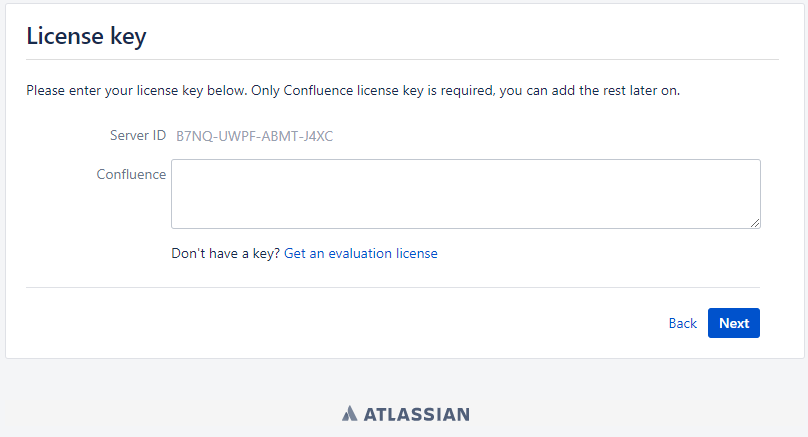

### 查找被破解文件

进入docker confluence 容器，查找decoder.jar文件

```
docker exec -it confluence /bin/bash
find -name "*decoder*"
```

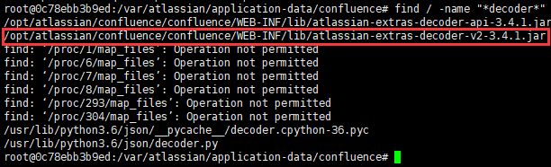

### 破解文件

将decoder.jar文件从容器中复制出来，其中 “confluence:” 是Wiki confluence容器名称，atlassian-extras-decoder-v2-3.3.0.jar 是安装版本wiki的decode文件

```bash
docker cp confluence:/opt/atlassian/confluence/confluence/WEB-INF/lib/atlassian-extras-decoder-v2-3.4.1.jar ./
```

1. 下载`atlassian-extras-decoder-v2-3.4.1.jar` 文件到windows上

2. 将文件名改为 `atlassian-extras-2.4.jar`破解工具只识别这个文件名

3. 下载破解文件 [http://wiki.wuyijun.cn/download/attachments/2327034/51CTO%E4%B8%8B%E8%BD%BD-Confluence.zip](http://wiki.wuyijun.cn/download/attachments/2327034/51CTO下载-Confluence.zip)

4. 解压缩此文件夹，dos命令行进入此文件夹iNViSiBLE，目录需根据你的实际情况修改 

5. 执行 java -jar confluence_keygen.jar 运行破解文件

6. 填入 name ，server id 处输入步骤1中得到的id，点击 “gen” 生成key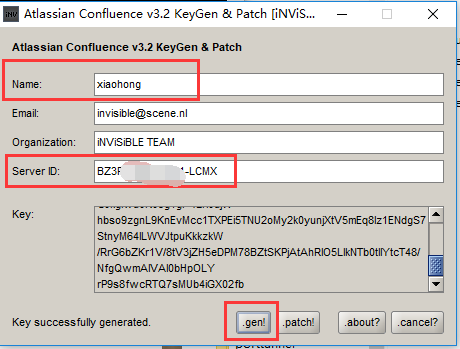
7. 点击 patch，选择刚才改名为  “atlassian-extras-2.4.jar” 的jar包，显示 “jar success fully patched” 则破解成功。注意：patch前先删除atlassian-extras-2.4.bak文件否则patch失败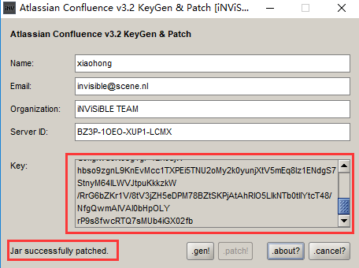
8. 将 “atlassian-extras-2.4.jar” 文件名改回原来的`atlassian-extras-decoder-v2-3.4.1.jar` 
9. 复制key中的内容备用
10. 将 `atlassian-extras-decoder-v2-3.4.1.jar` 文件上传回服务器

### 放回破解文件

```
docker cp atlassian-extras-decoder-v2-3.4.1.jar confluence:/opt/atlassian/confluence/confluence/WEB-INF/lib/atlassian-extras-decoder-v2-3.4.1.jar
```

### 重启 confluence 容器

```
docker restart confluence
```

### 输入key

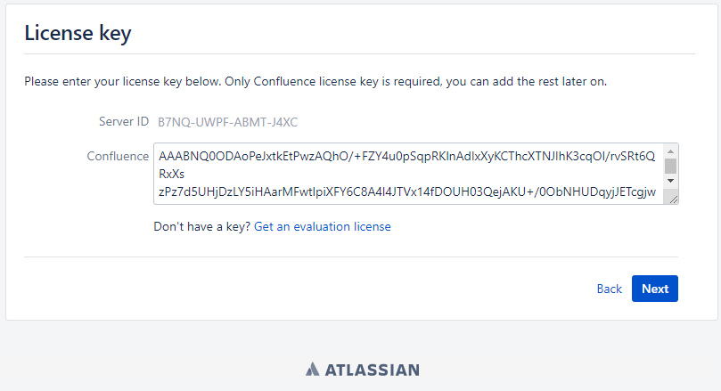

## 准备数据库

### 选择数据库

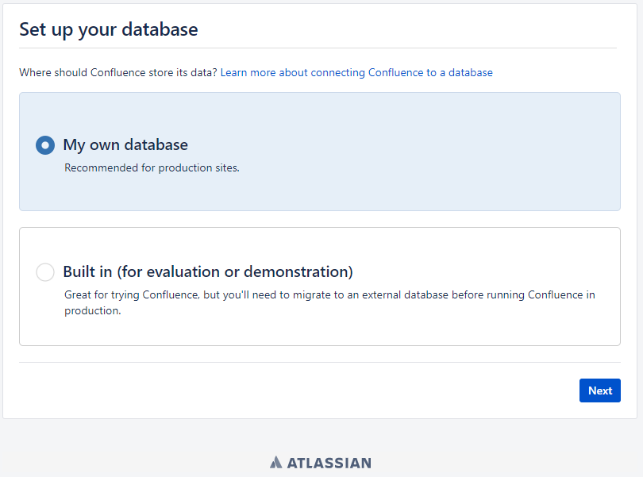

这里选择第三方数据库

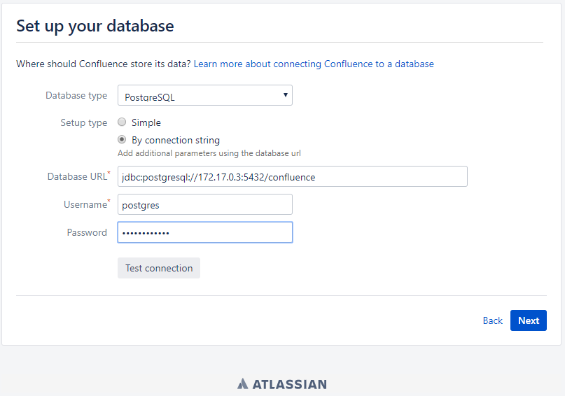

这里我们选择`PostgreSQL`数据库，因为不用装别的jar包就能用

### 安装PostgreSQL数据库

同样我们使用Docker

```bash
docker run --name postgresdb -p 5432:5432 -v /home/asc19/fgn/postgresdb-data:/var/lib/postgresql/data -e POSTGRES_PASSWORD=password -d postgres
```

**注意：每次都要带上密码参数**

### 初始化数据库

```bash
docker exec -it postgresdb bash
psql -U postgres 
CREATE DATABASE confluence WITH OWNER postgres; 
```

### 让Confluence连接数据库

查看一下`PostgreSQL`的容器IP地址

```bash
docker inspect postgresdb | grep IPAddress
```


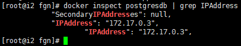

然后填入`Database URL`

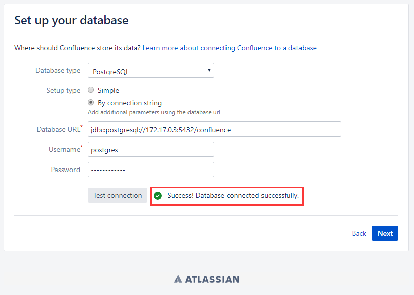

但是如果就像上面这样填写的话当给confluence做迁移时，会造成PostgreSQL Docker的ip变化，会比较麻烦，所以我们在confluence的docker中

```bash
echo "172.17.0.3 postgresdb" >> /etc/hosts
```

**注意：当restart容器后，很可能需要手动重新添加，且必须在网页加载出来之前添加**

然后按如下填写即可

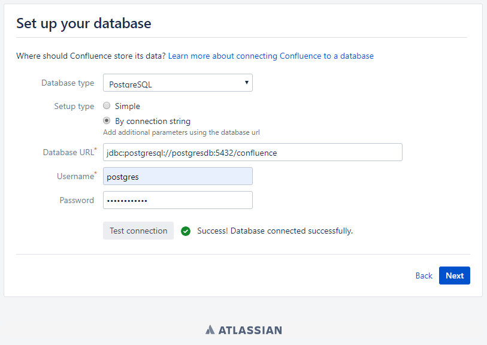

## 打包破解镜像

### 保存镜像

```bash
docker commit -m "Confluence po jie" -a "Orange" 0c78ebb3b9ed confluence-p
```

下次启动命令为

```bash
docker run -v /root/confluence-home:/var/atlassian/application-data/confluence --name="confluence-p" -d -p 8090:8090 -p 8091:8091 confluence-p
```

### 导出镜像

```bash
docker images
docker save [IMAGE ID] > confluence-p.tar
```

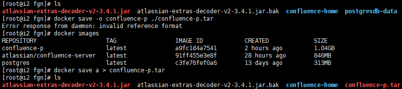

导入镜像

```bash
docker load < confluence-p.tar
```

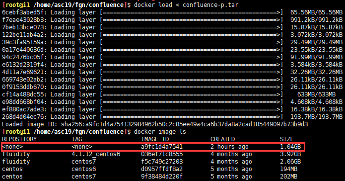

但是发现REPOSITORY和TAG都丢失了，重新命名下就好了

```bash
docker tag a9fc1d4a7541 confluence-p:latest
```

然后就是将Confluence和PostgreSQL的两个文件夹迁移即可~

## 一些实验

- 如果删除了confluence挂载目录下的所有文件，confluence就必须重置，所以不能动这个目录
- 如果数据库连接不上，网页会什么都不显示
