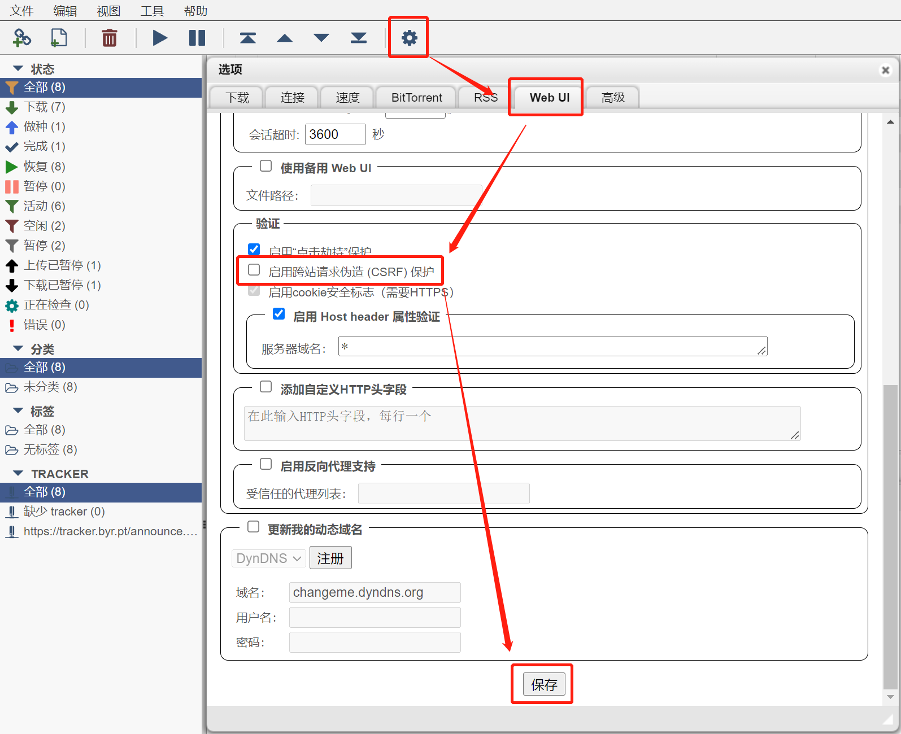
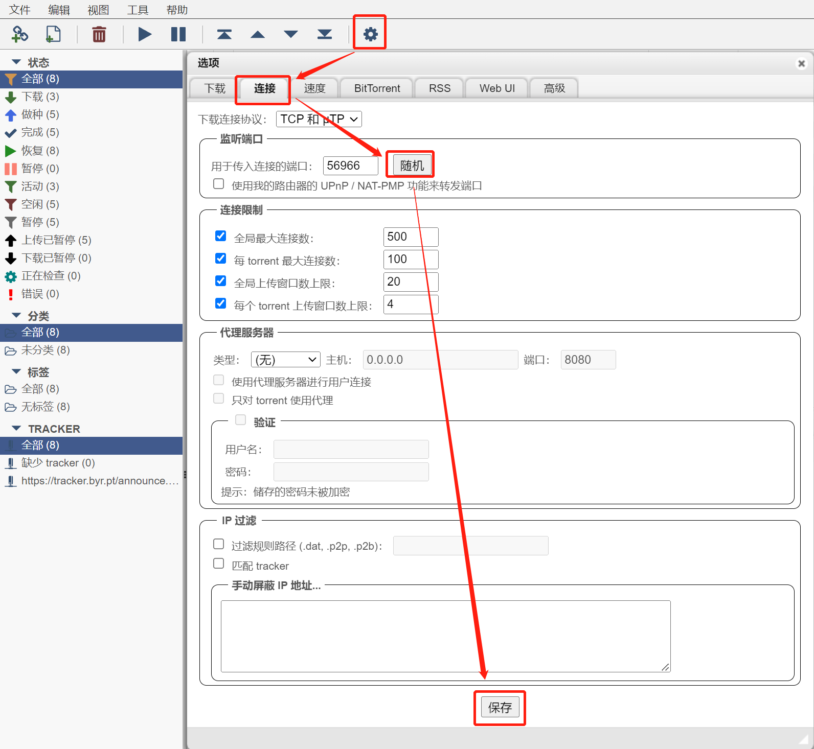

## 摘要

因为transmission总是有莫名无法上传种子的bug，于是换用qBittorrent试一下，同样使用Docker来安装

<!-- more --> 

```bash
docker pull linuxserver/qbittorrent:4.4.2

docker run -d \
  --name=qbittorrent \
  -e PUID=1000 \
  -e PGID=1000 \
  -e TZ=Europe/London \
  -e WEBUI_PORT=8088 \
  --net=host \
  -v /ssd-raid/qbittorrent/config:/config \
  -v /wolf1/qbittorrent/downloads:/downloads \
  --restart unless-stopped \
  linuxserver/qbittorrent:4.4.2
```

启动后默认用户名/密码为：admin/adminadmin。建议立即修改

需要特别注意的是：如果使用Nginx反向代理的话，需要先在局域网能直接访问的情况下，先按如下进行配置



遇到某个站点完全没速度，可以按如下方式改一下端口试试


