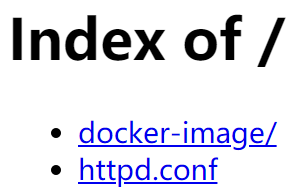
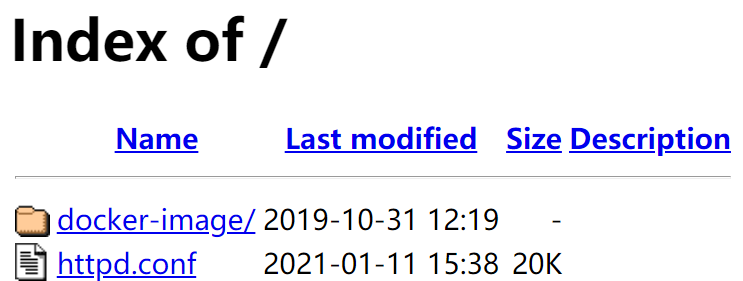
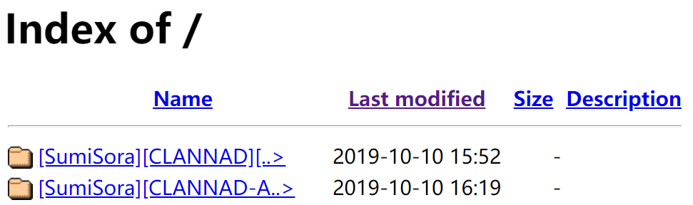
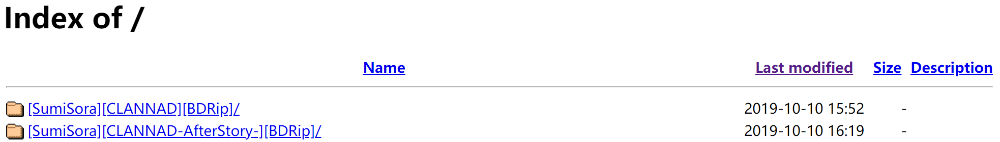

有时会想要把一些常用文件或者一些源放在VPS上，这时候用一个Docker做一个HFS (Http file system)会非常方便，

<!-- more --> 

## 基本配置

最简单的方法只需要执行如下命令

```shell
docker pull httpd:2.4
docker run -dit \
  --name hfs -p 12345:80 \
  --restart unless-stopped \
  -v /wolf1/hfs:/usr/local/apache2/htdocs/ \
  httpd:2.4
```

## 中文优化

但是，这时候如果你的文件中有中文字符，就会爆炸了，所以要手动改UTF-8，将容器中的`/usr/local/apache2/conf/httpd.conf`文件复制出来，在末尾加上`IndexOptions +Charset=UTF-8`，然后再挂进去到同样位置

```shell
docker run -dit \
  --name hfs -p 12345:80 \
  --restart unless-stopped \
  -v /wolf1/hfs:/usr/local/apache2/htdocs/ \
  -v /wolf1/hfs/httpd.conf:/usr/local/apache2/conf/httpd.conf \
  httpd:2.4
```

## 效果优化

然后会发现这个页面长得比较寒碜，大概是下面这个样子



如果想要让它能显示文件大小，需要再在刚刚复制出来的那个文件的第512行，将`Include conf/extra/httpd-autoindex.conf`取消注释，然后就会变成下main这个样子



但是还会出现一个问题，当文件名过长的时候会显示不全，类似如下的情况



只需要在配置文件刚刚取消注释的哪一行下面添加`IndexOptions NameWidth=*`，然后它就能自动根据文件名调整宽度，会变成下面这个样子


