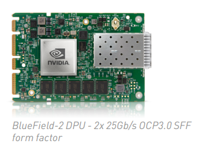
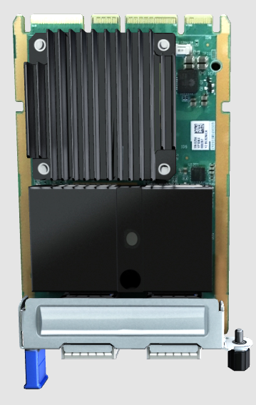
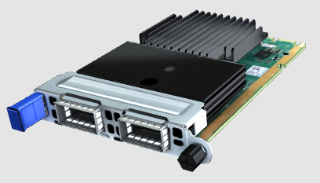
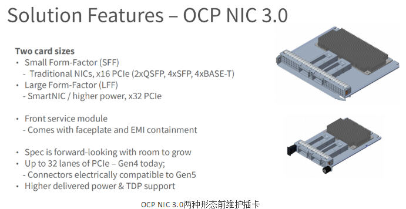

## 摘要

本文介绍一种网卡接口OCP3.0

<!-- more --> 

因为偶然的机会发现了原来还有这种接口

下图是[BlueField-2 DPU](https://www.nvidia.com/content/dam/en-zz/Solutions/Data-Center/documents/datasheet-nvidia-bluefield-2-dpu.pdf)的一种形态

下图是[华为Atlas800服务器3D渲染图](https://support-it.huawei.com/server-3D/res/server/atlas8009000Air/index.html?lang=cn)中的网卡

可以看出这种接口的网卡相比于PCIe接口的网卡有了便于热插拔的特性

> 摘自：http://www.grt-china.com/xinwenzixun/512.html
>
> OCP NIC 3.0采用了大卡（LFF）和小卡（SFF）两种尺寸规格，通过拉手条或螺钉从面板上插入服务器机箱中，实现机箱不开盖维护。信号速率从PCIe Gen4起步，可以支持到PCIe Gen5，提供x16和x32两种PCIe接口带宽，并改善了NIC卡的散热性能。
>
> 

看起来这种接口还是蛮NB的
