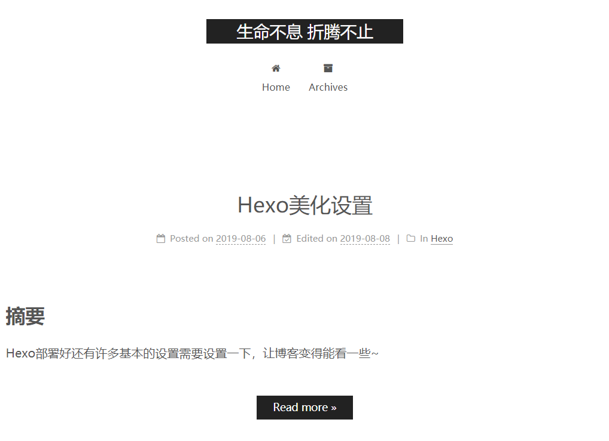
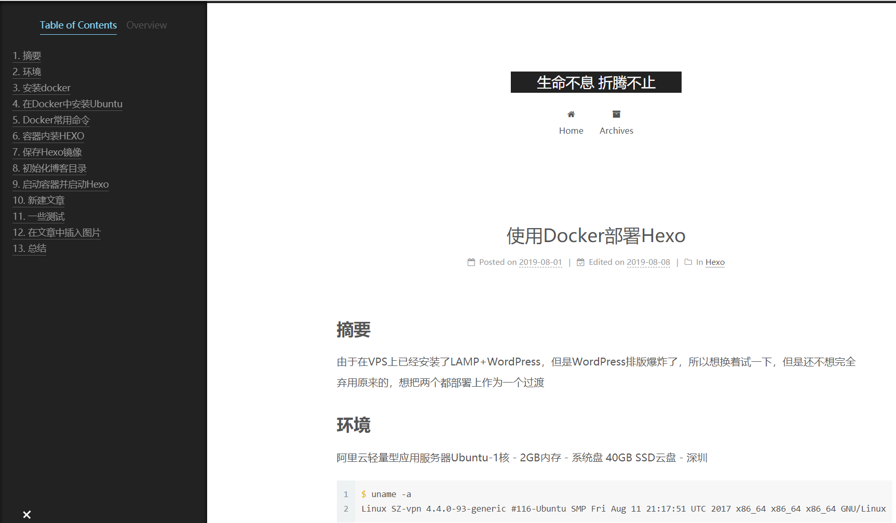
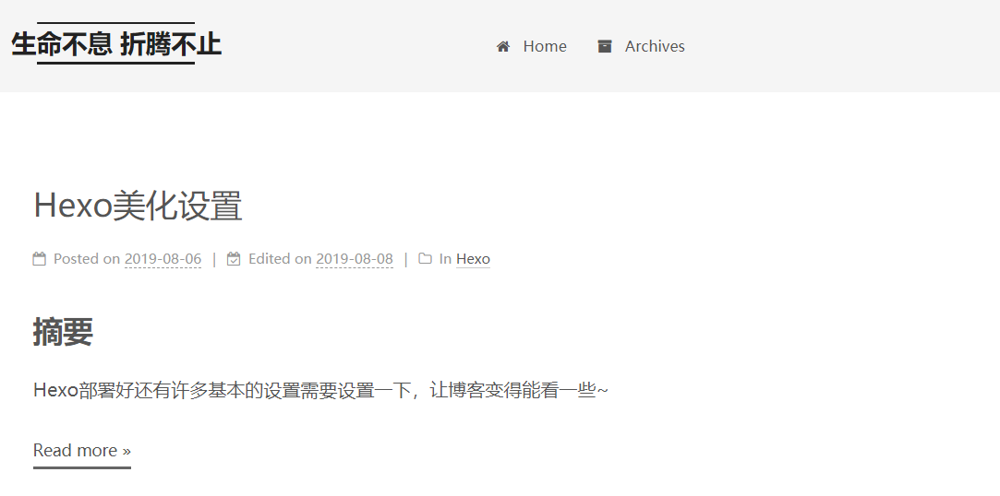
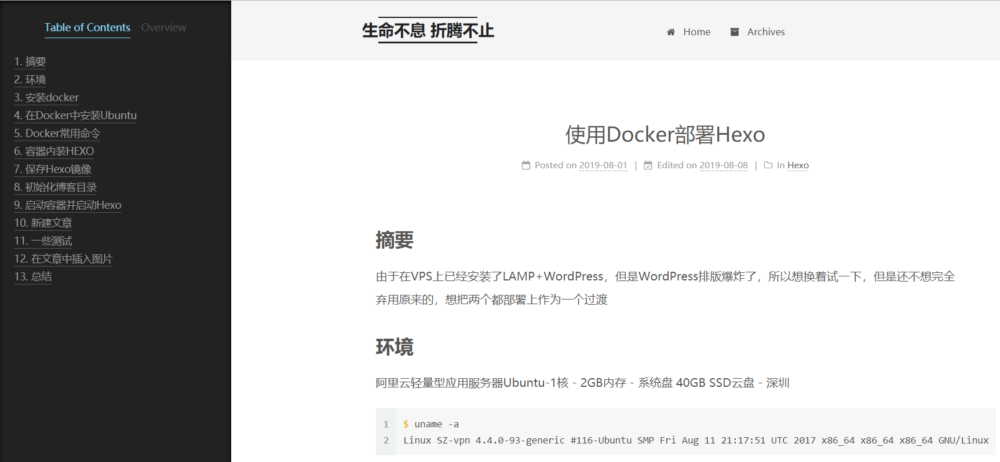
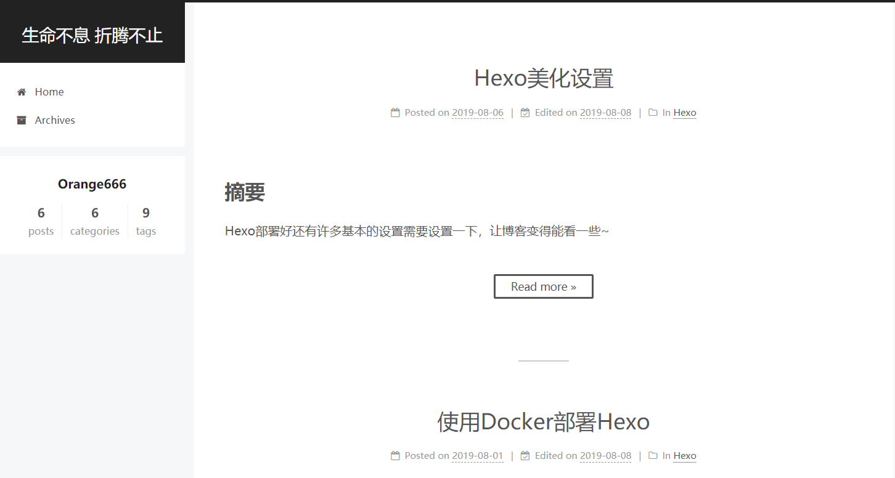
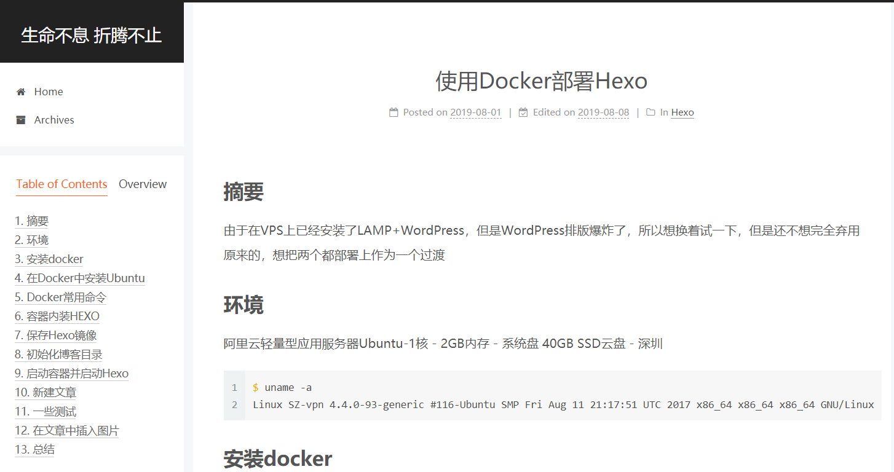

## 摘要

Hexo部署好还有许多基本的设置需要设置一下，让博客变得能看一些~

<!-- more --> 

## 修改页面标题及关键信息

简单的页面信息都在`_config.yml`中设置

| 参数          | 描述                                                         |
| ------------- | ------------------------------------------------------------ |
| `title`       | 网站标题                                                     |
| `subtitle`    | 网站副标题                                                   |
| `description` | 网站描述                                                     |
| `keywords`    | 网站的关键词。使用半角逗号 `,` 分隔多个关键词。              |
| `author`      | 您的名字                                                     |
| `language`    | 网站使用的语言                                               |
| `timezone`    | 网站时区。Hexo 默认使用您电脑的时区。[时区列表](https://en.wikipedia.org/wiki/List_of_tz_database_time_zones)。比如说：`America/New_York`, `Japan`, 和 `UTC` 。 |

## “阅读更多“设置

默认状态下在博客首页会显示文章的全文，这样不便于预览，通过在文章中增加以下标志，可以截断文章的预览，这样可以让文章更加美观。

```html
<!-- more --> 
```

## 标题设置

经试验发现，如果在文章中使用一级标题，会和标题的字一样大，感觉有点不协调，而且在自动生成的大纲中会爆炸，所以在文章中只使用二级标题及以下

## 安装NexT主题

这里安装最流行的主题之一NexT

### 下载主题

```bash
cd hexo
git clone https://github.com/theme-next/hexo-theme-next themes/next
```

### 切换主题

```bash
vim hexo/_config.yml
theme: next
```

### 打开插件获取

意义不明

```bash
vim next/_config.yml
fancybox: true
```

### 切换版面

NexT主题有四种版面可选，预览区分别如下

#### Muse





#### Mist





#### Pisces





#### Gemini

和Pisces长得一样，官网的介绍是

> Looks like Pisces, but have distinct column blocks with shadow to appear more sensitive to view.

那就用Gemini吧

### 创建categories和tags页面

#### 创建categories页面

打开命令行，进入博客所在文件夹。执行命令

```bash
$ hexo new page categories
```

成功后会提示：

```bash
INFO  Created: ~/hexo/blog/source/categories/index.md
```

根据上面的路径，找到`index.md`这个文件，打开后默认内容是这样的：

```yaml
---
title: 文章分类
date: 2019-08-08 13:47:40
---
```

添加`type: "categories"`到内容中，添加后是这样的：

```yaml
---
title: 文章分类
date: 2019-08-08
type: "categories"
---
```

#### 创建tags页面

打开命令行，进入博客所在文件夹。执行命令

```bash
$ hexo new page tags
```

成功后会提示：

```bash
INFO  Created: ~/hexo/blog/source/tags/index.md
```

根据上面的路径，找到`index.md`这个文件，打开后默认内容是这样的：

```yaml
---
title: 标签
date: 2019-08-08 13:47:40
---
```

添加`type: "tags"`到内容中，添加后是这样的：

```yaml
---
title: 文章分类
date: 2019-08-08
type: "tags"
---
```

#### 添加菜单

编辑主题配置文件 ，添加 tags 到 menu 中，如下:

```yaml
menu:
  home: /
  categories: /categories/
  #about: /about/
  archives: /archives/
  tags: /tags/
  #sitemap: /sitemap.xml
  #commonweal: /404.html
```

### 设置头像

上传头像图片到主题文件夹`themes/next`中的`source/images/`下

```bash
vim next/_config.yml
avatar:
  url: /images/[pic].jpg
```

还可以通过`rounded`和`rotated`来设置圆形和旋转

### 创建个人页面

编辑主题配置文件 ，将about也解除注释，如下:

```yaml
menu:
  home: /
  categories: /categories/
  about: /about/
  archives: /archives/
  tags: /tags/
  #sitemap: /sitemap.xml
  #commonweal: /404.html
```

在命令行执行以下命令创建页面

```bash
hexo new page "about"
INFO  Created: ~/hexo/blog/source/about/index.md
```

再编写该文件即可

### 设置不显示修改日期

编辑主题配置文件

```yaml
# Post meta display settings
post_meta:
  item_text: true
  created_at: true
  updated_at:
    enable: false
    another_day: true
  categories: true
```

中`updated_at`的`enable`为`false`

### 代码块主题

参考：https://theme-next.js.org/highlight/ 来进行配置即可

这里用了`prism-tomorrow`

把`copy_button:`的`enable:`设置为`true`可以产生复制按钮
