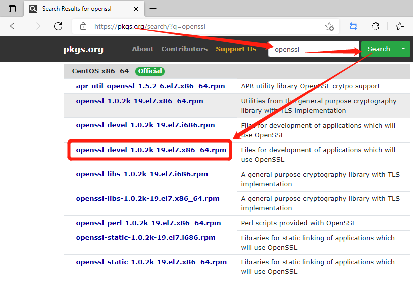
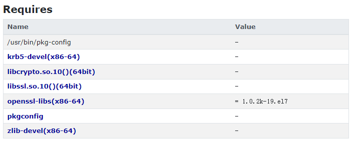
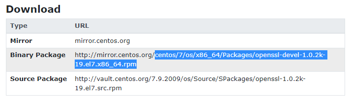

## 摘要

在有些情况下我们需要为离线（断网）状态下的Centos安装一些软件包，虽然使用反向穿透，或者挂[载本地everything源](/Linux/CentOS/CentOS%E6%8C%82%E8%BD%BD%E6%9C%AC%E5%9C%B0everything%E6%BA%90/)也是一种解决方法，但是这里介绍如何直接将包下载下来安装的方法。对于一些其他的系统如Ubuntu之类的，方法也是类似的，这里以Centos作为例子。

<!-- more --> 

## 下载特定的包

这里以安装`yum install openssl-devel`作为例子，首先我们要知道我们要安装的包是属于哪个源，登录这个包查询网站 https://pkgs.org/ ，搜索`openssl-devel`，然后找到自己对应的系统的对应包。这里注意要找`x86_64`



点进去之后然后找到如下两个描述



上图描述了这个包依赖于什么东西，如果这些没有装的话也要装



上图描述了安装包位于镜像站哪里

然后在[官方的镜像站列表](https://www.centos.org/download/mirrors/)中选择一个离自己近的，或者快的镜像站来下载，这里以阿里云镜像站作为例子，阿里云镜像站的地址是 https://mirrors.aliyun.com/centos/ 然后加上上面的位置信息 `7/os/x86_64/Packages/openssl-devel-1.0.2k-19.el7.x86_64.rpm`，变成https://mirrors.aliyun.com/centos/7/os/x86_64/Packages/openssl-devel-1.0.2k-19.el7.x86_64.rpm ，就可以直接下载下来了。

注意很多镜像站如官方镜像站 http://mirror.centos.org 是没有https的，建议找个有https的叭~

## 安装

如果是root用户，可以直接安装到根目录

```
rpm -ivh openssl-devel-1.0.2k-19.el7.x86_64.rpm
```

如果是非root用户

```
rpm2cpio openssl-devel-1.0.2k-19.el7.x86_64.rpm |cpio -idvm
```
