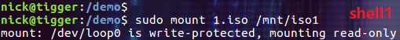
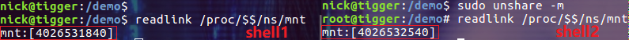
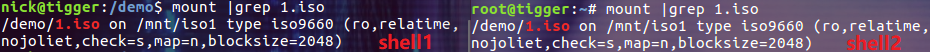
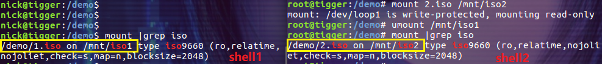
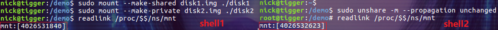
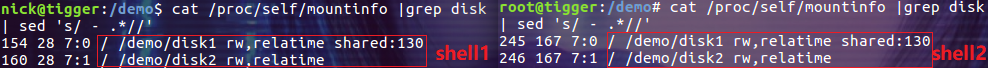
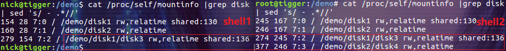

## 摘要

Mount namespace 为进程提供独立的文件系统视图。简单点说就是，**mount namespace 用来隔离文件系统的挂载点，这样进程就只能看到自己的 mount namespace 中的文件系统挂载点**。

<!-- more --> 

进程的 mount namespace 中的挂载点信息可以在 /proc/[pid]/mounts、/proc/[pid]/mountinfo 和 /proc/[pid]/mountstats 这三个文件中找到。
每个 mount namespace 都有一份自己的挂载点列表。当我们使用 clone 函数或 unshare 函数并传入 CLONE_NEWNS 标志创建新的 mount namespace 时， 新 mount namespace 中的挂载点其实是从调用者所在的 mount namespace 中拷贝的。但是在新的 mount namespace 创建之后，这两个 mount namespace 及其挂载点就基本上没啥关系了(除了 shared subtree 的情况)，两个 mount namespace 是相互隔离的。

本文我们将通过 demo 演示如何对通过 mount namespace 对文件系统进行隔离，以及 shared subtree 在 mount namespace 中的使用方式。本文的演示环境为 ubuntu 16.04。

## **演示文件系统的隔离**

我们通过 iso 文件的挂载来演示 mount namespace 对文件系统的隔离。下面先创建演示用的文件和目录：

```bash
$ sudo mkdir /demo && sudo chmod 777 /demo && cd $_
$ mkdir -p iso1/subdir1
$ mkdir -p iso2/subdir2
$ mkisofs -o 1.iso ./iso1
$ mkisofs -o 2.iso ./iso2
```


然后再准备两个充当挂载点：

```bash
$ sudo mkdir /mnt/iso1 /mnt/iso2
```

**第一步**，我们打开两个 bash shell，为了方便区分，分别把它们称为为 shell1 和 shell2。在 shell1 中执行挂载操作，把 1.iso 挂载到 /mnt/iso1 目录：

```bash
$ sudo mount 1.iso /mnt/iso1
```



**第二步**，先在 shell2 中执行 sudo unshare -m，然后在两个 shell 中分别执行 readlink /proc/$$/ns/mnt 命令：



图中左侧为 shell1，右侧为 shell2。可以看出它们的 mount namespace 是不同的。
**第三步**，通过 mount 命令查看两个 mount namespace 中的挂载点信息：



此时，在这两个 mount namespace 中，挂载点信息是相同的。
**第四步，我们在 shell2 中执行一些 mount 和 umount 操作**：

```bash
$ mount 2.iso /mnt/iso2
$ umount /mnt/iso1
```



再查之下发现两个 mount namespace 中的挂载点信息已经完全不一样了，这就说明 mount namespace 之间的挂载点信息是隔离的(也就是文件系统是隔离的)。

## 演示 shared subtree 功能

Mount namespace 实现了挂载点的隔离，但对于某些应用场景，会让我们用起来很不爽。比如系统新添加了一个磁盘设备，我们打算让所有的 mount namespace 都挂载它。过去的做法只能是在每个 mount namespace 中都挂载一遍，很显然，这太不方便了。于是在 Linux 内核 2.6.15 引入了 shared subtree 的概念来解决这个问题。**Shared subtree 的核心是允许在 mount namespace 之间自动地或者是受控地传播 mount 和 umount 事件**。

简单起见，本文只演示 shared subtree 中 shared 和 private 两种传播类型在 mount namespace 中的表现。我们可以简单的认为 shared 类型的传播方式可以在满足条件的情况下把 mount 和 umount 事件传播给其它的挂载点，而 private 类型的传播方式则不会把 mount 和 umount 事件传播给其它的挂载点。关于 shared subtree 的详细内容，请参考 [shared subtree 文档](https://www.kernel.org/doc/Documentation/filesystems/sharedsubtree.txt)。关于 shared subtree 与 mount namespace 结合使用的详细信息，请参考 [mount namespace 文档](http://man7.org/linux/man-pages/man7/mount_namespaces.7.html)。

我们通过虚拟磁盘文件的挂载来演示 shared subtree 在 mount namespace 中的表现。下面先创建演示用的文件和目录：

```bash
$ sudo mkdir /demo && sudo chmod 777 /demo && cd $_
$ dd if=/dev/zero bs=1M count=32 of=./disk1.img
$ dd if=/dev/zero bs=1M count=32 of=./disk2.img
$ dd if=/dev/zero bs=1M count=32 of=./disk3.img
$ dd if=/dev/zero bs=1M count=32 of=./disk4.img
$ mkfs.ext2 ./disk1.img
$ mkfs.ext2 ./disk2.img
$ mkfs.ext2 ./disk3.img
$ mkfs.ext2 ./disk4.img
$ mkdir disk1 disk2
```


**第一步**，我们打开两个 bash shell，为了方便区分，分别把它们称为为 shell1 和 shell2。在 shell1 中执行挂载操作，分别以 shared 和 private 方式挂载 disk1 和 disk2：

```bash
$ sudo mount --make-shared disk1.img ./disk1
$ sudo mount --make-private disk2.img ./disk2
```

**第二步**，在 shell2 中执行 sudo unshare -m --propagation unchanged，然后在两个 shell 中分别执行 readlink /proc/$$/ns/mnt 命令：



图中左侧为 shell1，右侧为 shell2。可以看出它们的 mount namespace 是不同的。默认情况下，unshare 会将新 namespace 里面的所有挂载点的类型设置成 private，所以我们使用参数 --propagation unchanged 让新 namespace 里的挂载点的类型和老 namespace 里保持一致。--propagation 参数还支持 private|shared|slave 类型，和 mount 命令的那些 --make-private 参数一样，它们实际上都是通过调用 mount 函数并传入不同的参数实现的。
**第三步**，分别在 shell1 和 shell2 中执行 cat /proc/self/mountinfo |grep disk| sed 's/ - .*//' 命令查看挂载点信息：



此时两个 mount namespace 中的挂载点信息是相同的。由于在挂载 /demo/disk1 时应用了 --make-shared 参数，所以上图 shell1 中 /demo/disk1 的挂载方式显示为 shared。又因为在 shell2 中执行 unshare 命令时设置了 --propagation unchanged 参数，所以上图中 shell2 中 /demo/disk1 的挂载方式也显示为 shared(*不设置 --propagation unchanged 参数则为 private 方式*)。
**第四步**，**在 shell2 中**分别在 disk1 目录下创建 disk3 目录，在 disk2 目录下创建 disk4 目录，并把 disk3.img 挂载到 ./disk1/disk3 目录，把 disk4.img 挂载到 ./disk2/disk4 目录：

```bash
$ mkdir ./disk1/disk3 ./disk2/disk4
$ mount disk3.img ./disk1/disk3
$ mount disk4.img ./disk2/disk4
```

然后使用分别在 shell1 和 shell2 中使用 cat /proc/self/mountinfo |grep disk| sed 's/ - .*//' 命令查看挂载点信息：



这次 shell1 中的挂载点信息和 shell2 中的挂载点信息是不一样的。**因为 /demo/disk1 的挂载方式为 shared，所以它的子挂载点 /demo/disk1/disk3 被传播到了 shell1 所在的 mount namespace 中。**而 /demo/disk2 的挂载方式为 private，所以它的子挂载点 /demo/disk2/disk4 不会被传播。

OK，这就完成了 shared subtree 在 mount namespace 间传播挂载点信息的基本功能演示，希望这个小 demo 可以帮助大家了解一点 shared subtree 相关的内容。

## 总结

要把 mount namespace 介绍清楚显然不是本文的目的，因为单是 shared subtree 在 mount namespace 中的使用方式就够我们好好的研究一番了。所以，本文只是希望以最少的概念加上最简单的 demo 来说明什么是 mount namespace、它可以用来干什么以及如何快速的实验一下。

**参考：**
[Linux Namespace系列（04）：mount namespaces (CLONE_NEWNS)](https://segmentfault.com/a/1190000006912742)
[Linux Namespace分析——mnt namespace的实现与应用](http://hustcat.github.io/namespace-implement-1/)
[Mount namespace man page](http://man7.org/linux/man-pages/man7/mount_namespaces.7.html)
[Applying mount namespaces](https://www.ibm.com/developerworks/library/l-mount-namespaces/index.html)

---

转自[https://www.cnblogs.com/sparkdev/tag/linux%20namespace/](https://www.cnblogs.com/sparkdev/tag/linux namespace/)
