## 摘要

**Network namespace 在逻辑上是网络堆栈的一个副本，它有自己的路由、防火墙规则和网络设备。**默认情况下，子进程继承其父进程的 network namespace。也就是说，如果不显式创建新的 network namespace，所有进程都从 init 进程继承相同的默认 network namespace。

<!-- more --> 

每个新创建的 network namespace 默认有一个本地环回接口 lo，除此之外，所有的其他网络设备(物理/虚拟网络接口，网桥等)只能属于一个 network namespace。每个 socket 也只能属于一个 network namespace。

说明：本文的演示环境为 ubuntu 16.04。

**ip netns 命令**
ip netns 命令用来管理 network namespace。本文将使用 ip netns 命令来创建和操作 network namespace。有关 ip netns 命令的详细介绍请参考笔者的博文《[Linux ip netns 命令](https://www.cnblogs.com/sparkdev/p/9253409.html)》。

## 创建 network namespace

我们先查一下看默认的 network namespace 的 ID：

```bash
$ readlink /proc/$$/ns/net
```

然后通过 ip netns add 命令创建名为 mynet 的 network namespace：

```bash
$ sudo ip netns add mynet
```

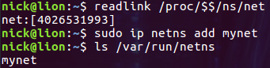

从上图可以看出，在名为 mynet 的 network namespace 创建成功后，/var/run/netns 目录下多了一个名为 mynet 文件。ip netns exec 子命令可以在对应的 network namespace 中执行命令，下面我们就通过它在 mynet network namespace 中创建一个 bash 进程，并查看 network namespace 的 ID：

```bash
$ sudo ip netns exec mynet bash
# readlink /proc/$$/ns/net
```

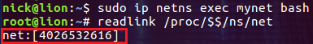

这是一个完全不同的 network namespace ID，说明当前的 bash 进程运行在一个隔离的 network 环境中。接下来让我们看看新的 network namespace 中都有什么：

```bash
# ip addr
```

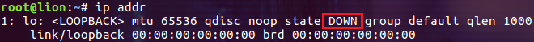

每个新创建的 network namespace 默认有一个本地环回接口 lo，并且这个接口是处于关闭状态的。下面我们就启动这个接口：

```bash
# ip link set lo up
```

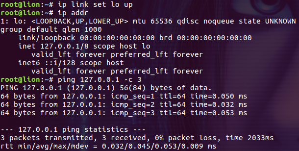

启动 lo 接口后我们可以看到其 IP 地址，并且能够正确的响应 ping 命令。

## 在两个 network namespace 之间通信

network namespace 之间是相互隔离的，我们可以使用 veth 设备把两个 network namespace 连接起来进行通信。**veth 设备是虚拟的以太网设备。它们可以充当 network namespace 之间的通道，也可以作为独立的网络设备使用。veth 设备总是被成对的创建，并且这一对设备总是连接在一起的，所以一般把称之为 veth pair。需要注意的是，veth pair 无法单独存在，删除其中一个，另一个也会自动消失。**接下来的示例我们就演示如何使用 veth pair 在两个 network namespace 直接通信。示例中我们使用 ip link 命令来创建和管理 veth pair。

**第一步，先创建两个 network namespace net0 和 net1**

```bash
$ sudo ip netns add net0
$ sudo ip netns add net1
```

**第二步，创建一对命名的 veth 设备**
默认情况下会自动为 veth pair 生成名称，这里为了易于辨识，我们在创建时指定 veth pair 的名称：

```bash
$ sudo ip link add vethmother type veth peer name vethfather
```

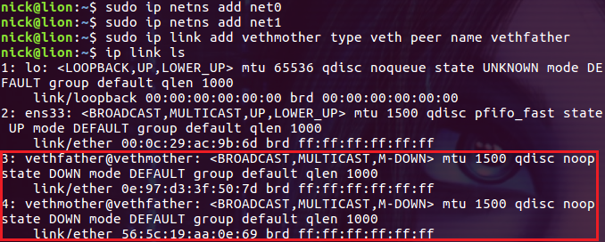

如图所示，veth pair 在主机上表现为两个网卡。

**第三步，把这一对 veth pair 分别放到 network namespace net0 和 net1中**

```bash
$ sudo ip link set vethmother netns net0
$ sudo ip link set vethfather netns net1
$ sudo ip netns exec net0 ip addr
$ sudo ip netns exec net1 ip addr
```

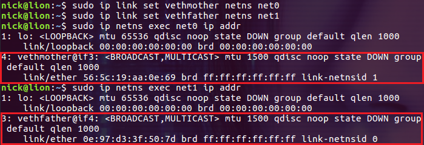

查看 net0 和 net1 中的网络资源，发现各自多了一个网卡，也就是 veth 设备的两个端点。注意，当我们把 veth pair 分配到 network namespace 中后，在主机上就看不到它们了：

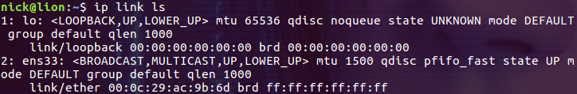

此时主机的网卡中已经看不到刚才的 veth pair 身影了。

**第四步，给这些 veth pair 分配 IP 并启用它们**

```bash
$ sudo ip netns exec net0 ip link set vethmother up
$ sudo ip netns exec net0 ip addr add 10.0.1.1/24 dev vethmother
$ sudo ip netns exec net0 ip route
```

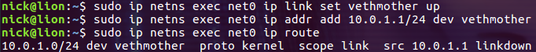

```bash
$ sudo ip netns exec net1 ip link set vethfather up
$ sudo ip netns exec net1 ip addr add 10.0.1.2/24 dev vethfather
$ sudo ip netns exec net1 ip route
```

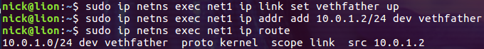

下面通过 ping 命令来验证两个 network namespace 是否可以通信：

```bash
$ sudo ip netns exec net0 ping -c 3 10.0.1.2
```

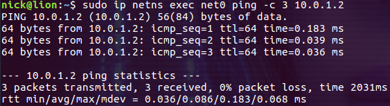

至此，我们构建了一个如下结构的虚拟网络：

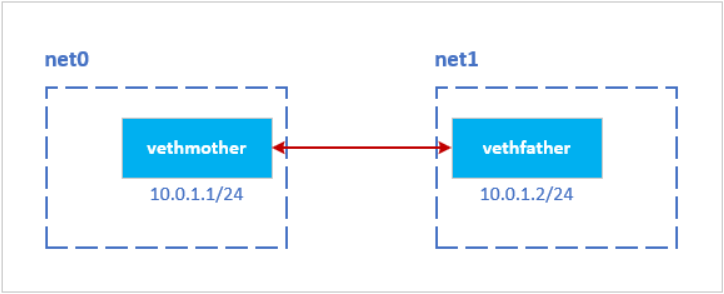

## 通过 bridge 连接 network namespace

虽然 veth pair 可以实现两个 network namespace 之间的通信，但是当需要在多个 network namespace 之间通信的时候，光靠 veth pair 就不行了。我们可以使用 Linux 提供的虚拟交换机，来完成这样的功能。下面的示例演示如何通过虚拟交换机(这里就是一个虚拟网桥)连接多个 network namespace。

**第一步，先添加一个叫 mybridge0 的网桥**

```bash
$ sudo ip link add mybridge0 type bridge
$ sudo ip link set dev mybridge0 up
$ sudo ip addr
```

对主机来说其实就是新添加了一个网络接口(network interface)：

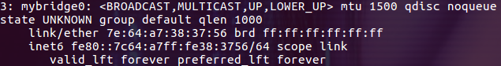

**第二步，创建 network namespace 和 veth 设备**
创建 network namespace net0：

```bash
$ sudo ip netns add net0
```

创建 veth 设备：

```bash
$ sudo ip link add veth0 type veth peer name veth0p 
```

把其中的一个 veth 放置到 net0 中，设置 IP 并启动它：

```bash
$ sudo ip link set dev veth0p netns net0
$ sudo ip netns exec net0 ip link set dev veth0p name eth0
$ sudo ip netns exec net0 ip addr add 10.0.1.1/24 dev eth0
$ sudo ip netns exec net0 ip link set dev eth0 up
$ sudo ip netns exec net0 ip addr
```

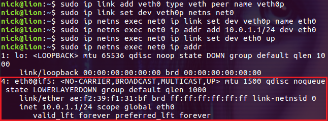

上图显示 network namespace net0 中的 eth0 网卡已经启动了。下面把 veth 设备的另一端连接到网桥 mybridge0 上：

```bash
$ sudo ip link set dev veth0 master mybridge0
$ sudo ip link set dev veth0 up
```

**第三步，重复第二步创建 net1 和 net2，并连接到网桥**
给 mybridge0 设置 IP：

```bash
$ sudo ip link set dev mybridge0 down
$ sudo ip addr add 10.0.1.0/24 dev mybridge0
$ sudo ip link set dev mybridge0 up
$ ip addr
```

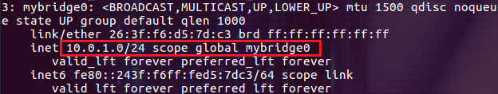

通过 bridge link 命令查看网桥的信息如下：

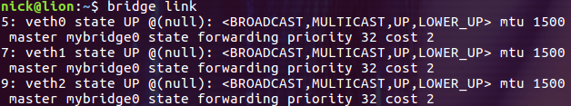

这时就可以在不同的 network namespace 之间通信了：

```bash
$ sudo ip netns exec net0 ping -c 3 10.0.1.3
```

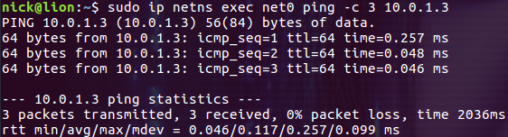

我们创建的网络拓扑结构如下所示：

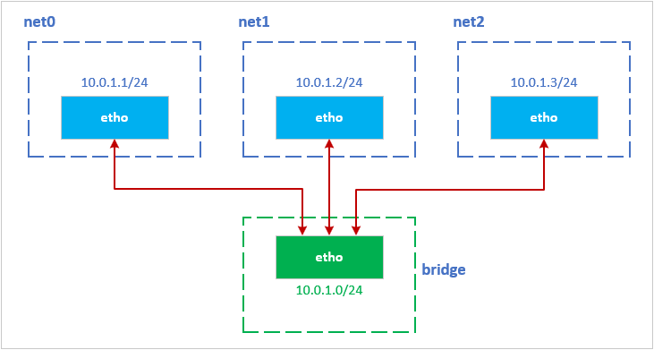

## 总结

通过 network namespace 可以创建相互独立的网络栈，从而实现网络的隔离。本文只是简单的介绍了 network namespace 的创建以及如何在 network namespace 之间通信，其中 network namespace 之间通过 bridge 通信的方式已经与 docker 网络的 bridge 模式非常类似了。

参考：
[Network namespace man page](http://man7.org/linux/man-pages/man7/network_namespaces.7.html)
[Linux Namespace系列（06）：network namespace (CLONE_NEWNET) ](https://segmentfault.com/a/1190000006912930)
[Network namespace 简介](http://cizixs.com/2017/02/10/network-virtualization-network-namespace)

------

转自[https://www.cnblogs.com/sparkdev/tag/linux%20namespace/](https://www.cnblogs.com/sparkdev/tag/linux namespace/)
