## 摘要

PID namespace 用来隔离进程的 PID 空间，使得不同 PID namespace 里的进程 PID 可以重复且互不影响。PID namesapce 对容器类应用特别重要， 可以实现容器内进程的暂停/恢复等功能，还可以支持容器在跨主机的迁移前后保持内部进程的 PID 不发生变化。

<!-- more --> 

## PID namesapce 与 /proc

Linux下的每个进程都有一个对应的 /proc/PID 目录，该目录包含了大量的有关当前进程的信息。 对一个 PID namespace 而言，/proc 目录只包含当前 namespace 和它所有子孙后代 namespace 里的进程的信息。

创建一个新的 PID namespace 后，如果想让子进程中的 top、ps 等依赖 /proc 文件系统的命令工作，还需要挂载 /proc 文件系统。下面的例子演示了挂载 /proc 文件系统的重要性。先输出当前进程的 PID，然后查看其 PID namespace，接着通过 unshare 命令创建新的 PID namespace：

```bash
$ sudo unshare --pid --mount --fork /bin/bash
```

该命令会同时创建新的 PID 和 mount namespace，然后再查看此时的 PID namespace：

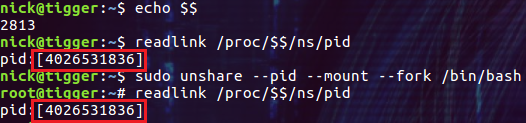

上图中的结果似乎不是我们想要的，因为显示的 PID namespace 并没有变化。让我们接着做实验：

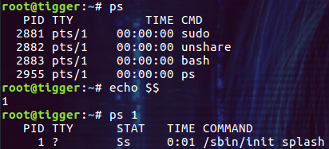

看样子 ps 命令显示的 PID 还是旧 namespace 中的编号，而 $$ 为 1 说明当前进程已经被认为是该 PID namespace 中的 1 号进程了。再看看 1 号进程的详细信息：/sbin/init，这是系统的 init 进程，这一切看起来实在是太乱了。
造成混乱的原因是当前进程没有正确的挂载 /proc 文件系统，由于我们新的 mount namespace 的挂载信息是从老的 namespace 拷贝过来的，所以这里看到的还是老 namespace 里面的进程号为 1 的信息。执行下面的命令挂载 /proc 文件系统：

```bash
$ mount -t proc proc /proc
```

然后再来检查相关的信息：

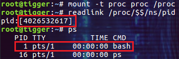

这次就符合我们的预期了，显示了新的 PID namespace，当前 PID namespace 中的 1 号进程也变成了 bash 进程。
其实 unshare 命令提供了一个专门的选项 --mount-proc 来配合 PID namespce 的创建：

```bash
$ sudo unshare --pid --mount-proc --fork /bin/bash
```

这样在创建了 PID 和 Mount namespace 后，会自动挂载 /proc 文件系统，就不需要我们手动执行 mount -t proc proc /proc 命令了。

## 不能修改的进程 PID namespace

在前面的演示中我们为 unshare 命令添加了 --fork /bin/bash 参数：

```bash
$ sudo unshare --pid --mount-proc --fork /bin/bash
```

--fork 是为了让 unshare 进程 fork 一个新的进程出来，然后再用 /bin/bash 替换掉新的进程中执行的命令。需要这么做是由于 PID namespace 本身的特点导致的。进程所属的 PID namespace 在它创建的时候就确定了，不能更改，所以调用 unshare 和 nsenter 等命令后，原进程还是属于老的 PID namespace，新 fork 出来的进程才属于新的 PID namespace。
我们在一个 shell 中执行下面的命令：

```bash
$ echo $$
$ sudo unshare --pid --mount-proc --fork /bin/bash
```

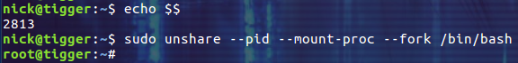

然后新打开一个 shell 检查进程所属的 PID namespace：

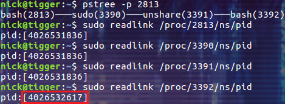

查看进程树中进程所属的 PID namespace，只有被 unshare fork 出来的 bash 进程加入了新的 PID namespace。

## PID namespace 的嵌套

PID namespace 可以嵌套，也就是说有父子关系，除了系统初始化时创建的根 PID namespace 之外，其它的 PID namespace 都有一个父 PID namespace。一个 PID namespace 的父是指：通过 clone 或 unshare 方法创建 PID namespace 的进程所在的 PID namespace。

在当前 namespace 里面创建的所有新的 namespace 都是当前 namespace 的子 namespace。父 namespace 里面可以看到所有子孙后代 namespace 里的进程信息，而子 namespace 里看不到祖先或者兄弟 namespace 里的进程信息。一个进程在 PID namespace 的嵌套结构中的每一个可以被看到的层中都有一个 PID。这里所谓的 "看到" 是指可以对这个进程执行操作，比如发送信号等。

目前 PID namespace 最多可以嵌套 32层，由内核中的宏 MAX_PID_NS_LEVEL 来定义。

在一个 PID namespace 里的进程，它的父进程可能不在当前 namespace 中，而是在外面的 namespace 里(外面的 namespace 指当前 namespace 的父 namespace)，这类进程的 PPID 都是 0。比如新创建的 PID namespace 里面的第一个进程，他的父进程就在外面的 PID namespace 里。通过 setns 的方式将子进程加入到新 PID namespace 中的进程的父进程也在外面的 namespace 中。

我们可以把子进程加入到新的子 PID namespace 中，但是却不能把子进程加入到任何祖先 PID namespace 中。

下面我们通过示例来获得一些直观的感受。
**打开第一个 shell 窗口**
先创建查看下当前进程的 PID，然后创建三个嵌套的 PID namespace：

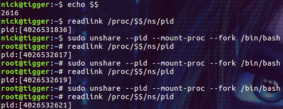

**打开第二个 shell 窗口**
在另一个 shell 中查看 2616 进程的子进程：

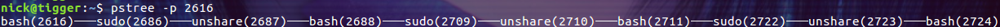

bash(2616)───
sudo(2686)───unshare(2687)───bash(2688)───
sudo(2709)───unshare(2710)───bash(2711)───
sudo(2722)───unshare(2723)───bash(2724)
下面我们通过 PID 来查看上面进程属于的 PID namespace：

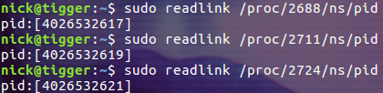

这与我们创建 PID namespace 看到的结果是一样的。然后我们通过 /proc/[pid]/status 看看 2724 号进程在不同 PID namespace 中的 PID：

```bash
$ grep pid /proc/2724/status
```

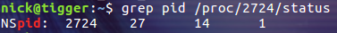

在我们创建的三个 PID namespace 中，PID 分别为 27, 24 和 1。
接下来我们使用 nsenter 命令进入到 2711(我们创建的第二个 PID namespace) 进程所在的 PID namespace：

```bash
$ sudo nsenter --mount --pid -t 2711 /bin/bash
```

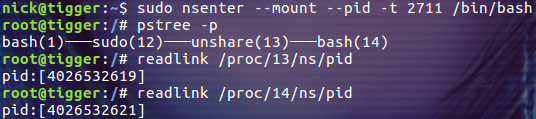

查看进程树，这里 bash(14) 就是最后一个 PID namespace 中 PID为 1 的进程。细心的读者可能已经发现了，pstree 命令并没有显示我们通过 nsenter 添加进来的 bash 进程，让我们来看看究竟：

```bash
$ ps -ef
```

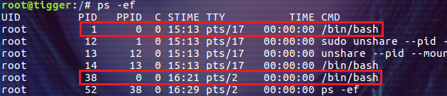

有两个 PPID 为 0 的进程，PID 为 38 的进程不属于当前 PID namespace 中 init 进程的子进程，所以不会被 pstree 显示。这也是我们创建的 PID namespace 根最外层的 PID namespace 不一样的地方：可以有多个 PPID 为 0 的进程。
再看上图中的 TTY 列，可以通过它看出命令是在哪个 shell 窗口中执行的。pts/17 代表的是我们打开的第一个 shell 窗口，pts/2 代表我们打开的第二个 shell 窗口。

**打开第三个 shell 窗口**
使用 nsenter 命令进入到 2688(我们创建的第一个 PID namespace) 进程所在的 PID namespace：

```bash
$ sudo nsenter --mount --pid -t 2688 /bin/bash
```

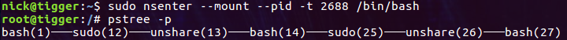

查看进程树，这里 bash(27) 是最后一个 PID namespace 中 PID为 1 的进程。bash(14) 是第二个 PID namespace 中 PID为 1 的进程。用 ps 命令查看进程信息：

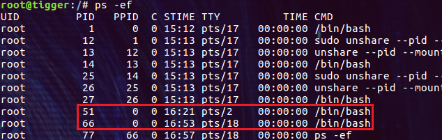

PID 为 51 和 66 的进程都是由 nsenter 命令添加的 bash 进程。到这里我们也可以看出，同样的进程在不同的 PID namespace 中拥有不同的 PID。
最后我们尝试给第二个 shell 窗口中的 bash 进程(51)发送一个信号：

```bash
$ kill 51
```

**回到第二个 shell 窗口**


此时 bash 进程已经被 kill 掉了，这说明从父 PID namespace 中可以给子 PID namespace 中的进程发送信号。

## PID namespace 中的 init 进程

在一个新的 PID namespace 中创建的第一个进程的 PID 为 1，该进程被称为这个 PID namespace 中的 init 进程。

在 Linux 系统中，进程的 PID 从 1 开始往后不断增加，并且不能重复（当然进程退出后，PID 会被回收再利用），进程的 PID 为 1 的进程是内核启动的第一个应用层进程，被称为 init 进程(不同的 init 系统的进程名称可能不太一样)。这个进程具有特殊意义，当 init 进程退出时，系统也将退出。所以除了在 init 进程里指定了 handler 的信号外，内核会帮 init 进程屏蔽掉其他任何信号，这样可以防止其他进程不小心 kill 掉 init 进程导致系统挂掉。
不过有了 PID namespace 后，可以通过在父 PID namespace 中发送 SIGKILL 或者 SIGSTOP 信号来终止子 PID namespace 中的 PID 为 1 的进程。由于 PID 为 1 的进程的特殊性，当这个进程停止后，内核将会给这个 PID namespace 里的所有其他进程发送 SIGKILL 信号，致使其他所有进程都停止，最终 PID namespace 被销毁掉。
当一个进程的父进程退出后，该进程就变成了孤儿进程。孤儿进程会被当前 PID namespace 中 PID 为 1 的进程接管，而不是被最外层的系统级别的 init 进程接管。

下面我们通过示例来获得一些直观的感受。
继续以上面三个 PID namespace 为例，**第一步，先回到第一个 shell 窗口**， 新启动两个 bash 进程：

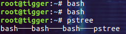

首先，利用 unshare、nohup 和 sleep 命令组合，创建出父子进程。下面的命令 fork 出一个子进程并在后台 sleep 一小时：

```bash
$ unshare --fork nohup sleep 3600&
$ pstree -p
```

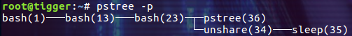

然后我们 kill 掉进程 unshare(34)：

```bash
$ kill 34
$ pstree -p
```

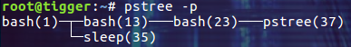

如同我们期望的一样，进程 sleep(35) 被当前 PID namespace 中的 init 进程 bash(1) 收养了！
现在 kill 掉进程 sleep(35)并重新执行 unshare --fork nohup sleep 3600& 命令：

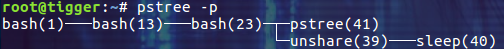

我们得到了和刚才相同的进程关系，只是进程的 PID 发生了一些变化。

**第二步，回到第三个 shell 窗口**
先检查当前的进程树：

```bash
$ pstree -p
```

bash(1)───
sudo(12)───unshare(13)───bash(14)───
sudo(25)───unshare(26)───bash(27)───bash(79)───bash(89)───unshare(105)───sleep(106)
我们先 kill 掉 sleep 进程的父进程 unshare(105)：

```bash
$ kill 105
$ pstree -p
```

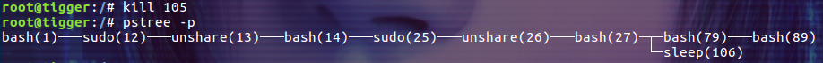

进程 sleep(106)被 bash(27) 收养了而不是 baus(1)，这说明孤儿进程只会被自己 PID namespace 中的 init 进程收养。
接下来 kill 掉第二个 PID namespace 中的 init 进程，即这里的 bash(14)：

```bash
$ kill -SIGKILL 14
$ pstree -p
```

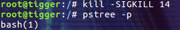

此时第一个和第三个 shell 窗口都回到了我们创建的第一个 PID namespace 中。我们创建的第二个和第三个 PID namespace 中的进程都被系统清除掉了。

## 总结

PID namespace 具有比较显著的点，比如可以嵌套，对 init 进程的特殊照顾，孤儿进程的收养等等。尤其是一旦进程的 PID namespace 确定后就不能改变的特点，与其它的 namespace 是完全不一样的。

**参考：**
[Linux Namespace PID](https://segmentfault.com/a/1190000006912878)
[PID namespaces](https://lwn.net/Articles/531419/)
[PID namespaces2](https://lwn.net/Articles/532748/)
[pid namespace man page](http://man7.org/linux/man-pages/man7/pid_namespaces.7.html)

------

转自[https://www.cnblogs.com/sparkdev/tag/linux%20namespace/](https://www.cnblogs.com/sparkdev/tag/linux namespace/)
