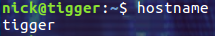
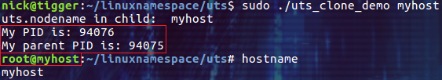
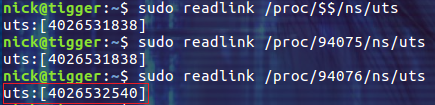
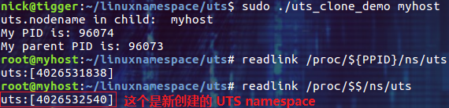
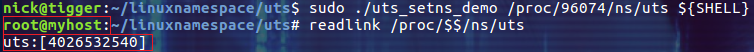
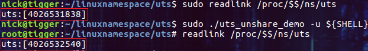
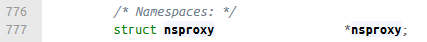
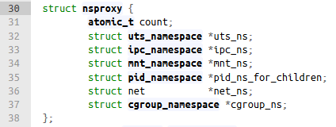
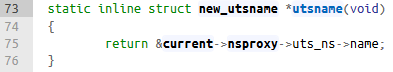

## 摘要

UTS namespace 用来隔离系统的 hostname 以及 NIS domain name。UTS 据称是 UNIX Time-sharing System 的缩写。

<!-- more --> 

## hostname 与 NIS domain name

**hostname** 是用来标识一台主机的，比如登录时的提示，在 Shell 的提示符上，都可以显示出来，这样的话，使用者可以知道自己用的是哪台机器。比如下图中的 nick@tigger：



nick 是用户名，而 tigger 就是主机的 hostname。我们可以通过 hostname 命令来查看当前主机的名称，比如上图中的输出：tigger。本质上，hostname 命令是通过执行系统调用 gethostname 来获得 hostname 的，我们在本文的结尾处会分析 gethostname 的相关实现。

**NIS domain name**
在一些大型的网络中，会有很多的 Linux 主机，如果能够有一部账号主控服务器来管理网络中所有主机的账号， 当其他的主机有用户登入的需求时，才到这部主控服务器上面请求相关的账号、密码等用户信息， 如此一来，如果想要增加、修改、删除用户数据，只要到这部主控服务器上面处理即可(听起来是不是有点类似 windows 平台上的域控制器的概念)。 
在 Linux 平台上，一般通过 Network Information Services(NIS Server) 创建的域(domain)来实现相关的功能。而主机的 NIS domain name 就是加入 NIS domain 的主机显示的 NIS domain 的名称(类似 windows 平台上使用域控制器创建的域名)。

简单起见，本文以 hostname 为例进行 Linux UTS namespace 的介绍。文中的 demo 均在 ubuntu 16.04 中完成。

## 通过 clone 函数创建 UTS 隔离的子进程

我们在《[Linux Namespace 简介](https://www.cnblogs.com/sparkdev/p/9365405.html)》一文中介绍了 clone 函数用于在创建新进程的同时创建 namespace，下面的 demo 就是通过 clone 函数为新进程创建新的 UTS namespace(该 demo 的主要代码来自 clone 函数的 man page，为了进行演示，笔者进行了适当的调整和扩展)：

```c
#define _GNU_SOURCE
#include <sys/wait.h>
#include <sys/utsname.h>
#include <sched.h>
#include <string.h>
#include <stdio.h>
#include <stdlib.h>
#include <unistd.h>

#define errExit(msg)    do { perror(msg); exit(EXIT_FAILURE); } while (0)

// 调用 clone 时执行的函数
static int childFunc(void *arg)
{
    struct utsname uts;
    char *shellname;
    // 在子进程的 UTS namespace 中设置 hostname
    if (sethostname(arg, strlen(arg)) == -1)
        errExit("sethostname");

    // 显示子进程的 hostname
    if (uname(&uts) == -1)
        errExit("uname");
    printf("uts.nodename in child:  %s\n", uts.nodename);
    printf("My PID is: %d\n", getpid());
    printf("My parent PID is: %d\n", getppid());
    // 获取系统的默认 shell
    shellname = getenv("SHELL");
    if(!shellname){
        shellname = (char *)"/bin/sh";
    }
    // 在子进程中执行 shell
    execlp(shellname, shellname, (char *)NULL);

    return 0;
}
// 设置子进程的堆栈大小为 1M
#define STACK_SIZE (1024 * 1024)

int main(int argc, char *argv[])
{
    char *stack;
    char *stackTop;        
    pid_t pid;

    if (argc < 2) {
        fprintf(stderr, "Usage: %s <child-hostname>\n", argv[0]);
        exit(EXIT_SUCCESS);
    }

    // 为子进程分配堆栈空间,大小为 1M
    stack = malloc(STACK_SIZE);
    if (stack == NULL)
        errExit("malloc");
    stackTop = stack + STACK_SIZE;  /* Assume stack grows downward */

    // 通过 clone 函数创建子进程
    // CLONE_NEWUTS 标识指明为新进程创建新的 UTS namespace
    pid = clone(childFunc, stackTop, CLONE_NEWUTS | SIGCHLD, argv[1]);
    if (pid == -1)
        errExit("clone");

    // 等待子进程退出
    if (waitpid(pid, NULL, 0) == -1)
        errExit("waitpid");
    printf("child has terminated\n");

    exit(EXIT_SUCCESS);
}
```

[;](copycode.gif)](javascript:void(0);)

这段代码中的 main 函数负责调用 clone 函数创建一个子进程。在调用 clone 函数时通过设置 CLONE_NEWUTS 标识让子进程拥有自己的 UTS namespace。 子进程执行 childFunc 函数，它先设置新的 hostname，然后分别输出 hostname，当前进程的 PID 和 父进程的 PID，并在最后执行系统的默认 shell。父进程等待子进程的退出，并最终退出程序。把上面的代码保存在文件 uts_clone.c 文件中，并执行下面的命令进行编译：

```
$ gcc -Wall uts_clone.c -o uts_clone_demo
```

然后以 myhost 为参数运行 demo 程序：

```
$ sudo ./uts_clone_demo
```



注意图中第二个红框，hostname 已经成了 myhost。我们在当前的 shell 中执行 hostname 命令，得到的结果也是 myhost。
下面让我们确认新创建的子进程和父进程分别属于不同的 UTS namespace。具体的做法是查看 /proc 目录中相关进程目录下的 ns/uts 链接文件。让我们新打开一个命令行终端，以管理员权限运行下面 3 个命令(注意，在执行下面命令的同时请不要退出 demo 程序)：



第一条命令查看当前 shell 进程的 uts namespace。
第二条命令查看 demo 程序中父进程的 uts namespace(父进程 PID 来自 demo 程序的输出)。
第三条命令查看 demo 程序中子进程的 uts namespace(子进程 PID 来自 demo 程序的输出)。
前两条命令的输出是相同的，它们都使用了系统默认的 uts namespace。而第三条命令的输出则说明 demo 中的子进程使用了和父进程不同的 uts namespace。

## 把当前进程加入到已存在的 UTS namespace

和 clone 函数一样，我们在前文中也介绍了通过 setns 函数可以将当前进程加入到已有的 namespace 中，下面的 demo 把当前进程加入到已有 UTS namespace(该 demo 的主要代码来自 setns 函数的 man page)：

```c
#define _GNU_SOURCE
#include <fcntl.h>
#include <sched.h>
#include <unistd.h>
#include <stdlib.h>
#include <stdio.h>

#define errExit(msg)    do { perror(msg); exit(EXIT_FAILURE); } while (0)

int main(int argc, char *argv[])
{
    int fd;

    if (argc < 3) {
        fprintf(stderr, "%s /proc/PID/ns/FILE cmd args...\n", argv[0]);
        exit(EXIT_FAILURE);
    }

    // 打开一个现存的 UTS namespace 文件
    fd = open(argv[1], O_RDONLY);
    if (fd == -1)
        errExit("open");

    // 把当前进程的 UTS namespace 设置为命令行参数传入的 namespace
    if (setns(fd, 0) == -1)        
        errExit("setns");

    // 在新的 UTS namespace 中运行用户指定的程序
    execvp(argv[2], &argv[2]);
    errExit("execvp");
}
```

代码的逻辑很简单，通过 open 函数打开用户传入的 UTS namespace 文件，然后把得到的文件描述符传递给 setns 函数。最后执行用户指定的程序。
所以执行上面的程序需要我们传入两个参数，第一个参数是一个已经存在的 UTS namespace 文件，第二个参数是指定要运行的程序。下面我们将结合前面的 uts_clone_demo 进行演示。把上面的代码保存到文件 uts_setns.c 文件中，并执行下面的命令进行编译：

```bash
$ gcc -Wall uts_setns.c -o uts_setns_demo
```

接下来的思路是：运行 uts_clone_demo 程序创建一个新的 UTS namespace，然后把运行 uts_setns_demo 程序的进程加入到这个新的 UTS namespace 中，并运行 shell 命令。

```bash
$ sudo ./uts_clone_demo myhost
```



需要记住进程的 PID，这里是 96074，需要为 uts_setns_demo 指定 UTS namespace 文件的路径：

```bash
$ sudo ./uts_setns_demo /proc/96074/ns/uts ${SHELL}
```

执行上的命令会把运行 uts_setns_demo 程序的 UTS namespace 设置为 uts:[4026532540]，并运行 shell 程序：



上图中的 hostname 已经变成了 myhost，并且执行 readlink /proc/$$/ns/uts 命令的结果也和我们预期的相同。

## 把当前进程加入到一个新建的 UTS namespace

我们要介绍的最后一个函数是 unshare 。它可以创建新的 namespace，并把当前进程加入到这个 namespace 中。下面我们依然通过 demo 程序演示 unshare 对 UTS namespace 的操作(该 demo 的主要代码来自 unshare 函数的 man page)：

```c
#define _GNU_SOURCE
#include <sched.h>
#include <unistd.h>
#include <stdlib.h>
#include <stdio.h>

#define errExit(msg)    do { perror(msg); exit(EXIT_FAILURE); } while (0)

static void usage(char *pname)
{
    fprintf(stderr, "Usage: %s [options] program [arg...]\n", pname);
    fprintf(stderr, "Options can be:\n");
    fprintf(stderr, "    -i   unshare IPC namespace\n");
    fprintf(stderr, "    -m   unshare mount namespace\n");
    fprintf(stderr, "    -n   unshare network namespace\n");
    fprintf(stderr, "    -p   unshare PID namespace\n");
    fprintf(stderr, "    -u   unshare UTS namespace\n");
    fprintf(stderr, "    -U   unshare user namespace\n");
    exit(EXIT_FAILURE);
}

int main(int argc, char *argv[])
{
    int flags, opt;
    flags = 0;

    while ((opt = getopt(argc, argv, "imnpuU")) != -1) {
        switch (opt) {
        case 'i': flags |= CLONE_NEWIPC;        break;
        case 'm': flags |= CLONE_NEWNS;         break;
        case 'n': flags |= CLONE_NEWNET;        break;
        case 'p': flags |= CLONE_NEWPID;        break;
        case 'u': flags |= CLONE_NEWUTS;        break;
        case 'U': flags |= CLONE_NEWUSER;       break;
        default:  usage(argv[0]);
        }
    }

    if (optind >= argc)
        usage(argv[0]);

    if (unshare(flags) == -1)
        errExit("unshare");

    execvp(argv[optind], &argv[optind]);
    errExit("execvp");
}
```

其实上面的代码可以根据参数实现几乎所有 namespace 的隔离，这里我们仅用它来演示对 UTS namespace 的隔离。把代码保存到文件 uts_unshare.c 文件中，并执行下面的命令进行编译：

```bash
$ gcc -Wall uts_unshare.c -o uts_unshare_demo
```

接下来运行新创建的程序 uts_unshare_demo：



我们为 uts_unshare_demo 指定了参数 -u，它会把当前的进程加入到一个新的 UTS namespace 中，并让它运行一个 shell 程序。如上图中的红框所示，通过对比 readlink /proc/$$/ns/uts 命令的输出，我们可以确定运行 uts_unshare_demo 的进程加入了新的 UTS namespace。

## UTS namespace 的实现方式

在新版(区别2.6)的 linux 内核中(比如笔者查看的 v4.13)，定义进程的结构体 task_struct 包含一个名为 nsproxy 的字段。该字段用来保存于 namespace 相关的信息(/include/linux/sched.h)：



而 nsproxy 结构体的定义如下(/include/linux/nsproxy.h)：



至于其中的 uts_namespace 结构体这里就不展开了，有兴趣的朋友可以自己去代码中查看。下面我们看看 gethostname 系统调用的大概实现(/kernel/sys.c)：

```c
SYSCALL_DEFINE2(gethostname, char __user *, name, int, len)
{
    struct new_utsname *u;
    …
    u = utsname();
    …
    if (copy_to_user(name, u->nodename, i))
        errno = -EFAULT;
    …
}
```

而 utsname 方法的实现如下(/include/linux/utsname.h)：



其实，不管是 gethostname 系统调用还是 uname 系统调用，只要是返回了 hostname 的函数，最后总要落到 utsname 函数的调用上。

## 总结

对于 linux namespace 的学习总算是迈出了第一步，虽然参考了很多的资料和文章，但一路下来还是感觉很不轻松。学习 linux namespace 的目的主要是想更好的理解和掌握容器技术，并希望能够通过进一步的学习和分享加深对 Linux 系统的了解。文中如有不当之处，还请朋友们多多指教！

**参考：**
[Linux Namespace系列（02）：UTS namespace (CLONE_NEWUTS)](https://segmentfault.com/a/1190000006908598)
[man 2 clone](http://man7.org/linux/man-pages/man2/clone.2.html)
[man 2 setns](http://man7.org/linux/man-pages/man2/setns.2.html)
[man 2 unshare](http://man7.org/linux/man-pages/man2/unshare.2.html)

------

转自[https://www.cnblogs.com/sparkdev/tag/linux%20namespace/](https://www.cnblogs.com/sparkdev/tag/linux namespace/)
