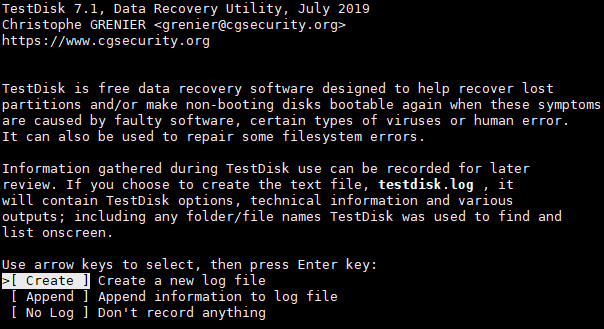
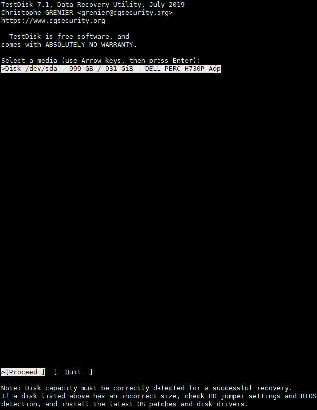
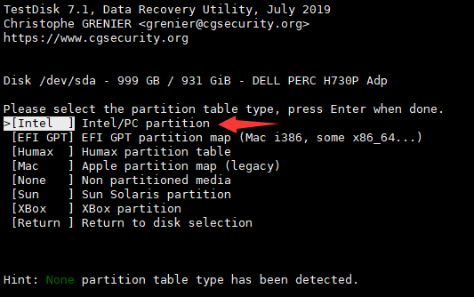
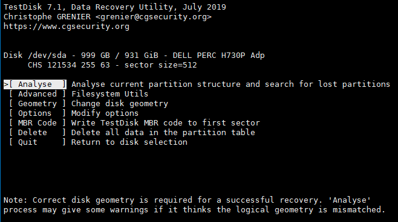
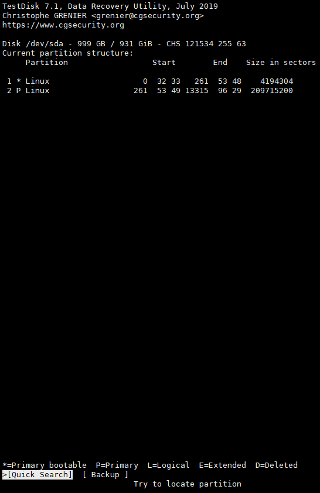
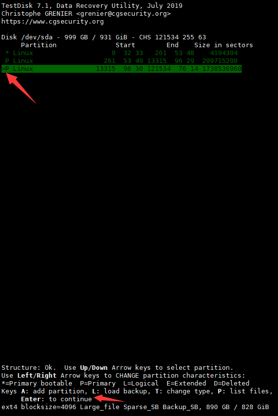
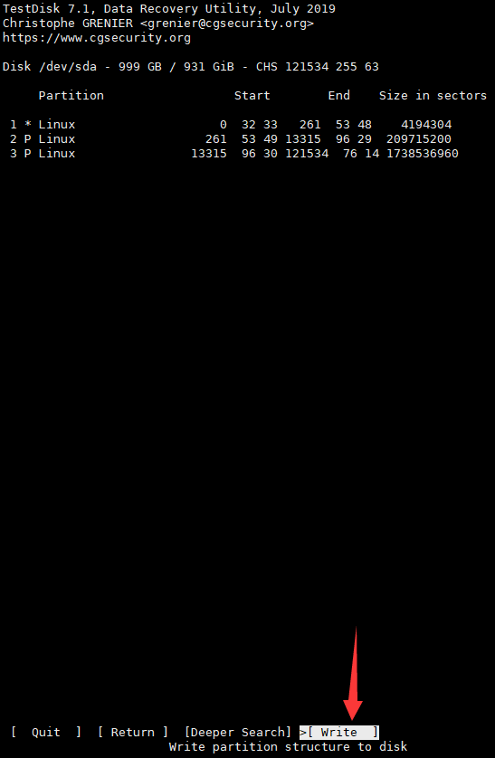

## 摘要

因为一些缘故，一个数据分区被删除了，然后系统分区被重装了（并没有覆盖到数据分区），本文介绍如何进行分区恢复

<!-- more --> 

## 安装testdisk

```shell
yum install libewf-20140608-1.el7.1.x86_64.rpm ntfs-3g-2017.3.23-11.el7.x86_64.rpm testdisk-7.1-1.el7.x86_64.rpm
```

## 使用testdisk重建分区表

1. 命令行重直接键入`testdisk`，出现如下页面，默认选择`Create`，直接敲`Enter`即可



2. 选择要进行恢复的盘，我这只有一块盘，所以直接`Enter`



3. 选择分区类型，这里选择`Intel`类型的分区表类型



4. 默认选择`Analyse`，默认选择`Enter`，然后会先显示分区表



5. 默认选择`Quick Search`，直接`Enter`，会分析出来丢失的分区



6. 分析出来了丢失的分区，直接`Enter`继续



7. 选择`Write`写入分区表，然后会确认，键入`Y`即可



8. 然后一直选`Quit`退出
9. 重启系统

## 使用fsck.ext4修复分区

重启后（其实不重启也）能通过`fdisk -l`看到已经找回来的分区，

```shell
# fdisk -l

Disk /dev/sda: 999.7 GB, 999653638144 bytes, 1952448512 sectors
Units = sectors of 1 * 512 = 512 bytes
Sector size (logical/physical): 512 bytes / 512 bytes
I/O size (minimum/optimal): 512 bytes / 512 bytes
Disk label type: dos
Disk identifier: 0x000e6536

   Device Boot      Start         End      Blocks   Id  System
/dev/sda1   *        2048     4196351     2097152   83  Linux
/dev/sda2         4196352   213911551   104857600   83  Linux
/dev/sda3       213911552  1952448511   869268480   83  Linux
```

但是还是无法挂载，需要用`fsck.ext4`来先检查一下

```shell
# fsck.ext4 -n -v /dev/sda3
e2fsck 1.42.9 (28-Dec-2013)
ext2fs_open2: Bad magic number in super-block
fsck.ext4: Superblock invalid, trying backup blocks...
/dev/sda3 was not cleanly unmounted, check forced.
Pass 1: Checking inodes, blocks, and sizes
Pass 2: Checking directory structure
Pass 3: Checking directory connectivity
Pass 4: Checking reference counts
Pass 5: Checking group summary information
Free blocks count wrong for group #86 (32768, counted=0).
Fix? no

Free blocks count wrong for group #87 (32768, counted=0).
Fix? no

Free blocks count wrong for group #88 (32768, counted=0).
Fix? no

......

Free inodes count wrong for group #6144 (8192, counted=8191).
Fix? no

Directories count wrong for group #6144 (0, counted=1).
Fix? no

Free inodes count wrong (54329333, counted=54329326).
Fix? no


/dev/sda3: ********** WARNING: Filesystem still has errors **********


          11 inodes used (0.00%, out of 54329344)
           0 non-contiguous files (0.0%)
           0 non-contiguous directories (0.0%)
             # of inodes with ind/dind/tind blocks: 0/0/0
             Extent depth histogram: 8/2
     3463073 blocks used (1.59%, out of 217317120)
           0 bad blocks
           2 large files

           5 regular files
           4 directories
           0 character device files
           0 block device files
           0 fifos
           0 links
           0 symbolic links (0 fast symbolic links)
           0 sockets
------------
           9 files
```

然后会提示该分区中有很多的错误

然后使用`fsck.ext4 -y -v /dev/sda3`进行修复

```shell
# fsck.ext4 -y -v /dev/sda3
e2fsck 1.42.9 (28-Dec-2013)
ext2fs_open2: Bad magic number in super-block
fsck.ext4: Superblock invalid, trying backup blocks...
/dev/sda3 was not cleanly unmounted, check forced.
Pass 1: Checking inodes, blocks, and sizes
Pass 2: Checking directory structure
Pass 3: Checking directory connectivity
Pass 4: Checking reference counts
Pass 5: Checking group summary information
Free blocks count wrong for group #86 (32768, counted=0).
Fix? yes

Free blocks count wrong for group #87 (32768, counted=0).
Fix? yes

......

Directories count wrong for group #6144 (0, counted=1).
Fix? yes

Free inodes count wrong (54329333, counted=54329326).
Fix? yes


/dev/sda3: ***** FILE SYSTEM WAS MODIFIED *****

          18 inodes used (0.00%, out of 54329344)
           0 non-contiguous files (0.0%)
           0 non-contiguous directories (0.0%)
             # of inodes with ind/dind/tind blocks: 0/0/0
             Extent depth histogram: 8/2
     6556189 blocks used (3.02%, out of 217317120)
           0 bad blocks
           2 large files

           5 regular files
           4 directories
           0 character device files
           0 block device files
           0 fifos
           0 links
           0 symbolic links (0 fast symbolic links)
           0 sockets
------------
           9 files
```

最后就能成功挂载了，没有报错，能读到之前的文件

```shell
mount /dev/sda3 local-disk/
```
