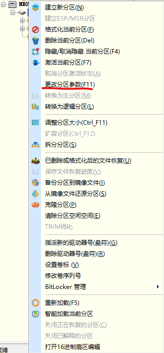
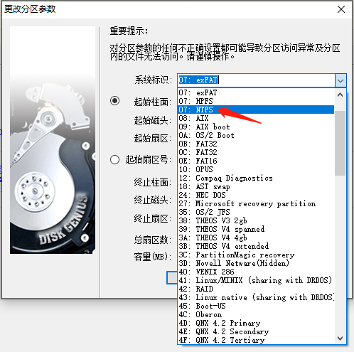
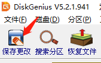

## 摘要

Linux系统一般挂载新硬盘时会将其格式化为`ext4`格式的硬盘，本文将介绍如何挂载一块全新的硬盘并将其格式化为`ext4`格式

<!-- more --> 

## 参考
[Linux中添加新硬盘后对硬盘的分区以及挂载](https://www.linuxidc.com/Linux/2018-06/152958.htm "Linux中添加新硬盘后对硬盘的分区以及挂载")

## 检查已挂载盘
```shell
df -h
```
注意：
- 如果你是IDE 接 口 硬 盘 :/dev/dh[a-z]，这里的硬盘名字应该是dh[a-z]开头
- 如果你是SCSI 接 口 硬 盘 : / dev/[ a -z ],这里的硬盘名字应该是sd[a-z]开头

## 对新盘分区
1.将硬盘装在电脑上，重启电脑，后查看/dev/ 下有没多了一块硬盘
2.用fdisk对这块硬盘分区
```shell
fdisk /dev/sdb
```
按下m显示菜单：
因为要新建分区选择n
这里是问你是要建立主分区还是扩展分区，这里是第一次建立选择主分区p
因为是MBR分区只能有4个分区，这里建立第一个分区，输入1
这里问你个分区的起始扇区，这里直接回车（默认），相当于输入了2048
这里问你的结束扇区，这里不需要计算，直接输入+1G 加号后面为这个分区的大小，或者直接回车，默认用完这块盘所有余量
此时第一个分区已经建立，但还是在内存中并没有写到硬盘sdb中，所以直接输入w　　
注意这里可以继续创建分区，完了再输入w，我这里只建立一个分区
经过以上步骤后分区的建立已经完成，但是此时系统还无法识别分区表

## 内核重新读取分区表
```shell
partprobe /dev/sdb
```
注意：这里是整个磁盘sdb，不是磁盘分区sdb1

## 创建文件系统（格式化分区）
Linux 中的主流的文件系统有：ext4和xfsd等
这里我建立ext4文件系统
```shell
mkfs.ext4 /dev/sdb1
```

　　注意：这里是磁盘分区sdb1，不是整个磁盘sdb

## 挂载
在挂载之前你需要确定挂载的目录，我这里是/mnt/sdb1，没有目录的自己mkdir,这里目录最好建立在/mnt下，这个目录是专门挂载的，可以任意。
将来这个分区就会与这个/mnt/sdb1目录建立联系
手动挂载
```shell
mount /dev/sdb1 /mnt/sdb1/
```
这里已经挂载成功，但是这只是一次性的，重启后就会消失

## 永久挂载：
要对/etc/fstab文件编辑
```shell
vim /etc/fstab
```
比如第一行中
```shell
# 硬盘路径　　　　　　　　　　　　　　　　　　　　　　　　　文件路径（挂载点）　　　　文件系统类型　　　　设备的自定义选项　　是否转存　　fsck的顺序
 
/dev/mapper/CentOS-root　　　　　　　　　　　　　　　　　　 /                  　xfs  　　　　　　 　defaults        0 　　　　　0
 
UUID=e4ef36e1-0840-4a58-a4f7-c26f52ead6f1 　　　　　　　　/boot　　　　　　　　　xfs 　　　　　　　　defaults 　　　 0　　　　　 0
 
# 我们要在最后一行写入自己的分区与文件路径，可以仿照上面的写
 
/dev/sdb1 　　　　　　　　　　　　　　　　　　　　　　　　/mnt/sdb1-zhi 　　　　　ext4 　　　　　　　　defaults 　　　　0　　　　　 0
```
这里第一列也可以写入UUID
UUID的查询：　
```shell
blkid
```
转存：0 不转存，不备份　　1转存，备份

fsck：开机检查磁盘的顺序　　0表示不检查　　1234....为检查顺序

以上步骤完成后，还需要判断是否正确
```shell
mount -a
```
如果没有其他信息出现，表示你插入的正确，否则错误。
如果错误且没有检查，开机后将进入紧急模式，无法开机
最后开机重启后df一下，看看是否正常

## 最后总结一下
1.fdisk /dev/sdb
2.partprobe /dev/sdb
3.mkfs.ext4 /dev/sdb1
4.mount /dev/sdb1　/mnt/sdb1
vim /etc/fstab
5.mount -a

## 挂载NTFS文件系统磁盘

```shell
mount -t ntfs-3g /dev/sdc1 /mnt/sdc1 -o force
```

## 格式化为NTFS

执行如下命令（需要安装`ntfsprogs`）

```shell
yum install ntfsprogs
mkfs.ntfs -f /dev/sdc1
```

其中`-f`参数是为了快速格式化，否则非常慢

但是这样在windows上还是读不出来的，需要使用DiskGenius修改分区参数

1. 右键该分区，选择更改分区参数



2. 修改系统标识为`07：NTFS`



3. 最后别忘了点保存



## 卸载硬盘

```shell
umount /mnt/sdc1
```

如果卸载不掉并提示`device is busy`

用如下命令可以查看正在占用该设备的进程

```shell
fuser -m /GPUFS
```

如下命令可以查询并杀死正在占用该设备的进程

```shell
fuser -m -k /GPUFS
```
