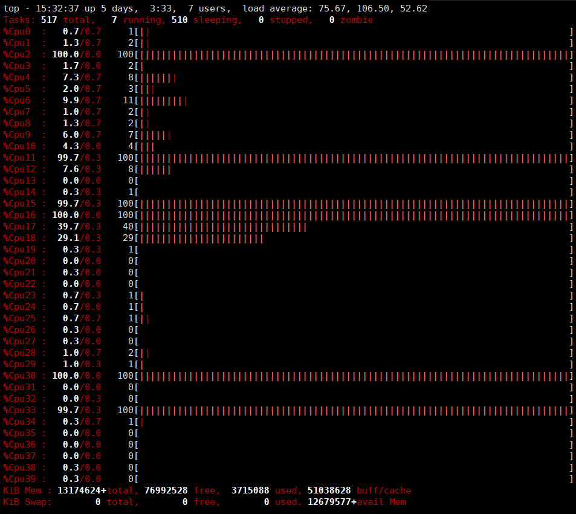

## 摘要

本文汇总了一些Linux常用的操作小技巧

<!-- more --> 

## 重定向所有输出到文件同时屏幕输出保留

```shell
[指令] 2>&1 | tee [文件名]
```

- `2>&1`是将错误输出重定向到标准输出
- `tee`是将屏幕输出拷贝一份到文件

## 让程序保持在后台运行

```bash
nohup [指令] 2>&1 | tee [文件名] &
```

这样会重定向所有输出到文件同时屏幕输出保留，也可以让屏幕不输出，如下

```bash
nohup [指令] 2>&1 > [文件名] &
```

如果终端还活着的话可以通过 `jobs` 或者 `jobs -l` 来查看任务，如果终端没了的话就只能通过`top`之类的常规方法了

## 清除多余空格（每个间隔只保留一个空格）

```shell
| tr -s [:space:]
```
## 以空格为分隔符选取第n个字段
```shell
cut -d " " -f n
```

## 查看端口占用

```bash
netstat -ntlp
```

## top

按`1`可以查看CPU的占用，再按`t`可以切换模式，再按`z`可以切换颜色

可以有下图效果



## 创建用户及用户组

```shell
groupadd -g 222 user
# 添加了一个指定gid为222的guest用户
useradd -u 222 -g user -m -s /bin/bash orange
# 添加了一个uid为222的用户，并加入到user的组中
passwd orange # 设置密码
******
```

如果要删除的话

```shell
userdel orange
groupdel user
```

## 非root用户安装rpm包到任意路径

先下载好包，这里假设下载得包叫`example.rpm`，然后执行如下命令

```shell
rpm2cpio example.rpm | cpio -idvm
```

然后在解压出来的包里添加相应的环境变量即可
