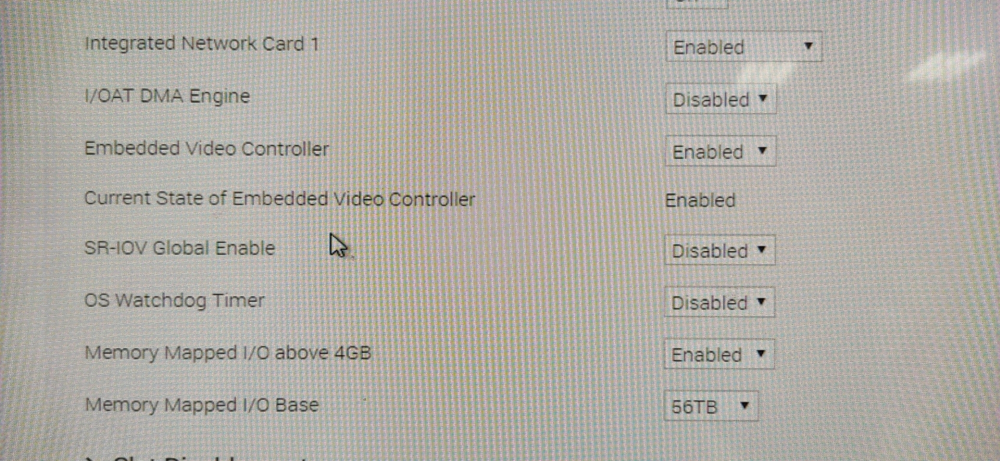
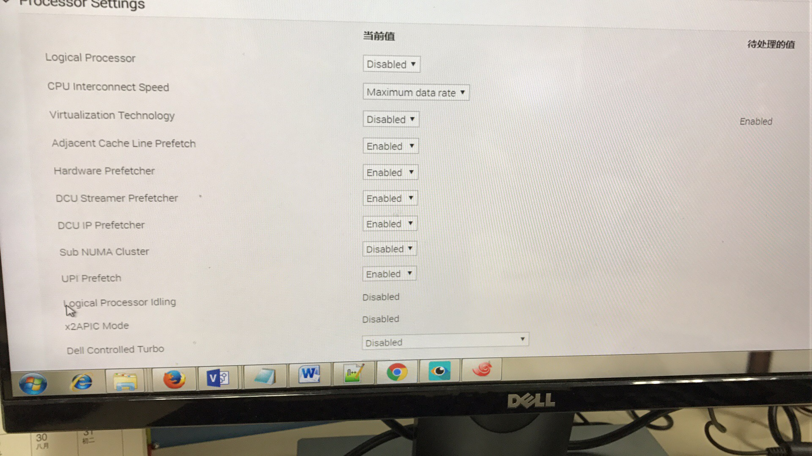

## 摘要

本文介绍如何开启SR-IOV

<!-- more --> 

## 参考

https://hub.docker.com/r/rdma/container_tools_installer

## 实验环境

DELL R740

## 1. 开启BIOS的SR-IOV和VT-d选项

参考：https://community.mellanox.com/s/article/docker-rdma-sriov-networking-with-connectx4-connectx5

将`SR-IOV`和`VT(Virtualization Technology)`的开关打开，不同型号的机器设置的地方可能不一样





## 2. 固件设置

### 2.1 查看网卡设备路径

```bash
[root@cpn124%tianhe2-K ~]# mst start
Starting MST (Mellanox Software Tools) driver set
Loading MST PCI module - Success
Loading MST PCI configuration module - Success
Create devices
Unloading MST PCI module (unused) - Success
[root@cpn124%tianhe2-K ~]# mst status
MST modules:
------------
    MST PCI module is not loaded
    MST PCI configuration module loaded

MST devices:
------------
/dev/mst/mt4115_pciconf0         - PCI configuration cycles access.
                                   domain:bus:dev.fn=0000:af:00.0 addr.reg=88 data.reg=92
                                   Chip revision is: 00
/dev/mst/mt4117_pciconf0         - PCI configuration cycles access.
                                   domain:bus:dev.fn=0000:5e:00.0 addr.reg=88 data.reg=92
                                   Chip revision is: 00xxxxxxxxxx mst
[root@cpn124%tianhe2-K ~]# lspci | grep Mellanox
5e:00.0 Ethernet controller: Mellanox Technologies MT27710 Family [ConnectX-4 Lx]
5e:00.1 Ethernet controller: Mellanox Technologies MT27710 Family [ConnectX-4 Lx]
af:00.0 Infiniband controller: Mellanox Technologies MT27700 Family [ConnectX-4]
```

这里因为有两块网卡，不要搞错了，是`/dev/mst/mt4115_pciconf0`这一块IB网卡，而不是以太网卡

### 2.2 查看网卡现有配置

```shell
[root@cpn124%tianhe2-K ~]# mlxconfig -d /dev/mst/mt4115_pciconf0 q

Device #1:
----------

Device type:    ConnectX4       
Name:           N/A             
Description:    N/A             
Device:         /dev/mst/mt4115_pciconf0

Configurations:                              Next Boot
         MEMIC_BAR_SIZE                      0               
         MEMIC_SIZE_LIMIT                    _256KB(1)       
         FLEX_PARSER_PROFILE_ENABLE          0               
         FLEX_IPV4_OVER_VXLAN_PORT           0               
         ROCE_NEXT_PROTOCOL                  254             
         NON_PREFETCHABLE_PF_BAR             False(0)        
         NUM_OF_VFS                          0               
         FPP_EN                              True(1)         
         SRIOV_EN                            False(0)
```

可以看到现在的`NUM_OF_VFS=0`，`SRIOV_EN=False`

### 2.3 更改配置

下面的例子是配置256个虚拟网卡的指令，其中`NUM_OF_VFS=256`。但我们实验中其实只设置了8个虚拟网卡，如果配到256个，并不清楚会不会因为数量多了一点引起什么问题。

```shell
[root@cpn124%tianhe2-K ~]# mlxconfig -d /dev/mst/mt4115_pciconf0 set SRIOV_EN=1 NUM_OF_VFS=256

Device #1:
----------

Device type:    ConnectX4       
Name:           N/A             
Description:    N/A             
Device:         /dev/mst/mt4115_pciconf0

Configurations:                              Next Boot       New
         SRIOV_EN                            False(0)        True(1)         
         NUM_OF_VFS                          0               256               

 Apply new Configuration? (y/n) [n] : y
Applying... Done!
-I- Please reboot machine to load new configurations.
```

## 3. 修改内核启动参数

修改`/etc/sysconfig/grub`，添加参数`intel_iommu=on`

```bash
GRUB_CMDLINE_LINUX="intel_pstate=disable intel_idle.max_cstate=0 processor.max_cstate=1 net.ifnames=0 biosdevname=0"
# 修改为了
GRUB_CMDLINE_LINUX="intel_pstate=disable intel_idle.max_cstate=0 processor.max_cstate=1 net.ifnames=0 biosdevname=0 intel_iommu=on"
# 然后执行
```
然后将这个设置写入启动设置

```shell
grub2-mkconfig -o /boot/grub2/grub.cfg
```

重启后可以通过以下操作检查是否生效

检查上述操作是否生效

```shell
[root@cpn124%tianhe2-K ~]# cat /proc/cmdline |grep intel_iommu=on
BOOT_IMAGE=/vmlinuz-3.10.0-957.el7.x86_64 root=UUID=5cedf166-4e57-49eb-b246-f63d4c5e114f ro intel_pstate=disable intel_idle.max_cstate=0 processor.max_cstate=1 net.ifnames=0 biosdevname=0 intel_iommu=on
[root@cpn124%tianhe2-K ~]# dmesg |grep -e DMAR -e IOMMU
[    0.000000] ACPI: DMAR 000000006f6c5000 001D0 (v01 DELL   PE_SC3   00000001 DELL 00000001)
[    0.000000] DMAR: IOMMU enabled
```

## 4. 重启

前面3步的设置都需要重启之后才能生效

后面的第5步是立即生效的

## 5. 设置开启的虚拟网卡数量（可选）

执行了前4步之后，通过`lspci`还是看不到虚拟网卡，这是正常的，因为还需要一步

```shell
echo 8 >> /sys/class/infiniband/mlx5_2/device/sriov_numvfs
```

（注意：这里是`mlx5_2`而不是`mlx5_0`，具体的设备名通过`ibdev2netdev`查询）

这里开启了8个虚拟网卡，使用`lspci`即可看到多出来了8块虚拟网卡

这一步操作是立即生效的，但这一步也是会重启失效的，重启系统后需要重新设置

如果需要关掉虚拟网卡，使用以下命令即可

```shell
echo 0 >> /sys/class/infiniband/mlx5_2/device/sriov_numvfs
```

在不需要使用时置零即可，应该不会对系统有什么影响

## 请暂时不要执行第5步

因为完成了最后这一步才算是真正开启了SR-IOV，各种软件才能看到虚拟网卡

**但是**根据我们的实验这会导致很多软件的的**很多兼容性问题**，因为很多软件对虚拟网卡的兼容性并不是很好，各种MPI可能会有各种各样的问题，各种依赖于IB的设备的软件，可能由于一下看到了很多很多网卡然后随便捡一个使用然后就崩了~
