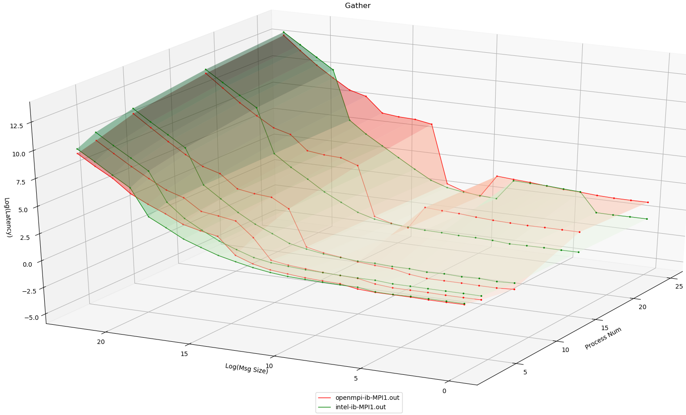
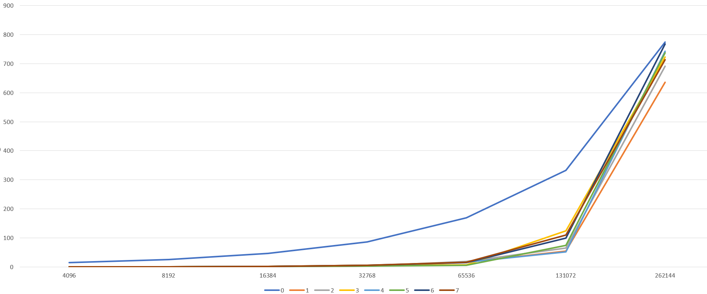
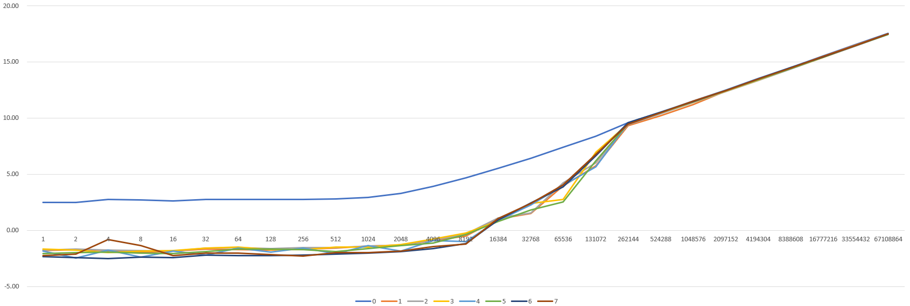

## 摘要

<!-- more --> 

在IB网上使用OSU和IMB对MPI_Gather进行测试时，会发现在测试结果中有一段的延迟增长非常快，可以达到10倍左右甚至以上。我们期望的延迟增长应该是随着消息大小增大一倍，一次Gather操作所花的时间也应该增大一倍左右。一个典型的实验现象如下：

<!-- more --> 

```shell
# OSU MPI Gather Latency Test v5.4.3
# Size       Avg Latency(us)
1                       0.59
2                       0.53
4                       0.51
8                       0.51
16                      0.51
32                      0.50
64                      0.60
128                     0.73
256                     0.85
512                     0.95
1024                    1.10
2048                    1.27
4096                    1.68
8192                   14.99 # 这里的延迟较上一个包增长了将近10倍
16384                  26.85
32768                  30.94
65536                  37.80
131072                 85.37
262144                124.70
524288                239.80
1048576               518.77
```

# 实验环境

内核版本：

```shell
$ uname -r
3.10.0-514.el7.lustre.zqh.20170930.x86_64
```

操作系统：

```shell
cat /etc/redhat-release
Red Hat Enterprise Linux Server release 7.3 (Maipo)
```

网络：
100G IB网
网卡：Mellanox Technologies MT27700 Family [ConnectX-4]
OpenMPI版本：1.10.7
编译器：gcc 4.8.5
Intel Parallel Studio版本：2018 update4

# 可视化实验现象图

本小节将使用Intel MPI、OpenMPI在IB网环境下，使用IMB Gather测试对同的进程数进行测试



**注意这幅图中的消息大小和延迟均为取LOG2之后的对应值，以方便观察**
可以看到无论是Intel MPI还是OpenMPI均在会在一个地方出现爆炸式增长，并且进程数越多，增长越快。

# 部分实验现象细节值（可省略直接看本节结论）

在这里记录使用Intel MPI、OpenMPI在IB网环境下使用osu_gather进行8进程、16进程测试的结果，作为baseline

### OpenMPI

#### 8进程

```shell
# OSU MPI Gather Latency Test v5.4.3
# Size       Avg Latency(us)
1                       0.59
2                       0.53
4                       0.51
8                       0.51
16                      0.51
32                      0.50
64                      0.60
128                     0.73
256                     0.85
512                     0.95
1024                    1.10
2048                    1.27
4096                    1.68
8192                   14.99
16384                  26.85
32768                  30.94
65536                  37.80
131072                 85.37
262144                124.70
524288                239.80
1048576               518.77
#----------------------------------------------------------------
# Benchmarking Gather
# #processes = 8
#----------------------------------------------------------------
       #bytes #repetitions  t_min[usec]  t_max[usec]  t_avg[usec]
            0         1000         0.04         0.04         0.04
            1         1000         0.14         2.69         0.48
            2         1000         0.14         2.66         0.46
            4         1000         0.14         2.67         0.46
            8         1000         0.14         2.73         0.47
           16         1000         0.14         2.73         0.47
           32         1000         0.14         2.65         0.46
           64         1000         0.14         3.32         0.55
          128         1000         0.15         4.61         0.72
          256         1000         0.16         5.16         0.79
          512         1000         0.18         5.86         0.90
         1024         1000         0.22         6.51         1.02
         2048         1000         0.24         7.76         1.20
         4096         1000         0.30        10.31         1.59
         8192         1000         1.14        31.90        15.18
        16384         1000        13.04        37.76        27.11
        32768         1000        16.49        42.11        31.30
        65536          640        19.98        52.50        38.29
       131072          320        34.31       124.55        85.63
       262144          160        56.40       178.13       124.28
       524288           80       113.65       328.06       234.09
      1048576           40       301.80       632.51       508.27
      2097152           20       879.76      1240.88      1102.90
      4194304           10      2010.39      2463.74      2254.52
```

#### 16进程

```shell
# OSU MPI Gather Latency Test v5.4.3
# Size       Avg Latency(us)
1                       3.01
2                       2.90
4                       2.80
8                       2.85
16                      2.88
32                      3.00
64                      3.15
128                     3.40
256                     3.58
512                     3.87
1024                    1.04
2048                    1.11
4096                    1.50
8192                   33.28
16384                  47.53
32768                  51.87
65536                  61.20
131072                152.89
262144                213.20
524288                411.94
1048576               857.93
#----------------------------------------------------------------
# Benchmarking Gather
# #processes = 16
#----------------------------------------------------------------
       #bytes #repetitions  t_min[usec]  t_max[usec]  t_avg[usec]
            0         1000         0.04         0.04         0.04
            1         1000         0.14        10.94         2.65
            2         1000         0.14        10.97         2.65
            4         1000         0.14        11.00         2.66
            8         1000         0.14        11.29         2.70
           16         1000         0.14        12.05         2.81
           32         1000         0.14        12.75         2.90
           64         1000         0.14        13.68         3.13
          128         1000         0.16        14.90         3.54
          256         1000         0.17        15.76         3.62
          512         1000         0.20        17.80         3.93
         1024         1000         0.22        11.59         0.95
         2048         1000         0.24        13.67         1.11
         4096         1000         0.31        19.09         1.53
         8192         1000         1.23        72.16        33.30
        16384         1000        13.17        79.35        47.76
        32768         1000        16.59        84.80        52.39
        65536          640        20.92       102.20        64.84
       131072          320        34.59       259.48       152.99
       262144          160        56.40       355.35       214.13
       524288           80       113.16       678.98       408.39
      1048576           40       300.51      1330.02       843.47
      2097152           20       938.04      2632.70      1844.78
      4194304           10      2319.03      5243.26      3882.33
```

### Intel MPI

#### 8进程

```shell
# OSU MPI Gather Latency Test v5.4.3
# Size       Avg Latency(us)
1                       0.95
2                       0.93
4                       0.88
8                       0.87
16                      0.87
32                      0.87
64                      0.92
128                     0.93
256                     0.94
512                     0.96
1024                    1.01
2048                    1.19
4096                    1.41
8192                    1.88
16384                   3.01
32768                   4.81
65536                   8.87
131072                 18.77
262144                 38.06
524288                377.36
1048576               733.46
#----------------------------------------------------------------
# Benchmarking Gather
# #processes = 8
#----------------------------------------------------------------
       #bytes #repetitions  t_min[usec]  t_max[usec]  t_avg[usec]
            0         1000         0.05         0.07         0.06
            1         1000         0.30         4.37         0.83
            2         1000         0.32         4.27         0.83
            4         1000         0.31         4.33         0.83
            8         1000         0.33         4.08         0.81
           16         1000         0.33         4.32         0.84
           32         1000         0.32         4.15         0.83
           64         1000         0.32         4.81         0.91
          128         1000         0.33         4.70         0.91
          256         1000         0.35         5.01         0.94
          512         1000         0.35         4.98         0.95
         1024         1000         0.37         5.36         1.02
         2048         1000         0.40         6.15         1.14
         4096         1000         0.48         7.59         1.39
         8192         1000         0.61        10.55         1.87
        16384         1000         1.15        18.92         3.46
        32768         1000         1.90        26.08         5.08
        65536          640         3.79        48.18         9.53
       131072          320         7.20       100.52        19.12
       262144          160        15.36       209.99        40.75
       524288           80       259.98       431.49       374.85
      1048576           40       536.65       840.25       746.30
      2097152           20      1108.71      1625.62      1463.41
      4194304           10      2306.89      3291.18      2990.85
```

#### 16进程

```shell
# OSU MPI Gather Latency Test v5.4.3
# Size       Avg Latency(us)
1                       0.86
2                       0.81
4                       0.78
8                       0.77
16                      0.74
32                      0.79
64                      0.79
128                     0.79
256                     0.80
512                     0.84
1024                    0.90
2048                    1.03
4096                    1.18
8192                    1.63
16384                   2.81
32768                   4.92
65536                   9.96
131072                 19.15
262144                 40.60
524288                651.16
1048576              1254.97
#----------------------------------------------------------------
# Benchmarking Gather
# #processes = 16
#----------------------------------------------------------------
       #bytes #repetitions  t_min[usec]  t_max[usec]  t_avg[usec]
            0         1000         0.05         0.08         0.06
            1         1000         0.32         5.99         0.70
            2         1000         0.31         5.93         0.69
            4         1000         0.31         5.93         0.69
            8         1000         0.32         5.95         0.69
           16         1000         0.30         6.00         0.70
           32         1000         0.33         6.05         0.71
           64         1000         0.33         6.57         0.74
          128         1000         0.34         6.53         0.75
          256         1000         0.35         6.81         0.77
          512         1000         0.36         7.22         0.81
         1024         1000         0.35         8.00         0.88
         2048         1000         0.40         9.87         1.04
         4096         1000         0.46        12.15         1.25
         8192         1000         0.62        17.55         1.73
        16384         1000         1.12        29.58         2.99
        32768         1000         1.90        53.40         5.38
        65536          640         3.82       109.65        10.64
       131072          320         7.21       212.86        20.45
       262144          160        15.25       440.21        42.88
       524288           80       359.64       831.49       636.55
      1048576           40       586.35      1591.95      1211.63
      2097152           20      1222.41      3164.04      2428.03
      4194304           10      2675.99      6338.31      4884.85
```

从这些结果中还可以得到以下两个结论：
\1. 使用OSU和IMB的测试效果差距不大，故后面只使用OSU进行测试（因为好改源码）。
\2. 不同的MPI产生断层的地方是不一样的，这和前面的可视化的图的结果是一致的，但一定都会有一个大断层。后面将选用在后期才断层的Intel MPI进行实验

# 进一步的实验

从前面IMB的测试可以注意到t_max和t_min的时间差距特别远，对OSU也使用`-f`参数输出最大值和最小值，使用`-m 67108864`增大最大消息大小，并且修改源码查看每个进程所花的时间

```shell
# OSU MPI Gather Latency Test v5.4.3
# Size       Avg Latency(us)   Min Latency(us)   Max Latency(us)  Iterations
1                       0.92              0.20              5.55        1000
2                       0.92              0.18              5.62        1000
4                       1.12              0.18              6.83        1000
8                       1.03              0.19              6.45        1000
16                      0.98              0.18              6.06        1000
32                      1.07              0.22              6.65        1000
64                      1.10              0.21              6.68        1000
128                     1.09              0.21              6.78        1000
256                     1.11              0.20              6.84        1000
512                     1.11              0.23              6.89        1000
1024                    1.24              0.25              7.59        1000
2048                    1.53              0.27              9.80        1000
4096                    2.30              0.32             15.03        1000
8192                    3.74              0.43             25.49        1000
16384                   7.45              1.75             46.07         100
32768                  14.60              2.85             86.64         100
65536                  32.86              5.83            168.52         100
131072                113.56             51.16            333.00         100
262144                723.46            635.76            774.66         100
524288               1410.58           1191.46           1501.59         100
1048576              2761.69           2343.98           2926.72         100
2097152              5540.65           5220.03           5785.99         100
4194304             11149.36          10389.16          11772.69         100
8388608             22412.04          21585.84          23605.34         100
16777216            45466.04          43798.31          47738.80         100
33554432            92076.78          89692.44          96626.01         100
67108864           184738.00         179055.89         194026.17         100
```

将每个进程所花的时间部分可视化


可以看到一开始除了根进程要花费的时间多，其他的都很快能完成，但到了后面，其他进程所花的时间多
将延迟取log2之后重新观察


发现根进程在大约在2048之后确实是线性增长的，这是正常的
**产生断层的原因是：发送的数据包的大小增长时，链路上的拥塞点的缓存逐渐被填满，非根进程需要开始平分带宽，故它们的耗时开始逐渐贴近根进程的用时，但始终不会超过根进程的用时。而非根进程数量众多，根进程只有1个，当非根进程的用时开始增长时，就导致了延时看起来像是爆炸式增长。所以在观察gather的性能时，不应该只看平均值，而要看最大值和最小值的变化**

# Future Work

为啥这个地方每个进程要开始平分带宽呢？如果一个一个进程来发送数据，并且让中间切换时的带宽的利用率尽可能高，这样就可以一部分进程先发送完，从而进行后面的计算，可以平均减少非根进程一半的耗时。虽然说这样依然存在着短板效应，但是有没有什么应用场景是可以利用这一点的呢？
