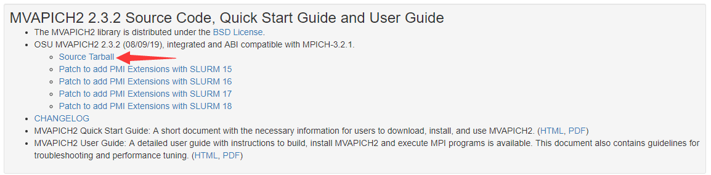
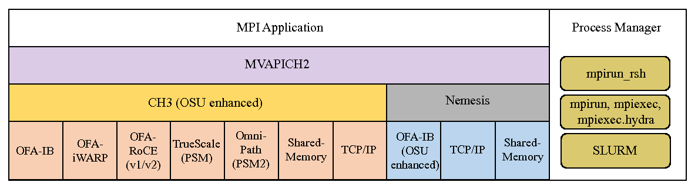
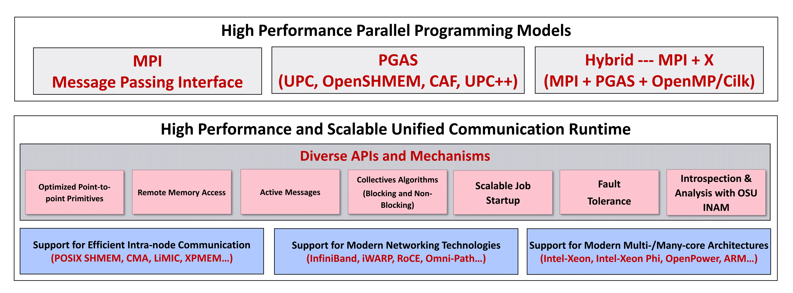

## 摘要

本文将介绍如何使用Intel编译器从源码编译安装MVAPICH2 2.3.2

<!-- more --> 

## 下载

官网：http://mvapich.cse.ohio-state.edu/downloads/



## 版本区别

在官网可以看到Mvapich有两种版本：`MVAPICH2 2.3.2`和`MVAPICH2-X 2.3rc2`

我也并没有完全明白他们的区别，我观察到的区别有如下：

- 安装方式的区别

  - `MVAPICH2 2.3.2`可以从源码编译安装
  - `MVAPICH2-X 2.3rc2`只能通过rpm或者解压安装

- 功能上的区别，官网上`MVAPICH2-X 2.3rc2`似乎功能更加强大

  - `MVAPICH2 2.3.2`的[介绍](http://mvapich.cse.ohio-state.edu/static/media/mvapich/mvapich2-2.3.2-userguide.html#x1-20001)如下：

  - `MVAPICH2-X 2.3rc2`的介绍如下：

    > Message Passing Interface (MPI) has been the most popular programming model for developing parallel scientific applications. Partitioned Global Address Space (PGAS) programming models are an attractive alternative for designing applications with irregular communication patterns. They improve programmability by providing a shared memory abstraction while exposing locality control required for performance. It is widely believed that hybrid programming model (MPI+X, where X is a PGAS model) is optimal for many scientific computing problems, especially for exascale computing.
    >
    > MVAPICH2-X provides advanced MPI features/support (such as User Mode Memory Registration (UMR), On-Demand Paging (ODP), Dynamic Connected Transport (DC), Core-Direct, SHARP, and XPMEM). It also provides support for the OSU InfiniBand Network Analysis and Monitoring (OSU INAM) Tool.
    >
    > It also provides a unified high-performance runtime that supports both MPI and PGAS programming models on InfiniBand clusters. It enables developers to port parts of large MPI applications that are suited for PGAS programming model. This minimizes the development overheads that have been a huge deterrent in porting MPI applications to use PGAS models. The unified runtime also delivers superior performance compared to using separate MPI and PGAS libraries by optimizing use of network and memory resources. The DCT support is also available for the PGAS models.
    >
    > MVAPICH2-X supports Unified Parallel C (UPC) OpenSHMEM, CAF, and UPC++ as PGAS models. It can be used to run pure MPI, MPI+OpenMP, pure PGAS (UPC/OpenSHMEM/CAF/UPC++) as well as hybrid MPI(+OpenMP) + PGAS applications. MVAPICH2-X derives from the popular MVAPICH2 library and inherits many of its features for performance and scalability of MPI communication. It takes advantage of the RDMA features offered by the InfiniBand interconnect to support UPC/OpenSHMEM/CAF/UPC++ data transfer and OpenSHMEM atomic operations. It also provides a high-performance shared memory channel for multi-core InfiniBand clusters.



因为想从源码编译安装……所以就选择前者了，有空可以研究下哪个更好点~

## 安装

```bash
cd /GPUFS/software/mvapich
tar -xvf mvapich2-2.3.2.tar.gz
cd /GPUFS/software/mvapich/mvapich2-2.3.2
mkdir install

export CC=icc
export CXX=icpc
export FC=ifort
export F77=ifort
export CFLAGS='-O3 -ipo -xHOST'
export CXXFLAGS='-O3 -ipo -xHOST'
export FCFLAGS='-O3 -ipo -xHOST'
export FFLAGS='-O3 -ipo -xHOST'
export LDFLAGS='-Wc,-static-intel'
./configure --prefix=`pwd`/install
```

配置结果

```
-----------------------------------------------------------------------------
Hwloc optional build support status (more details can be found above):

Probe / display I/O devices: PCI(linux)
Graphical output (Cairo):    
XML input / output:          basic
libnuma memory support:      no
Plugin support:              no
-----------------------------------------------------------------------------
```

然后

```shell
make -j
```

### 缺少yacc

然后出现了缺少yacc的报错

```bash
/public/fgn/software/mvapich/install-package/mvapich2-2.3.2/confdb/ylwrap: line 176: yacc: command not found
```

然后装一下完事

```bash
yum install byacc
```
