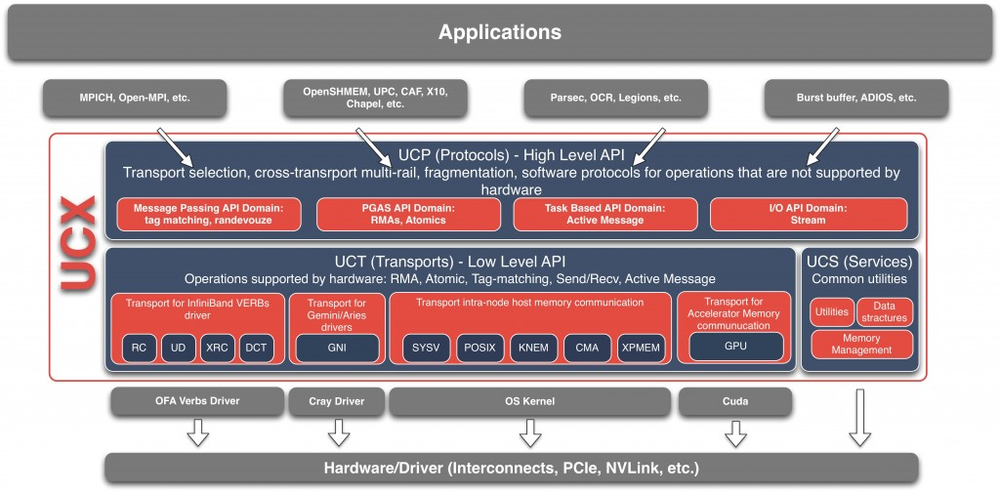

## 摘要

本文介绍如何测试UCX的UCT和UCP两部分的接口

<!-- more --> 

## 基础知识

UCT是UCX的底层，负责与底层的通信硬件进行交互，仅提供简单的通信接口，通过上层的UCP的封装，再提供更高级的功能给MPI等软件



## UCT

### Step 1：选择设备和传输模式

UCT测试中必须设置`-d <device>`和`-x <transport>`参数，这两个参数的获取可以通过`ucx_info -d`中的`Transport`和紧随其后的`Device`字段来获知

例如：

```bash
ucx_perftest -d mlx5_0:1 -x rc
```

### Step 2：选择测试项目

测试项目通过`-t <test>`来选择，UCT的测试项目有如下这些

```
 am_lat - UCT active message latency
put_lat - UCT put latency
add_lat - UCT atomic add latency
    get - UCT get latency / bandwidth / message rate
   fadd - UCT atomic fetch-and-add latency / rate
   swap - UCT atomic swap latency / rate
  cswap - UCT atomic compare-and-swap latency / rate
  am_bw - UCT active message bandwidth / message rate
```

### Step 3：选择data layout

注意部分测试需要选择特定的data layout，通过`-D <layout>`来进行选择

```
short - short messages (default, cannot be used for get)
bcopy - copy-out (cannot be used for atomics)
zcopy - zero-copy (cannot be used for atomics)
iov    - scatter-gather list (iovec)
```

### Step 4：选择消息大小

部分测试带宽的项目需要`-s <size>`指定消息的大小来打满带宽，测试迭代次数可以通过`-s <size>`来制定

当然这样测试一次只能测一组size大小，很麻烦，所以还可以使用`-b <file>`参数来通过配置文件指定多组参数组合，这个配置文件在`ucx`的安装目录`<path-to-ucx>/share/ucx/perftest`有很多的例子

### Step 5：启动服务端与客户端测试

服务端可以省略除了`-b <file>`以外的参数，除非只进行一项测试（不能使用`while true; do ucx_perftest; done `来代替`-b`的作用）

```bash
ucx_perftest -b ./msg_pow2
```

客户端需要填写服务端地址等参数，例如

```bash
ucx_perftest -d mlx5_0:1 -x rc_verbs -t put_bw -D zcopy -b ./msg_pow2 gpu6
```

### 其他参数

暂未关注其他参数的作用，建议自己多看看，如发现有用会补充到这里

## UCP

### Step 1：选择测试项目

测试项目通过`-t <test>`来选择，`UCP`的测试项目有如下这些

```
     tag_lat - UCP tag match latency
      tag_bw - UCP tag match bandwidth
tag_sync_lat - UCP tag sync match latency
 tag_sync_bw - UCP tag sync match bandwidth
 ucp_put_lat - UCP put latency
  ucp_put_bw - UCP put bandwidth
     ucp_get - UCP get latency / bandwidth / message rate
     ucp_add - UCP atomic add bandwidth / message rate
    ucp_fadd - UCP atomic fetch-and-add latency / bandwidth / rate
    ucp_swap - UCP atomic swap latency / bandwidth / rate
   ucp_cswap - UCP atomic compare-and-swap latency / bandwidth / rate
   stream_bw - UCP stream bandwidth
  stream_lat - UCP stream latency
  ucp_am_lat - UCP am latency
   ucp_am_bw - UCP am bandwidth / message rate
```

### Step 2：选择消息大小

部分测试带宽的项目需要`-s <size>`指定消息的大小来打满带宽，测试迭代次数可以通过`-s <size>`来制定

当然这样测试一次只能测一组size大小，很麻烦，所以还可以使用`-b <file>`参数来通过配置文件指定多组参数组合，这个配置文件在`ucx`的安装目录`<path-to-ucx>/share/ucx/perftest`有很多的例子

### Step 3：选择传输方法

通过环境变量`UCX_TLS`、`UCX_SELF_DEVICES`、`UCX_SHM_DEVICES`、`UCX_NET_DEVICES`来选择传输方法

UCX中环境变量的作用、选项、默认配置，可以通过`ucx_info -f`来查询

UCX的当前环境变量配置可以通过`ucx_info -c`来查看

### Step 4：启动服务端与客户端测试

服务端可以省略除了`-b <file>`以外的参数，除非只进行一项测试（不能使用`while true; do ucx_perftest; done `来代替`-b`的作用）

```bash
ucx_perftest -b ./msg_pow2
```

客户端需要填写服务端地址等参数，例如

```bash
ucx_perftest -t ucp_put_bw -b ./msg_pow2 gpu6
```

### 其他参数

暂未关注其他参数的作用，建议自己多看看，如发现有用会补充到这里

## UCT与UCP公共参数

### 内存选项

可以选择主存，也可以选择显存

```
-m <send mem type>[,<recv mem type>]
memory type of message for sender and receiver (host)
    host - System memory
    cuda - NVIDIA GPU memory
    cuda-managed - NVIDIA GPU managed/unified memory
```

### 输出

- `-f`：如果单项测试运行时间大于1秒，会输出当前运行进度及测试结果，如果想要只输出最终结果，就加这个参数
- `-v`：将结果以CSV格式输出，方便数据后处理

### 绑核

可以对CPU进行绑核，这里的编号是指核的编号，不是socket的编号，理论上可以提升性能，还可以消除`UCX  WARN  CPU affinity is not set. Performance may be impacted`的Warning

```
-c <cpulist>   set affinity to this CPU list (separated by comma) (off)
```

这侧参数通用需要在服务端和客户端都设置，不然另一边照样报Warning

### 其他参数

暂未关注其他参数的作用，建议自己多看看，如发现有用会补充到这里

## 测试案例

### 100G EDR IB网卡测试

#### 先说结论

> 以下结论中的`~`符号表述该数据是个约数，表示“左右”

- 在IB perftest测试中，使用具有对网卡【不】具有亲和性的CPU，IB(_verbs)的延迟会升高~160ns
- 在IB perftest测试中，使用具有对网卡【不】具有亲和性的CPU，IB(_verbs)的小数据包消息速率（MsgRate[Mpps]）会降低\~26%
- 在IB perftest测试中，使用具有对网卡【不】具有亲和性的CPU，IB(_verbs)的（大数据包）带宽几乎没有影响
- 在延迟测试中，无论是UCT还是UCP的（小数据包）延迟相比IB(_verbs)几乎没有变化
- 在延迟测试中，UCT的（小数据包）对比原生RoCE，使用具有对网卡具有亲和性的CPU，消息速率下降了~20%；使用具有对网卡【不】具有亲和性的CPU，消息速率下降了~29%
- 在延迟测试中，UCP的（小数据包）对比原生RoCE，使用具有对网卡具有亲和性的CPU，消息速率下降了~28%；使用具有对网卡【不】具有亲和性的CPU，消息速率下降了~25%
- 在UCT延迟测试中，`put_lat`延迟最低，`am_lat`延迟稍高，`add_lat`延迟最高，`add_lat`高出\~1us
- 在UCT延迟测试中，使用具有对网卡【不】具有亲和性的CPU，UCT的小数据包延迟、消息速率（MsgRate[Mpps]）、带宽劣化\~10%
- 在UCT带宽测试中，UCT能达到的最大带宽与IB(_verbs)一致
- 在UCT带宽测试中，如果使用bcopy，可以在\~4KB打满带宽，但最大的包大小只能支持到8256（应该是由于相关参数设置）
- 在UCT带宽测试中，IB(_verbs)在\~4KB大小就能打满带宽，如果使用zero-copy，UCT在4KB只能到满带宽的\~10%，UCT需要512KB的包才能打满带宽
- 在UCT带宽测试中，使用具有对网卡【不】具有亲和性的CPU，UCT的（大数据包）带宽几乎没有影响
- 在UCP延迟测试中，使用具有对网卡【不】具有亲和性的CPU，UCP的小数据包延迟劣化\~10%
- 在UCP延迟测试中，不同操作的延迟、消息速率、（小数据包）带宽差异巨大
- 在UCP带宽测试中，带宽速度并不总是随着包的大小增大而增大，比如`stream_bw`，猜测可能需要调参？
- 在UCP带宽测试中，使用具有对网卡【具有】亲和性的CPU，可以在4KB大小的数据包达到IB(_verbs)\~82%的性能（`ucp_am_bw`）
- 在UCP带宽测试中，使用具有对网卡【不】具有亲和性的CPU，UCT的带宽在4KB大小上再劣化16%（`ucp_am_bw`）

#### `ib perftest`测试

##### 延迟测试

###### 近CPU

```
# numactl --physcpubind=14 ib_write_lat -F -d mlx5_0 --iters 100000 gpu6
---------------------------------------------------------------------------------------
                    RDMA_Write Latency Test
 Dual-port       : OFF          Device         : mlx5_0
 Number of qps   : 1            Transport type : IB
 Connection type : RC           Using SRQ      : OFF
 TX depth        : 1
 Mtu             : 4096[B]
 Link type       : IB
 Max inline data : 220[B]
 rdma_cm QPs     : OFF
 Data ex. method : Ethernet
---------------------------------------------------------------------------------------
 #bytes #iterations    t_min[usec]    t_max[usec]  t_typical[usec]    t_avg[usec]    t_stdev[usec]   99% percentile[usec]   99.9% percentile[usec]
 2       100000          1.48           11.65        1.53              1.55             0.30            1.58        8.12
---------------------------------------------------------------------------------------
```

###### 远CPU

```
numactl --physcpubind=0 ib_write_lat -F -d mlx5_0 --iters 100000 gpu6
---------------------------------------------------------------------------------------
                    RDMA_Write Latency Test
 Dual-port       : OFF          Device         : mlx5_0
 Number of qps   : 1            Transport type : IB
 Connection type : RC           Using SRQ      : OFF
 TX depth        : 1
 Mtu             : 4096[B]
 Link type       : IB
 Max inline data : 220[B]
 rdma_cm QPs     : OFF
 Data ex. method : Ethernet
---------------------------------------------------------------------------------------
 #bytes #iterations    t_min[usec]    t_max[usec]  t_typical[usec]    t_avg[usec]    t_stdev[usec]   99% percentile[usec]   99.9% percentile[usec]
 2       100000          1.59           9.30         1.70              1.71             0.24            1.75        6.13
---------------------------------------------------------------------------------------
```

##### 带宽测试

###### 近CPU

```
numactl --physcpubind=14 ib_write_bw -F -a -d mlx5_0 --iters=10000 --perform_warm_up gpu6
---------------------------------------------------------------------------------------
                    RDMA_Write BW Test
 Dual-port       : OFF          Device         : mlx5_0
 Number of qps   : 1            Transport type : IB
 Connection type : RC           Using SRQ      : OFF
 TX depth        : 128
 CQ Moderation   : 100
 Mtu             : 4096[B]
 Link type       : IB
 Max inline data : 0[B]
 rdma_cm QPs     : OFF
 Data ex. method : Ethernet
---------------------------------------------------------------------------------------
 #bytes     #iterations    BW peak[MB/sec]    BW average[MB/sec]   MsgRate[Mpps]
 2          10000            12.85              12.78              6.699589
 4          10000            27.49              26.79              7.023679
 8          10000            54.67              53.17              6.968536
 16         10000            110.25             108.84             7.133210
 32         10000            217.47             216.09             7.080729
 64         10000            441.01             436.70             7.154857
 128        10000            882.02             860.80             7.051688
 256        10000            1706.98            1661.90            6.807136
 512        10000            3368.53            3354.59            6.870204
 1024       10000            6016.92            5825.04            5.964844
 2048       10000            8935.23            8922.25            4.568190
 4096       10000            10371.08            10362.64                  2.652835
 8192       10000            10418.60            10404.98                  1.331837
 16384      10000            10302.62            10302.14                  0.659337
 32768      10000            10310.39            10302.12                  0.329668
 65536      10000            10329.40            10329.02                  0.165264
 131072     10000            10338.65            10338.29                  0.082706
 262144     10000            10419.36            10416.33                  0.041665
 524288     10000            10392.79            10385.47                  0.020771
 1048576    10000            10379.42            10378.66                  0.010379
 2097152    10000            10380.60            10379.62                  0.005190
 4194304    10000            10380.31            10380.04                  0.002595
 8388608    10000            10383.98            10383.97                  0.001298
---------------------------------------------------------------------------------------
```

###### 远CPU

```
numactl --physcpubind=0 ib_write_bw -F -a -d mlx5_0 --iters=10000 --perform_warm_up gpu6
---------------------------------------------------------------------------------------
                    RDMA_Write BW Test
 Dual-port       : OFF          Device         : mlx5_0
 Number of qps   : 1            Transport type : IB
 Connection type : RC           Using SRQ      : OFF
 TX depth        : 128
 CQ Moderation   : 100
 Mtu             : 4096[B]
 Link type       : IB
 Max inline data : 0[B]
 rdma_cm QPs     : OFF
 Data ex. method : Ethernet
---------------------------------------------------------------------------------------
 #bytes     #iterations    BW peak[MB/sec]    BW average[MB/sec]   MsgRate[Mpps]
 2          10000            7.38               7.09               3.719234
 4          10000            19.87              19.74              5.173599
 8          10000            40.39              40.26              5.276447
 16         10000            79.64              79.05              5.180663
 32         10000            159.28             158.22             5.184397
 64         10000            320.49             314.66             5.155441
 128        10000            643.59             634.78             5.200158
 256        10000            1254.02            1231.33            5.043531
 512        10000            2538.20            2530.61            5.182694
 1024       10000            5026.05            5017.23            5.137640
 2048       10000            8251.26            8239.19            4.218463
 4096       10000            9963.10            9952.78            2.547910
 8192       10000            10328.81            10323.26                  1.321378
 16384      10000            10323.53            10317.71                  0.660334
 32768      10000            10363.19            10363.04                  0.331617
 65536      10000            10349.26            10348.72                  0.165580
 131072     10000            10383.06            10375.07                  0.083001
 262144     10000            10375.78            10368.52                  0.041474
 524288     10000            10380.77            10379.93                  0.020760
 1048576    10000            10395.79            10394.86                  0.010395
 2097152    10000            10420.25            10261.75                  0.005131
 4194304    10000            10406.98            10237.38                  0.002559
 8388608    10000            10340.00            10282.59                  0.001285
---------------------------------------------------------------------------------------
```

#### `UCT`测试

##### 延迟测试

###### 近CPU

```
+--------------+--------------+------------------------------+---------------------+-----------------------+
|              |              |        latency (usec)        |   bandwidth (MB/s)  |  message rate (msg/s) |
+--------------+--------------+----------+---------+---------+----------+----------+-----------+-----------+
|     Test     | # iterations | 50.0%ile | average | overall |  average |  overall |  average  |  overall  |
+--------------+--------------+----------+---------+---------+----------+----------+-----------+-----------+
ucx_perftest -d mlx5_0:1 -x rc_verbs -c 14 -t put_lat -f gpu6
                     1000000      1.550     1.562     1.570        4.89       4.86      640327      636851
ucx_perftest -d mlx5_0:1 -x rc_verbs -c 14 -t am_lat -f gpu6
                     1000000      1.616     1.650     1.648        4.62       4.63      606179      606657
ucx_perftest -d mlx5_0:1 -x rc_verbs -c 14 -t add_lat -f gpu6
                     1000000      2.553     2.591     2.594        2.94       2.94      385903      385516
```

###### 远CPU

```
+--------------+--------------+------------------------------+---------------------+-----------------------+
|              |              |        latency (usec)        |   bandwidth (MB/s)  |  message rate (msg/s) |
+--------------+--------------+----------+---------+---------+----------+----------+-----------+-----------+
|     Test     | # iterations | 50.0%ile | average | overall |  average |  overall |  average  |  overall  |
+--------------+--------------+----------+---------+---------+----------+----------+-----------+-----------+
ucx_perftest -d mlx5_0:1 -x rc_verbs -c 0 -t put_lat -f gpu6
                     1000000      1.713     1.729     1.729        4.41       4.41      578447      578202
ucx_perftest -d mlx5_0:1 -x rc_verbs -c 0 -t am_lat -f gpu6
                     1000000      1.869     1.903     1.900        4.01       4.02      525571      526398
ucx_perftest -d mlx5_0:1 -x rc_verbs -c 0 -t add_lat -f gpu6
                     1000000      2.772     2.797     2.795        2.73       2.73      357502      357794
```

##### 带宽测试

###### 近CPU

```
ucx_perftest -d mlx5_0:1 -x rc_verbs -c 14 -t put_bw -D bcopy -b ./msg_pow2 -f gpu6
+--------------+--------------+------------------------------+---------------------+-----------------------+
|              |              |       overhead (usec)        |   bandwidth (MB/s)  |  message rate (msg/s) |
+--------------+--------------+----------+---------+---------+----------+----------+-----------+-----------+
|     Test     | # iterations | 50.0%ile | average | overall |  average |  overall |  average  |  overall  |
+--------------+--------------+----------+---------+---------+----------+----------+-----------+-----------+
         8           2000000      0.145     0.173     0.173       44.15      44.15     5786886     5786886
        16           2000000      0.148     0.176     0.176       86.74      86.74     5684532     5684532
        32           2000000      0.146     0.175     0.175      174.81     174.81     5728052     5728052
        64           2000000      0.147     0.186     0.186      327.66     327.66     5368320     5368320
       128           1400000      0.148     0.196     0.196      621.62     621.62     5092302     5092302
       256            700000      0.153     0.181     0.181     1346.55    1346.55     5515470     5515470
       512            300000      0.180     0.222     0.222     2195.09    2195.09     4495550     4495550
      1024            200000      0.192     0.221     0.221     4424.35    4424.35     4530561     4530561
      2048            100000      0.248     0.321     0.321     6083.51    6083.51     3114791     3114791
      4096            100000      0.332     0.386     0.386    10122.70   10122.70     2591438     2591438
      8192             80000      0.662     0.736     0.736    10617.50   10617.50     1359057     1359057
[1701272248.196790] [gpu5:137304:0]         libperf.c:542  UCX  ERROR Message size (16384) is larger than max supported (8256)
+--------------+--------------+----------+---------+---------+----------+----------+-----------+-----------+
ucx_perftest -d mlx5_0:1 -x rc_verbs -c 14 -t put_bw -D zcopy -b ./msg_pow2 -f gpu6
+--------------+--------------+------------------------------+---------------------+-----------------------+
|              |              |       overhead (usec)        |   bandwidth (MB/s)  |  message rate (msg/s) |
+--------------+--------------+----------+---------+---------+----------+----------+-----------+-----------+
|     Test     | # iterations | 50.0%ile | average | overall |  average |  overall |  average  |  overall  |
+--------------+--------------+----------+---------+---------+----------+----------+-----------+-----------+
         8           2000000      2.954     3.010     2.984        2.53       2.56      332265      335101
        16           2000000      3.005     3.079     3.009        4.96       5.07      325063      332382
        32           2000000      3.002     3.025     3.014       10.09      10.13      330707      331833
        64           2000000      2.976     3.004     3.024       20.32      20.19      332891      330731
       128           1400000      3.005     3.051     3.043       40.01      40.11      327725      328587
       256            700000      3.072     3.120     3.100       78.26      78.75      320549      322548
       512            300000      3.033     3.072     3.072      158.93     158.93      325486      325486
      1024            200000      3.219     3.261     3.261      299.50     299.50      306694      306694
      2048            100000      3.452     3.517     3.517      555.41     555.41      284372      284372
      4096            100000      3.899     3.937     3.937      992.19     992.19      254003      254003
      8192             80000      4.562     4.599     4.599     1698.62    1698.62      217426      217426
     16384             40000      6.002     6.074     6.074     2572.28    2572.28      164630      164630
     32768             20000      7.925     7.970     7.970     3920.83    3920.83      125473      125473
     65536             10000     10.638    10.755    10.755     5811.20    5811.20       92989       92989
    131072              5000     16.783    16.710    16.710     7480.36    7480.36       59855       59855
    262144              2500     28.426    28.420    28.420     8796.48    8796.48       35200       35200
    524288              1200     51.595    52.002    52.002     9614.93    9614.93       19246       19246
   1048576               600     97.607    98.573    98.573    10144.73   10144.73       10162       10162
   2097152               300    192.163   193.393   193.393    10341.62   10341.62        5188        5188
```

###### 远CPU

```
ucx_perftest -d mlx5_0:1 -x rc_verbs -c 0 -t put_bw -D bcopy -b ./msg_pow2 -f gpu6
+--------------+--------------+------------------------------+---------------------+-----------------------+
|              |              |       overhead (usec)        |   bandwidth (MB/s)  |  message rate (msg/s) |
+--------------+--------------+----------+---------+---------+----------+----------+-----------+-----------+
|     Test     | # iterations | 50.0%ile | average | overall |  average |  overall |  average  |  overall  |
+--------------+--------------+----------+---------+---------+----------+----------+-----------+-----------+
         8           2000000      0.201     0.241     0.241       31.63      31.63     4145552     4145552
        16           2000000      0.200     0.246     0.246       61.99      61.99     4062772     4062772
        32           2000000      0.202     0.241     0.241      126.57     126.57     4147608     4147608
        64           2000000      0.205     0.248     0.248      246.22     246.22     4034131     4034131
       128           1400000      0.203     0.253     0.253      482.07     482.07     3949115     3949115
       256            700000      0.205     0.245     0.245      996.69     996.69     4082451     4082451
       512            300000      0.220     0.279     0.279     1748.94    1748.94     3581846     3581846
      1024            200000      0.239     0.297     0.297     3290.69    3290.69     3369680     3369680
      2048            100000      0.285     0.383     0.383     5096.75    5096.75     2609560     2609560
      4096            100000      0.375     0.443     0.443     8808.37    8808.37     2254964     2254964
      8192             80000      0.683     0.822     0.822     9499.07    9499.07     1215896     1215896
[1701272338.822857] [gpu5:139520:0]         libperf.c:542  UCX  ERROR Message size (16384) is larger than max supported (8256)
+--------------+--------------+----------+---------+---------+----------+----------+-----------+-----------+
ucx_perftest -d mlx5_0:1 -x rc_verbs -c 0 -t put_bw -D zcopy -b ./msg_pow2 -f gpu6
+--------------+--------------+------------------------------+---------------------+-----------------------+
|              |              |       overhead (usec)        |   bandwidth (MB/s)  |  message rate (msg/s) |
+--------------+--------------+----------+---------+---------+----------+----------+-----------+-----------+
|     Test     | # iterations | 50.0%ile | average | overall |  average |  overall |  average  |  overall  |
+--------------+--------------+----------+---------+---------+----------+----------+-----------+-----------+
         8           2000000      3.220     3.262     3.246        2.34       2.35      306553      308086
        16           2000000      3.215     3.233     3.241        4.72       4.71      309272      308575
        32           2000000      3.202     3.239     3.231        9.42       9.44      308757      309488
        64           2000000      3.238     3.258     3.260       18.74      18.72      306981      306723
       128           1400000      3.246     3.270     3.269       37.33      37.34      305787      305910
       256            700000      3.298     3.308     3.303       73.81      73.92      302325      302769
       512            300000      3.328     3.408     3.365      143.27     145.08      293562      297135
      1024            200000      3.492     3.496     3.496      279.36     279.36      286070      286070
      2048            100000      3.681     3.729     3.729      523.82     523.82      268198      268198
      4096            100000      4.155     4.160     4.160      939.00     939.00      240387      240387
      8192             80000      4.778     4.821     4.821     1620.62    1620.62      207442      207442
     16384             40000      6.225     6.285     6.285     2486.16    2486.16      159118      159118
     32768             20000      8.198     8.267     8.267     3780.02    3780.02      120967      120967
     65536             10000     10.849    10.905    10.905     5731.53    5731.53       91714       91714
    131072              5000     17.343    16.970    16.970     7365.77    7365.77       58938       58938
    262144              2500     29.310    29.213    29.213     8557.76    8557.76       34245       34245
    524288              1200     53.064    53.097    53.097     9416.66    9416.66       18849       18849
   1048576               600    100.253   100.615   100.615     9938.87    9938.87        9955        9955
   2097152               300    197.949   199.050   199.050    10047.72   10047.72        5041        5041
```

#### UCP测试

##### 延迟测试

###### 脚本

```bash
#!/bin/bash
set -e

SERVER=gpu19
AFFINITY=14
SLEEP=1
export UCX_NET_DEVICES=mlx5_0:1

if [ "$HOSTNAME" == "$SERVER" ]
then
    echo Run as server
    SERVER=""
else
    echo Run as client
    SLEEP=3
fi

echo "ucx_perftest -c $AFFINITY -t ucp_put_lat -f $SERVER"
ucx_perftest -c $AFFINITY -t ucp_put_lat -f $SERVER
sleep $SLEEP

echo "ucx_perftest -c $AFFINITY -t stream_lat -f $SERVER"
ucx_perftest -c $AFFINITY -t stream_lat -f $SERVER
sleep $SLEEP

echo "ucx_perftest -c $AFFINITY -t tag_lat -f $SERVER"
ucx_perftest -c $AFFINITY -t tag_lat -f $SERVER
sleep $SLEEP

echo "ucx_perftest -c $AFFINITY -t ucp_am_lat -f $SERVER"
ucx_perftest -c $AFFINITY -t ucp_am_lat -f $SERVER
sleep $SLEEP

echo "ucx_perftest -c $AFFINITY -t tag_sync_lat -f $SERVER"
ucx_perftest -c $AFFINITY -t tag_sync_lat -f $SERVER
sleep $SLEEP

echo "ucx_perftest -c $AFFINITY -t ucp_get -f $SERVER"
ucx_perftest -c $AFFINITY -t ucp_get -f $SERVER
sleep $SLEEP

echo "ucx_perftest -c $AFFINITY -t ucp_fadd -f $SERVER"
ucx_perftest -c $AFFINITY -t ucp_fadd -f $SERVER
sleep $SLEEP

echo "ucx_perftest -c $AFFINITY -t ucp_swap -f $SERVER"
ucx_perftest -c $AFFINITY -t ucp_swap -f $SERVER
sleep $SLEEP

echo "ucx_perftest -c $AFFINITY -t ucp_cswap -f $SERVER"
ucx_perftest -c $AFFINITY -t ucp_cswap -f $SERVER
sleep $SLEEP
```

###### 近CPU

```
+--------------+--------------+------------------------------+---------------------+-----------------------+
|              |              |        latency (usec)        |   bandwidth (MB/s)  |  message rate (msg/s) |
+--------------+--------------+----------+---------+---------+----------+----------+-----------+-----------+
|     Test     | # iterations | 50.0%ile | average | overall |  average |  overall |  average  |  overall  |
+--------------+--------------+----------+---------+---------+----------+----------+-----------+-----------+
ucx_perftest -c 14 -t ucp_put_lat -f gpu19
                     1000000      1.544     1.563     1.568        4.88       4.87      639737      637742
ucx_perftest -c 14 -t stream_lat -f gpu19
                     1000000      1.699     1.737     1.738        4.39       4.39      575720      575464
ucx_perftest -c 14 -t tag_lat -f gpu19
                     1000000      1.709     1.743     1.740        4.38       4.39      573575      574853
ucx_perftest -c 14 -t ucp_am_lat -f gpu19
                     1000000      1.725     1.752     1.753        4.36       4.35      570896      570548
ucx_perftest -c 14 -t tag_sync_lat -f gpu19
                     1000000      2.859     2.926     2.928        2.61       2.61      341716      341587
ucx_perftest -c 14 -t ucp_get -f gpu19
                     1000000      3.152     3.195     3.191        2.39       2.39      313023      313346
ucx_perftest -c 14 -t ucp_fadd -f gpu19
                     1000000      5.388     5.463     5.467        1.40       1.40      183040      182919
ucx_perftest -c 14 -t ucp_swap -f gpu19
                     1000000      5.377     5.465     5.462        1.40       1.40      182992      183092
ucx_perftest -c 14 -t ucp_cswap -f gpu19
                     1000000      5.388     5.474     5.470        1.39       1.39      182672      182812
```

###### 远CPU

```
+--------------+--------------+------------------------------+---------------------+-----------------------+
|              |              |        latency (usec)        |   bandwidth (MB/s)  |  message rate (msg/s) |
+--------------+--------------+----------+---------+---------+----------+----------+-----------+-----------+
|     Test     | # iterations | 50.0%ile | average | overall |  average |  overall |  average  |  overall  |
+--------------+--------------+----------+---------+---------+----------+----------+-----------+-----------+
ucx_perftest -c 0 -t ucp_put_lat -f gpu19
                     1000000      1.692     1.717     1.718        4.44       4.44      582274      582026
ucx_perftest -c 0 -t stream_lat -f gpu19
                     1000000      1.950     1.991     1.992        3.83       3.83      502375      501908
ucx_perftest -c 0 -t tag_lat -f gpu19
                     1000000      1.961     2.002     2.001        3.81       3.81      499584      499641
ucx_perftest -c 0 -t ucp_am_lat -f gpu19
                     1000000      2.028     2.061     2.071        3.70       3.68      485250      482817
ucx_perftest -c 0 -t tag_sync_lat -f gpu19
                     1000000      3.278     3.320     3.317        2.30       2.30      301190      301480
ucx_perftest -c 0 -t ucp_get -f gpu19
                     1000000      3.468     3.508     3.515        2.17       2.17      285037      284467
ucx_perftest -c 0 -t ucp_fadd -f gpu19
                     1000000      6.028     6.105     6.114        1.25       1.25      163802      163561
ucx_perftest -c 0 -t ucp_swap -f gpu19
                     1000000      6.026     6.101     6.124        1.25       1.25      163918      163287
ucx_perftest -c 0 -t ucp_cswap -f gpu19
                     1000000      6.039     6.103     6.130        1.25       1.24      163855      163123
```

##### 带宽测试

###### 脚本

```bash
#!/bin/bash
set -e

SERVER=gpu19
AFFINITY=14
SLEEP=1
export UCX_NET_DEVICES=mlx5_0:1

if [ "$HOSTNAME" == "$SERVER" ]
then
    echo Run as server
    SERVER=""
else
    echo Run as client
    SLEEP=3
fi

echo "ucx_perftest -c $AFFINITY -t tag_bw -b /usr/share/ucx/perftest/msg_pow2 -f $SERVER"
ucx_perftest -c $AFFINITY -t tag_bw -b /usr/share/ucx/perftest/msg_pow2 -f $SERVER
sleep $SLEEP

echo "ucx_perftest -c $AFFINITY -t tag_sync_bw -b /usr/share/ucx/perftest/msg_pow2 -f $SERVER"
ucx_perftest -c $AFFINITY -t tag_sync_bw -b /usr/share/ucx/perftest/msg_pow2 -f $SERVER
sleep $SLEEP

echo "ucx_perftest -c $AFFINITY -t ucp_put_bw -b /usr/share/ucx/perftest/msg_pow2 -f $SERVER"
ucx_perftest -c $AFFINITY -t ucp_put_bw -b /usr/share/ucx/perftest/msg_pow2 -f $SERVER
sleep $SLEEP

echo "ucx_perftest -c $AFFINITY -t ucp_get -b /usr/share/ucx/perftest/msg_pow2 -f $SERVER"
ucx_perftest -c $AFFINITY -t ucp_get -b /usr/share/ucx/perftest/msg_pow2 -f $SERVER
sleep $SLEEP

echo "ucx_perftest -c $AFFINITY -t stream_bw -b /usr/share/ucx/perftest/msg_pow2 -f $SERVER"
ucx_perftest -c $AFFINITY -t stream_bw -b /usr/share/ucx/perftest/msg_pow2 -f $SERVER
sleep $SLEEP

echo "ucx_perftest -c $AFFINITY -t ucp_am_bw -b /usr/share/ucx/perftest/msg_pow2 -f $SERVER"
ucx_perftest -c $AFFINITY -t ucp_am_bw -b /usr/share/ucx/perftest/msg_pow2 -f $SERVER
sleep $SLEEP
```

###### 近CPU

```
ucx_perftest -c 14 -t tag_bw -b /usr/share/ucx/perftest/msg_pow2 -f gpu19
+--------------+--------------+------------------------------+---------------------+-----------------------+
|              |              |       overhead (usec)        |   bandwidth (MB/s)  |  message rate (msg/s) |
+--------------+--------------+----------+---------+---------+----------+----------+-----------+-----------+
|     Test     | # iterations | 50.0%ile | average | overall |  average |  overall |  average  |  overall  |
+--------------+--------------+----------+---------+---------+----------+----------+-----------+-----------+
         1           2000000      0.199     0.212     0.212        4.50       4.50     4723653     4723653
         2           2000000      0.195     0.214     0.214        8.91       8.91     4670923     4670923
         4           2000000      0.189     0.203     0.203       18.75      18.75     4915248     4915248
         8           2000000      0.189     0.210     0.210       36.27      36.27     4753744     4753744
        12           2000000      0.189     0.207     0.207       64.46      64.46     4827770     4827770
        16           2000000      0.189     0.207     0.207       73.56      73.56     4820671     4820671
        24           2000000      0.188     0.205     0.205      111.43     111.43     4868490     4868490
        32           2000000      0.195     0.203     0.203      150.33     150.33     4925878     4925878
        40           2000000      0.206     0.218     0.218      175.25     175.25     4594204     4594204
        48           2000000      0.202     0.217     0.217      211.17     211.17     4613130     4613130
        64           2000000      0.210     0.226     0.226      270.20     270.20     4426914     4426914
        80           2000000      0.210     0.229     0.229      333.69     333.69     4373698     4373698
        96           2000000      0.201     0.218     0.218      419.30     419.30     4579822     4579822
       128           1400000      0.227     0.267     0.267      456.46     456.46     3739298     3739298
       256            700000      0.241     0.266     0.266      917.16     917.16     3756678     3756678
       300            700000      0.233     0.267     0.267     1071.18    1071.18     3744036     3744036
       512            300000      0.253     0.280     0.280     1746.63    1746.63     3577089     3577089
      1024            200000      0.285     0.335     0.335     2914.24    2914.24     2984187     2984187
      2048            100000      0.332     0.360     0.360     5424.88    5424.88     2777538     2777538
      3000            100000      0.320     0.404     0.404     7073.34    7073.34     2472313     2472313
      4096            100000      0.396     0.475     0.475     8229.77    8229.77     2106822     2106822
      6000            100000      0.496     0.605     0.605     9458.24    9458.24     1652947     1652947
      8192             80000      0.679     0.824     0.824     9476.89    9476.89     1213042     1213042
     10000             80000      0.856     1.059     1.059     9004.57    9004.57      944198      944198
     16384             40000      1.335     1.645     1.645     9496.77    9496.77      607793      607793
     25000             40000      2.255     2.598     2.598     9177.53    9177.53      384934      384934
     32768             20000      2.824     3.416     3.416     9148.12    9148.12      292740      292740
     45000             20000      0.335     4.132     4.132    10386.10   10386.10      242014      242014
     65536             10000      5.410     6.076     6.076    10286.53   10286.53      164584      164584
    100000             10000      0.330     9.202     9.202    10363.98   10363.98      108674      108674
    131072              5000      0.320    12.144    12.144    10293.32   10293.32       82347       82347
    262144              2500      0.317    24.180    24.180    10339.15   10339.15       41357       41357
    524288              1200      0.322    48.247    48.247    10363.39   10363.39       20727       20727
   1048576               600      0.315    97.349    97.349    10272.35   10272.35       10272       10272
   2097152               300      0.351   195.870   195.870    10210.83   10210.83        5105        5105
ucx_perftest -c 14 -t tag_sync_bw -b /usr/share/ucx/perftest/msg_pow2 -f gpu19
+--------------+--------------+------------------------------+---------------------+-----------------------+
|              |              |       overhead (usec)        |   bandwidth (MB/s)  |  message rate (msg/s) |
+--------------+--------------+----------+---------+---------+----------+----------+-----------+-----------+
|     Test     | # iterations | 50.0%ile | average | overall |  average |  overall |  average  |  overall  |
+--------------+--------------+----------+---------+---------+----------+----------+-----------+-----------+
         1           2000000      0.205     0.306     0.306        3.12       3.12     3271550     3271550
         2           2000000      0.225     0.320     0.320        5.96       5.96     3126979     3126979
         4           2000000      0.218     0.314     0.314       12.15      12.15     3185601     3185601
         8           2000000      0.227     0.316     0.316       24.18      24.18     3168874     3168874
        12           2000000      0.229     0.324     0.324       41.17      41.17     3083290     3083290
        16           2000000      0.228     0.315     0.315       48.48      48.48     3177291     3177291
        24           2000000      0.225     0.317     0.317       72.12      72.12     3151006     3151006
        32           2000000      0.217     0.321     0.321       95.09      95.09     3115984     3115984
        40           2000000      0.228     0.321     0.321      118.66     118.66     3110628     3110628
        48           2000000      0.222     0.326     0.326      140.26     140.26     3064002     3064002
        64           2000000      0.222     0.322     0.322      189.79     189.79     3109598     3109598
        80           2000000      0.227     0.319     0.319      239.30     239.30     3136585     3136585
        96           2000000      0.230     0.329     0.329      277.97     277.97     3036214     3036214
       128           1400000      0.230     0.325     0.325      375.70     375.70     3077762     3077762
       256            700000      0.232     0.353     0.353      692.22     692.22     2835317     2835317
       300            700000      0.243     0.335     0.335      855.25     855.25     2989330     2989330
       512            300000      0.246     0.401     0.401     1216.45    1216.45     2491281     2491281
      1024            200000      0.298     0.432     0.432     2259.54    2259.54     2313767     2313767
      2048            100000      0.323     0.427     0.427     4577.82    4577.82     2343841     2343841
      3000            100000      0.322     0.477     0.477     6003.60    6003.60     2098411     2098411
      4096            100000      0.325     0.503     0.503     7762.35    7762.35     1987163     1987163
      6000            100000      0.488     0.632     0.632     9046.84    9046.84     1581050     1581050
      8192             80000      0.692     0.839     0.839     9311.14    9311.14     1191826     1191826
     10000             80000      0.906     1.066     1.066     8943.37    8943.37      937780      937780
     16384             40000      1.423     1.674     1.674     9334.75    9334.75      597424      597424
     25000             40000      2.301     2.632     2.632     9056.74    9056.74      379867      379867
     32768             20000      2.812     3.360     3.360     9300.87    9300.87      297628      297628
     45000             20000      0.322     4.149     4.149    10343.67   10343.67      241025      241025
     65536             10000      5.249     6.052     6.052    10327.18   10327.18      165235      165235
    100000             10000      0.325     9.207     9.207    10358.59   10358.59      108618      108618
    131072              5000      0.322    11.959    11.959    10452.35   10452.35       83619       83619
    262144              2500      0.316    23.897    23.897    10461.66   10461.66       41847       41847
    524288              1200      0.318    48.534    48.534    10302.00   10302.00       20604       20604
   1048576               600      0.328    97.277    97.277    10279.95   10279.95       10280       10280
   2097152               300      0.342   196.537   196.537    10176.19   10176.19        5088        5088
ucx_perftest -c 14 -t ucp_put_bw -b /usr/share/ucx/perftest/msg_pow2 -f gpu19
+--------------+--------------+------------------------------+---------------------+-----------------------+
|              |              |       overhead (usec)        |   bandwidth (MB/s)  |  message rate (msg/s) |
+--------------+--------------+----------+---------+---------+----------+----------+-----------+-----------+
|     Test     | # iterations | 50.0%ile | average | overall |  average |  overall |  average  |  overall  |
+--------------+--------------+----------+---------+---------+----------+----------+-----------+-----------+
         1           2000000      0.065     0.268     0.268        3.56       3.56     3732429     3732429
         2           2000000      0.069     0.268     0.268        7.12       7.12     3731010     3731010
         4           2000000      0.065     0.270     0.270       14.12      14.12     3701401     3701401
         8           2000000      0.069     0.276     0.276       27.67      27.67     3626894     3626894
        12           2000000      0.072     0.272     0.272       49.12      49.12     3679101     3679101
        16           2000000      0.069     0.265     0.265       57.61      57.61     3775729     3775729
        24           2000000      0.069     0.267     0.267       85.63      85.63     3741023     3741023
        32           2000000      0.065     0.283     0.283      107.75     107.75     3530812     3530812
        40           2000000      0.065     0.275     0.275      138.58     138.58     3632737     3632737
        48           2000000      0.065     0.274     0.274      166.91     166.91     3646168     3646168
        64           2000000      0.065     0.283     0.283      215.67     215.67     3533600     3533600
        80           2000000      0.065     0.280     0.280      272.25     272.25     3568447     3568447
        96           2000000      0.069     0.277     0.277      330.07     330.07     3605260     3605260
       128           1400000      0.064     0.299     0.299      407.82     407.82     3340898     3340898
       256            700000      0.070     0.309     0.309      790.76     790.76     3238956     3238956
       300            700000      0.064     0.305     0.305      938.34     938.34     3279750     3279750
       512            300000      0.070     0.333     0.333     1466.38    1466.38     3003153     3003153
      1024            200000      0.070     0.363     0.363     2689.44    2689.44     2753984     2753984
      2048            100000      0.064     0.366     0.366     5337.85    5337.85     2732980     2732980
      3000            100000      0.068     0.424     0.424     6747.41    6747.41     2358391     2358391
      4096            100000      0.068     0.480     0.480     8141.40    8141.40     2084199     2084199
      6000            100000      0.068     0.581     0.581     9851.69    9851.69     1721708     1721708
      8192             80000      0.705     0.741     0.741    10546.72   10546.72     1349980     1349980
     10000             80000      0.065     1.013     1.013     9419.00    9419.00      987653      987653
     16384             40000      1.326     1.529     1.529    10218.25   10218.25      653968      653968
     25000             40000      2.023     2.314     2.314    10302.08   10302.08      432101      432101
     32768             20000      2.660     3.017     3.017    10357.98   10357.98      331455      331455
     45000             20000      3.638     4.139     4.139    10368.90   10368.90      241613      241613
     65536             10000      5.865     6.073     6.073    10292.10   10292.10      164674      164674
    100000             10000      9.338     9.212     9.212    10352.88   10352.88      108558      108558
    131072              5000     11.998    12.133    12.133    10302.13   10302.13       82417       82417
    262144              2500     24.182    24.306    24.306    10285.68   10285.68       41143       41143
    524288              1200     48.160    48.408    48.408    10328.81   10328.81       20658       20658
   1048576               600     97.003    97.600    97.600    10245.92   10245.92       10246       10246
   2097152               300    195.280   196.816   196.816    10161.77   10161.77        5081        5081
ucx_perftest -c 14 -t ucp_get -b /usr/share/ucx/perftest/msg_pow2 -f gpu19
+--------------+--------------+------------------------------+---------------------+-----------------------+
|              |              |        latency (usec)        |   bandwidth (MB/s)  |  message rate (msg/s) |
+--------------+--------------+----------+---------+---------+----------+----------+-----------+-----------+
|     Test     | # iterations | 50.0%ile | average | overall |  average |  overall |  average  |  overall  |
+--------------+--------------+----------+---------+---------+----------+----------+-----------+-----------+
         1           2000000      3.115     3.160     3.170        0.30       0.30      316456      315419
         2           2000000      3.120     3.197     3.195        0.60       0.60      312774      312965
         4           2000000      3.148     3.192     3.173        1.20       1.20      313319      315144
         8           2000000      3.158     3.192     3.197        2.39       2.39      313309      312745
        12           2000000      3.161     3.207     3.212        4.16       4.16      311784      311379
        16           2000000      3.155     3.192     3.192        4.78       4.78      313258      313268
        24           2000000      3.178     3.223     3.211        7.10       7.13      310231      311456
        32           2000000      3.157     3.193     3.184        9.56       9.58      313158      314047
        40           2000000      3.188     3.223     3.226       11.84      11.83      310288      310025
        48           2000000      3.151     3.193     3.200       14.34      14.30      313177      312497
        64           2000000      3.167     3.204     3.212       19.05      19.00      312088      311357
        80           2000000      3.205     3.260     3.250       23.41      23.47      306782      307676
        96           2000000      3.179     3.233     3.220       28.32      28.43      309356      310529
       128           1400000      3.164     3.251     3.253       37.55      37.52      307623      307365
       256            700000      3.287     3.317     3.314       73.60      73.66      301458      301707
       300            700000      3.325     3.350     3.343       85.39      85.57      298467      299099
       512            300000      3.335     3.386     3.378      144.20     144.53      295326      296006
      1024            200000      3.502     3.577     3.577      273.04     273.04      279590      279590
      2048            100000      3.866     3.926     3.926      497.46     497.46      254699      254699
      3000            100000      3.972     4.047     4.047      707.00     707.00      247113      247113
      4096            100000      4.242     4.294     4.294      909.62     909.62      232863      232863
      6000            100000      4.707     4.780     4.780     1197.13    1197.13      209213      209213
      8192             80000      5.026     5.105     5.105     1530.33    1530.33      195883      195883
     10000             80000      5.391     5.447     5.447     1750.79    1750.79      183584      183584
     16384             40000      6.384     6.450     6.450     2422.45    2422.45      155037      155037
     25000             40000      7.718     7.916     7.916     3011.75    3011.75      126322      126322
     32768             20000      8.909     9.005     9.005     3470.41    3470.41      111053      111053
     45000             20000      9.808     9.868     9.868     4348.92    4348.92      101337      101337
     65536             10000     11.138    11.242    11.242     5559.71    5559.71       88955       88955
    100000             10000     14.618    15.068    15.068     6329.14    6329.14       66366       66366
    131072              5000     17.377    17.463    17.463     7158.16    7158.16       57265       57265
    262144              2500     29.586    29.548    29.548     8460.68    8460.68       33843       33843
    524288              1200     54.075    54.020    54.020     9255.82    9255.82       18512       18512
   1048576               600    102.472   102.897   102.897     9718.49    9718.49        9718        9718
   2097152               300    202.672   203.467   203.467     9829.59    9829.59        4915        4915
ucx_perftest -c 14 -t stream_bw -b /usr/share/ucx/perftest/msg_pow2 -f gpu19
+--------------+--------------+------------------------------+---------------------+-----------------------+
|              |              |       overhead (usec)        |   bandwidth (MB/s)  |  message rate (msg/s) |
+--------------+--------------+----------+---------+---------+----------+----------+-----------+-----------+
|     Test     | # iterations | 50.0%ile | average | overall |  average |  overall |  average  |  overall  |
+--------------+--------------+----------+---------+---------+----------+----------+-----------+-----------+
         1           2000000      0.190     0.198     0.198        4.80       4.80     5038176     5038176
         2           2000000      0.189     0.191     0.191        9.99       9.99     5239167     5239167
         4           2000000      0.183     0.191     0.191       20.01      20.01     5246313     5246313
         8           2000000      0.184     0.193     0.193       39.50      39.50     5177699     5177699
        12           2000000      0.184     0.198     0.198       67.39      67.39     5047179     5047179
        16           2000000      0.184     0.194     0.194       78.79      78.79     5163596     5163596
        24           2000000      0.183     0.194     0.194      118.20     118.20     5164407     5164407
        32           2000000      0.183     0.199     0.199      153.64     153.64     5034324     5034324
        40           2000000      0.195     0.202     0.202      188.53     188.53     4942272     4942272
        48           2000000      0.198     0.202     0.202      226.94     226.94     4957636     4957636
        64           2000000      0.203     0.205     0.205      298.46     298.46     4889928     4889928
        80           2000000      0.203     0.205     0.205      372.33     372.33     4880168     4880168
        96           2000000      0.197     0.212     0.212      432.10     432.10     4719698     4719698
       128           1400000      0.220     0.237     0.237      515.43     515.43     4222441     4222441
       256            700000      0.232     0.251     0.251      970.90     970.90     3976796     3976796
       300            700000      0.233     0.248     0.248     1153.39    1153.39     4031373     4031373
       512            300000      0.251     0.295     0.295     1653.79    1653.79     3386955     3386955
      1024            200000      0.268     0.293     0.293     3330.81    3330.81     3410752     3410752
      2048            100000      0.355     0.376     0.376     5191.18    5191.18     2657886     2657886
      3000            100000      3.915     3.977     3.977      719.39     719.39      251445      251445
      4096            100000      4.233     4.289     4.289      910.71     910.71      233142      233142
      6000            100000      4.515     4.576     4.576     1250.38    1250.38      218519      218519
      8192             80000      4.865     4.919     4.919     1588.22    1588.22      203293      203293
     10000             80000      5.687     5.765     5.765     1654.39    1654.39      173475      173475
     16384             40000      6.953     7.060     7.060     2213.18    2213.18      141644      141644
     25000             40000      8.488     8.612     8.612     2768.55    2768.55      116121      116121
     32768             20000      9.293     9.382     9.382     3330.90    3330.90      106589      106589
     45000             20000     10.422    10.561    10.561     4063.61    4063.61       94689       94689
     65536             10000     12.192    12.458    12.458     5016.98    5016.98       80272       80272
    100000             10000     15.582    15.650    15.650     6093.65    6093.65       63897       63897
    131072              5000     19.750    19.884    19.884     6286.59    6286.59       50293       50293
    262144              2500     33.013    33.308    33.308     7505.70    7505.70       30023       30023
    524288              1200     60.050    60.697    60.697     8237.59    8237.59       16475       16475
   1048576               600    114.637   115.666   115.666     8645.55    8645.55        8646        8646
   2097152               300    223.855   225.724   225.724     8860.39    8860.39        4430        4430
ucx_perftest -c 14 -t ucp_am_bw -b /usr/share/ucx/perftest/msg_pow2 -f gpu19
+--------------+--------------+------------------------------+---------------------+-----------------------+
|              |              |       overhead (usec)        |   bandwidth (MB/s)  |  message rate (msg/s) |
+--------------+--------------+----------+---------+---------+----------+----------+-----------+-----------+
|     Test     | # iterations | 50.0%ile | average | overall |  average |  overall |  average  |  overall  |
+--------------+--------------+----------+---------+---------+----------+----------+-----------+-----------+
         1           2000000      0.202     0.233     0.233        4.09       4.09     4290106     4290106
         2           2000000      0.205     0.232     0.232        8.22       8.22     4308654     4308654
         4           2000000      0.202     0.227     0.227       16.79      16.79     4400304     4400304
         8           2000000      0.202     0.227     0.227       33.64      33.64     4408947     4408947
        12           2000000      0.215     0.227     0.227       58.78      58.78     4402618     4402618
        16           2000000      0.205     0.237     0.237       64.27      64.27     4212219     4212219
        24           2000000      0.212     0.226     0.226      101.36     101.36     4428393     4428393
        32           2000000      0.204     0.225     0.225      135.69     135.69     4446241     4446241
        40           2000000      0.223     0.238     0.238      160.60     160.60     4210047     4210047
        48           2000000      0.228     0.245     0.245      186.99     186.99     4084791     4084791
        64           2000000      0.217     0.244     0.244      249.95     249.95     4095240     4095240
        80           2000000      0.216     0.248     0.248      307.78     307.78     4034121     4034121
        96           2000000      0.216     0.239     0.239      382.84     382.84     4181642     4181642
       128           1400000      0.238     0.266     0.266      458.78     458.78     3758308     3758308
       256            700000      0.251     0.303     0.303      805.90     805.90     3300968     3300968
       300            700000      0.246     0.277     0.277     1031.73    1031.73     3606164     3606164
       512            300000      0.252     0.303     0.303     1610.94    1610.94     3299198     3299198
      1024            200000      0.279     0.334     0.334     2922.35    2922.35     2992490     2992490
      2048            100000      0.318     0.366     0.366     5340.50    5340.50     2734334     2734334
      3000            100000      0.340     0.440     0.440     6507.95    6507.95     2274692     2274692
      4096            100000      0.352     0.495     0.495     7883.63    7883.63     2018210     2018210
      6000            100000      0.486     0.605     0.605     9457.76    9457.76     1652863     1652863
      8192             80000      0.681     0.823     0.823     9493.43    9493.43     1215159     1215159
     10000             80000      0.877     1.149     1.149     8302.76    8302.76      870608      870608
     16384             40000      1.354     1.684     1.684     9278.65    9278.65      593833      593833
     25000             40000      2.498     2.758     2.758     8645.25    8645.25      362608      362608
     32768             20000      3.122     3.463     3.463     9023.55    9023.55      288754      288754
     45000             20000      0.326     4.140     4.140    10365.65   10365.65      241537      241537
     65536             10000      4.536     6.080     6.080    10280.28   10280.28      164484      164484
    100000             10000      0.372     9.173     9.173    10396.20   10396.20      109012      109012
    131072              5000      0.332    12.079    12.079    10348.37   10348.37       82787       82787
    262144              2500      0.327    24.113    24.113    10367.77   10367.77       41471       41471
    524288              1200      0.337    48.441    48.441    10321.90   10321.90       20644       20644
   1048576               600      0.334    97.113    97.113    10297.23   10297.23       10297       10297
   2097152               300      0.364   195.900   195.900    10209.30   10209.30        5105        5105
```

###### 远CPU

```
ucx_perftest -c 0 -t tag_bw -b /usr/share/ucx/perftest/msg_pow2 -f gpu19
+--------------+--------------+------------------------------+---------------------+-----------------------+
|              |              |       overhead (usec)        |   bandwidth (MB/s)  |  message rate (msg/s) |
+--------------+--------------+----------+---------+---------+----------+----------+-----------+-----------+
|     Test     | # iterations | 50.0%ile | average | overall |  average |  overall |  average  |  overall  |
+--------------+--------------+----------+---------+---------+----------+----------+-----------+-----------+
         1           2000000      0.252     0.268     0.268        3.56       3.56     3735971     3735971
         2           2000000      0.248     0.267     0.267        7.14       7.14     3740898     3740898
         4           2000000      0.247     0.265     0.265       14.38      14.38     3769936     3769936
         8           2000000      0.248     0.272     0.272       28.00      28.00     3670041     3670041
        12           2000000      0.252     0.274     0.274       48.71      48.71     3648490     3648490
        16           2000000      0.246     0.265     0.265       57.53      57.53     3770412     3770412
        24           2000000      0.246     0.262     0.262       87.35      87.35     3816510     3816510
        32           2000000      0.248     0.272     0.272      112.04     112.04     3671187     3671187
        40           2000000      0.262     0.277     0.277      137.91     137.91     3615270     3615270
        48           2000000      0.261     0.285     0.285      160.57     160.57     3507632     3507632
        64           2000000      0.270     0.282     0.282      216.48     216.48     3546830     3546830
        80           2000000      0.258     0.281     0.281      271.36     271.36     3556820     3556820
        96           2000000      0.268     0.281     0.281      325.52     325.52     3555524     3555524
       128           1400000      0.289     0.316     0.316      386.66     386.66     3167491     3167491
       256            700000      0.300     0.333     0.333      733.10     733.10     3002783     3002783
       300            700000      0.290     0.324     0.324      882.82     882.82     3085671     3085671
       512            300000      0.309     0.364     0.364     1342.53    1342.53     2749498     2749498
      1024            200000      0.333     0.414     0.414     2356.34    2356.34     2412891     2412891
      2048            100000      0.389     0.438     0.438     4461.63    4461.63     2284355     2284355
      3000            100000      0.368     0.513     0.513     5572.58    5572.58     1947759     1947759
      4096            100000      0.382     0.600     0.600     6505.64    6505.64     1665444     1665444
      6000            100000      0.584     0.766     0.766     7470.03    7470.03     1305482     1305482
      8192             80000      0.710     0.911     0.911     8580.09    8580.09     1098251     1098251
     10000             80000      0.858     1.240     1.240     7691.70    7691.70      806533      806533
     16384             40000      1.386     1.811     1.811     8628.18    8628.18      552204      552204
     25000             40000      2.468     2.887     2.887     8259.57    8259.57      346431      346431
     32768             20000      3.256     3.670     3.670     8514.07    8514.07      272450      272450
     45000             20000      0.377     4.207     4.207    10201.19   10201.19      237705      237705
     65536             10000      5.522     6.166     6.166    10135.56   10135.56      162169      162169
    100000             10000      0.366     9.304     9.304    10249.81   10249.81      107477      107477
    131072              5000      0.385    12.349    12.349    10122.45   10122.45       80980       80980
    262144              2500      0.376    24.497    24.497    10205.44   10205.44       40822       40822
    524288              1200      0.375    49.280    49.280    10146.12   10146.12       20292       20292
   1048576               600      0.366    98.275    98.275    10175.53   10175.53       10176       10176
   2097152               300      0.411   195.463   195.463    10232.09   10232.09        5116        5116
ucx_perftest -c 0 -t tag_sync_bw -b /usr/share/ucx/perftest/msg_pow2 -f gpu19
+--------------+--------------+------------------------------+---------------------+-----------------------+
|              |              |       overhead (usec)        |   bandwidth (MB/s)  |  message rate (msg/s) |
+--------------+--------------+----------+---------+---------+----------+----------+-----------+-----------+
|     Test     | # iterations | 50.0%ile | average | overall |  average |  overall |  average  |  overall  |
+--------------+--------------+----------+---------+---------+----------+----------+-----------+-----------+
         1           2000000      0.271     0.438     0.438        2.18       2.18     2284104     2284104
         2           2000000      0.278     0.438     0.438        4.35       4.35     2281912     2281912
         4           2000000      0.272     0.436     0.436        8.76       8.76     2295597     2295597
         8           2000000      0.275     0.433     0.433       17.61      17.61     2307780     2307780
        12           2000000      0.275     0.445     0.445       30.03      30.03     2248990     2248990
        16           2000000      0.275     0.437     0.437       34.95      34.95     2290790     2290790
        24           2000000      0.276     0.439     0.439       52.13      52.13     2277782     2277782
        32           2000000      0.265     0.439     0.439       69.49      69.49     2277074     2277074
        40           2000000      0.284     0.441     0.441       86.56      86.56     2269156     2269156
        48           2000000      0.286     0.447     0.447      102.43     102.43     2237527     2237527
        64           2000000      0.277     0.439     0.439      138.95     138.95     2276600     2276600
        80           2000000      0.278     0.449     0.449      169.91     169.91     2227092     2227092
        96           2000000      0.282     0.444     0.444      205.99     205.99     2249982     2249982
       128           1400000      0.287     0.450     0.450      271.05     271.05     2220418     2220418
       256            700000      0.295     0.466     0.466      523.49     523.49     2144214     2144214
       300            700000      0.303     0.466     0.466      613.39     613.39     2143951     2143951
       512            300000      0.311     0.505     0.505      967.83     967.83     1982107     1982107
      1024            200000      0.345     0.551     0.551     1773.34    1773.34     1815901     1815901
      2048            100000      0.386     0.580     0.580     3367.11    3367.11     1723958     1723958
      3000            100000      0.365     0.670     0.670     4269.79    4269.79     1492401     1492401
      4096            100000      0.369     0.760     0.760     5137.37    5137.37     1315167     1315167
      6000            100000      0.631     0.899     0.899     6367.67    6367.67     1112831     1112831
      8192             80000      0.774     1.060     1.060     7370.99    7370.99      943486      943486
     10000             80000      1.064     1.391     1.391     6854.24    6854.24      718720      718720
     16384             40000      1.721     2.011     2.011     7769.00    7769.00      497216      497216
     25000             40000      2.809     3.157     3.157     7551.94    7551.94      316751      316751
     32768             20000      3.528     3.848     3.848     8120.69    8120.69      259862      259862
     45000             20000      0.364     4.252     4.252    10091.81   10091.81      235156      235156
     65536             10000      0.392     6.171     6.171    10128.66   10128.66      162059      162059
    100000             10000      0.371     9.330     9.330    10221.47   10221.47      107180      107180
    131072              5000      0.363    12.485    12.485    10012.34   10012.34       80099       80099
    262144              2500      0.378    24.511    24.511    10199.60   10199.60       40798       40798
    524288              1200      0.375    49.322    49.322    10137.37   10137.37       20275       20275
   1048576               600      0.383    98.492    98.492    10153.16   10153.16       10153       10153
   2097152               300      0.534   200.003   200.003     9999.85    9999.85        5000        5000
ucx_perftest -c 0 -t ucp_put_bw -b /usr/share/ucx/perftest/msg_pow2 -f gpu19
+--------------+--------------+------------------------------+---------------------+-----------------------+
|              |              |       overhead (usec)        |   bandwidth (MB/s)  |  message rate (msg/s) |
+--------------+--------------+----------+---------+---------+----------+----------+-----------+-----------+
|     Test     | # iterations | 50.0%ile | average | overall |  average |  overall |  average  |  overall  |
+--------------+--------------+----------+---------+---------+----------+----------+-----------+-----------+
         1           2000000      0.065     0.314     0.314        3.03       3.03     3180206     3180206
         2           2000000      0.069     0.318     0.318        6.01       6.01     3148402     3148402
         4           2000000      0.065     0.315     0.315       12.11      12.11     3175101     3175101
         8           2000000      0.065     0.317     0.317       24.08      24.08     3155574     3155574
        12           2000000      0.065     0.322     0.322       41.48      41.48     3106766     3106766
        16           2000000      0.065     0.320     0.320       47.71      47.71     3126841     3126841
        24           2000000      0.072     0.318     0.318       71.95      71.95     3143358     3143358
        32           2000000      0.065     0.332     0.332       91.90      91.90     3011472     3011472
        40           2000000      0.065     0.330     0.330      115.61     115.61     3030533     3030533
        48           2000000      0.065     0.333     0.333      137.44     137.44     3002452     3002452
        64           2000000      0.069     0.331     0.331      184.43     184.43     3021650     3021650
        80           2000000      0.065     0.328     0.328      232.81     232.81     3051474     3051474
        96           2000000      0.065     0.328     0.328      279.40     279.40     3051841     3051841
       128           1400000      0.070     0.363     0.363      336.69     336.69     2758142     2758142
       256            700000      0.068     0.374     0.374      653.38     653.38     2676251     2676251
       300            700000      0.068     0.370     0.370      773.99     773.99     2705304     2705304
       512            300000      0.064     0.380     0.380     1283.70    1283.70     2629020     2629020
      1024            200000      0.068     0.416     0.416     2344.89    2344.89     2401163     2401163
      2048            100000      0.068     0.513     0.513     3808.67    3808.67     1950041     1950041
      3000            100000      0.065     0.546     0.546     5244.00    5244.00     1832910     1832910
      4096            100000      0.065     0.630     0.630     6200.78    6200.78     1587399     1587399
      6000            100000      0.068     0.759     0.759     7537.36    7537.36     1317249     1317249
      8192             80000      0.068     0.907     0.907     8612.85    8612.85     1102444     1102444
     10000             80000      0.068     1.187     1.187     8034.83    8034.83      842513      842513
     16384             40000      1.330     1.545     1.545    10111.43   10111.43      647132      647132
     25000             40000      2.028     2.439     2.439     9776.06    9776.06      410037      410037
     32768             20000      2.655     3.176     3.176     9840.65    9840.65      314901      314901
     45000             20000      3.653     4.230     4.230    10145.45   10145.45      236406      236406
     65536             10000      6.145     6.217     6.217    10052.42   10052.42      160839      160839
    100000             10000      9.558     9.481     9.481    10058.92   10058.92      105475      105475
    131072              5000     12.242    12.430    12.430    10056.32   10056.32       80451       80451
    262144              2500     24.788    25.098    25.098     9960.94    9960.94       39844       39844
    524288              1200     48.920    49.229    49.229    10156.60   10156.60       20313       20313
   1048576               600     97.599    98.038    98.038    10200.11   10200.11       10200       10200
   2097152               300    198.453   200.047   200.047     9997.67    9997.67        4999        4999
ucx_perftest -c 0 -t ucp_get -b /usr/share/ucx/perftest/msg_pow2 -f gpu19
+--------------+--------------+------------------------------+---------------------+-----------------------+
|              |              |        latency (usec)        |   bandwidth (MB/s)  |  message rate (msg/s) |
+--------------+--------------+----------+---------+---------+----------+----------+-----------+-----------+
|     Test     | # iterations | 50.0%ile | average | overall |  average |  overall |  average  |  overall  |
+--------------+--------------+----------+---------+---------+----------+----------+-----------+-----------+
         1           2000000      3.473     3.526     3.543        0.27       0.27      283635      282234
         2           2000000      3.506     3.557     3.546        0.54       0.54      281150      281971
         4           2000000      3.540     3.580     3.571        1.07       1.07      279300      280024
         8           2000000      3.530     3.591     3.586        2.12       2.13      278446      278859
        12           2000000      3.555     3.593     3.591        3.72       3.72      278317      278440
        16           2000000      3.530     3.591     3.573        4.25       4.27      278495      279852
        24           2000000      3.561     3.592     3.586        6.37       6.38      278384      278874
        32           2000000      3.519     3.567     3.538        8.56       8.63      280337      282678
        40           2000000      3.491     3.523     3.525       10.83      10.82      283863      283720
        48           2000000      3.480     3.548     3.510       12.90      13.04      281843      284903
        64           2000000      3.445     3.498     3.485       17.45      17.51      285855      286923
        80           2000000      3.589     3.622     3.619       21.07      21.08      276111      276298
        96           2000000      3.558     3.594     3.586       25.47      25.53      278215      278888
       128           1400000      3.522     3.570     3.567       34.20      34.22      280145      280332
       256            700000      3.588     3.640     3.645       67.07      66.98      274703      274349
       300            700000      3.647     3.688     3.688       77.58      77.59      271156      271183
       512            300000      3.660     3.719     3.715      131.31     131.42      268921      269153
      1024            200000      3.892     3.922     3.922      248.97     248.97      254943      254943
      2048            100000      4.126     4.164     4.164      469.07     469.07      240163      240163
      3000            100000      4.365     4.418     4.418      647.65     647.65      226370      226370
      4096            100000      4.788     4.830     4.830      808.67     808.67      207019      207019
      6000            100000      5.295     5.337     5.337     1072.17    1072.17      187375      187375
      8192             80000      5.699     5.754     5.754     1357.86    1357.86      173806      173806
     10000             80000      5.617     5.767     5.767     1653.72    1653.72      173405      173405
     16384             40000      6.635     6.726     6.726     2323.18    2323.18      148683      148683
     25000             40000      7.788     7.838     7.838     3041.73    3041.73      127580      127580
     32768             20000      8.810     8.851     8.851     3530.71    3530.71      112983      112983
     45000             20000      9.619     9.752     9.752     4400.76    4400.76      102545      102545
     65536             10000     11.397    11.488    11.488     5440.46    5440.46       87047       87047
    100000             10000     14.592    15.092    15.092     6319.04    6319.04       66260       66260
    131072              5000     17.308    17.506    17.506     7140.32    7140.32       57123       57123
    262144              2500     30.098    30.190    30.190     8280.89    8280.89       33124       33124
    524288              1200     55.179    55.641    55.641     8986.22    8986.22       17972       17972
   1048576               600    105.772   105.985   105.985     9435.30    9435.30        9435        9435
   2097152               300    208.972   209.947   209.947     9526.23    9526.23        4763        4763
ucx_perftest -c 0 -t stream_bw -b /usr/share/ucx/perftest/msg_pow2 -f gpu19
+--------------+--------------+------------------------------+---------------------+-----------------------+
|              |              |       overhead (usec)        |   bandwidth (MB/s)  |  message rate (msg/s) |
+--------------+--------------+----------+---------+---------+----------+----------+-----------+-----------+
|     Test     | # iterations | 50.0%ile | average | overall |  average |  overall |  average  |  overall  |
+--------------+--------------+----------+---------+---------+----------+----------+-----------+-----------+
         1           2000000      0.246     0.255     0.255        3.75       3.75     3928763     3928763
         2           2000000      0.237     0.242     0.242        7.88       7.88     4129884     4129884
         4           2000000      0.237     0.252     0.252       15.13      15.13     3967096     3967096
         8           2000000      0.243     0.245     0.245       31.11      31.11     4077647     4077647
        12           2000000      0.238     0.245     0.245       54.41      54.41     4074988     4074988
        16           2000000      0.243     0.254     0.254       60.03      60.03     3934003     3934003
        24           2000000      0.246     0.245     0.245       93.47      93.47     4083641     4083641
        32           2000000      0.244     0.247     0.247      123.80     123.80     4056524     4056524
        40           2000000      0.250     0.265     0.265      143.91     143.91     3772524     3772524
        48           2000000      0.255     0.258     0.258      177.11     177.11     3869100     3869100
        64           2000000      0.255     0.265     0.265      230.18     230.18     3771264     3771264
        80           2000000      0.249     0.262     0.262      291.49     291.49     3820556     3820556
        96           2000000      0.248     0.255     0.255      359.15     359.15     3922869     3922869
       128           1400000      0.274     0.294     0.294      415.13     415.13     3400765     3400765
       256            700000      0.295     0.335     0.335      728.56     728.56     2984171     2984171
       300            700000      0.278     0.312     0.312      918.07     918.07     3208904     3208904
       512            300000      0.298     0.342     0.342     1427.21    1427.21     2922921     2922921
      1024            200000      0.332     0.377     0.377     2588.53    2588.53     2650655     2650655
      2048            100000      0.362     0.540     0.540     3614.70    3614.70     1850728     1850728
      3000            100000      4.201     4.241     4.241      674.65     674.65      235808      235808
      4096            100000      4.501     4.546     4.546      859.28     859.28      219977      219977
      6000            100000      4.822     4.869     4.869     1175.15    1175.15      205372      205372
      8192             80000      5.188     5.231     5.231     1493.36    1493.36      191150      191150
     10000             80000      6.102     6.134     6.134     1554.65    1554.65      163016      163016
     16384             40000      7.405     7.493     7.493     2085.17    2085.17      133451      133451
     25000             40000      9.114     9.197     9.197     2592.46    2592.46      108736      108736
     32768             20000      9.715     9.777     9.777     3196.31    3196.31      102282      102282
     45000             20000     10.911    10.981    10.981     3908.29    3908.29       91070       91070
     65536             10000     12.558    12.670    12.670     4932.91    4932.91       78926       78926
    100000             10000     18.098    18.201    18.201     5239.59    5239.59       54941       54941
    131072              5000     20.839    20.957    20.957     5964.66    5964.66       47717       47717
    262144              2500     35.423    35.692    35.692     7004.37    7004.37       28017       28017
    524288              1200     65.245    65.493    65.493     7634.38    7634.38       15269       15269
   1048576               600    126.844   158.038   158.038     6327.59    6327.59        6328        6328
   2097152               300    244.375   271.827   271.827     7357.63    7357.63        3679        3679
ucx_perftest -c 0 -t ucp_am_bw -b /usr/share/ucx/perftest/msg_pow2 -f gpu19
+--------------+--------------+------------------------------+---------------------+-----------------------+
|              |              |       overhead (usec)        |   bandwidth (MB/s)  |  message rate (msg/s) |
+--------------+--------------+----------+---------+---------+----------+----------+-----------+-----------+
|     Test     | # iterations | 50.0%ile | average | overall |  average |  overall |  average  |  overall  |
+--------------+--------------+----------+---------+---------+----------+----------+-----------+-----------+
         1           2000000      0.257     0.288     0.288        3.31       3.31     3472662     3472662
         2           2000000      0.255     0.282     0.282        6.76       6.76     3544357     3544357
         4           2000000      0.254     0.285     0.285       13.37      13.37     3505057     3505057
         8           2000000      0.262     0.280     0.280       27.22      27.22     3567459     3567459
        12           2000000      0.262     0.288     0.288       46.41      46.41     3476218     3476218
        16           2000000      0.255     0.288     0.288       52.96      52.96     3470813     3470813
        24           2000000      0.255     0.280     0.280       81.85      81.85     3576173     3576173
        32           2000000      0.255     0.281     0.281      108.55     108.55     3556940     3556940
        40           2000000      0.277     0.300     0.300      127.30     127.30     3337187     3337187
        48           2000000      0.271     0.295     0.295      154.94     154.94     3384657     3384657
        64           2000000      0.267     0.292     0.292      209.13     209.13     3426447     3426447
        80           2000000      0.278     0.299     0.299      255.34     255.34     3346832     3346832
        96           2000000      0.273     0.298     0.298      307.07     307.07     3354039     3354039
       128           1400000      0.282     0.331     0.331      369.07     369.07     3023387     3023387
       256            700000      0.288     0.338     0.338      721.82     721.82     2956579     2956579
       300            700000      0.287     0.336     0.336      850.32     850.32     2972097     2972097
       512            300000      0.309     0.413     0.413     1182.39    1182.39     2421542     2421542
      1024            200000      0.333     0.418     0.418     2336.19    2336.19     2392261     2392261
      2048            100000      0.382     0.446     0.446     4379.39    4379.39     2242248     2242248
      3000            100000      0.385     0.595     0.595     4805.94    4805.94     1679798     1679798
      4096            100000      0.385     0.544     0.544     7174.79    7174.79     1836747     1836747
      6000            100000      0.592     0.679     0.679     8424.19    8424.19     1472233     1472233
      8192             80000      0.733     0.899     0.899     8688.64    8688.64     1112146     1112146
     10000             80000      0.973     1.313     1.313     7264.01    7264.01      761687      761687
     16384             40000      1.435     1.861     1.861     8394.44    8394.44      537244      537244
     25000             40000      2.762     2.999     2.999     7949.14    7949.14      333411      333411
     32768             20000      3.542     3.825     3.825     8169.41    8169.41      261421      261421
     45000             20000      0.378     4.240     4.240    10121.66   10121.66      235852      235852
     65536             10000      0.409     6.119     6.119    10214.74   10214.74      163436      163436
    100000             10000      0.393     9.332     9.332    10219.28   10219.28      107157      107157
    131072              5000      0.375    12.156    12.156    10282.82   10282.82       82263       82263
    262144              2500      0.371    24.673    24.673    10132.62   10132.62       40530       40530
    524288              1200      0.380    49.301    49.301    10141.78   10141.78       20284       20284
   1048576               600      0.373    98.927    98.927    10108.50   10108.50       10109       10109
   2097152               300      0.387   199.137   199.137    10043.35   10043.35        5022        5022
```

### 25G RoCE 以太网卡测试

#### 先说结论

- RoCE的延迟比IB高0.5us左右，比较符合以太网延迟比IB略高一些的预测
- 在perftest测试中，使用具有对网卡【不】具有亲和性的CPU，原生RoCE的延迟会升高\~170ns（IB为\~160ns）
- 在perftest测试中，使用具有对网卡【不】具有亲和性的CPU，原生RoCE的小数据包消息速率（MsgRate[Mpps]）会降低\~22%（IB为~26%）
- 在perftest测试中，使用具有对网卡【不】具有亲和性的CPU，原生RoCE的（大数据包）带宽几乎没有影响（IB也不受影响）
- 在延迟测试中，无论是UCT还是UCP的（小数据包）延迟相比原生RoCE几乎没有变化
- 在延迟测试中，UCT的（小数据包）对比原生RoCE，使用具有对网卡具有亲和性的CPU，消息速率下降了\~15%（IB\~20%）；使用具有对网卡【不】具有亲和性的CPU，消息速率下降了\~20%（IB\~29%）
- 在延迟测试中，UCP的（小数据包）对比原生RoCE，使用具有对网卡具有亲和性的CPU，消息速率下降了\~30%（IB\~28%）；使用具有对网卡【不】具有亲和性的CPU，消息速率下降了\~28%（IB\~25%）
- 在UCT延迟测试中，`put_lat`延迟最低，`am_lat`延迟稍高，`add_lat`延迟最高，`add_lat`高出\~1us（与IB一致）
- 在UCT延迟测试中，使用具有对网卡【不】具有亲和性的CPU，UCT的小数据包延迟、消息速率（MsgRate[Mpps]）、带宽劣化\~26%（IB\~10%）
- 在UCT带宽测试中，UCT能达到的最大带宽与原生RoCE一致（与IB一致）
- 在UCT带宽测试中，如果使用bcopy，可以在\~1KB（IB\~4KB）打满带宽，但最大的包大小只能支持到8256（应该是由于相关参数设置）
- 在UCT带宽测试中，原生RoCE在\~512Bytes大小就能打满带宽，如果使用zero-copy，UCT在4KB只能到满带宽的\~4%（IB\~10%），UCT需要512KB的包才能打满带宽（与IB一致）
- 在UCT带宽测试中，使用具有对网卡【不】具有亲和性的CPU，UCT的（大数据包）带宽几乎没有影响
- 在UCP延迟测试中，使用具有对网卡【不】具有亲和性的CPU，UCP的小数据包延迟劣化\~7%（IB\~10%）
- 在UCP延迟测试中，不同操作的延迟、消息速率、（小数据包）带宽差异巨大
- 在UCP带宽测试中，IB的带宽速度并不总是随着包的大小增大而增大，比如`stream_bw`；但25G RoCE 以太网 UCP测试中没有出现该问题
- 在UCP带宽测试中，使用具有对网卡【具有】亲和性的CPU，可以在512Bytes大小的数据包达到原生RoCE\~70%的性能（`stream_bw`）
- 在UCP带宽测试中，使用具有对网卡【不】具有亲和性的CPU，UCT的带宽的512Bytes大小上再劣化\~30%（`stream_bw`）

#### `ib perftest`测试

##### 延迟测试

###### 近CPU

```
# numactl --physcpubind=14 ib_write_lat -F -d mlx5_2 --iters 100000 gpu19
---------------------------------------------------------------------------------------
                    RDMA_Write Latency Test
 Dual-port       : OFF          Device         : mlx5_2
 Number of qps   : 1            Transport type : IB
 Connection type : RC           Using SRQ      : OFF
 TX depth        : 1
 Mtu             : 1024[B]
 Link type       : Ethernet
 GID index       : 3
 Max inline data : 220[B]
 rdma_cm QPs     : OFF
 Data ex. method : Ethernet
---------------------------------------------------------------------------------------
 #bytes #iterations    t_min[usec]    t_max[usec]  t_typical[usec]    t_avg[usec]    t_stdev[usec]   99% percentile[usec]   99.9% percentile[usec]
 2       100000          2.01           10.43        2.06              2.09             0.34    2.12             8.59
---------------------------------------------------------------------------------------
```

###### 远CPU

```
numactl --physcpubind=0 ib_write_lat -F -d mlx5_2 --iters 100000 gpu19
---------------------------------------------------------------------------------------
                    RDMA_Write Latency Test
 Dual-port       : OFF          Device         : mlx5_2
 Number of qps   : 1            Transport type : IB
 Connection type : RC           Using SRQ      : OFF
 TX depth        : 1
 Mtu             : 1024[B]
 Link type       : Ethernet
 GID index       : 3
 Max inline data : 220[B]
 rdma_cm QPs     : OFF
 Data ex. method : Ethernet
---------------------------------------------------------------------------------------
 local address: LID 0000 QPN 0x03c3 PSN 0x97d6aa RKey 0x0034a2 VAddr 0x002b99d5c43000
 GID: 00:00:00:00:00:00:00:00:00:00:255:255:10:20:09:20
 remote address: LID 0000 QPN 0x0347 PSN 0x6f3d6f RKey 0x00926d VAddr 0x002b7e84e8f000
 GID: 00:00:00:00:00:00:00:00:00:00:255:255:10:20:09:19
---------------------------------------------------------------------------------------
 #bytes #iterations    t_min[usec]    t_max[usec]  t_typical[usec]    t_avg[usec]    t_stdev[usec]   99% percentile[usec]   99.9% percentile[usec]
 2       100000          2.12           35.92        2.23              2.25             0.27    2.28             8.03
---------------------------------------------------------------------------------------
```

##### 带宽测试

###### 近CPU

```
# numactl --physcpubind=14 ib_write_bw -F -a -d mlx5_2 --iters=10000 --perform_warm_up gpu19
Requested SQ size might be too big. Try reducing TX depth and/or inline size.
Current TX depth is 128 and  inline size is 0 .
---------------------------------------------------------------------------------------
                    RDMA_Write BW Test
 Dual-port       : OFF          Device         : mlx5_2
 Number of qps   : 1            Transport type : IB
 Connection type : RC           Using SRQ      : OFF
 TX depth        : 128
 CQ Moderation   : 100
 Mtu             : 1024[B]
 Link type       : Ethernet
 GID index       : 3
 Max inline data : 0[B]
 rdma_cm QPs     : OFF
 Data ex. method : Ethernet
---------------------------------------------------------------------------------------
 #bytes     #iterations    BW peak[MB/sec]    BW average[MB/sec]   MsgRate[Mpps]
 2          10000            7.88               7.82               4.098549
 4          10000            27.11              26.11              6.845110
 8          10000            54.07              52.65              6.900310
 16         10000            108.14             106.04             6.949527
 32         10000            215.11             212.69             6.969377
 64         10000            429.05             423.21             6.933873
 128        10000            833.27             830.40             6.802627
 256        10000            1579.26            1559.61            6.388179
 512        10000            2478.59            2474.59            5.067964
 1024       10000            2715.03            2708.94            2.773959
 2048       10000            2737.07            2735.88            1.400770
 4096       10000            2748.94            2746.59            0.703126
 8192       10000            2753.66            2752.97            0.352380
 16384      10000            2756.24            2755.89            0.176377
 32768      10000            2757.99            2757.92            0.088253
 65536      10000            2758.50            2758.47            0.044136
 131072     10000            2758.92            2758.86            0.022071
 262144     10000            2759.14            2759.13            0.011037
 524288     10000            2759.00            2758.89            0.005518
 1048576    10000            2759.25            2759.23            0.002759
 2097152    10000            2759.11            2759.10            0.001380
 4194304    10000            2759.13            2759.13            0.000690
 8388608    10000            2759.12            2759.11            0.000345
---------------------------------------------------------------------------------------
```

###### 远CPU

```
# numactl --physcpubind=0 ib_write_bw -F -a -d mlx5_2 --iters=10000 --perf
orm_warm_up gpu19
Requested SQ size might be too big. Try reducing TX depth and/or inline size.
Current TX depth is 128 and  inline size is 0 .
---------------------------------------------------------------------------------------
                    RDMA_Write BW Test
 Dual-port       : OFF          Device         : mlx5_2
 Number of qps   : 1            Transport type : IB
 Connection type : RC           Using SRQ      : OFF
 TX depth        : 128
 CQ Moderation   : 100
 Mtu             : 1024[B]
 Link type       : Ethernet
 GID index       : 3
 Max inline data : 0[B]
 rdma_cm QPs     : OFF
 Data ex. method : Ethernet
---------------------------------------------------------------------------------------
 #bytes     #iterations    BW peak[MB/sec]    BW average[MB/sec]   MsgRate[Mpps]
 2          10000            6.48               6.44               3.375411
 4          10000            20.96              20.84              5.463458
 8          10000            41.58              40.69              5.333438
 16         10000            84.03              83.58              5.477685
 32         10000            166.30             165.55             5.424836
 64         10000            335.42             329.74             5.402410
 128        10000            662.44             658.22             5.392126
 256        10000            1292.42            1286.00            5.267444
 512        10000            2376.30            2346.89            4.806440
 1024       10000            2715.07            2712.65            2.777752
 2048       10000            2738.54            2737.21            1.401452
 4096       10000            2748.19            2747.36            0.703324
 8192       10000            2753.68            2753.68            0.352470
 16384      10000            2756.41            2756.30            0.176403
 32768      10000            2758.00            2757.82            0.088250
 65536      10000            2758.52            2758.41            0.044135
 131072     10000            2758.96            2758.93            0.022071
 262144     10000            2759.10            2759.07            0.011036
 524288     10000            2759.13            2759.08            0.005518
 1048576    10000            2759.22            2759.22            0.002759
 2097152    10000            2759.20            2759.18            0.001380
 4194304    10000            2759.21            2759.21            0.000690
 8388608    10000            2759.22            2759.21            0.000345
---------------------------------------------------------------------------------------
```

#### `UCT`测试

##### 延迟测试

###### 脚本

```bash
#!/bin/bash
set -e

SERVER=gpu19
AFFINITY=14
SLEEP=1

if [ "$HOSTNAME" == "$SERVER" ]
then
    echo Run as server
    SERVER=""
else
    echo Run as client
    SLEEP=2
fi
COMMANDS=(
    "ucx_perftest -d mlx5_2:1 -x rc_verbs -c $AFFINITY -t put_lat -f"
    "ucx_perftest -d mlx5_2:1 -x rc_verbs -c $AFFINITY -t am_lat -f"
    "ucx_perftest -d mlx5_2:1 -x rc_verbs -c $AFFINITY -t add_lat -f"
)

for COMMAND in "${COMMANDS[@]}"
do
    echo $COMMAND $SERVER
    $COMMAND $SERVER
    sleep $SLEEP
done
```

###### 近CPU

```
+--------------+--------------+------------------------------+---------------------+-----------------------+
|              |              |        latency (usec)        |   bandwidth (MB/s)  |  message rate (msg/s) |
+--------------+--------------+----------+---------+---------+----------+----------+-----------+-----------+
|     Test     | # iterations | 50.0%ile | average | overall |  average |  overall |  average  |  overall  |
+--------------+--------------+----------+---------+---------+----------+----------+-----------+-----------+
ucx_perftest -d mlx5_2:1 -x rc_verbs -c 14 -t put_lat -f gpu19
                     1000000      2.073     2.103     2.101        3.63       3.63      475456      475873
ucx_perftest -d mlx5_2:1 -x rc_verbs -c 14 -t am_lat -f gpu19
                     1000000      2.135     2.176     2.180        3.51       3.50      459578      458735
ucx_perftest -d mlx5_2:1 -x rc_verbs -c 14 -t add_lat -f gpu19
                     1000000      3.092     3.142     3.144        2.43       2.43      318261      318043
```

###### 远CPU

```
+--------------+--------------+------------------------------+---------------------+-----------------------+
|              |              |        latency (usec)        |   bandwidth (MB/s)  |  message rate (msg/s) |
+--------------+--------------+----------+---------+---------+----------+----------+-----------+-----------+
|     Test     | # iterations | 50.0%ile | average | overall |  average |  overall |  average  |  overall  |
+--------------+--------------+----------+---------+---------+----------+----------+-----------+-----------+
ucx_perftest -d mlx5_2:1 -x rc_verbs -c 0 -t put_lat -f gpu19
                     1000000      2.233     2.257     2.254        3.38       3.38      443162      443646
ucx_perftest -d mlx5_2:1 -x rc_verbs -c 0 -t am_lat -f gpu19
                     1000000      2.388     2.423     2.421        3.15       3.15      412781      413045
ucx_perftest -d mlx5_2:1 -x rc_verbs -c 0 -t add_lat -f gpu19
                     1000000      3.323     3.347     3.348        2.28       2.28      298775      298718
```

##### 带宽测试

###### 脚本

```bash
#!/bin/bash
set -e

SERVER=gpu19
AFFINITY=14
SLEEP=1

if [ "$HOSTNAME" == "$SERVER" ]
then
    echo Run as server
    SERVER=""
else
    echo Run as client
    SLEEP=2
fi
COMMANDS=(
    "ucx_perftest -d mlx5_2:1 -x rc_verbs -c $AFFINITY -t put_bw -D bcopy -b /usr/share/ucx/perftest/msg_pow2 -f"
    "ucx_perftest -d mlx5_2:1 -x rc_verbs -c $AFFINITY -t put_bw -D zcopy -b /usr/share/ucx/perftest/msg_pow2 -f"
)

for COMMAND in "${COMMANDS[@]}"
do
    echo $COMMAND $SERVER
    $COMMAND $SERVER
    sleep $SLEEP
done
```

###### 近CPU

```
ucx_perftest -d mlx5_2:1 -x rc_verbs -c 14 -t put_bw -D bcopy -b /usr/share/ucx/perftest/msg_pow2 -f gpu19
+--------------+--------------+------------------------------+---------------------+-----------------------+
|              |              |       overhead (usec)        |   bandwidth (MB/s)  |  message rate (msg/s) |
+--------------+--------------+----------+---------+---------+----------+----------+-----------+-----------+
|     Test     | # iterations | 50.0%ile | average | overall |  average |  overall |  average  |  overall  |
+--------------+--------------+----------+---------+---------+----------+----------+-----------+-----------+
         1           2000000      0.140     0.178     0.178        5.35       5.35     5609615     5609615
         2           2000000      0.143     0.178     0.178       10.74      10.74     5633060     5633060
         4           2000000      0.142     0.171     0.171       22.33      22.33     5852746     5852746
         8           2000000      0.138     0.169     0.169       45.03      45.03     5902390     5902390
        12           2000000      0.138     0.168     0.168       79.39      79.39     5946119     5946119
        16           2000000      0.138     0.181     0.181       84.38      84.38     5529905     5529905
        24           2000000      0.143     0.172     0.172      132.81     132.81     5802437     5802437
        32           2000000      0.142     0.181     0.181      169.00     169.00     5537871     5537871
        40           2000000      0.142     0.170     0.170      223.81     223.81     5867053     5867053
        48           2000000      0.139     0.169     0.169      271.64     271.64     5933967     5933967
        64           2000000      0.142     0.178     0.178      343.19     343.19     5622843     5622843
        80           2000000      0.144     0.183     0.183      418.04     418.04     5479351     5479351
        96           2000000      0.142     0.179     0.179      511.91     511.91     5591390     5591390
       128           1400000      0.140     0.185     0.185      661.50     661.50     5418991     5418991
       256            700000      0.142     0.201     0.201     1212.52    1212.52     4966485     4966485
       300            700000      0.149     0.185     0.185     1544.71    1544.71     5399164     5399164
       512            300000      0.184     0.223     0.223     2187.37    2187.37     4479753     4479753
      1024            200000      0.357     0.362     0.362     2697.66    2697.66     2762414     2762414
      2048            100000      0.713     0.714     0.714     2736.43    2736.43     1401067     1401067
      3000            100000      1.041     1.045     1.045     2737.01    2737.01      956663      956663
      4096            100000      1.416     1.424     1.424     2744.00    2744.00      702470      702470
      6000            100000      2.077     2.085     2.085     2744.62    2744.62      479662      479662
      8192             80000      2.828     2.841     2.841     2750.36    2750.36      352050      352050
ucx_perftest -d mlx5_2:1 -x rc_verbs -c 14 -t put_bw -D zcopy -b /usr/share/ucx/perftest/msg_pow2 -f gpu19
+--------------+--------------+------------------------------+---------------------+-----------------------+
|              |              |       overhead (usec)        |   bandwidth (MB/s)  |  message rate (msg/s) |
+--------------+--------------+----------+---------+---------+----------+----------+-----------+-----------+
|     Test     | # iterations | 50.0%ile | average | overall |  average |  overall |  average  |  overall  |
+--------------+--------------+----------+---------+---------+----------+----------+-----------+-----------+
         1           2000000      3.959     4.013     4.001        0.24       0.24      249183      249942
         2           2000000      3.971     4.018     4.008        0.47       0.48      248868      249485
         4           2000000      3.985     4.052     4.016        0.94       0.95      246876      249008
         8           2000000      3.981     4.032     4.014        1.89       1.90      248108      249137
        12           2000000      3.976     4.010     4.020        3.33       3.32      249406      248736
        16           2000000      3.965     4.002     4.020        3.81       3.80      249949      248783
        24           2000000      3.968     4.022     4.023        5.69       5.69      248650      248548
        32           2000000      4.005     4.047     4.028        7.54       7.58      247105      248282
        40           2000000      3.972     4.021     4.025        9.49       9.48      248717      248438
        48           2000000      4.006     4.054     4.048       11.29      11.31      246693      247028
        64           2000000      4.016     4.060     4.049       15.03      15.07      246334      246987
        80           2000000      4.022     4.065     4.074       18.77      18.73      245988      245476
        96           2000000      4.012     4.062     4.080       22.54      22.44      246196      245119
       128           1400000      4.055     4.088     4.090       29.86      29.84      244632      244484
       256            700000      4.185     4.229     4.228       57.73      57.75      236451      236531
       300            700000      4.232     4.277     4.277       66.89      66.89      233804      233799
       512            300000      4.365     4.395     4.409      111.10     110.75      227538      226812
      1024            200000      4.845     4.893     4.893      199.58     199.58      204368      204368
      2048            100000      5.264     5.297     5.297      368.69     368.69      188773      188773
      3000            100000      5.655     5.701     5.701      501.83     501.83      175405      175405
      4096            100000      6.068     6.137     6.137      636.51     636.51      162947      162947
      6000            100000      6.765     6.742     6.742      848.68     848.68      148319      148319
      8192             80000      7.793     7.810     7.810     1000.36    1000.36      128048      128048
     10000             80000      8.111     8.145     8.145     1170.85    1170.85      122775      122775
     16384             40000     10.313    10.393    10.393     1503.41    1503.41       96221       96221
     25000             40000     13.298    13.408    13.408     1778.12    1778.12       74581       74581
     32768             20000     15.976    16.076    16.076     1943.90    1943.90       62208       62208
     45000             20000     20.294    20.361    20.361     2107.71    2107.71       49116       49116
     65536             10000     27.372    27.518    27.518     2271.26    2271.26       36344       36344
    100000             10000     39.248    39.429    39.429     2418.70    2418.70       25364       25364
    131072              5000     49.905    50.174    50.174     2491.34    2491.34       19935       19935
    262144              2500     95.115    95.614    95.614     2614.68    2614.68       10463       10463
    524288              1200    185.503   186.575   186.575     2679.89    2679.89        5364        5364
   1048576               600    366.342   368.328   368.328     2714.97    2714.97        2719        2719
   2097152               300    727.829   732.223   732.223     2731.41    2731.41        1370        1370
```

###### 远CPU

```
ucx_perftest -d mlx5_2:1 -x rc_verbs -c 0 -t put_bw -D bcopy -b /usr/share/ucx/perftest/msg_pow2 -f gpu19
+--------------+--------------+------------------------------+---------------------+-----------------------+
|              |              |       overhead (usec)        |   bandwidth (MB/s)  |  message rate (msg/s) |
+--------------+--------------+----------+---------+---------+----------+----------+-----------+-----------+
|     Test     | # iterations | 50.0%ile | average | overall |  average |  overall |  average  |  overall  |
+--------------+--------------+----------+---------+---------+----------+----------+-----------+-----------+
         1           2000000      0.188     0.250     0.250        3.81       3.81     3998004     3998004
         2           2000000      0.191     0.239     0.239        7.98       7.98     4186037     4186037
         4           2000000      0.188     0.256     0.256       14.88      14.88     3900644     3900644
         8           2000000      0.188     0.227     0.227       33.56      33.56     4398963     4398963
        12           2000000      0.188     0.237     0.237       56.29      56.29     4215730     4215730
        16           2000000      0.188     0.240     0.240       63.56      63.56     4165584     4165584
        24           2000000      0.192     0.242     0.242       94.77      94.77     4140617     4140617
        32           2000000      0.191     0.232     0.232      131.31     131.31     4302686     4302686
        40           2000000      0.192     0.246     0.246      155.18     155.18     4067896     4067896
        48           2000000      0.192     0.242     0.242      188.96     188.96     4127868     4127868
        64           2000000      0.188     0.237     0.237      257.31     257.31     4215747     4215747
        80           2000000      0.193     0.232     0.232      329.41     329.41     4317691     4317691
        96           2000000      0.194     0.231     0.231      396.67     396.67     4332701     4332701
       128           1400000      0.193     0.245     0.245      498.65     498.65     4084933     4084933
       256            700000      0.195     0.269     0.269      908.71     908.71     3722079     3722079
       300            700000      0.197     0.242     0.242     1183.45    1183.45     4136459     4136459
       512            300000      0.230     0.278     0.278     1756.13    1756.13     3596568     3596568
      1024            200000      0.235     0.360     0.360     2714.37    2714.37     2779530     2779530
      2048            100000      0.710     0.714     0.714     2734.86    2734.86     1400262     1400262
      3000            100000      1.042     1.044     1.044     2739.18    2739.18      957423      957423
      4096            100000      1.417     1.422     1.422     2747.42    2747.42      703346      703346
      6000            100000      2.078     2.084     2.084     2745.84    2745.84      479874      479874
      8192             80000      2.829     2.840     2.840     2751.18    2751.18      352156      352156
ucx_perftest -d mlx5_2:1 -x rc_verbs -c 0 -t put_bw -D zcopy -b /usr/share/ucx/perftest/msg_pow2 -f gpu19
+--------------+--------------+------------------------------+---------------------+-----------------------+
|              |              |       overhead (usec)        |   bandwidth (MB/s)  |  message rate (msg/s) |
+--------------+--------------+----------+---------+---------+----------+----------+-----------+-----------+
|     Test     | # iterations | 50.0%ile | average | overall |  average |  overall |  average  |  overall  |
+--------------+--------------+----------+---------+---------+----------+----------+-----------+-----------+
         1           2000000      4.188     4.242     4.246        0.22       0.22      235725      235499
         2           2000000      4.231     4.253     4.248        0.45       0.45      235131      235426
         4           2000000      4.222     4.240     4.252        0.90       0.90      235860      235158
         8           2000000      4.229     4.249     4.246        1.80       1.80      235356      235505
        12           2000000      4.198     4.262     4.259        3.13       3.13      234656      234796
        16           2000000      4.232     4.255     4.267        3.59       3.58      235021      234335
        24           2000000      4.230     4.269     4.266        5.36       5.37      234271      234423
        32           2000000      4.198     4.253     4.254        7.18       7.17      235145      235049
        40           2000000      4.225     4.278     4.266        8.92       8.94      233766      234411
        48           2000000      4.227     4.265     4.260       10.73      10.74      234475      234725
        64           2000000      4.218     4.263     4.262       14.32      14.32      234567      234645
        80           2000000      4.264     4.294     4.282       17.77      17.82      232901      233561
        96           2000000      4.283     4.304     4.301       21.27      21.28      232351      232478
       128           1400000      4.282     4.321     4.302       28.25      28.37      231535      232424
       256            700000      4.405     4.451     4.449       54.85      54.88      224687      224774
       300            700000      4.463     4.475     4.497       63.94      63.62      223491      222378
       512            300000      4.642     4.657     4.668      104.84     104.59      214723      214207
      1024            200000      5.108     5.182     5.130      188.44     190.37      193004      194941
      2048            100000      5.530     5.566     5.566      350.89     350.89      179658      179658
      3000            100000      5.928     5.961     5.961      479.92     479.92      167745      167745
      4096            100000      6.297     6.313     6.313      618.73     618.73      158396      158396
      6000            100000      7.008     7.066     7.066      809.82     809.82      141527      141527
      8192             80000      7.781     7.837     7.837      996.86     996.86      127600      127600
     10000             80000      8.323     8.392     8.392     1136.40    1136.40      119162      119162
     16384             40000     10.552    10.623    10.623     1470.84    1470.84       94136       94136
     25000             40000     13.534    13.616    13.616     1751.02    1751.02       73445       73445
     32768             20000     16.235    16.347    16.347     1911.65    1911.65       61176       61176
     45000             20000     20.522    20.639    20.639     2079.33    2079.33       48454       48454
     65536             10000     27.592    27.751    27.751     2252.14    2252.14       36038       36038
    100000             10000     39.440    39.667    39.667     2404.21    2404.21       25213       25213
    131072              5000     50.248    50.474    50.474     2476.53    2476.53       19816       19816
    262144              2500     95.577    96.154    96.154     2599.98    2599.98       10404       10404
    524288              1200    185.879   186.684   186.684     2678.32    2678.32        5361        5361
   1048576               600    366.744   368.600   368.600     2712.97    2712.97        2717        2717
   2097152               300    728.118   732.340   732.340     2730.97    2730.97        1370        1370
```

#### UCP测试

##### 延迟测试

###### 脚本

```bash
#!/bin/bash
set -e

SERVER=gpu6
AFFINITY=14
SLEEP=1
export UCX_NET_DEVICES=mlx5_2:1

if [ "$HOSTNAME" == "$SERVER" ]
then
    echo Run as server
    SERVER=""
else
    echo Run as client
    SLEEP=3
fi

echo "ucx_perftest -c $AFFINITY -t ucp_put_lat -f $SERVER"
ucx_perftest -c $AFFINITY -t ucp_put_lat -f $SERVER
sleep $SLEEP

echo "ucx_perftest -c $AFFINITY -t stream_lat -f $SERVER"
ucx_perftest -c $AFFINITY -t stream_lat -f $SERVER
sleep $SLEEP

echo "ucx_perftest -c $AFFINITY -t tag_lat -f $SERVER"
ucx_perftest -c $AFFINITY -t tag_lat -f $SERVER
sleep $SLEEP

echo "ucx_perftest -c $AFFINITY -t ucp_am_lat -f $SERVER"
ucx_perftest -c $AFFINITY -t ucp_am_lat -f $SERVER
sleep $SLEEP

echo "ucx_perftest -c $AFFINITY -t tag_sync_lat -f $SERVER"
ucx_perftest -c $AFFINITY -t tag_sync_lat -f $SERVER
sleep $SLEEP

echo "ucx_perftest -c $AFFINITY -t ucp_get -f $SERVER"
ucx_perftest -c $AFFINITY -t ucp_get -f $SERVER
sleep $SLEEP

echo "ucx_perftest -c $AFFINITY -t ucp_fadd -f $SERVER"
ucx_perftest -c $AFFINITY -t ucp_fadd -f $SERVER
sleep $SLEEP

echo "ucx_perftest -c $AFFINITY -t ucp_swap -f $SERVER"
ucx_perftest -c $AFFINITY -t ucp_swap -f $SERVER
sleep $SLEEP

echo "ucx_perftest -c $AFFINITY -t ucp_cswap -f $SERVER"
ucx_perftest -c $AFFINITY -t ucp_cswap -f $SERVER
sleep $SLEEP
```

###### 近CPU

```
+--------------+--------------+------------------------------+---------------------+-----------------------+
|              |              |        latency (usec)        |   bandwidth (MB/s)  |  message rate (msg/s) |
+--------------+--------------+----------+---------+---------+----------+----------+-----------+-----------+
|     Test     | # iterations | 50.0%ile | average | overall |  average |  overall |  average  |  overall  |
+--------------+--------------+----------+---------+---------+----------+----------+-----------+-----------+
ucx_perftest -c 14 -t ucp_put_lat -f gpu19
                     1000000      2.072     2.104     2.106        3.63       3.62      475315      474790
ucx_perftest -c 14 -t stream_lat -f gpu19
                     1000000      2.253     2.285     2.291        3.34       3.33      437668      436584
ucx_perftest -c 14 -t tag_lat -f gpu19
                     1000000      2.258     2.298     2.295        3.32       3.32      435104      435764
ucx_perftest -c 14 -t ucp_am_lat -f gpu19
                     1000000      2.261     2.304     2.304        3.31       3.31      434107      434000
ucx_perftest -c 14 -t tag_sync_lat -f gpu19
                     1000000      3.412     3.464     3.467        2.20       2.20      288645      288438
ucx_perftest -c 14 -t ucp_get -f gpu19
                     1000000      4.162     4.214     4.218        1.81       1.81      237319      237064
ucx_perftest -c 14 -t ucp_fadd -f gpu19
                     1000000      6.426     6.520     6.513        1.17       1.17      153382      153550
ucx_perftest -c 14 -t ucp_swap -f gpu19
                     1000000      6.416     6.506     6.512        1.17       1.17      153699      153569
ucx_perftest -c 14 -t ucp_cswap -f gpu19
                     1000000      6.436     6.521     6.525        1.17       1.17      153350      153247
```

###### 远CPU

```
+--------------+--------------+------------------------------+---------------------+-----------------------+
|              |              |        latency (usec)        |   bandwidth (MB/s)  |  message rate (msg/s) |
+--------------+--------------+----------+---------+---------+----------+----------+-----------+-----------+
|     Test     | # iterations | 50.0%ile | average | overall |  average |  overall |  average  |  overall  |
+--------------+--------------+----------+---------+---------+----------+----------+-----------+-----------+
ucx_perftest -c 0 -t ucp_put_lat -f gpu19
                     1000000      2.238     2.256     2.257        3.38       3.38      443223      443161
ucx_perftest -c 0 -t stream_lat -f gpu19
                     1000000      2.492     2.518     2.525        3.03       3.02      397166      396098
ucx_perftest -c 0 -t tag_lat -f gpu19
                     1000000      2.505     2.529     2.529        3.02       3.02      395395      395350
ucx_perftest -c 0 -t ucp_am_lat -f gpu19
                     1000000      2.566     2.589     2.601        2.95       2.93      386206      384435
ucx_perftest -c 0 -t tag_sync_lat -f gpu19
                     1000000      3.805     3.824     3.826        2.00       1.99      261523      261375
ucx_perftest -c 0 -t ucp_get -f gpu19
                     1000000      4.504     4.560     4.557        1.67       1.67      219281      219451
ucx_perftest -c 0 -t ucp_fadd -f gpu19
                     1000000      7.061     7.112     7.120        1.07       1.07      140599      140453
ucx_perftest -c 0 -t ucp_swap -f gpu19
                     1000000      7.057     7.119     7.134        1.07       1.07      140478      140183
ucx_perftest -c 0 -t ucp_cswap -f gpu19
                     1000000      7.082     7.174     7.138        1.06       1.07      139393      140104
```

##### 带宽测试

###### 脚本

```bash
#!/bin/bash
set -e

SERVER=gpu19
AFFINITY=14
SLEEP=1
export UCX_NET_DEVICES=mlx5_2:1

if [ "$HOSTNAME" == "$SERVER" ]
then
    echo Run as server
    SERVER=""
else
    echo Run as client
    SLEEP=3
fi

echo "ucx_perftest -c $AFFINITY -t tag_bw -b /usr/share/ucx/perftest/msg_pow2 -f $SERVER"
ucx_perftest -c $AFFINITY -t tag_bw -b /usr/share/ucx/perftest/msg_pow2 -f $SERVER
sleep $SLEEP

echo "ucx_perftest -c $AFFINITY -t tag_sync_bw -b /usr/share/ucx/perftest/msg_pow2 -f $SERVER"
ucx_perftest -c $AFFINITY -t tag_sync_bw -b /usr/share/ucx/perftest/msg_pow2 -f $SERVER
sleep $SLEEP

echo "ucx_perftest -c $AFFINITY -t ucp_put_bw -b /usr/share/ucx/perftest/msg_pow2 -f $SERVER"
ucx_perftest -c $AFFINITY -t ucp_put_bw -b /usr/share/ucx/perftest/msg_pow2 -f $SERVER
sleep $SLEEP

echo "ucx_perftest -c $AFFINITY -t ucp_get -b /usr/share/ucx/perftest/msg_pow2 -f $SERVER"
ucx_perftest -c $AFFINITY -t ucp_get -b /usr/share/ucx/perftest/msg_pow2 -f $SERVER
sleep $SLEEP

echo "ucx_perftest -c $AFFINITY -t stream_bw -b /usr/share/ucx/perftest/msg_pow2 -f $SERVER"
ucx_perftest -c $AFFINITY -t stream_bw -b /usr/share/ucx/perftest/msg_pow2 -f $SERVER
sleep $SLEEP

echo "ucx_perftest -c $AFFINITY -t ucp_am_bw -b /usr/share/ucx/perftest/msg_pow2 -f $SERVER"
ucx_perftest -c $AFFINITY -t ucp_am_bw -b /usr/share/ucx/perftest/msg_pow2 -f $SERVER
sleep $SLEEP
```

###### 近CPU

```
ucx_perftest -c 14 -t tag_bw -b /usr/share/ucx/perftest/msg_pow2 -f gpu19
+--------------+--------------+------------------------------+---------------------+-----------------------+
|              |              |       overhead (usec)        |   bandwidth (MB/s)  |  message rate (msg/s) |
+--------------+--------------+----------+---------+---------+----------+----------+-----------+-----------+
|     Test     | # iterations | 50.0%ile | average | overall |  average |  overall |  average  |  overall  |
+--------------+--------------+----------+---------+---------+----------+----------+-----------+-----------+
         1           2000000      0.206     0.224     0.224        4.25       4.25     4455842     4455842
         2           2000000      0.198     0.229     0.229        8.32       8.32     4361185     4361185
         4           2000000      0.195     0.219     0.219       17.43      17.43     4568463     4568463
         8           2000000      0.199     0.219     0.219       34.80      34.80     4561565     4561565
        12           2000000      0.199     0.215     0.215       61.96      61.96     4640972     4640972
        16           2000000      0.200     0.229     0.229       66.59      66.59     4364352     4364352
        24           2000000      0.205     0.219     0.219      104.28     104.28     4555924     4555924
        32           2000000      0.205     0.224     0.224      135.94     135.94     4454432     4454432
        40           2000000      0.218     0.237     0.237      161.23     161.23     4226676     4226676
        48           2000000      0.208     0.225     0.225      203.39     203.39     4443072     4443072
        64           2000000      0.215     0.239     0.239      254.98     254.98     4177510     4177510
        80           2000000      0.210     0.228     0.228      334.93     334.93     4389951     4389951
        96           2000000      0.210     0.235     0.235      389.87     389.87     4258419     4258419
       128           1400000      0.236     0.273     0.273      446.36     446.36     3656546     3656546
       256            700000      0.260     0.277     0.277      881.29     881.29     3609756     3609756
       300            700000      0.245     0.285     0.285     1005.41    1005.41     3514180     3514180
       512            300000      0.270     0.293     0.293     1668.26    1668.26     3416586     3416586
      1024            200000      0.274     0.397     0.397     2461.35    2461.35     2520418     2520418
      2048            100000      0.324     0.739     0.739     2643.57    2643.57     1353508     1353508
      3000            100000      0.367     1.044     1.044     2740.84    2740.84      957993      957993
      4096            100000      0.388     1.450     1.450     2694.17    2694.17      689707      689707
      6000            100000      0.466     2.086     2.086     2743.52    2743.52      479465      479465
      8192             80000      0.538     2.869     2.869     2722.94    2722.94      348537      348537
     10000             80000      0.092     3.511     3.511     2716.27    2716.27      284821      284821
     16384             40000      0.091     5.711     5.711     2736.14    2736.14      175113      175113
     25000             40000      0.092     8.783     8.783     2714.58    2714.58      113858      113858
     32768             20000      0.091    11.454    11.454     2728.21    2728.21       87303       87303
     45000             20000      0.091    15.748    15.748     2725.17    2725.17       63501       63501
     65536             10000      0.090    22.938    22.938     2724.75    2724.75       43596       43596
    100000             10000      0.335    34.627    34.627     2754.12    2754.12       28879       28879
    131072              5000      0.319    45.361    45.361     2755.69    2755.69       22046       22046
    262144              2500      0.327    90.664    90.664     2757.43    2757.43       11030       11030
    524288              1200      0.331   181.282   181.282     2758.13    2758.13        5516        5516
   1048576               600      0.335   362.510   362.510     2758.55    2758.55        2759        2759
   2097152               300      0.338   725.013   725.013     2758.57    2758.57        1379        1379
ucx_perftest -c 14 -t tag_sync_bw -b /usr/share/ucx/perftest/msg_pow2 -f gpu19
+--------------+--------------+------------------------------+---------------------+-----------------------+
|              |              |       overhead (usec)        |   bandwidth (MB/s)  |  message rate (msg/s) |
+--------------+--------------+----------+---------+---------+----------+----------+-----------+-----------+
|     Test     | # iterations | 50.0%ile | average | overall |  average |  overall |  average  |  overall  |
+--------------+--------------+----------+---------+---------+----------+----------+-----------+-----------+
         1           2000000      0.223     0.322     0.322        2.96       2.96     3102801     3102801
         2           2000000      0.225     0.331     0.331        5.77       5.77     3024593     3024593
         4           2000000      0.236     0.335     0.335       11.40      11.40     2989491     2989491
         8           2000000      0.238     0.328     0.328       23.23      23.23     3044613     3044613
        12           2000000      0.229     0.327     0.327       40.84      40.84     3058529     3058529
        16           2000000      0.238     0.329     0.329       46.34      46.34     3036823     3036823
        24           2000000      0.229     0.334     0.334       68.53      68.53     2994079     2994079
        32           2000000      0.238     0.333     0.333       91.78      91.78     3007415     3007415
        40           2000000      0.245     0.344     0.344      110.95     110.95     2908456     2908456
        48           2000000      0.244     0.332     0.332      138.04     138.04     3015459     3015459
        64           2000000      0.238     0.340     0.340      179.27     179.27     2937182     2937182
        80           2000000      0.238     0.344     0.344      221.58     221.58     2904322     2904322
        96           2000000      0.238     0.340     0.340      269.46     269.46     2943219     2943219
       128           1400000      0.240     0.335     0.335      364.29     364.29     2984299     2984299
       256            700000      0.252     0.371     0.371      658.75     658.75     2698244     2698244
       300            700000      0.252     0.365     0.365      783.02     783.02     2736844     2736844
       512            300000      0.265     0.410     0.410     1190.05    1190.05     2437222     2437222
      1024            200000      0.333     0.464     0.464     2103.44    2103.44     2153919     2153919
      2048            100000      0.762     0.778     0.778     2510.86    2510.86     1285559     1285559
      3000            100000      1.071     1.078     1.078     2654.40    2654.40      927781      927781
      4096            100000      1.475     1.482     1.482     2635.21    2635.21      674614      674614
      6000            100000      2.108     2.117     2.117     2702.60    2702.60      472313      472313
      8192             80000      2.885     2.901     2.901     2692.99    2692.99      344703      344703
     10000             80000      3.525     3.541     3.541     2693.14    2693.14      282396      282396
     16384             40000      5.723     5.749     5.749     2718.02    2718.02      173953      173953
     25000             40000      8.773     8.814     8.814     2705.02    2705.02      113457      113457
     32768             20000     11.436    11.487    11.487     2720.43    2720.43       87054       87054
     45000             20000     15.717    15.788    15.788     2718.25    2718.25       63340       63340
     65536             10000     22.845    22.961    22.961     2722.05    2722.05       43553       43553
    100000             10000      0.327    34.627    34.627     2754.15    2754.15       28879       28879
    131072              5000      0.318    45.356    45.356     2755.99    2755.99       22048       22048
    262144              2500      0.321    90.666    90.666     2757.37    2757.37       11029       11029
    524288              1200      0.332   181.276   181.276     2758.23    2758.23        5516        5516
   1048576               600      0.332   362.517   362.517     2758.49    2758.49        2758        2758
   2097152               300      0.332   724.974   724.974     2758.72    2758.72        1379        1379
ucx_perftest -c 14 -t ucp_put_bw -b /usr/share/ucx/perftest/msg_pow2 -f gpu19
+--------------+--------------+------------------------------+---------------------+-----------------------+
|              |              |       overhead (usec)        |   bandwidth (MB/s)  |  message rate (msg/s) |
+--------------+--------------+----------+---------+---------+----------+----------+-----------+-----------+
|     Test     | # iterations | 50.0%ile | average | overall |  average |  overall |  average  |  overall  |
+--------------+--------------+----------+---------+---------+----------+----------+-----------+-----------+
         1           2000000      0.072     0.286     0.286        3.33       3.33     3496149     3496149
         2           2000000      0.068     0.279     0.279        6.84       6.84     3586724     3586724
         4           2000000      0.074     0.284     0.284       13.45      13.45     3524782     3524782
         8           2000000      0.072     0.288     0.288       26.46      26.46     3468646     3468646
        12           2000000      0.068     0.278     0.278       47.95      47.95     3591715     3591715
        16           2000000      0.068     0.286     0.286       53.39      53.39     3498719     3498719
        24           2000000      0.073     0.290     0.290       78.95      78.95     3449185     3449185
        32           2000000      0.074     0.294     0.294      103.96     103.96     3406627     3406627
        40           2000000      0.068     0.302     0.302      126.49     126.49     3315748     3315748
        48           2000000      0.068     0.288     0.288      158.97     158.97     3472728     3472728
        64           2000000      0.072     0.302     0.302      202.21     202.21     3312949     3312949
        80           2000000      0.074     0.287     0.287      265.61     265.61     3481403     3481403
        96           2000000      0.072     0.292     0.292      313.69     313.69     3426376     3426376
       128           1400000      0.072     0.325     0.325      375.61     375.61     3076964     3076964
       256            700000      0.066     0.349     0.349      699.21     699.21     2863958     2863958
       300            700000      0.067     0.320     0.320      894.58     894.58     3126801     3126801
       512            300000      0.070     0.336     0.336     1453.49    1453.49     2976753     2976753
      1024            200000      0.070     0.425     0.425     2296.04    2296.04     2351146     2351146
      2048            100000      0.711     0.714     0.714     2734.24    2734.24     1399931     1399931
      3000            100000      1.040     1.045     1.045     2736.69    2736.69      956542      956542
      4096            100000      1.418     1.424     1.424     2743.08    2743.08      702228      702228
      6000            100000      2.078     2.086     2.086     2743.35    2743.35      479435      479435
      8192             80000      2.831     2.841     2.841     2749.90    2749.90      351987      351987
     10000             80000      3.492     3.504     3.504     2721.37    2721.37      285356      285356
     16384             40000      5.655     5.677     5.677     2752.47    2752.47      176158      176158
     25000             40000      8.642     8.669     8.669     2750.24    2750.24      115353      115353
     32768             20000     11.305    11.340    11.340     2755.74    2755.74       88184       88184
     45000             20000     15.524    15.573    15.573     2755.83    2755.83       64216       64216
     65536             10000     22.602    22.671    22.671     2756.84    2756.84       44109       44109
    100000             10000     34.495    34.597    34.597     2756.51    2756.51       28904       28904
    131072              5000     45.200    45.332    45.332     2757.43    2757.43       22059       22059
    262144              2500     90.395    90.669    90.669     2757.27    2757.27       11029       11029
    524288              1200    180.785   181.370   181.370     2756.80    2756.80        5514        5514
   1048576               600    361.566   363.048   363.048     2754.45    2754.45        2754        2754
   2097152               300    723.122   727.351   727.351     2749.71    2749.71        1375        1375
ucx_perftest -c 14 -t ucp_get -b /usr/share/ucx/perftest/msg_pow2 -f gpu19
+--------------+--------------+------------------------------+---------------------+-----------------------+
|              |              |        latency (usec)        |   bandwidth (MB/s)  |  message rate (msg/s) |
+--------------+--------------+----------+---------+---------+----------+----------+-----------+-----------+
|     Test     | # iterations | 50.0%ile | average | overall |  average |  overall |  average  |  overall  |
+--------------+--------------+----------+---------+---------+----------+----------+-----------+-----------+
         1           2000000      4.172     4.214     4.221        0.23       0.23      237284      236918
         2           2000000      4.145     4.200     4.197        0.45       0.45      238108      238269
         4           2000000      4.168     4.222     4.212        0.90       0.91      236852      237426
         8           2000000      4.148     4.220     4.210        1.81       1.81      236992      237538
        12           2000000      4.156     4.228     4.232        3.16       3.15      236530      236270
        16           2000000      4.184     4.219     4.216        3.62       3.62      237007      237192
        24           2000000      4.164     4.231     4.223        5.41       5.42      236362      236774
        32           2000000      4.202     4.264     4.244        7.16       7.19      234518      235626
        40           2000000      4.197     4.237     4.235        9.00       9.01      236015      236106
        48           2000000      4.201     4.234     4.234       10.81      10.81      236186      236165
        64           2000000      4.193     4.238     4.245       14.40      14.38      235975      235598
        80           2000000      4.203     4.234     4.245       18.02      17.97      236160      235572
        96           2000000      4.212     4.281     4.280       21.39      21.39      233582      233621
       128           1400000      4.252     4.316     4.310       28.28      28.32      231685      232028
       256            700000      4.374     4.437     4.456       55.02      54.79      225367      224416
       300            700000      4.481     4.511     4.502       63.43      63.56      221692      222144
       512            300000      4.671     4.707     4.716      103.74     103.54      212463      212055
      1024            200000      5.170     5.243     5.238      186.26     186.43      190730      190902
      2048            100000      5.714     5.754     5.754      339.41     339.41      173777      173777
      3000            100000      6.175     6.242     6.242      458.36     458.36      160207      160207
      4096            100000      6.448     6.545     6.545      596.83     596.83      152788      152788
      6000            100000      7.121     7.157     7.157      799.53     799.53      139728      139728
      8192             80000      7.837     7.968     7.968      980.43     980.43      125495      125495
     10000             80000      8.486     8.556     8.556     1114.66    1114.66      116881      116881
     16384             40000     10.913    10.982    10.982     1422.74    1422.74       91055       91055
     25000             40000     13.664    13.783    13.783     1729.80    1729.80       72553       72553
     32768             20000     16.374    16.530    16.530     1890.46    1890.46       60495       60495
     45000             20000     20.675    20.808    20.808     2062.45    2062.45       48058       48058
     65536             10000     27.805    27.955    27.955     2235.77    2235.77       35772       35772
    100000             10000     39.653    39.799    39.799     2396.24    2396.24       25126       25126
    131072              5000     50.605    50.834    50.834     2458.98    2458.98       19672       19672
    262144              2500     95.554    95.878    95.878     2607.47    2607.47       10430       10430
    524288              1200    186.013   186.543   186.543     2680.34    2680.34        5361        5361
   1048576               600    367.075   368.023   368.023     2717.22    2717.22        2717        2717
   2097152               300    728.878   730.700   730.700     2737.10    2737.10        1369        1369
ucx_perftest -c 14 -t stream_bw -b /usr/share/ucx/perftest/msg_pow2 -f gpu19
+--------------+--------------+------------------------------+---------------------+-----------------------+
|              |              |       overhead (usec)        |   bandwidth (MB/s)  |  message rate (msg/s) |
+--------------+--------------+----------+---------+---------+----------+----------+-----------+-----------+
|     Test     | # iterations | 50.0%ile | average | overall |  average |  overall |  average  |  overall  |
+--------------+--------------+----------+---------+---------+----------+----------+-----------+-----------+
         1           2000000      0.204     0.212     0.212        4.50       4.50     4720463     4720463
         2           2000000      0.206     0.208     0.208        9.19       9.19     4816582     4816582
         4           2000000      0.204     0.208     0.208       18.32      18.32     4802357     4802357
         8           2000000      0.198     0.211     0.211       36.11      36.11     4732866     4732866
        12           2000000      0.204     0.207     0.207       64.38      64.38     4822053     4822053
        16           2000000      0.205     0.210     0.210       72.49      72.49     4750954     4750954
        24           2000000      0.204     0.211     0.211      108.68     108.68     4748112     4748112
        32           2000000      0.205     0.216     0.216      141.16     141.16     4625571     4625571
        40           2000000      0.209     0.216     0.216      176.90     176.90     4637424     4637424
        48           2000000      0.213     0.214     0.214      213.59     213.59     4666017     4666017
        64           2000000      0.212     0.214     0.214      284.66     284.66     4663885     4663885
        80           2000000      0.212     0.214     0.214      357.14     357.14     4681078     4681078
        96           2000000      0.210     0.228     0.228      400.88     400.88     4378659     4378659
       128           1400000      0.245     0.254     0.254      480.57     480.57     3936830     3936830
       256            700000      0.249     0.265     0.265      922.04     922.04     3776679     3776679
       300            700000      0.247     0.260     0.260     1100.89    1100.89     3847890     3847890
       512            300000      0.257     0.279     0.279     1750.41    1750.41     3584834     3584834
      1024            200000      0.276     0.385     0.385     2538.64    2538.64     2599563     2599563
      2048            100000      0.335     0.739     0.739     2642.96    2642.96     1353198     1353198
      3000            100000      0.402     1.044     1.044     2741.37    2741.37      958177      958177
      4096            100000      0.402     1.448     1.448     2697.18    2697.18      690478      690478
      6000            100000      0.468     2.084     2.084     2745.15    2745.15      479750      479750
      8192             80000      0.559     2.868     2.868     2723.72    2723.72      348636      348636
     10000             80000      0.827     3.504     3.504     2721.83    2721.83      285404      285404
     16384             40000      1.115     5.709     5.709     2736.85    2736.85      175158      175158
     25000             40000      1.898     8.764     8.764     2720.31    2720.31      114098      114098
     32768             20000      2.224    11.440    11.440     2731.58    2731.58       87411       87411
     45000             20000      3.105    15.734    15.734     2727.63    2727.63       63558       63558
     65536             10000      4.497    22.885    22.885     2731.07    2731.07       43697       43697
    100000             10000      6.876    34.994    34.994     2725.27    2725.27       28576       28576
    131072              5000      8.787    45.846    45.846     2726.52    2726.52       21812       21812
    262144              2500     17.815    91.659    91.659     2727.49    2727.49       10910       10910
    524288              1200    185.278   183.223   183.223     2728.92    2728.92        5458        5458
   1048576               600    370.527   366.515   366.515     2728.40    2728.40        2728        2728
   2097152               300    744.418   733.126   733.126     2728.04    2728.04        1364        1364
ucx_perftest -c 14 -t ucp_am_bw -b /usr/share/ucx/perftest/msg_pow2 -f gpu19
+--------------+--------------+------------------------------+---------------------+-----------------------+
|              |              |       overhead (usec)        |   bandwidth (MB/s)  |  message rate (msg/s) |
+--------------+--------------+----------+---------+---------+----------+----------+-----------+-----------+
|     Test     | # iterations | 50.0%ile | average | overall |  average |  overall |  average  |  overall  |
+--------------+--------------+----------+---------+---------+----------+----------+-----------+-----------+
         1           2000000      0.214     0.248     0.248        3.84       3.84     4029585     4029585
         2           2000000      0.215     0.243     0.243        7.84       7.84     4108226     4108226
         4           2000000      0.218     0.242     0.242       15.79      15.79     4138911     4138911
         8           2000000      0.218     0.246     0.246       31.06      31.06     4070857     4070857
        12           2000000      0.222     0.254     0.254       52.60      52.60     3939769     3939769
        16           2000000      0.213     0.242     0.242       62.97      62.97     4127082     4127082
        24           2000000      0.224     0.242     0.242       94.77      94.77     4140574     4140574
        32           2000000      0.220     0.254     0.254      119.93     119.93     3929959     3929959
        40           2000000      0.232     0.251     0.251      152.09     152.09     3986915     3986915
        48           2000000      0.236     0.262     0.262      174.66     174.66     3815527     3815527
        64           2000000      0.232     0.254     0.254      240.26     240.26     3936349     3936349
        80           2000000      0.231     0.257     0.257      296.69     296.69     3888742     3888742
        96           2000000      0.226     0.251     0.251      364.11     364.11     3977106     3977106
       128           1400000      0.250     0.297     0.297      410.91     410.91     3366176     3366176
       256            700000      0.251     0.299     0.299      817.06     817.06     3346673     3346673
       300            700000      0.258     0.316     0.316      905.33     905.33     3164342     3164342
       512            300000      0.273     0.314     0.314     1552.70    1552.70     3179920     3179920
      1024            200000      0.273     0.413     0.413     2364.64    2364.64     2421395     2421395
      2048            100000      0.335     0.745     0.745     2620.17    2620.17     1341525     1341525
      3000            100000      0.393     1.050     1.050     2723.87    2723.87      952063      952063
      4096            100000      0.394     1.450     1.450     2693.41    2693.41      689514      689514
      6000            100000      0.458     2.085     2.085     2743.89    2743.89      479529      479529
      8192             80000      0.537     2.869     2.869     2723.22    2723.22      348572      348572
     10000             80000      0.095     3.516     3.516     2712.61    2712.61      284437      284437
     16384             40000      0.101     5.718     5.718     2732.74    2732.74      174895      174895
     25000             40000      0.096     8.789     8.789     2712.63    2712.63      113776      113776
     32768             20000      0.097    11.463    11.463     2726.21    2726.21       87239       87239
     45000             20000      0.098    15.776    15.776     2720.37    2720.37       63389       63389
     65536             10000      0.101    22.948    22.948     2723.50    2723.50       43576       43576
    100000             10000      0.329    34.627    34.627     2754.13    2754.13       28879       28879
    131072              5000      0.340    45.358    45.358     2755.87    2755.87       22047       22047
    262144              2500      0.338    90.664    90.664     2757.45    2757.45       11030       11030
    524288              1200      0.338   181.281   181.281     2758.15    2758.15        5516        5516
   1048576               600      0.353   362.486   362.486     2758.72    2758.72        2759        2759
   2097152               300      0.352   724.937   724.937     2758.86    2758.86        1379        1379
```

###### 远CPU

```
ucx_perftest -c 0 -t tag_bw -b /usr/share/ucx/perftest/msg_pow2 -f gpu19
+--------------+--------------+------------------------------+---------------------+-----------------------+
|              |              |       overhead (usec)        |   bandwidth (MB/s)  |  message rate (msg/s) |
+--------------+--------------+----------+---------+---------+----------+----------+-----------+-----------+
|     Test     | # iterations | 50.0%ile | average | overall |  average |  overall |  average  |  overall  |
+--------------+--------------+----------+---------+---------+----------+----------+-----------+-----------+
         1           2000000      0.246     0.271     0.271        3.52       3.52     3688049     3688049
         2           2000000      0.245     0.272     0.272        7.01       7.01     3676044     3676044
         4           2000000      0.246     0.268     0.268       14.25      14.25     3734458     3734458
         8           2000000      0.247     0.277     0.277       27.51      27.51     3606001     3606001
        12           2000000      0.246     0.276     0.276       48.32      48.32     3618771     3618771
        16           2000000      0.252     0.273     0.273       55.95      55.95     3666664     3666664
        24           2000000      0.252     0.272     0.272       84.11      84.11     3675031     3675031
        32           2000000      0.246     0.277     0.277      110.00     110.00     3604577     3604577
        40           2000000      0.260     0.273     0.273      139.53     139.53     3657719     3657719
        48           2000000      0.258     0.284     0.284      161.39     161.39     3525646     3525646
        64           2000000      0.260     0.275     0.275      221.98     221.98     3636999     3636999
        80           2000000      0.267     0.274     0.274      278.27     278.27     3647351     3647351
        96           2000000      0.260     0.277     0.277      331.04     331.04     3615885     3615885
       128           1400000      0.295     0.325     0.325      375.60     375.60     3076930     3076930
       256            700000      0.298     0.334     0.334      730.00     730.00     2990098     2990098
       300            700000      0.302     0.347     0.347      825.58     825.58     2885610     2885610
       512            300000      0.325     0.417     0.417     1172.02    1172.02     2400307     2400307
      1024            200000      0.340     0.414     0.414     2361.58    2361.58     2418261     2418261
      2048            100000      0.365     0.740     0.740     2639.01    2639.01     1351171     1351171
      3000            100000      0.423     1.044     1.044     2739.53    2739.53      957534      957534
      4096            100000      0.449     1.449     1.449     2696.61    2696.61      690332      690332
      6000            100000      0.515     2.083     2.083     2746.55    2746.55      479994      479994
      8192             80000      0.600     2.866     2.866     2725.82    2725.82      348905      348905
     10000             80000      0.090     3.510     3.510     2717.10    2717.10      284908      284908
     16384             40000      0.091     5.711     5.711     2735.86    2735.86      175095      175095
     25000             40000      0.091     8.774     8.774     2717.20    2717.20      113968      113968
     32768             20000      0.091    11.441    11.441     2731.51    2731.51       87408       87408
     45000             20000      0.091    15.743    15.743     2725.95    2725.95       63519       63519
     65536             10000      0.089    22.930    22.930     2725.64    2725.64       43610       43610
    100000             10000      0.093    34.993    34.993     2725.30    2725.30       28577       28577
    131072              5000      0.372    45.360    45.360     2755.74    2755.74       22046       22046
    262144              2500      0.373    90.659    90.659     2757.59    2757.59       11030       11030
    524288              1200      0.384   181.289   181.289     2758.03    2758.03        5516        5516
   1048576               600      0.382   362.504   362.504     2758.59    2758.59        2759        2759
   2097152               300      0.395   724.934   724.934     2758.87    2758.87        1379        1379
ucx_perftest -c 0 -t tag_sync_bw -b /usr/share/ucx/perftest/msg_pow2 -f gpu19
+--------------+--------------+------------------------------+---------------------+-----------------------+
|              |              |       overhead (usec)        |   bandwidth (MB/s)  |  message rate (msg/s) |
+--------------+--------------+----------+---------+---------+----------+----------+-----------+-----------+
|     Test     | # iterations | 50.0%ile | average | overall |  average |  overall |  average  |  overall  |
+--------------+--------------+----------+---------+---------+----------+----------+-----------+-----------+
         1           2000000      0.275     0.455     0.455        2.10       2.10     2198312     2198312
         2           2000000      0.277     0.466     0.466        4.10       4.10     2148126     2148126
         4           2000000      0.283     0.458     0.458        8.32       8.32     2182051     2182051
         8           2000000      0.276     0.452     0.452       16.89      16.89     2213572     2213572
        12           2000000      0.278     0.446     0.446       29.92      29.92     2241152     2241152
        16           2000000      0.277     0.463     0.463       32.99      32.99     2161879     2161879
        24           2000000      0.273     0.451     0.451       50.79      50.79     2218933     2218933
        32           2000000      0.271     0.449     0.449       68.03      68.03     2229184     2229184
        40           2000000      0.283     0.465     0.465       82.00      82.00     2149454     2149454
        48           2000000      0.283     0.462     0.462       99.04      99.04     2163554     2163554
        64           2000000      0.291     0.472     0.472      129.38     129.38     2119767     2119767
        80           2000000      0.289     0.468     0.468      162.90     162.90     2135130     2135130
        96           2000000      0.283     0.471     0.471      194.46     194.46     2124067     2124067
       128           1400000      0.287     0.475     0.475      257.26     257.26     2107469     2107469
       256            700000      0.298     0.485     0.485      503.43     503.43     2062050     2062050
       300            700000      0.309     0.508     0.508      562.72     562.72     1966851     1966851
       512            300000      0.319     0.532     0.532      917.64     917.64     1879323     1879323
      1024            200000      0.363     0.573     0.573     1704.25    1704.25     1745154     1745154
      2048            100000      0.715     0.792     0.792     2467.06    2467.06     1263135     1263135
      3000            100000      1.062     1.077     1.077     2656.67    2656.67      928574      928574
      4096            100000      1.474     1.483     1.483     2633.61    2633.61      674204      674204
      6000            100000      2.109     2.116     2.116     2703.72    2703.72      472509      472509
      8192             80000      2.883     2.896     2.896     2697.47    2697.47      345276      345276
     10000             80000      3.523     3.544     3.544     2690.98    2690.98      282170      282170
     16384             40000      5.719     5.746     5.746     2719.16    2719.16      174026      174026
     25000             40000      8.765     8.802     8.802     2708.77    2708.77      113614      113614
     32768             20000     11.431    11.476    11.476     2723.10    2723.10       87139       87139
     45000             20000     15.713    15.774    15.774     2720.67    2720.67       63396       63396
     65536             10000     22.845    22.946    22.946     2723.80    2723.80       43581       43581
    100000             10000     34.895    35.044    35.044     2721.36    2721.36       28535       28535
    131072              5000      0.373    45.360    45.360     2755.73    2755.73       22046       22046
    262144              2500      0.369    90.670    90.670     2757.27    2757.27       11029       11029
    524288              1200      0.367   181.279   181.279     2758.18    2758.18        5516        5516
   1048576               600      0.374   362.529   362.529     2758.40    2758.40        2758        2758
   2097152               300      0.382   724.950   724.950     2758.81    2758.81        1379        1379
ucx_perftest -c 0 -t ucp_put_bw -b /usr/share/ucx/perftest/msg_pow2 -f gpu19
+--------------+--------------+------------------------------+---------------------+-----------------------+
|              |              |       overhead (usec)        |   bandwidth (MB/s)  |  message rate (msg/s) |
+--------------+--------------+----------+---------+---------+----------+----------+-----------+-----------+
|     Test     | # iterations | 50.0%ile | average | overall |  average |  overall |  average  |  overall  |
+--------------+--------------+----------+---------+---------+----------+----------+-----------+-----------+
         1           2000000      0.065     0.324     0.324        2.94       2.94     3084430     3084430
         2           2000000      0.065     0.335     0.335        5.70       5.70     2985889     2985889
         4           2000000      0.069     0.333     0.333       11.46      11.46     3004971     3004971
         8           2000000      0.069     0.331     0.331       23.03      23.03     3018982     3018982
        12           2000000      0.072     0.332     0.332       40.20      40.20     3010575     3010575
        16           2000000      0.072     0.323     0.323       47.20      47.20     3093054     3093054
        24           2000000      0.065     0.333     0.333       68.75      68.75     3003612     3003612
        32           2000000      0.072     0.349     0.349       87.49      87.49     2866742     2866742
        40           2000000      0.069     0.330     0.330      115.49     115.49     3027629     3027629
        48           2000000      0.065     0.336     0.336      136.15     136.15     2974204     2974204
        64           2000000      0.069     0.332     0.332      183.97     183.97     3014145     3014145
        80           2000000      0.071     0.331     0.331      230.45     230.45     3020546     3020546
        96           2000000      0.065     0.338     0.338      270.51     270.51     2954685     2954685
       128           1400000      0.064     0.365     0.365      334.58     334.58     2740884     2740884
       256            700000      0.066     0.401     0.401      609.35     609.35     2495901     2495901
       300            700000      0.064     0.406     0.406      703.83     703.83     2460060     2460060
       512            300000      0.064     0.458     0.458     1065.11    1065.11     2181345     2181345
      1024            200000      0.064     0.425     0.425     2300.25    2300.25     2355457     2355457
      2048            100000      0.680     0.715     0.715     2732.83    2732.83     1399211     1399211
      3000            100000      1.039     1.044     1.044     2739.21    2739.21      957422      957422
      4096            100000      1.419     1.423     1.423     2744.73    2744.73      702652      702652
      6000            100000      2.076     2.084     2.084     2745.72    2745.72      479849      479849
      8192             80000      2.829     2.839     2.839     2751.99    2751.99      352255      352255
     10000             80000      3.489     3.504     3.504     2721.70    2721.70      285391      285391
     16384             40000      5.655     5.673     5.673     2754.25    2754.25      176272      176272
     25000             40000      8.640     8.667     8.667     2750.89    2750.89      115381      115381
     32768             20000     11.303    11.339    11.339     2755.93    2755.93       88190       88190
     45000             20000     15.525    15.569    15.569     2756.46    2756.46       64230       64230
     65536             10000     22.603    22.670    22.670     2756.96    2756.96       44111       44111
    100000             10000     34.496    34.592    34.592     2756.91    2756.91       28908       28908
    131072              5000     45.201    45.324    45.324     2757.92    2757.92       22063       22063
    262144              2500     90.395    90.664    90.664     2757.43    2757.43       11030       11030
    524288              1200    180.778   181.382   181.382     2756.61    2756.61        5513        5513
   1048576               600    361.560   363.040   363.040     2754.52    2754.52        2755        2755
   2097152               300    723.132   727.320   727.320     2749.82    2749.82        1375        1375
ucx_perftest -c 0 -t ucp_get -b /usr/share/ucx/perftest/msg_pow2 -f gpu19
+--------------+--------------+------------------------------+---------------------+-----------------------+
|              |              |        latency (usec)        |   bandwidth (MB/s)  |  message rate (msg/s) |
+--------------+--------------+----------+---------+---------+----------+----------+-----------+-----------+
|     Test     | # iterations | 50.0%ile | average | overall |  average |  overall |  average  |  overall  |
+--------------+--------------+----------+---------+---------+----------+----------+-----------+-----------+
         1           2000000      4.508     4.599     4.593        0.21       0.21      217415      217728
         2           2000000      4.560     4.608     4.586        0.41       0.42      217005      218073
         4           2000000      4.559     4.610     4.612        0.83       0.83      216931      216842
         8           2000000      4.549     4.577     4.582        1.67       1.66      218479      218231
        12           2000000      4.545     4.576     4.580        2.92       2.92      218534      218362
        16           2000000      4.583     4.621     4.603        3.30       3.32      216406      217265
        24           2000000      4.557     4.589     4.583        4.99       4.99      217893      218196
        32           2000000      4.594     4.631     4.615        6.59       6.61      215926      216691
        40           2000000      4.546     4.568     4.574        8.35       8.34      218910      218626
        48           2000000      4.555     4.606     4.604        9.94       9.94      217102      217191
        64           2000000      4.522     4.555     4.578       13.40      13.33      219560      218419
        80           2000000      4.597     4.629     4.629       16.48      16.48      216044      216007
        96           2000000      4.629     4.708     4.631       19.45      19.77      212398      215937
       128           1400000      4.577     4.614     4.606       26.46      26.50      216736      217118
       256            700000      4.728     4.789     4.772       50.98      51.16      208830      209556
       300            700000      4.795     4.822     4.819       59.34      59.37      207394      207507
       512            300000      5.016     5.051     5.035       96.66      96.98      197965      198616
      1024            200000      5.487     5.570     5.551      175.32     175.91      179525      180133
      2048            100000      6.015     6.071     6.071      321.69     321.69      164705      164705
      3000            100000      6.435     6.462     6.462      442.74     442.74      154748      154748
      4096            100000      6.900     6.976     6.976      559.95     559.95      143348      143348
      6000            100000      7.468     7.526     7.526      760.31     760.31      132873      132873
      8192             80000      8.355     8.412     8.412      928.69     928.69      118872      118872
     10000             80000      8.850     8.864     8.864     1075.87    1075.87      112813      112813
     16384             40000     11.101    11.142    11.142     1402.33    1402.33       89749       89749
     25000             40000     14.012    14.086    14.086     1692.55    1692.55       70991       70991
     32768             20000     16.792    16.863    16.863     1853.22    1853.22       59303       59303
     45000             20000     21.038    21.116    21.116     2032.32    2032.32       47356       47356
     65536             10000     28.077    28.290    28.290     2209.25    2209.25       35348       35348
    100000             10000     39.959    40.085    40.085     2379.14    2379.14       24947       24947
    131072              5000     50.815    50.968    50.968     2452.50    2452.50       19620       19620
    262144              2500     95.930    96.357    96.357     2594.52    2594.52       10378       10378
    524288              1200    186.328   186.824   186.824     2676.31    2676.31        5353        5353
   1048576               600    367.128   368.045   368.045     2717.06    2717.06        2717        2717
   2097152               300    729.302   731.010   731.010     2735.94    2735.94        1368        1368
ucx_perftest -c 0 -t stream_bw -b /usr/share/ucx/perftest/msg_pow2 -f gpu19
+--------------+--------------+------------------------------+---------------------+-----------------------+
|              |              |       overhead (usec)        |   bandwidth (MB/s)  |  message rate (msg/s) |
+--------------+--------------+----------+---------+---------+----------+----------+-----------+-----------+
|     Test     | # iterations | 50.0%ile | average | overall |  average |  overall |  average  |  overall  |
+--------------+--------------+----------+---------+---------+----------+----------+-----------+-----------+
         1           2000000      0.251     0.257     0.257        3.71       3.71     3894659     3894659
         2           2000000      0.250     0.255     0.255        7.49       7.49     3927676     3927676
         4           2000000      0.249     0.265     0.265       14.38      14.38     3768528     3768528
         8           2000000      0.254     0.263     0.263       29.06      29.06     3809300     3809300
        12           2000000      0.254     0.270     0.270       49.47      49.47     3704896     3704896
        16           2000000      0.257     0.267     0.267       57.18      57.18     3747122     3747122
        24           2000000      0.252     0.266     0.266       85.97      85.97     3756010     3756010
        32           2000000      0.248     0.259     0.259      117.90     117.90     3863345     3863345
        40           2000000      0.254     0.262     0.262      145.39     145.39     3811420     3811420
        48           2000000      0.254     0.272     0.272      168.42     168.42     3679285     3679285
        64           2000000      0.260     0.270     0.270      226.19     226.19     3705962     3705962
        80           2000000      0.255     0.262     0.262      290.95     290.95     3813577     3813577
        96           2000000      0.255     0.270     0.270      339.17     339.17     3704595     3704595
       128           1400000      0.287     0.316     0.316      386.71     386.71     3167895     3167895
       256            700000      0.307     0.321     0.321      760.59     760.59     3115361     3115361
       300            700000      0.300     0.317     0.317      902.26     902.26     3153636     3153636
       512            300000      0.326     0.397     0.397     1229.75    1229.75     2518532     2518532
      1024            200000      0.326     0.397     0.397     2461.84    2461.84     2520926     2520926
      2048            100000      0.378     0.739     0.739     2643.00    2643.00     1353215     1353215
      3000            100000      0.465     1.044     1.044     2741.25    2741.25      958137      958137
      4096            100000      0.458     1.448     1.448     2696.88    2696.88      690402      690402
      6000            100000      0.535     2.083     2.083     2746.61    2746.61      480006      480006
      8192             80000      0.606     2.864     2.864     2727.95    2727.95      349177      349177
     10000             80000      0.919     3.497     3.497     2726.89    2726.89      285935      285935
     16384             40000      1.222     5.700     5.700     2741.29    2741.29      175443      175443
     25000             40000      2.058     8.752     8.752     2724.12    2724.12      114258      114258
     32768             20000      2.431    11.430    11.430     2734.08    2734.08       87491       87491
     45000             20000      3.368    15.728    15.728     2728.60    2728.60       63581       63581
     65536             10000      4.822    22.872    22.872     2732.60    2732.60       43722       43722
    100000             10000      7.513    34.938    34.938     2729.64    2729.64       28622       28622
    131072              5000      9.558    45.773    45.773     2730.89    2730.89       21847       21847
    262144              2500     19.337    91.574    91.574     2730.04    2730.04       10920       10920
    524288              1200    185.298   183.008   183.008     2732.13    2732.13        5464        5464
   1048576               600    370.604   366.193   366.193     2730.80    2730.80        2731        2731
   2097152               300    744.353   732.059   732.059     2732.02    2732.02        1366        1366
ucx_perftest -c 0 -t ucp_am_bw -b /usr/share/ucx/perftest/msg_pow2 -f gpu19
+--------------+--------------+------------------------------+---------------------+-----------------------+
|              |              |       overhead (usec)        |   bandwidth (MB/s)  |  message rate (msg/s) |
+--------------+--------------+----------+---------+---------+----------+----------+-----------+-----------+
|     Test     | # iterations | 50.0%ile | average | overall |  average |  overall |  average  |  overall  |
+--------------+--------------+----------+---------+---------+----------+----------+-----------+-----------+
         1           2000000      0.268     0.295     0.295        3.24       3.24     3395326     3395326
         2           2000000      0.265     0.297     0.297        6.43       6.43     3368613     3368613
         4           2000000      0.271     0.302     0.302       12.61      12.61     3306052     3306052
         8           2000000      0.269     0.300     0.300       25.45      25.45     3335530     3335530
        12           2000000      0.271     0.303     0.303       44.05      44.05     3298958     3298958
        16           2000000      0.271     0.299     0.299       51.06      51.06     3346161     3346161
        24           2000000      0.277     0.302     0.302       75.74      75.74     3308913     3308913
        32           2000000      0.270     0.300     0.300      101.74     101.74     3333905     3333905
        40           2000000      0.277     0.301     0.301      126.83     126.83     3324899     3324899
        48           2000000      0.278     0.298     0.298      153.62     153.62     3355874     3355874
        64           2000000      0.278     0.302     0.302      201.81     201.81     3306523     3306523
        80           2000000      0.288     0.311     0.311      245.18     245.18     3213616     3213616
        96           2000000      0.275     0.305     0.305      300.44     300.44     3281589     3281589
       128           1400000      0.296     0.331     0.331      369.09     369.09     3023582     3023582
       256            700000      0.314     0.342     0.342      713.13     713.13     2920964     2920964
       300            700000      0.301     0.356     0.356      803.77     803.77     2809372     2809372
       512            300000      0.325     0.424     0.424     1150.99    1150.99     2357229     2357229
      1024            200000      0.326     0.393     0.393     2481.92    2481.92     2541486     2541486
      2048            100000      0.370     0.742     0.742     2630.55    2630.55     1346841     1346841
      3000            100000      0.432     1.056     1.056     2708.38    2708.38      946648      946648
      4096            100000      0.454     1.452     1.452     2690.63    2690.63      688800      688800
      6000            100000      0.513     2.083     2.083     2747.60    2747.60      480178      480178
      8192             80000      0.589     2.864     2.864     2727.73    2727.73      349150      349150
     10000             80000      0.094     3.512     3.512     2715.44    2715.44      284734      284734
     16384             40000      0.095     5.713     5.713     2735.03    2735.03      175042      175042
     25000             40000      0.095     8.776     8.776     2716.83    2716.83      113952      113952
     32768             20000      0.095    11.449    11.449     2729.54    2729.54       87345       87345
     45000             20000      0.100    15.749    15.749     2725.00    2725.00       63497       63497
     65536             10000      0.104    22.918    22.918     2727.15    2727.15       43634       43634
    100000             10000      0.102    35.006    35.006     2724.30    2724.30       28566       28566
    131072              5000      0.386    45.358    45.358     2755.88    2755.88       22047       22047
    262144              2500      0.402    90.660    90.660     2757.54    2757.54       11030       11030
    524288              1200      0.378   181.267   181.267     2758.37    2758.37        5517        5517
   1048576               600      0.392   362.508   362.508     2758.56    2758.56        2759        2759
   2097152               300      0.385   724.970   724.970     2758.73    2758.73        1379        1379
```

### 100G IB + 25G RoCE聚合UCP带宽测试

#### 脚本

```bash
```


#### 结果

```
```
