## 摘要

Allreduce是MPI中重要的collective操作，有[研究工作](https://ieeexplore.ieee.org/document/8665758/)显示MPI_Allreduce是使用率以及花费时间最多的MPI操作。本文归纳整理当前领域内一些关于Allreduce算法已有的研究工作。

<!-- more --> 

## 简介

```c
int MPI_Allreduce(const void *sendbuf, void *recvbuf, int count, MPI_Datatype datatype, MPI_Op op, MPI_Comm comm);
```

MPI_Allreduce进行的操作是：假设`comm`中有 **n** 个进程，每个进程上`sendbuf`中都有 **count** 个数据，取每个进程上的第 **i** ( 0 ≤ i ＜ count)个数据得到 n 个数进行`op`规约操作(如：求和、求最大值)，最后得到 m 个结果数据，在每个进程上的`recvbuf`中都放一份结果。

---

本文将按照时间顺序来归纳整理一些2000年之后的研究的工作。虽然在1980-2000期间就涌现了一大批Collective算法，但是实在有些久远了，而且文献太多，本文主要关注2000年之后的研究工作对之前工作的总结，以及2000年之后出现的一些新的创新。

由于谈及Allreduce的时候难免会涉及到其他算法，所以本文在很多地方也都顺便一起写了。

## 2000 [Automatically tuned collective communications](https://dl.acm.org/doi/10.5555/370049.370055)

**经典好文**，Jack Dongarra出品。简单介绍了常用的Collective算法，重点讲了如何自动化的选择最优的算法和参数。

### 常见的Collective算法

这里有些算法并没有指定是用于什么Collective操作的，这里重点是它的思想，在很多Collective操作中都能适用

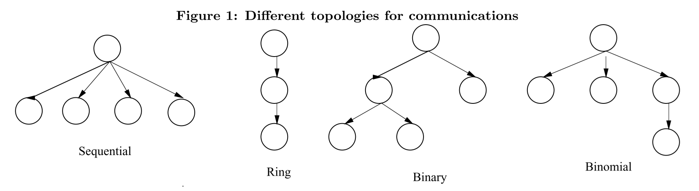

#### Sequential tree

由根进程直接与其他所有进程进行通信，发送/接收数据包。当有 **N** 个进程时，则需要 N-1 步。

#### Chain and Ring trees

每个进程 **i** 发送数据给 **(i+1)%N** 并从 **(i-1)%N** 接收数据。如果是Chain的话，则最后一个进程不用发送数据给第0个。

#### Binary tree

除了根进程，每个进程都必须从另一个进程接收数据；每个进程都发送数据给至多两个其他进程。简单来说就是将进程组织成一棵完全二叉树。

#### Binomial tree

见下图

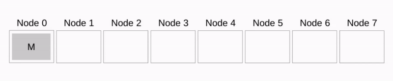

#### Rabenseifner’s Algorithm

这个算法的引用指向如下，但是现在已经404了

> R. Rabenseifner. A new optimized MPI reduce algorithm. http://www.hlrs.de/structure/support/parallel_computing/models/mpi/myreduce.html
> (1997).

对于Reduce，使用Reduce_scatter+gather

对于Allreduce，使用Reduce_scatter+Allgather

在本文后面还会再有详细介绍

#### Circular Algorithm for Alltoall

每个进程 **i** 在第 **k** (0<=2<SUP>k</SUP><N) 步发送数据给 (i + 2<SUP>k</SUP>)%N 并从 (i - 2<SUP>k</SUP>)%N 接收数据

#### Distributed binomial for barrier

没看懂，原文如下

> In step s ∈ [1... ln], process r sends to (r+s)mod N and receives from (r-s)mod N. At the end of ln steps, each process
> is in synchronization with every other process.

我猜他这里想表达的是[butterfly barrier](http://homepages.math.uic.edu/~jan/mcs572/barriers.pdf)算法。

#### Extended Ring for Barrier

不失一般性，假设进程根进程是进程0，进程0发送消息给进程1，进程1收到收发送消息个进程2，……，进程N-1收到消息后发送消息给进程0；

然后进程0再次发送消息给进程1，进程1收到收发送消息个进程2，……，进程N-1收到消息后表示Barrier完成

#### [Tournament Algorithm for Barrier](https://www.inf.ed.ac.uk/teaching/courses/ppls/BarrierPaper.pdf)

也没看懂，感兴趣的话可以去看这篇论文[Two algorithms for Barrier Synchronization](https://www.inf.ed.ac.uk/teaching/courses/ppls/BarrierPaper.pdf)，这里有详细解释

### How to Tune

其实Tune的主要思想挺简单的，就是在实际跑应用之前先测试得到在不同情况下的最佳算法及最佳参数，归纳成伪代码如下：

```
for each message_size
	for each process_num
		for each MPI_collective_operation
			for each algorithm
				for each segment_size
					TEST
				find best segment_size for current algorithm
			find best algorithm with best segment_size for current MPI_collective_operation with specified process_num and message_size
```

显然，如果真的按照这种方法测，肯定要话很长时间，所以作者加了一些优化操作。

这里作者将外面三成循环称为primary tests，里面的两层循环称为secondary tests，分别采用不同的优化手段。

对于primary tests，文章中采用了3种优化策略，我觉得其实是就是一种

- 并不对所有的message_size进行测量，原计划是测{8, 16, 32, 64.. 1MB}，优化后只用测 {8, 1024, 8192.. 1MB}。中间的数据差值即可
- 没用的MPI collective操作不测（我觉得这条不算）

对于secondary tests采用一种启发式的搜索方法，简单来说就是下山法（把爬山法改成找最小值），加上一些对最小值所在位置的预判。

## 2000 [Exploiting Hierarchy in Parallel Computer Networks to Optimize Collective Operation Performance](https://www.researchgate.net/publication/2625264_Exploiting_Hierarchy_in_Parallel_Computer_Networks_to_Optimize_Collective_Operation_Performance)

看了下综述，大概感受了下他大概想干啥：别人是把网络分成了2层，他把2网络分成了多层，来利用拓扑优势来进行优化，并且只实现了个Broadcast。

## 2003 [Pipelining and overlapping for MPI collective operations](https://ieeexplore.ieee.org/document/1243181)

为Bcast、Reduce、Allreduce实现了流水线传输的设计，并且他用的这套系统也是支持RDMA的。但是他似乎不是第一个做的，文章里也没有讲他这个和别人的区别是什么。

没完全仔细看，大致感受了一下，就是比较朴素的，正常人能想到的流水线设计。

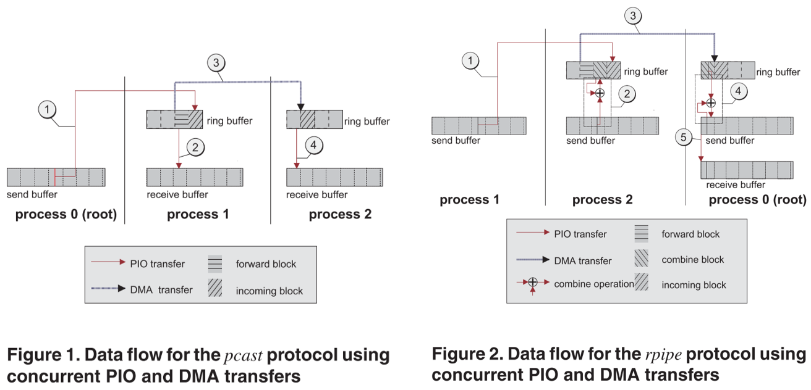

## 2004 [Optimization of Collective Reduction Operations](https://citeseerx.ist.psu.edu/viewdoc/download?doi=10.1.1.70.2679&rep=rep1&type=pdf)

就是*2005 [Optimization of Collective Communication Operations in MPICH](http://journals.sagepub.com/doi/10.1177/1094342005051521)* 后半部分的加长版，建议直接去看后者

## 2005 [Optimization of Collective Communication Operations in MPICH](http://journals.sagepub.com/doi/10.1177/1094342005051521)

**经典好文**，讲了MPICH-1.2.6中Collective操作的实现，使用的是经典的性能评估模型 **T=α+βn** ，无视网络中的拥塞以及假设任意点对之间通信的带宽和延迟都一样；在测试中，每个节点一个进程。

这里详细讲述一下其中各种collective算法所使用具体算法

### Allgather

#### Ring算法

每个进程 **i** 发送数据给 **(i+1)%N** 并从 **(i-1)%N** 接收数据，但是这种方法会带来过高的延迟，所以遭到了弃用

#### Recursive Doubling算法

每个进程 **i** 在第 **k** (0<=2<SUP>k</SUP><N) 步发送数据给 (i XOR 2<SUP>k</SUP>) 并从 (i XOR 2<SUP>k</SUP>) 接收数据。这种方法能够有效降低延迟，但是缺点也显而易见，就是当进程数 **N** 不是2的幂的时候很不友好，需要特殊处理。

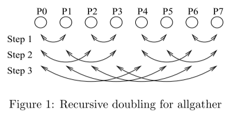

#### Bruck算法

出自论文[Efficient algorithms for all-to-all communications in multiport message-passing systems](https://ieeexplore.ieee.org/document/642949) 

可以看做是Recursive Doubling算法的一个改进，每个进程 **i** 在第 **k** (0 ≤ k < ⌈log<sub>2</sub>N⌉) 步发送数据给 (i-2<SUP>k</SUP>)%N 并从 (i+2<SUP>k</SUP>)%N 接收数据。

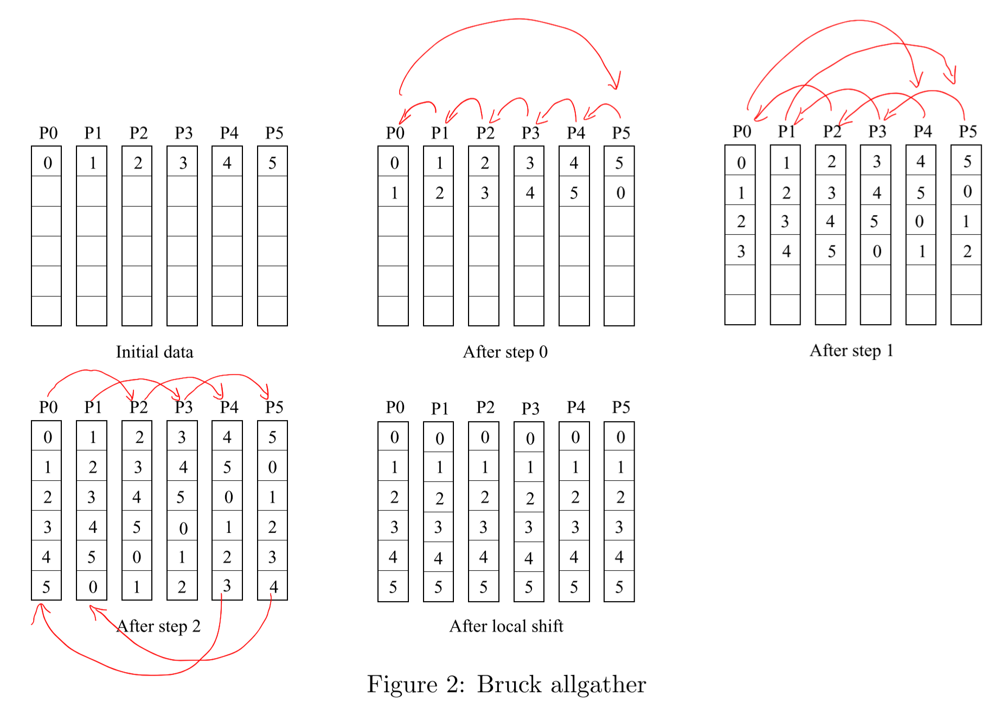

#### 策略

通过下图中的实验可以发现，对于短消息当进程数为2的幂的时候，Recursive Doubling算法更快，当进程数非2的幂的时候，Bruck算法更快。

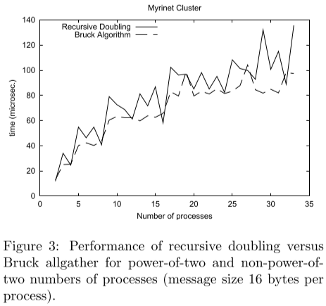

所以Allgather采取的策略是：

- 对于 进程数并非2的指数 的 短消息，使用Bruck算法
- 对于 进程数为2的指数 的 短消息 和 中等消息 的情况，使用Recursive Doubling算法
- 对于 长消息 和 进程数并非2的指数 的 中等消息，使用Ring算法

### Broadcast

#### Binomial Tree算法

见下图。这种算法对于短消息会比较快，但是对于长消息性能往往不足。


#### Scatter + Allgather

出自[这篇论文](https://ieeexplore.ieee.org/document/296665)和[这篇论文](http://citeseerx.ist.psu.edu/viewdoc/summary?doi=10.1.1.40.3752)，也可以叫它Van de Geijn algorithm

先将要广播的消息分成 N/p 份，通过Scatter操作分发到每个节点上一份，然后进行一次Allgather操作。其中的Scatter会采用Binomial Tree算法，而Allgather会根据消息的大小采用Recursive Doubling算法或者Ring算法

#### 策略

- 对于短消息，或者进程数少于8，使用Binomial Tree算法
- 其他情况使用Scatter + Allgather

### Alltoall

#### Native算法

这名字是我自己取的，代表一切直接根据目的直接send和recv不进行任何调度的方法

这里就是指 p 个进程，每个进程都调用 p-1 个`MPI_Irecv`和`MPI_Isend`，然后`MPI_Waitall`完事

#### Bruck算法

出自论文[Efficient algorithms for all-to-all communications in multiport message-passing systems](https://ieeexplore.ieee.org/document/642949) 

如下图，每个进程 **i** 需要先将自己的 **N** 数据偏移 i 个单位，然后每个进程 **i** 在第 **k** (0 ≤ k < ⌈log<sub>2</sub>N⌉) 步发送数据给 (i**+**2<SUP>k</SUP>)%N 并从 (i**-**2<SUP>k</SUP>)%N 接收数据，要传输的数据是所有二进制第 k 位为1的单位的数据，最后还需要再进行偏移和旋转，即可完成。

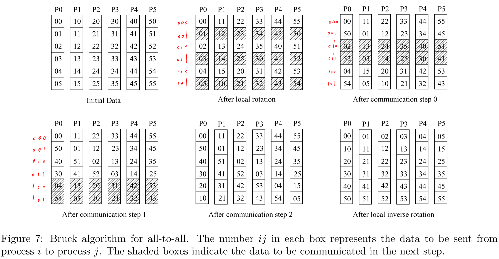

#### Pairwise-exchange算法

每个进程 **i** 在第 **k** (0<=2<SUP>k</SUP><N) 步发送数据给 (i ^ 2<SUP>k</SUP>)%N 并从 (i ^ 2<SUP>k</SUP>)%N 接收数据，其中“^”表示位运算。同样这种算法对于进程数 **N** 不是2的幂的时候很麻烦。

#### Circular Algorithm

每个进程 **i** 在第 **k** (0<=2<SUP>k</SUP><N) 步发送数据给 (i + 2<SUP>k</SUP>)%N 并从 (i - 2<SUP>k</SUP>)%N 接收数据

#### 策略

- 对于短消息，使用Bruck算法
- 对于进程数是2的幂的长消息，使用Pairwise-exchange算法
- 对于进程数不是2的幂的长消息，使用Shift算法

### Reduce_scatter

#### Reduce+Scatter

在旧的MPICH的实现中，就是直接先用基于Binomial Tree算法的Reduce，然后再做一个线性的Scatter

#### Recursive Halving算法

和Recursive是非常类似的，只不过所有的步骤颠倒了，如下图，每步发送的数据量是减半的。同样这个算法也有个问题就是不好处理进程数 **N** 不是2的幂的情况，这里使用的办法就是：对于前 **x** 个偶数编号的进程，将它们的数据发送给后一个进程，并由该进程完成它的reduce任务，然后再将数据发送回去，这里的 x 能使得 N-x 为2的幂

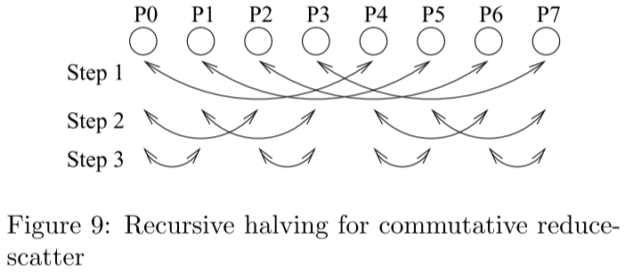

#### Pairwise-exchange算法

每个进程 **i** 在第 **k** (0<=2<SUP>k</SUP><N) 步发送数据给 (i + 2<SUP>k</SUP>)%N 并从 (i - 2<SUP>k</SUP>)%N 接收数据，总计 N-1 步，注意这里只需要发送每个进程需要的那一部分数据即可。

#### 策略

- 对于短消息，使用Recursive Halving算法

- 对于长消息，使用Pairwise-exchange算法

### Reduce

#### Binomial Tree算法

以二叉树的逻辑结构将结果归约到根进程

#### Reduce_scatter + Gather

应该是出自论文[Optimization of Collective Reduction Operations](https://www.semanticscholar.org/paper/Optimization-of-Collective-Reduction-Operations-Rabenseifner/e2584fdc3f9e696423d96522038f3fa35137ab92)，也叫作Rabenseifner’s algorithm

先做一个基于Recursive Halving算法的Reduce_scatter，再做一个基于Binomial Tree算法的Gather

#### 策略

- 对于短消息，使用Binomial Tree算法
- 对于长消息，使用Reduce_scatter + Gather

### Allreduce

#### Binomial Tree

先使用一个基于Binomial Tree算法的Reduce，在使用一个基于Binomial Tree算法的Broadcast

#### Recursive Doubling

和Allgather中的Recursive Doubling类似，只不过中间加了一个归约操作。每个进程 **i** 在第 **k** (0<=2<SUP>k</SUP><N) 步发送数据给 (i+2<SUP>k</SUP>)%N 并从 (i-2<SUP>k</SUP>)%N 接收数据，并在每一步将自己持有的数据与收到的数据进行归约。

#### Reduce_scatter + Allgather

应该是出自论文[Optimization of Collective Reduction Operations](https://www.semanticscholar.org/paper/Optimization-of-Collective-Reduction-Operations-Rabenseifner/e2584fdc3f9e696423d96522038f3fa35137ab92)，也叫作Rabenseifner’s algorithm

先做一个基于Recursive Halving算法的Reduce_scatter，再做一个基于Recursive Doubling算法算法Allgather。

当遇到进程数不为2的幂的时候，操作和Reduce中的做法是一样的，见下图

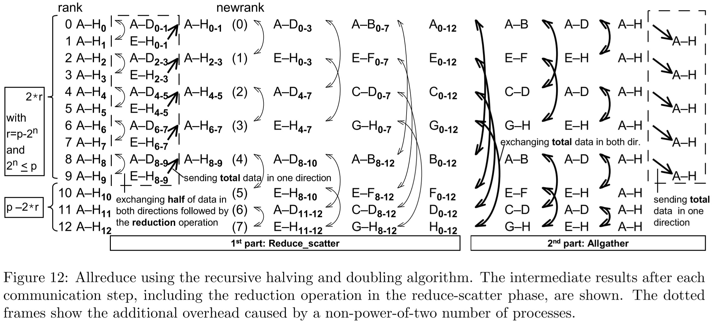

#### Binary Blocks Algorithm

上面这种方法还是有一定缺陷的，就是有进程负载不均衡，有些进程几乎没有任何通信任务，也没有任何计算任务

这种算法就将所有进程分成了若干个块，每个块中的进程数都是2的幂，然后每个块分别执行Reduce_scatter，然后从最小的快向大的块进行reduce，之后再由大的块将结果发送回小的块，最后再分块进行Allgather，如下图所示是13个进程进行Allreduce

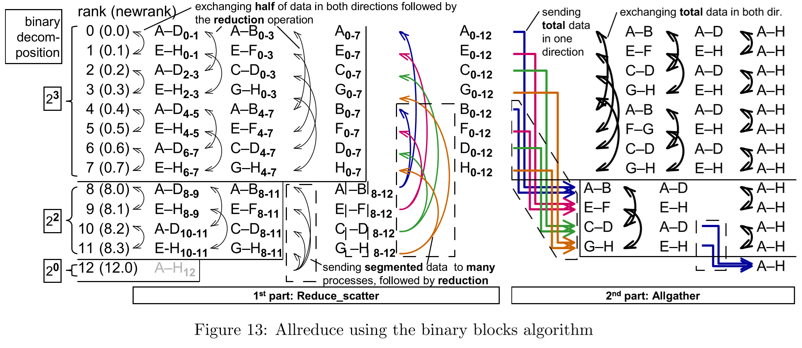

#### Ring算法

也是一种Reduce_scatter + Allgather的思想，但是在Reduce_scatter阶段是各个进程直接将一部分数据发送到其目的节点，在Allgather阶段也是直接用Ring算法

#### 策略

在MPICH-1.2.6及MPICH-3.2.1的实现中

- 对于短消息，使用recursive doubling算法
- 对于长消息，先进行reduce-scatter（recursive-halving算法），再进行allgather（recursive doubling算法）。

但是在这篇论文中最后在生产环境中在不同消息大小及节点数量的情况下进行实验得到的结果如下

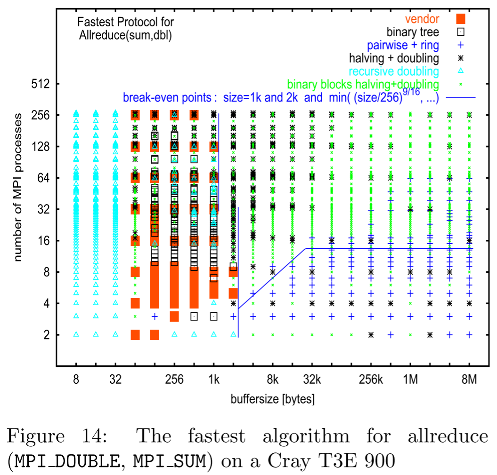

### Attention

这里论文中讲的是MPICH-1.2.6中Collective操作的实现，在MPICH后续的版本中算法是有所改变的，在其他MPI实现中算法更是不同的。

## 2005 [Automatic generation and tuning of MPI collective communication routines](https://dl.acm.org/doi/10.1145/1088149.1088202)

实质上就是把各种算法结合各种参数都试一下，测出性能最好的算法和参数。

但是对于MPI算法的归纳整理非常全面。

## 2006 [Optimizing MPI collective communication by orthogonal structures](https://www.semanticscholar.org/paper/Optimizing-MPI-collective-communication-by-K%C3%BChnemann-Rauber/6e09a510c106303def59c92e5fca6f8d8a152cc0)

直接将MPI进程进行了简单的分组，然后先在组内做collective操作，再在组间做，进行了性能评测。并不是最早提出这种想法的工作，但是他直接将进程分组做在了MPI上层，使得可以兼容各种MPI实现。

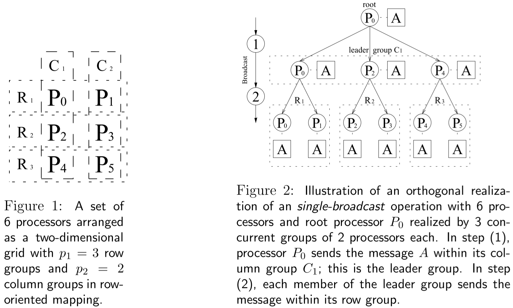

## 2007 [Collective communication: theory, practice, and experience: Research Articles](https://www.cs.utexas.edu/~pingali/CSE392/2011sp/lectures/Conc_Comp.pdf)

**深度好文**，理论分析了当时市面上各种MPI算法的上下界，以及在当时的各种拓扑中应该要采用的算法。

受限于篇幅，在这里不展开讨论了，建议阅读原文。

## 2009 [Hierarchical Collectives in MPICH2](https://www.semanticscholar.org/paper/Hierarchical-Collectives-in-MPICH2-Zhu-Goodell/47488c34088ccd8adf78fa24b5c82dcbcf200021)

写得有些奇怪的文章，作者大概是想探究了共享内存通信能带来多大的提升，得到的结论是：在大数据包传输时优化不大；在小数据包时有效果。

对他的结果的准确性有很大疑问，建议不要看着篇文章。建议去看 *2011 [Kernel Assisted Collective Intra-node MPI Communication among Multi-Core and Many-Core CPUs](https://www.semanticscholar.org/paper/Kernel-Assisted-Collective-Intra-node-MPI-among-and-Ma-Bosilca/15ee1b0a68d65fa53aecfe16aec6e8894de95a68)*。

## 2010 [Designing topology-aware collective communication algorithms for large scale InfiniBand clusters: Case studies with Scatter and Gather](https://ieeexplore.ieee.org/abstract/document/5470853)

针对Scatter和Gather进行topology aware的优化，在胖树型的拓扑中进行的实验，不过对标的对比对象Tree base实现的，没有去和暴力的方法去做对比

有针对优化前和优化后的预期性能进行建模，但是没有和暴力的方法进行比较

Panda实验室出品

## 2011 [Kernel Assisted Collective Intra-node MPI Communication among Multi-Core and Many-Core CPUs](https://www.semanticscholar.org/paper/Kernel-Assisted-Collective-Intra-node-MPI-among-and-Ma-Bosilca/15ee1b0a68d65fa53aecfe16aec6e8894de95a68)

KNEM是一个专门为节点间（大数据包）通信而设计的内核模块，这篇工作为了让KNEM更好地为节点内的Collective操作服务，增加了一些重要的新特性：①使多个进程都能访问一块共享区域；②让共享区域可以选择put或者get两种方式。在算法上反而用的是比较传统的操作，并没有发现什么特别的优化。

如果想了解更多节点内通信优化的工作，可以从这一篇工作入手。

## 2012 [Faster topology-aware collective algorithms through non-minimal communication](https://doi.org/10.1145/2370036.2145823)

说是小幅增加通讯量来大幅提升性能，但是没看懂他的描述

## 2012 [Designing Non-blocking Allreduce with Collective Offload on InfiniBand Clusters: A Case Study with Conjugate Gradient Solvers](https://www.semanticscholar.org/paper/Designing-Non-blocking-Allreduce-with-Collective-on-Kandalla-Yang/a8c71a6f0cc2deff80c1647c35de31b5bb1a655f)

利用IB的新特性实现了非阻塞的Iallreduce卸载

使用了IB的CORE-Direct新特性，可以将一系列任务卸载给网卡进行；同时还支持单个数据的reduce操作，所以本文所有的Allreduce都是仅限单个操作数据的。

实现了两种算法的卸载：Recursive Doubling和Reduce+Bcast，实际效果前者略好一点点而已。

IPDPS ‘12 Panda实验室出品

## 2014 [MPI Collectives and Datatypes for Hierarchical All-to-all Communication](https://dl.acm.org/doi/10.1145/2642769.2642770)

这写得也太抽象了叭？没看懂他在说啥

## 2016 [Modeling MPI Communication Performance on SMP Nodes: Is it Time to Retire the Ping Pong Test](https://dl.acm.org/doi/abs/10.1145/2966884.2966919)

提出了一个更科学的性能评估模型，考虑到了节点内有多个进程都要通信的情况，并且考虑到了在小数据包传输时可能吃不满节点网卡带宽，在大数据包传输的时候受节点网卡带宽的限制。后面一些基于multi-leader的工作都有用到这个模型的

但是我没完全看懂他的实验细节。

## 2016 [Scalable hierarchical aggregation protocol (SHArP): a hardware architecture for efficient data reduction](https://dl.acm.org/doi/10.5555/3018058.3018059)

详细讲了Sharp是如何offload collective操作的，建议原文仔细看。

另外值得一提的是，[超算PERCS](https://ieeexplore.ieee.org/abstract/document/5577310)和[Cray XC](https://www.alcf.anl.gov/files/CrayXCNetwork.pdf)是也都是一定程度上支持硬件reduce操作的。

## 2017 [Scalable reduction collectives with data partitioning-based multi-leader design](https://doi.org/10.1145/3126908.3126954)

以往的算法都是一个节点有一个leader进程负责通信，这篇工作把它改成了一个节点有多个leader进程负责通信。这样不但可以将reduce的计算任务进行分摊，而且还能提升对带宽的利用率。

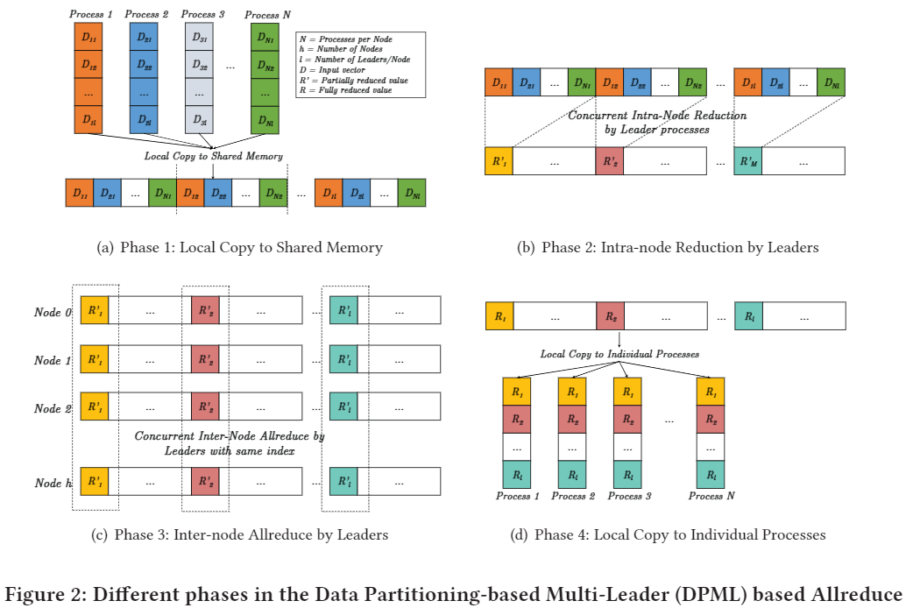

文章中还针对Omni-Path和InfiniBand的不同特性有针对性的进行了优化，甚至还有支持Sharp的版本。

Panda实验室出品，SC17

## 2019 [Node-Aware Improvements to Allreduce](https://ieeexplore.ieee.org/document/8955452)

提出了一种叫NAP的Allreduce算法(Node-Aware Parallel Allreduce)

假设每个节点都有 **ppn** 个进程要进行Allreduce操作的进程时，可以将节点的通信与计算任务分散到各个进程上。如下图所示，当有16个进程分散在4个节点上时，通信的步骤如图

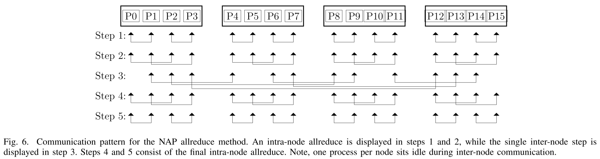

在上面的示例中节点数 n = ppn 每个节点上的进程数，当节点数 n 很大时，可以再将上图中的step3再分为多个log<sub>ppn</sub>(n)个阶段。如下图所示，当有64个进程分散在16个进程上，需要进行两轮节点间的通信，其中第二轮如下图所示

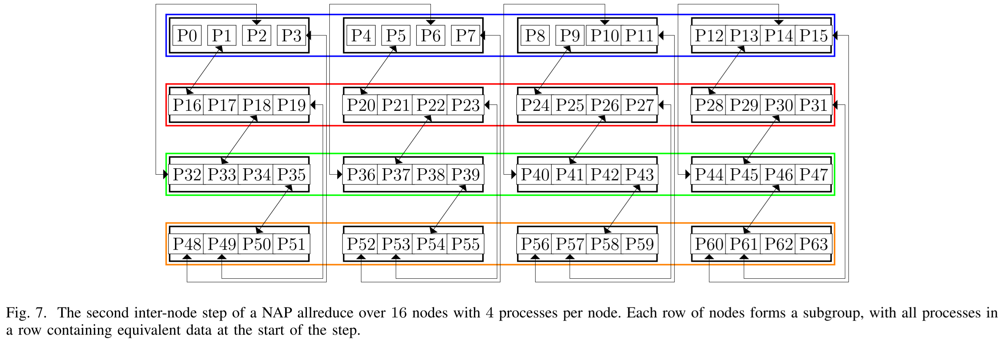

可以这样理解：在每一轮节点间通信时，一个节点上的 ppn 个进程都要负责去取 ppn 个subgroup的的数据。

它是*2017 [Scalable reduction collectives with data partitioning-based multi-leader design](https://doi.org/10.1145/3126908.3126954)*的一个改进，将reduce分成了多个阶段

当log<sub>ppn</sub>(n)不为整数时，也是能解决的，见论文。

## 2020 [Decomposing MPI Collectives for Exploiting Multi-lane Communication](https://ieeexplore.ieee.org/document/9229624)

将OpenMPI-4.0.2、Mvapich2-2.3.3、MPICH-3.3.2、Intel MPI-2019.4.243的Bcast、Allgather、Allreduce、Scan进行了暴力划分改造，强迫多个进程同时进行通信（而不是一个节点只有一个进程负责通信），来利用起来节点的多个lane（文中对lane的定义是：能同时、独立的进行传输的链路），发现能有较大性能提升，说明现在的这些MPI实现对于Multi-lane的优化并不够好。

## OpenMPI-3.16中的实现

```c
int
ompi_coll_tuned_allreduce_intra_dec_fixed(const void *sbuf, void *rbuf, int count,
                                          struct ompi_datatype_t *dtype,
                                          struct ompi_op_t *op,
                                          struct ompi_communicator_t *comm,
                                          mca_coll_base_module_t *module)
{
    size_t dsize, block_dsize;
    int comm_size = ompi_comm_size(comm);
    const size_t intermediate_message = 10000;
    OPAL_OUTPUT((ompi_coll_tuned_stream, "ompi_coll_tuned_allreduce_intra_dec_fixed"));

    /**
     * Decision function based on MX results from the Grig cluster at UTK.
     *
     * Currently, linear, recursive doubling, and nonoverlapping algorithms
     * can handle both commutative and non-commutative operations.
     * Ring algorithm does not support non-commutative operations.
     */
    ompi_datatype_type_size(dtype, &dsize);
    block_dsize = dsize * (ptrdiff_t)count;

    if (block_dsize < intermediate_message) {
        return (ompi_coll_base_allreduce_intra_recursivedoubling(sbuf, rbuf,
                                                                 count, dtype,
                                                                 op, comm, module));
    }

    if( ompi_op_is_commute(op) && (count > comm_size) ) {
        const size_t segment_size = 1 << 20; /* 1 MB */
        if (((size_t)comm_size * (size_t)segment_size >= block_dsize)) {
            return (ompi_coll_base_allreduce_intra_ring(sbuf, rbuf, count, dtype,
                                                        op, comm, module));
        } else {
            return (ompi_coll_base_allreduce_intra_ring_segmented(sbuf, rbuf,
                                                                  count, dtype,
                                                                  op, comm, module,
                                                                  segment_size));
        }
    }

    return (ompi_coll_base_allreduce_intra_nonoverlapping(sbuf, rbuf, count,
                                                          dtype, op, comm, module));
}
```

- 当数据量小于10KB时，使用Recursive Doubling
- 当数据量大于10KB 小于`comm_size` × 1MB 时，使用Ring算法
- 当数据量大于`comm_size` × 1MB 时，使用分段Ring

## Mvapich2-2.3.6中的实现

```
   For long messages and for builtin ops and if count >= pof2 (where
   pof2 is the nearest power-of-two less than or equal to the number
   of processes), we use Rabenseifner's algorithm (see 
   http://www.hlrs.de/mpi/myreduce.html).
   This algorithm implements the allreduce in two steps: first a
   reduce-scatter, followed by an allgather. A recursive-halving
   algorithm (beginning with processes that are distance 1 apart) is
   used for the reduce-scatter, and a recursive doubling 
   algorithm is used for the allgather. The non-power-of-two case is
   handled by dropping to the nearest lower power-of-two: the first
   few even-numbered processes send their data to their right neighbors
   (rank+1), and the reduce-scatter and allgather happen among the remaining
   power-of-two processes. At the end, the first few even-numbered
   processes get the result from their right neighbors.
   
   For short messages, for user-defined ops, and for count < pof2 
   we use a recursive doubling algorithm (similar to the one in
   MPI_Allgather). We use this algorithm in the case of user-defined ops
   because in this case derived datatypes are allowed, and the user
   could pass basic datatypes on one process and derived on another as
   long as the type maps are the same. Breaking up derived datatypes
   to do the reduce-scatter is tricky. 
```

- 当`count*type_size <= MPIR_CVAR_ALLREDUCE_SHORT_MSG_SIZE`时，使用Recursive Doubling
- 当`count*type_size > MPIR_CVAR_ALLREDUCE_SHORT_MSG_SIZE`时，使用Rabenseifner's algorithm

`MPIR_CVAR_ALLREDUCE_SHORT_MSG_SIZE`默认为2048

## MPICH-3.4.2中的实现

```c
    /* If op is user-defined or count is less than pof2, use
     * recursive doubling algorithm. Otherwise do a reduce-scatter
     * followed by allgather. (If op is user-defined,
     * derived datatypes are allowed and the user could pass basic
     * datatypes on one process and derived on another as long as
     * the type maps are the same. Breaking up derived
     * datatypes to do the reduce-scatter is tricky, therefore
     * using recursive doubling in that case.) */
```

- 当`count*type_size <= MPIR_CVAR_ALLREDUCE_SHORT_MSG_SIZE`时，使用Recursive Doubling
- 当`count*type_size > MPIR_CVAR_ALLREDUCE_SHORT_MSG_SIZE`时，使用Rabenseifner's algorithm

`MPIR_CVAR_ALLREDUCE_SHORT_MSG_SIZE`默认为2048

## 其他资料

在非论文资料中也有一些写得很好，记录在这里

https://en.wikipedia.org/wiki/Broadcast_(parallel_pattern)

https://en.wikipedia.org/wiki/Reduction_Operator

1996 [A high-performance, portable implementation of the MPI message passing interface standard](https://web.cse.ohio-state.edu/~panda.2/788/papers/3a_P567.pdf)
