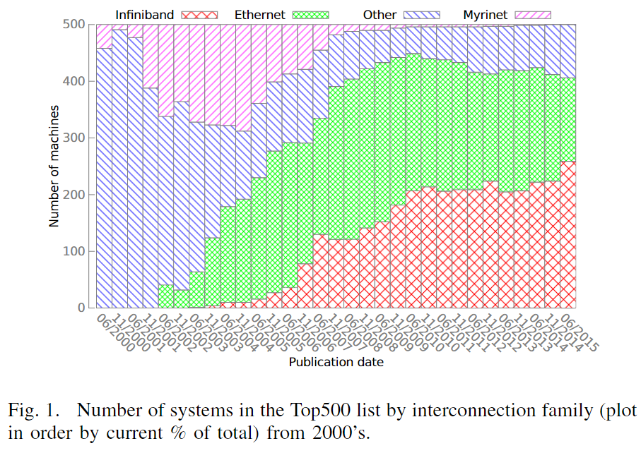
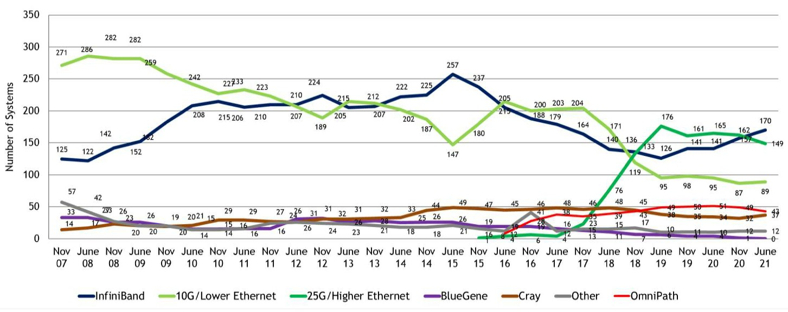
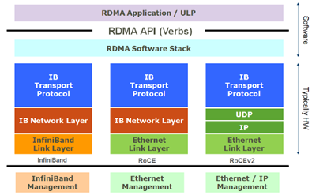
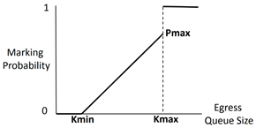
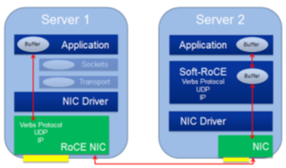
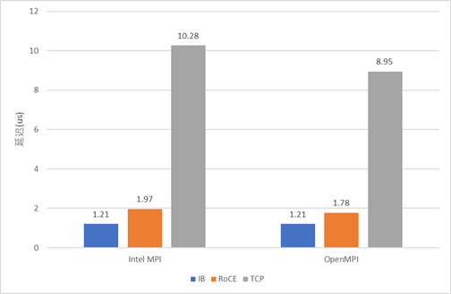
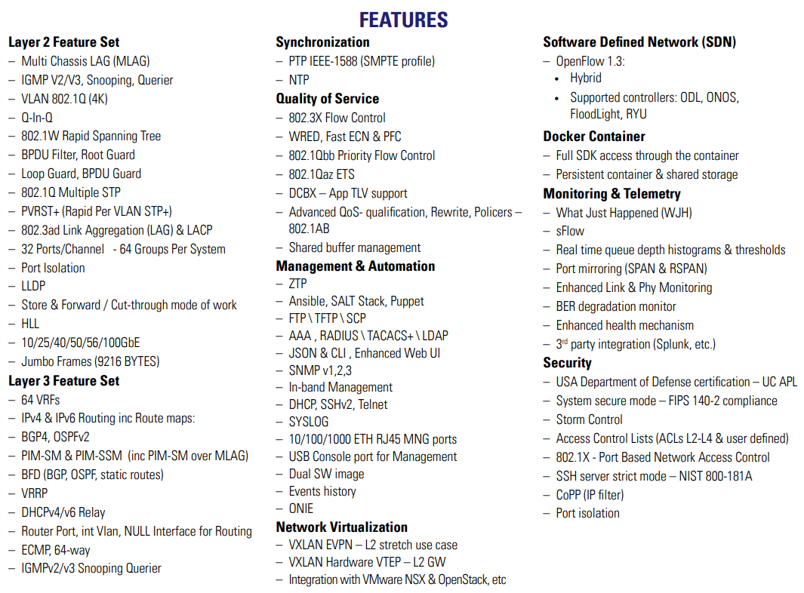
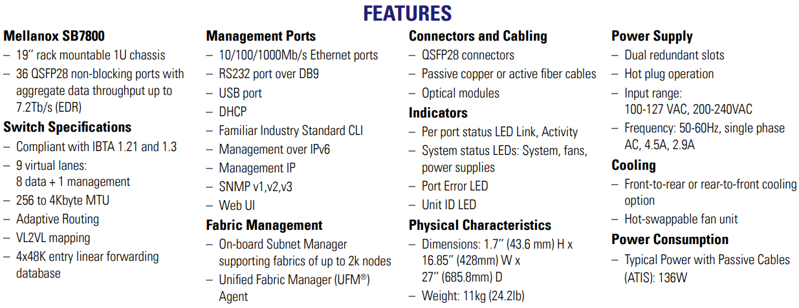
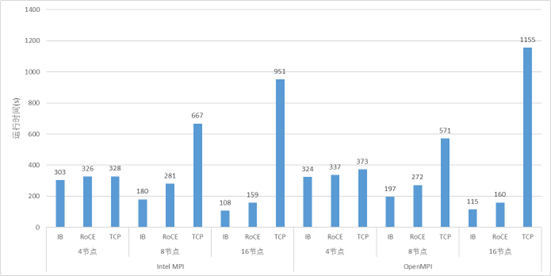
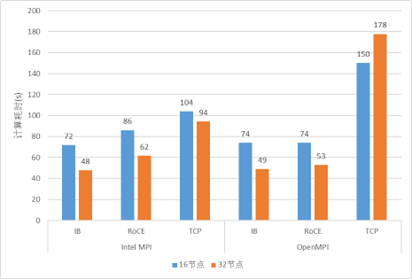

## 摘要

RoCE(RDMA over Converged Ethernet)协议是一种能在以太网上进行RDMA（远程内存直接访问）的集群网络通信协议，它大大降低了以太网通信的延迟，提高了带宽的利用率，相比传统的TCP/IP协议的性能有了很大提升。本文将聊一聊我对于将RoCE应用到HPC上这件事的看法。

<!-- more --> 

## HPC网络的发展与RoCE的诞生

在早年的高性能计算(HPC)系统中，往往会采用一些定制的网络解决方案，例如：Myrinet、Quadrics、InfiniBand，而不是以太网。这些网络可以摆脱以太网方案在设计上的限制，可以提供更高的带宽、更低的延迟、更好的拥塞控制、以及一些特有的功能。

IBTA在2010年发布了RoCE(RDMA over Converged Ethernet)协议技术标准，随后又在2014年发布了RoCEv2协议技术标准，同时带宽上也有大幅提升。以太网性能的大幅提升，使越来越多的人想要选择能兼容传统以太网的高性能网络解决方案。这也打破了top500上使用以太网的HPC集群数量越来越少的趋势，使以太网现在仍然占有top500的半壁江山。

虽然现在Myrinet、Quadrics已经消亡，但InfiniBand仍然占据着高性能网络中重要的一席之地，另外Cray自研系列网络，天河自研系列网络，Tofu D系列网络也有着其重要的地位。

## RoCE协议介绍

RoCE协议是一种能在以太网上进行RDMA（远程内存直接访问）的集群网络通信协议。它将收/发包的工作卸载(offload)到了网卡上，不需要想TCP/IP协议一样使系统进入内核态，减少了拷贝、封包解包等等的开销。这样大大降低了以太网通信的延迟，减少了通讯时对CPU资源的占用，缓解了网络中的拥塞，让带宽得到更有效的利用。

RoCE协议有两个版本：RoCE v1和RoCE v2。其中RoCE v1是链路层协议，所以使用RoCEv1协议通信的双方必须在同一个二层网络内；而RoCE v2是网络层协议，因此RoCE v2协议的包可以被三层路由，具有更好的可扩展性。

### RoCE v1协议

RoCE协议保留了IB与应用程序的接口、传输层和网络层，将IB网的链路层和物理层替换为以太网的链路层和网络层。在RoCE数据包链路层数据帧中，Ethertype字段值被IEEE定义为了0x8915，来表明这是一个RoCE数据包。但是由于RoCE协议没有继承以太网的网络层，在RoCE数据包中并没有IP字段，因此RoCE数据包不能被三层路由，数据包的传输只能被局限在一个二层网络中路由。

### RoCEv2协议

RoCE v2协议对RoCE协议进行了一些改进。RoCEv2协议将RoCE协议保留的IB网络层部分替换为了以太网网络层和使用UDP协议的传输层，并且利用以太网网络层IP数据报中的DSCP和ECN字段实现了拥塞控制的功能。因此RoCE v2协议的包可以被路由，具有更好的可扩展性。由于RoCE v2协议现在已经全面取代存在缺陷的RoCE协议，人们在提到RoCE协议时一般也指的是RoCE v2协议，故本文中接下来提到的所有RoCE协议，除非特别声明为第一代RoCE，均指代RoCE v2协议。

### 无损网络与RoCE拥塞控制机制

在使用RoCE协议的网络中，必须要实现RoCE流量的无损传输。因为在进行RDMA通信时，数据包必须无丢包地、按顺序地到达，如果出现丢包或者包乱序到达的情况，则必须要进行go-back-N重传，并且期望收到的数据包后面的数据包不会被缓存。

RoCE协议的拥塞控制共有两个阶段：使用DCQCN(Datacenter Quantized Congestion Notification)进行减速的阶段和使用PFC(Priority Flow Control)暂停传输的阶段（虽然严格来说只有前者是拥塞控制策略，后者其实是流量控制策略，但是我习惯把它们看成拥塞控制的两个阶段，后文中也这会这么写）。

当在网络中存在多对一通信的情况时，这时网络中往往就会出现拥塞，其具体表现是交换机某一个端口的待发送缓冲区消息的总大小迅速增长。如果情况得不到控制，将会导致缓冲区被填满，从而导致丢包。因此，在第一个阶段，当交换机检测到某个端口的待发送缓冲区消息的总大小达到一定的阈值时，就会将RoCE数据包中IP层的ECN字段进行标记。当接收方接收到这个数据包，发现ECN字段已经被交换机标记了，就会返回一个CNP(Congestion Notification Packet)包给发送方，提醒发送方降低发送速度。需要特别注意的是，对于ECN字段的标记并不是达到一个阈值就全部标记，而是存在两个Kmin和Kmax，如图2所示，当拥塞队列长度小于Kmin时，不进行标记。当队列长度位于Kmin和Kmax之间时，队列越长，标记概率越大。当队列长度大于Kmax时，则全部标记。而接收方不会每收到一个ECN包就返回一个CNP包，而是在每一个时间间隔内，如果收到了带有ECN标记的数据包，就会返回一个CNP包。这样，发送方就可以根据收到的CNP包的数量来调节自己的发送速度。

 

当网络中的拥塞情况进一步恶化时，交换机检测到某个端口的待发送队列长度达到一个更高的阈值时，交换机将向消息来源的上一跳发送PFC的暂停控制帧，使上游服务器或者交换机暂停向其发送数据，直到交换机中的拥塞得到缓解的时候，向上游发送一个PFC控制帧来通知上有继续发送。由于PFC的流量控制是支持按不同的流量通道进行暂停的，因此，当设置好了每个流量通道带宽占总带宽的比例，可以一个流量通道上的流量传输暂停，并不影响其他流量通道上的数据传输。

值得一提的是，并不是每一款声称支持RoCE的交换机都完美的实现了拥塞控制的功能。在我的测试中，发现了某品牌的某款交换机的在产生拥塞时，对来自不同端口但注入速度相同的流量进行ECN标记时概率不同，导致了负载不均衡的问题。

### RoCE和Soft-RoCE

虽然现在大部分的高性能以太网卡都能支持RoCE协议，但是仍然有一些网卡不支持RoCE协议。因此IBM、Mellanox等联手创建了开源的Soft-RoCE项目。这样，在安装了不支持RoCE协议的网卡的节点上，仍然可以选择使用Soft-RoCE，使其具备了能与安装了支持RoCE协议的网卡的节点使用RoCE协议进行通信的能力，如图3所示。虽然这并不会给前者带来性能提升，但是让后者能够充分发挥其性能。在一些场景下，比如：数据中心，可以只将其高IO存储服务器升级为支持RoCE协议的以太网卡，以提高整体性能和可扩展性。同时这种RoCE和Soft-RoCE结合的方法也可以满足集群逐步升级的需求，而不用一次性全部升级。

 

## 将RoCE应用到HPC上存在的问题

### HPC网络的核心需求

我认为HPC网络的核心需求有两个：①低延迟；②在迅速变化的流量模式下仍然能保持低延迟。

对于①低延迟，RoCE就是用来解决这个问题的。如前面提到的，RoCE通过将网络操作卸载到网卡上，实现了低延迟，也减少了CPU的占用。

对于②在迅速变化的流量模式下仍然能保持低延迟，其实就是拥塞控制的问题。但是关键在于HPC的流量模式是迅速变化的，而RoCE在这个问题上表现是欠佳的。

### RoCE的低延迟

#### 实机测试

RoCE的延迟有幸有机会与IB实测对比了一下：以太网用的是25G Mellanox ConnectX-4 Lx 以太网卡，和Mellanox SN2410交换机；IB用的是100G InfiniBand EDR网卡(Mellanox ConnectX-4)，和Mellanox CS7520。测试中以太网交换机摆位于机架顶部，IB交换机摆在比较远的机柜，因而IB的会因为线缆的实际长度较长而有一点劣势。测试使用OSU Micro-Benchmarks中的osu_latency对IB、RoCE、TCP协议进行延迟测试，结果如下。

虽然IB用的是100G的，RoCE用的是25G的，但是这里我们关注的是延迟，应该没有关系。

可以看出，虽然RoCE协议的确能大幅降低通信延迟，比TCP快了5倍左右，但仍然比IB慢了47%-63%。

#### 官方纸面数据

上面用到的以太网交换机[SN2410的官方延迟数据](https://network.nvidia.com/pdf/prod_eth_switches/PB_SN2410.pdf)是300ns，虽然IB交换机CS7520没找到官方延迟数据，不过找到了同为EDR交换机的[SB7800的官方数据](https://network.nvidia.com/pdf/prod_ib_switch_systems/pb_sb7800.pdf)，延迟为90ns。

不过上面这些是有些旧的前两年的设备了，新一点的Mellanox以太网交换机[SN3000系列的200G以太网交换机官方延迟数据](https://nvdam.widen.net/s/gbk7knpsfd/sn3000-series)是425ns，更新的[Mellanox SN4000系列400G以太网交换机](https://www.nvidia.com/content/dam/en-zz/Solutions/networking/br-sn4000-series.pdf)，在官方文档没有找到延迟数据。新一点的Mellanox IB交换机[QM8700系列HDR交换机的官方延迟数据](https://network.nvidia.com/pdf/prod_ib_switch_systems/PB_QM8700.pdf)是130ns，最新的[QM9700系列NDR交换机](https://nvdam.widen.net/s/k8sqcr6gzb/infiniband-quantum-2-qm9700-series-datasheet-us-nvidia-1751454-r8-web)，在官方文档中也没有找到延迟数据。（不知道为啥都是新一代的比旧的延迟还大一点，而且最新一代的延迟都没放出来）

定制网络的Cray XC系列Aries交换机延迟大约是100ns，天河-2A的交换机延迟也大约是100ns。

可见在交换机实现上，以太网交换机与IB交换机以及一些定制的超算网络的延迟性能还是有一定差距的。

### RoCE的包结构

假设我们要使用RoCE发送1 byte的数据，这时为了封装这1 byte的数据包要额外付出的代价如下：

- 以太网链路层：14 bytes MAC header + 4 bytes CRC

- 以太网IP层：20 bytes

- 以太网UDP层：8 bytes

- IB传输层：12 bytes Base Transport Header (BTH)

总计：58 bytes

假设我们要使用IB发送1 byte的数据，这时为了封装这1 byte的数据包要额外付出的代价如下：

- IB链路层：8 bytes Local Routing Header(LHR) + 6 byte CRC
- IB网络层：0 bytes 当只有二层网络时， 链路层Link Next Header (LNH)字段可以指示该包没有网络层
- IB传输层：12 bytes Base Transport Header (BTH)

总计：26 bytes

如果是定制的网络，数据包的结构可以做到更简单，比如天河-1A的Mini-packet (MP)的包头是有8 bytes。

由此可见，以太网繁重的底层结构也是将RoCE应用到HPC的一个阻碍之一。

数据中心的以太网交换机往往还要具备许多其他功能，还要付出许多成本来进行实现，比如SDN、QoS等等，这一块我也不是很懂，这里放一张[SN2410的官方features](https://network.nvidia.com/pdf/prod_eth_switches/PB_SN2410.pdf)的图叭↓

感觉IB交换机的功能感觉就会要简单一些，这里放一张[SB7800的官方features](https://network.nvidia.com/pdf/prod_eth_switches/PB_SN2410.pdf)的图↓

对于这个以太网的这些features，我挺想知道：以太网针这些功能与RoCE兼容吗，这些功能会对RoCE的性能产生影响吗？

### RoCE拥塞控制存在的问题

RoCE协议的两段拥塞控制都存在一定的问题，可能难以在迅速变化的流量模式下仍然能保持低延迟。

采用PFC(Priority Flow Control)采用的是暂停控制帧来防止接收到过多的数据包从而引起丢包。这种方法比起credit-based的方法，buffer的利用率难免要低一些。由其对于一些延迟较低的交换机，buffer会相对较少，此时用PFC(Priority Flow Control)就不好控制；而如果用credit-base则可以实现更加精确的管理。

DCQCN与IB的拥塞控制相比，其实大同小异，都是backward notification：通过通过先要将拥塞信息发送到目的地，然后再将拥塞信息返回到发送方，再进行限速。但是在细节上略有不同：RoCE的降速与提速策略根据论文[Congestion Control for Large-Scale RDMA Deployments](https://dl.acm.org/doi/10.1145/2785956.2787484)，是固定死的一套公式；而IB中的可以自定义提速与降速策略；虽然大部分人应该实际上应该都用的是默认配置，但是有自由度总好过没有叭。还有一点是，在这篇论文中测试的是每N=50us最多产生一个CNP包，不知道如果这个值改小行不行；而IB中想对应的CCTI_Timer最小可以为1.024us，也不知道实际能不能设置这么小。

最好的方法当然还是直接从拥塞处直接返回拥塞信息给源，即Forward notification。以太网受限于规范不这么干可以理解，但是IB为啥不这么干呢？

## RoCE在HPC上的应用案例

### Slingshot

美国的新三大超算都准备用Slingshot网络，这是一个改进的以太网，其中的Rosetta交换机兼容传统的以太网同时还对RoCE的一些不足进行了改进，如果一条链路的两端都是支持的设备（专用网卡、Rosetta交换机）就可以开启一些增强功能：

- 将IP数据包最小帧大小减小到32 bytes
- 相邻交换机的排队占用情况(credit)会传播给相邻的交换机
- 更加nb的拥塞控制，但是具体怎么实现的论文里没细说

最后达到的效果是交换机平均延迟是350ns，达到了较强的以太网交换机的水平，但是还没没有IB以及一些定制超算交换机延迟低，也没有前一代的Cray XC超算交换机延迟低。

但是在实际应用的表现似乎还行，但是论文[An In-Depth Analysis of the Slingshot Interconnect](https://ieeexplore.ieee.org/document/9355230/)中似乎只是和前一代的Cray超算比，没有和IB比。

### CESM与GROMACS测试

我也用前面测试延迟的25G以太网和100G测了CESM与GROMACS来对比了应用的性能。虽然两者之间带**宽差了4倍**，但是也有一点点参考价值。

CESM测试结果↓

GROMACS测试结果↓

### 一些期待

如果能有人将100G或者200G的IB和以太网组一个大规模集群来对比两者之间的性能差距，其实就能说明很多问题，但是成本实在太高，到目前为止还没发现有哪里做了这样的实验。

## 价格

当然价格也是参考因素之一，当然如果不差钱的话也不是个问题。所以也查了下这些交换机的价格，不过这些都是Google查到的，我会选取报价比较低的，但也仅供参考。

### 以太网

- SN3700-VS2R 32 x 200 Gigabit Ethernet [$25,893.53](https://www.dihuni.com/product/mellanox-msn3700-vs2r-spectrum-2-ethernet-switch/?utm_term=&utm_campaign=Shopping+-+Networking+Switches&utm_source=adwords&utm_medium=ppc&hsa_acc=7868558386&hsa_cam=15796727511&hsa_grp=135724561110&hsa_ad=573229183104&hsa_src=g&hsa_tgt=pla-1699539776157&hsa_kw=&hsa_mt=&hsa_net=adwords&hsa_ver=3&gclid=CjwKCAjwve2TBhByEiwAaktM1KCFOUuYmgM-xdUCXhtQOIv3TwqUzNCuoG1xuejK6Tdm3gbycUVOyRoClvIQAvD_BwE)
- SN2700 Open Ethernet Switch 32 x 100 Gigabit Ethernet [$18,146](https://www.pcnation.com/web/details/7AF871/mellanox-sn2700-open-ethernet-switch-msn2700-cb2f?dfw_tracker=110924-7AF871&mkwid=s_dc&pcrid=524019285072&pkw=&pmt=&plc=&gclid=CjwKCAjwve2TBhByEiwAaktM1LjhFCDDxu7V3iFl7gO4vZRUH-2CkIfR-1q0HgmrKX8nWxKMNe69IhoCVlQQAvD_BwE)

### InfiniBand

- QM8700-HS2F 40-port Non-blocking Managed HDR 200Gb/s InfiniBand Smart Switch [$12,952](https://techsupplyplus.com/Mellanox-QM8790--Quantum-HDR-Switch_p_1162400.html)
- Mellanox SB7800 Infiniband EDR 36 x 100Gb [$2,835](https://www.etb-tech.com/dell-mellanox-sb7800-infiniband-edr-switch-36-x-100gb-qsfp28-ports-sw00766.html?currency=USD&gclid=CjwKCAjwve2TBhByEiwAaktM1DqQcvf05N0f5ZUMJMRu0HzTKg-GuMkJ6jVFJ1KCgGn44G1flJ2wThoCkJsQAvD_BwE)

比较一下发现还是IB的成本低一些

## 总结与结论

将RoCE应用到HPC中有我觉得如下问题：

- 以太网交换机的延迟相比于IB交换机以及一些HPC定制网络的交换机要高一些
- RoCE的流量控制、拥塞控制策略还有一些改进的空间
- 以太网交换机的成本还是要高一些

但是从实测性能上来看，在小规模情况下，性能不会有什么问题。但是在大规模情况下，也没人测过，所以也不知道。虽然Slingshot的新超算即将出来了，但是毕竟是魔改过的，严格来说感觉也不能算是以太网。但是从他们魔改这件事情来看，看来他们也觉得直接应用RoCE有问题，要魔改了才能用。

> **免责声明**
>
> 本文属于随便写的随笔，所有观点基于本人所见所闻，是本人的一己之见，不对正确性、准确性做保证。

## 参考资料

https://en.wikipedia.org/wiki/Myrinet

https://en.wikipedia.org/wiki/Quadrics_(company)

https://www.nextplatform.com/2021/07/07/the-eternal-battle-between-infiniband-and-ethernet-in-hpc/

[On the Use of Commodity Ethernet Technology in Exascale HPC Systems](https://ieeexplore.ieee.org/abstract/document/7397640)

https://network.nvidia.com/pdf/prod_eth_switches/PB_SN2410.pdf

Infiniband Architecture Specification1.2.1

[Tianhe-1A Interconnect and Message-Passing Services](http://ieeexplore.ieee.org/document/6086529/)

https://fasionchan.com/network/ethernet/

[Congestion Control for Large-Scale RDMA Deployments](https://dl.acm.org/doi/10.1145/2785956.2787484)

[An In-Depth Analysis of the Slingshot Interconnect](https://ieeexplore.ieee.org/document/9355230/)
