## 简介

Doxygen是一款非常好用的代码文档工具，在大部分情况下，你只需要在写代码的时候顺便按照指定格式写上一些注释，随后使用doxygen就能自动帮你生成一套文档。本文将简单讲解如何使用Doxygen这一工具。

<!-- more --> 

## 安装

打开官网 https://www.doxygen.nl/download.html 找到如下图所示的Windows GUI版直接下载就好。

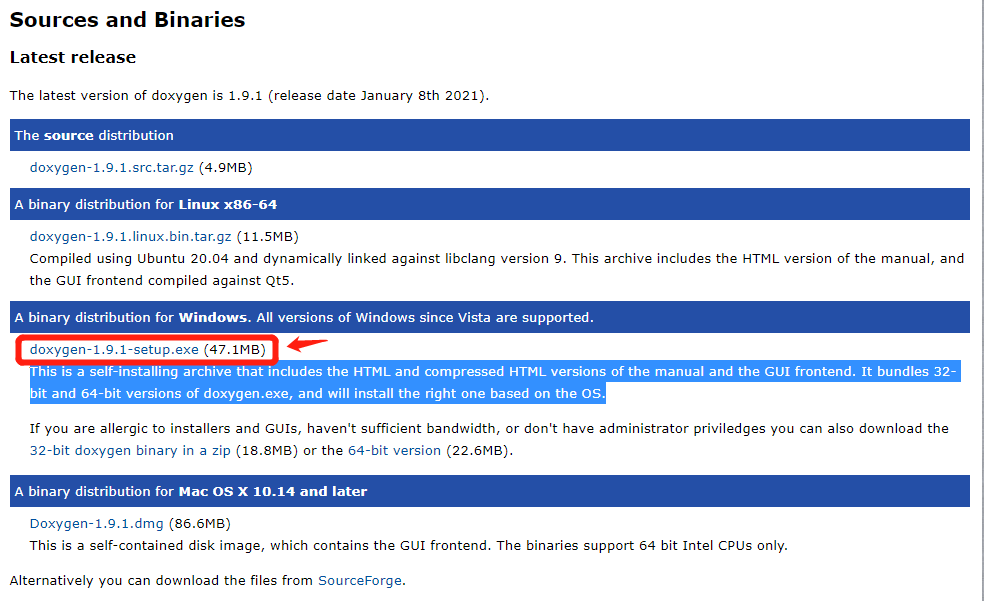

这里推荐直接使用GUI版就好，并且直接在你代码开发机上使用Doxygen，也就是说：如果你只是在本地写代码，但是代码是推到远端服务器上进行编译执行的，我也强烈建议你在本地运行Doxygen就好。原因是：①如果你在远端服务器上生成了文档，你往往还要把生成的文档再拉回本地才能看；②Doxygen的安装并没有什么其他的依赖，安装起来很容易；③GUI版的Doxygen使用起来非常方便，否则需要改Doxygen的文本配置文件，很不友好。

本文仅使用Doxygen的Windows GUI版作为例子，其他系统的GUI版应该是类似的。

安装完成之后，会得到如下这样的一个图标，直接打开它就好

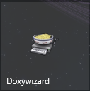

## 简单配置

首先我们新建一个具有基本目录结构的项目

```
├── Readme.md
├── doc
├── include
└── src
    └── mpi
        ├── check
        └── utils
```

然后我们打开Doxywizard，①首先填写你项目的相关信息，如下图箭头所示；②填写源码的相对路径和产生文档的相对路径，并且勾选 **Scan recursively** （图中就忘记勾选了），不然默认会忽略子文件夹中的文件；③保存到项目中的`doc`文件夹

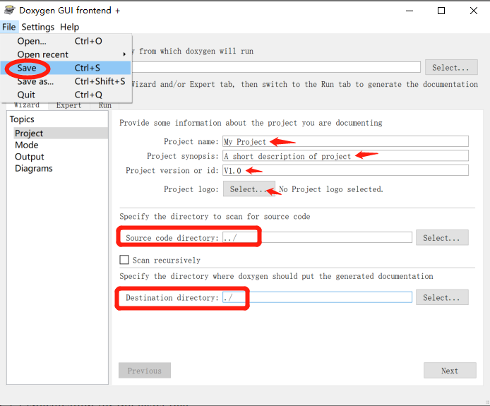

然后切换到 **Run** 选项卡，点击 **Run doxygen** 即可生成文档。

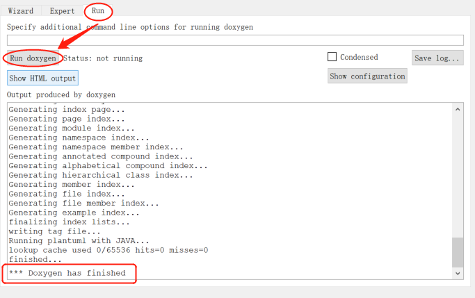

点击 **Show HTML Output** 可以直接打开生成的HTML文档。

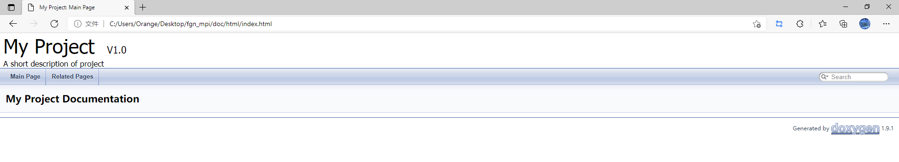

## 文档语法

简要的说，Doxygen注释块其实就是在注释块的基础添加一些额外标识，使Doxygen把它识别为文档，并将它组织到生成的文档中去。

Doxygen有好几种将代码标记为文档的方式，针对不同语言也有不同的注释方法，详细方式可以查阅官方文档 https://www.doxygen.nl/manual/docblocks.html ，建议选择一种自己喜欢的形式。

在文档块中都可以有两类描述：一种就是brief描述,另一种就是detailed。两种都是可选的，但不能同时没有。简述(brief)就是在一行内简述地描述。而详细描述(detailed)则提供更长，更详细的文档。

这里直接举例，下面的例子全部搬运自 https://zhuanlan.zhihu.com/p/100223113 这篇文章

### 文件注释

举例说明如下，在代码文件头部写上这段注释。可以看到可以标注一些文本名称、作者、邮件、版本、日期、介绍、以及版本详细记录。

```c
/**
  * @file     	sensor.c
  * @author   	JonesLee
  * @email   	Jones_Lee3@163.com
  * @version	V4.01
  * @date    	07-DEC-2017
  * @license  	GNU General Public License (GPL)  
  * @brief   	Universal Synchronous/Asynchronous Receiver/Transmitter 
  * @detail		detail
  * @attention
  *  This file is part of OST.                                                  \n                                                                  
  *  This program is free software; you can redistribute it and/or modify 		\n     
  *  it under the terms of the GNU General Public License version 3 as 		    \n   
  *  published by the Free Software Foundation.                               	\n 
  *  You should have received a copy of the GNU General Public License   		\n      
  *  along with OST. If not, see <http://www.gnu.org/licenses/>.       			\n  
  *  Unless required by applicable law or agreed to in writing, software       	\n
  *  distributed under the License is distributed on an "AS IS" BASIS,         	\n
  *  WITHOUT WARRANTIES OR CONDITIONS OF ANY KIND, either express or implied.  	\n
  *  See the License for the specific language governing permissions and     	\n  
  *  limitations under the License.   											\n
  *   																			\n
  * @htmlonly 
  * <span style="font-weight: bold">History</span> 
  * @endhtmlonly 
  * Version|Auther|Date|Describe
  * ------|----|------|-------- 
  * V3.3|Jones Lee|07-DEC-2017|Create File
  * <h2><center>&copy;COPYRIGHT 2017 WELLCASA All Rights Reserved.</center></h2>
  */ 
```

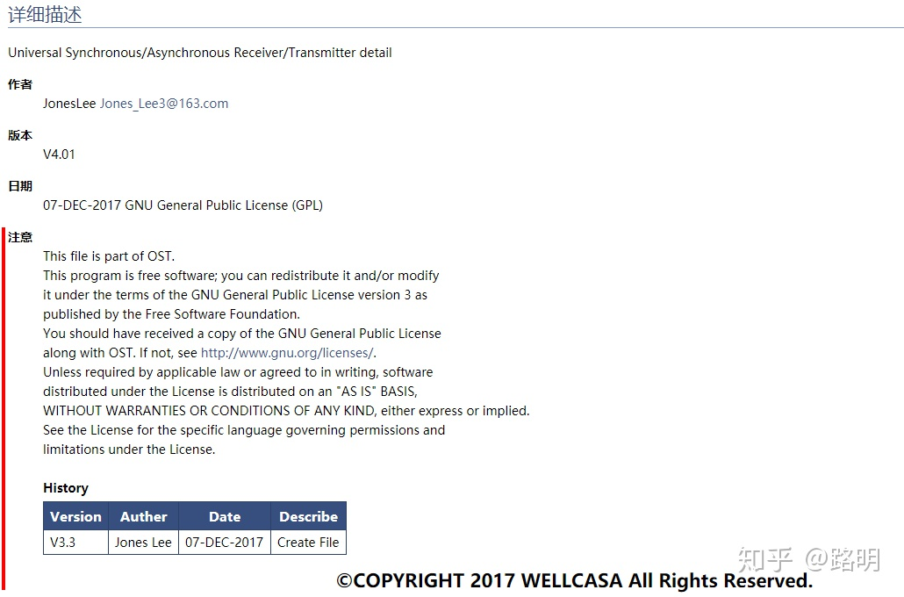

### 函数注释

```c
/**
  * @brief		can send the message
  * @param[in]	canx : The Number of CAN
  * @param[in]	id : the can id	
  * @param[in]	p : the data will be sent
  * @param[in]	size : the data size
  * @param[in]	is_check_send_time : is need check out the time out
  * @note	Notice that the size of the size is smaller than the size of the buffer.		
  * @return		
  *	+1 Send successfully \n
  *	-1 input parameter error \n
  *	-2 canx initialize error \n
  *	-3 canx time out error \n
  * @par Sample
  * @code
  *	u8 p[8] = {0};
  *	res_ res = 0; 
  * 	res = can_send_msg(CAN1,1,p,0x11,8,1);
  * @endcode
  */							
	extern s32 can_send_msg(const CAN_TypeDef * canx,
							const u32 id,
							const u8 *p,
							const u8 size,
							const u8 is_check_send_time);
```

打开注释网页后展示如下。

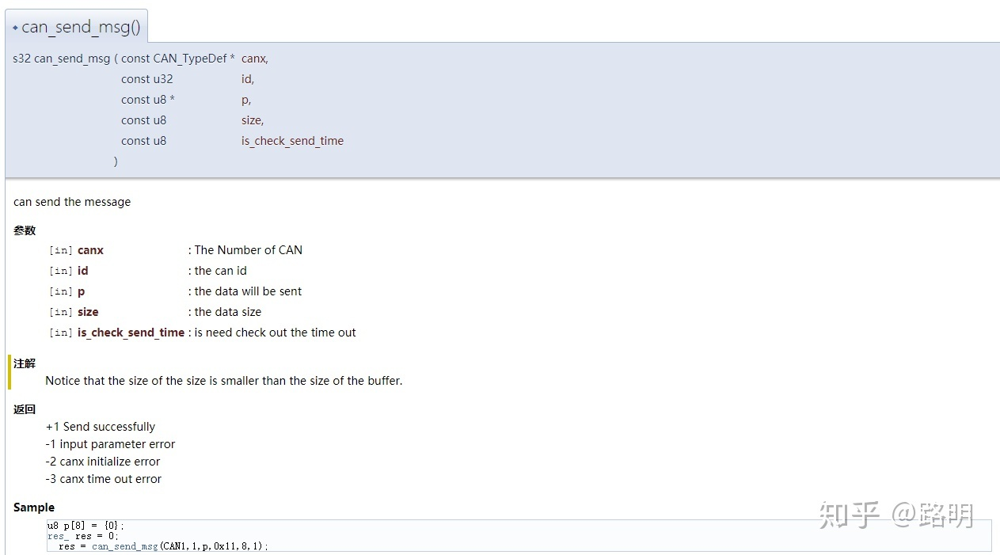

### 类和成员注释

如果对文件、结构体、联合体、类或者枚举的成员进行文档注释的话，并且要在成员中间添加注释，而这些注释往往都是在每个成员后面。为此,可以使用在注释段中使用`<`标识。

```c
/**
* @class <class‐name> [header‐file] [<header‐name]
* @brief brief description
* @author <list of authors>
* @note
* detailed description
*/
class Test
{
public:
    /** @brief A enum, with inline docs */
    enum TEnum 
    {
        TVal1, /**< enum value TVal1. */ 
        TVal2, /**< enum value TVal2. */ 
        TVal3 /**< enum value TVal3. */ 
    }
   *enumPtr, /**< enum pointer. */
    enumVar; /**< enum variable. */
    /** @brief A constructor. */ 
    Test(); 
    /** @brief A destructor. */ 
    ~Test();
    /** @brief a normal member taking two arguments and returning an integer value. */ 
    int testMe(int a,const char *s); 
};
```

### 枚举注释

```c
/** bool */  
typedef enum
{
    false = 0,  /**< FALSE 0  */
    true = 1    /**< TRUE  1  */
}bool;
```

打开注释网页后展示如下。

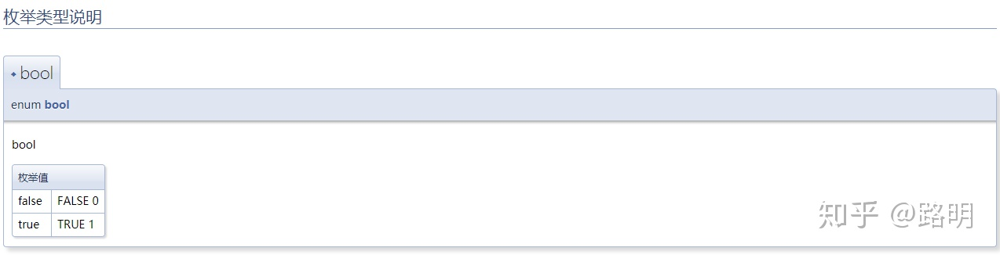

### 其他注释属性

参考：

官方文档 https://www.doxygen.nl/manual/commands.html

https://www.cnblogs.com/rongpmcu/p/7662765.html

## 常用配置

### 不生成Latex文档

一般来说我们都是生成html格式的文档来方便查阅，而Doxygen默认会生成Latex文档，这里我们设置不生成。注意取消勾选之后记得手动把Latex文件夹删掉。

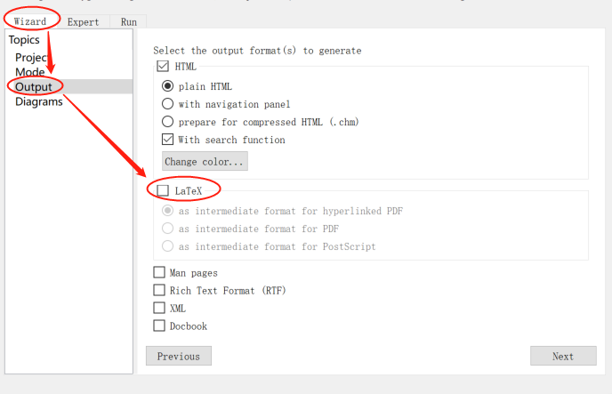

### 针对所有代码生成文档

Doxygen默认只对有Doxygen注释的部分生成文档，可以设置对所有代码生成文档，方便查阅时跳转。

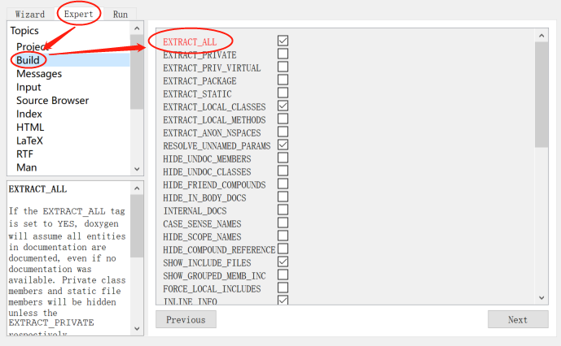

### 将 顶部导航栏 改为 左侧树状常驻导航栏

有时候顶部的导航栏体验很不好，可以给它改成左侧树状常驻导航栏

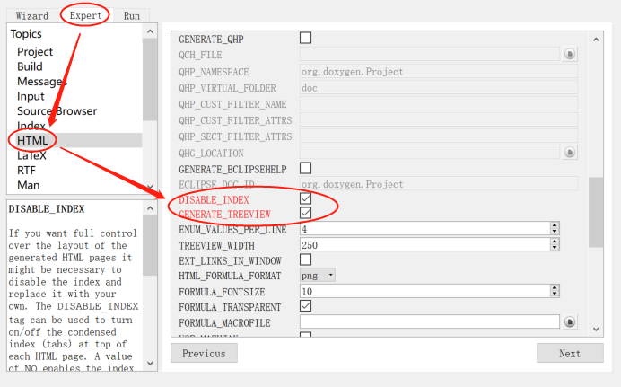

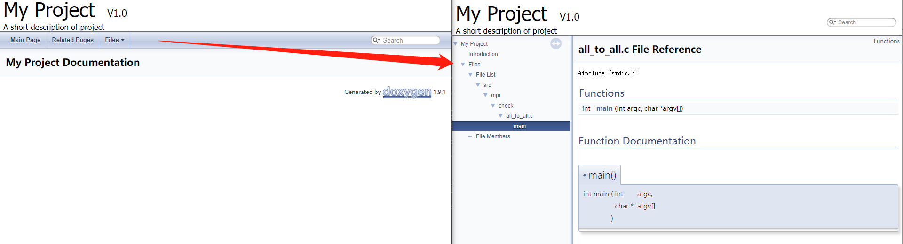

### 在文档中浏览代码

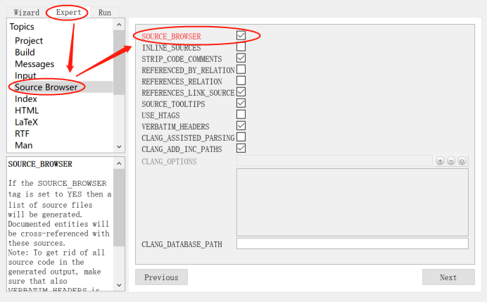

这样在文档中就会生成可以跳转到代码的链接

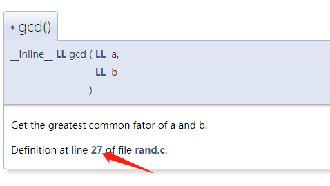

## 参考

https://www.youtube.com/watch?v=TtRn3HsOm1s&t=517s

https://zhuanlan.zhihu.com/p/100223113

https://www.doxygen.nl/manual/docblocks.html
