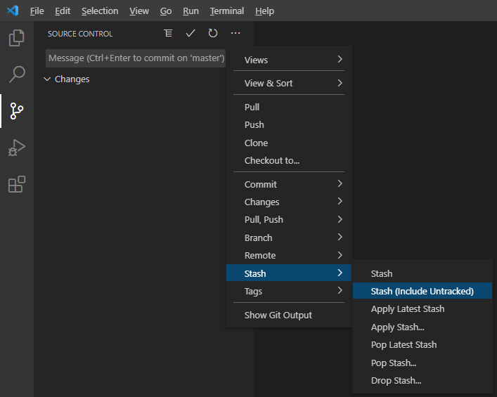

## 摘要

本文简要记录一些我用过的git的小技巧。（大佬请绕道）

<!-- more --> 

## 仅commit一个文件中的部分修改

需要在`git add`时将一个文件的部分修改给add进去，使用如下命令

```bash
git add --patch <filename>
```

然后会弹出一个交互式界面，让你一块块选择是否add这一块修改

- `y`表示add这一块
- `n`表示忽略这块修改
- `s`表示将这一块继续细分
- `e`手动修改这一块
- `d`表示忽略这一块和之后的所有块
- `a`表示add这一块和之后所有的块

还有些其他选项，我没用过

## 缓存当前修改

有时候想要暂存当前所有的修改，但是又不想搞得那么隆重产生一个新的commit，比如：想要临时切换到另一个分支上去看一下，但是当前有修改切换不过去，就可以使用`git stash`来暂存当前修改

- `git stash`

保存当前工作进度，将工作区和暂存区恢复到修改之前。

- `git stash save message`

作用同上，`message`为此次进度保存的说明。

- `git stash list`

显示保存的工作进度列表，编号越小代表保存进度的时间越近。

- `git stash pop stash@{num}`

恢复工作进度到工作区，此命令的`stash@{num}`是可选项，在多个工作进度中可以选择恢复，不带此项则默认恢复最近的一次进度相当于`git stash pop stash@{0}`

- `git stash apply stash@{num}`

恢复工作进度到工作区且该工作进度可重复恢复，此命令的`stash@{num}`是可选项，在多个工作进度中可以选择恢复，不带此项则默认恢复最近的一次进度相当于`git stash apply stash@{0}`

- `git stash drop stash@{num}`

删除一条保存的工作进度，此命令的stash@{num}是可选项，在多个工作进度中可以选择删除，不带此项则默认删除最近的一次进度相当于`git stash drop stash@{0}`

- `git stash clear`

删除所有保存的工作进度。

参考：https://www.jianshu.com/p/1e65e938f93c

**建议直接使用vscode中的GUI，挺方便的**



如果想要只把一部分文件stash起来，比如像临时还原某一个文件的更改，可以使用如下命令

```bash
git stash -p
```

然后要通过命令行交互决定每一个文件是否更改，具体的指令规则按 `?` 即可

```bash
(1/28) Stash this hunk [y,n,q,a,d,j,J,g,/,e,?]? ?
y - stash this hunk
n - do not stash this hunk
q - quit; do not stash this hunk or any of the remaining ones
a - stash this hunk and all later hunks in the file
d - do not stash this hunk or any of the later hunks in the file
g - select a hunk to go to
/ - search for a hunk matching the given regex
j - leave this hunk undecided, see next undecided hunk
J - leave this hunk undecided, see next hunk
e - manually edit the current hunk
? - print help
```

但是不建议只把一个文件的一部分stash，因为这样直接pop出来的时候会提示冲突

## 代理

配置git使用本地的代理

```bash
git config --global http.proxy http://127.0.0.1:7890
```

然后可以通过如下命令查看配置

```bash
git config --global --list
cat ~/.gitconfig
```

## // TODO
