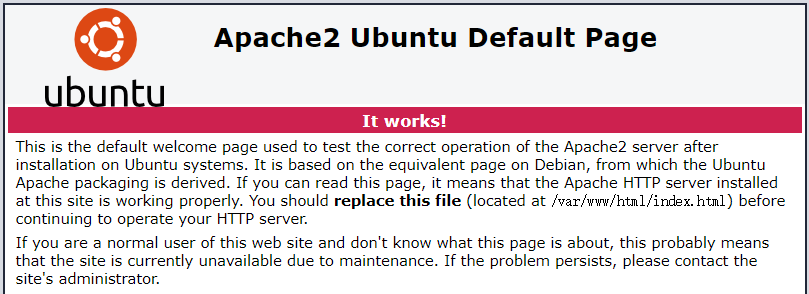
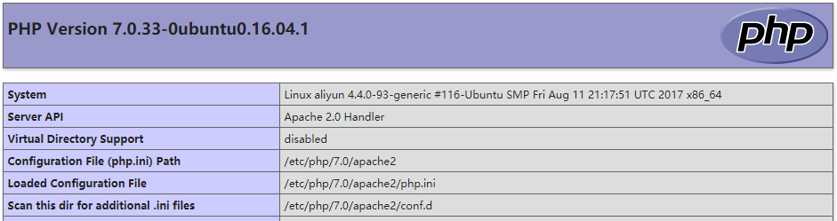

## 摘要

本文是一个**手动安装LAMP后安装WordPress的教程**，虽然后面用着用着觉得WordPress十分辣鸡于是不用了……

<!-- more --> 

前言

WordPress的安装需要LAMP（Linux+Apache+MySQL+PHP）环境或者其他如LNMP，WordPress安装的难点主要在于LAMP的安装，网上许多的解决方案都是直接用LAMP镜像或者LAMP一键安装脚本，或者直接就是WordPress镜像。
因为我后期Apache和MySQL还要用于其他生产环境，所以我偏向于手动安装LAMP。
之前网上看了好几个教程综合起来弄的，不过后来就找不到关键的几个网页了，所以是查着history写出来的
## 准备工作

系统我用的是`Ubuntu18.04`
```shell
apt-get update
```
## Apache安装
```shell
apt-get install apache2
```
就这一句，其实很简单
通过IP地址访问你的网站，看有没有出来这个东西↓，有则成功了

## MySQL安装
```shell
apt-get install mysql-server
```
然后在安装过程中会提示设置用户名和密码
## PHP安装
```shell
apt-get install php
apt-get install libapache2-mod-php7.0
apt-get -y install php7.0-mysql php7.0-curl php7.0-gd php7.0-intl php-pear php-imagick php7.0-imap php7.0-mcrypt php-memcache  php7.0-pspell php7.0-recode php7.0-sqlite3 php7.0-tidy php7.0-xmlrpc php7.0-xsl php7.0-mbstring php-gettext
systemctl restart apache2
```
这时候在网站根目录`/var/www/html`下建立一个`info.php`
```php
<?php phpinfo(); ?>
```
然后访问http://你的ip/info.php
应该会出现如下内容

## WordPress安装
1. 从官网下载安装包放到`/var/www/html`，**注意，如果想要安装中文版，这里一定要找对中文版的安装包**
这里是中文版安装包[https://cn.wordpress.org/wordpress-5.0.3-zh_CN.tar.gz](https://cn.wordpress.org/wordpress-5.0.3-zh_CN.tar.gz "https://cn.wordpress.org/wordpress-5.0.3-zh_CN.tar.gz")
2. 解压后得到一个`wordpress`文件夹
3. 这时访问http://你的ip/wordpress 就可以开始跟着提示安装了
4. 这个期间会需要数据库的用户名和密码，你可以直接给root，也可以自己创建一个数据库用户和数据库给WordPress，我选择了后者
这里只介绍一下直接给root的方法，因为如果你要选择后者，代表你的数据库还需要做其他运用，不能给WordPress完整的权限，而这代表着你知道如何使用MySQL，故不介绍
- 开放数据库的外部访问：编辑`/etc/mysql/mysql.conf.d/mysqld.cnf`，找到`bind-address = 127.0.0.1`一句并给它加注释（最前面加#即可）
- 给WordPress创建数据库：
```shell
mysql -u root -p
Enter password: 
Welcome to the MySQL monitor.  Commands end with ; or \g.
mysql> create database wordpress default character set utf8;
Query OK, 1 row affected (0.00 sec)
mysql> exit
```

## 插件的安装
第一次安装插件的时候竟然还提示需要ftp服务器，然后我架ftp服务器的时候不知道为啥死活从外面登不进去，于是干脆找了不需要用ftp服务器的方法
在`/var/www/html/wordpress/wp-config.php`的最后加上如下内容
```shell
define("FS_METHOD", "direct");
define("FS_CHMOD_DIR", 0777);
define("FS_CHMOD_FILE", 0777);
```
然后把`/var/www/html/wordpress`整个的权限变成777即可
```shell
chmod -R 777 /var/www/html/wordpress
```
如果还是不行就刷新一下网页，重启一下Apache即可
```shell
service apache2 restart
```
