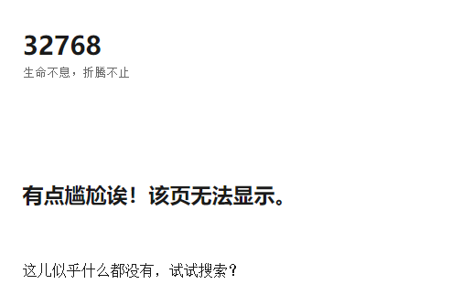
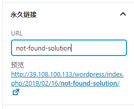
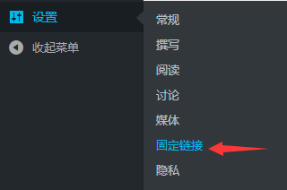
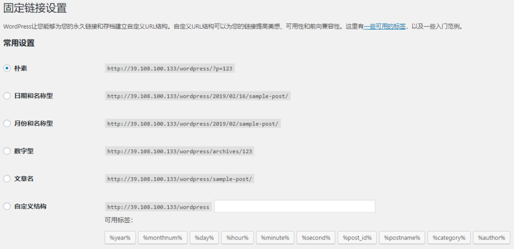

## 摘要

发布文章后发现在首页能够浏览文章，但是点进去就不行了，出现了下图的情况

<!-- more --> 

这是由于永久链接中存在中文字符导致的，所以在侧边栏改掉永久链接为不含中文的即可

但是比较蛋疼的是，要文章发布之后才能再进来改，好像有直接能让url中存在中文的一劳永逸的方法，但是后来我又找不到那个博客了

还有一种一劳永逸的方法是设置WordPress不用文章名作为标题，在这里设置↓

选择不带名称的都行~然后就OK了~
