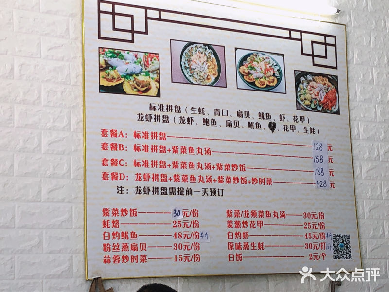
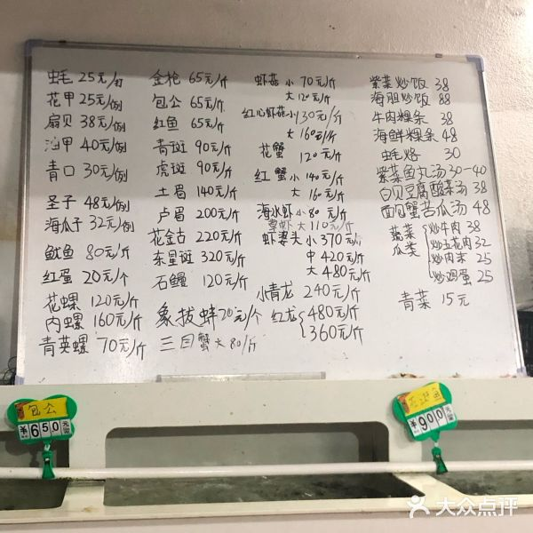
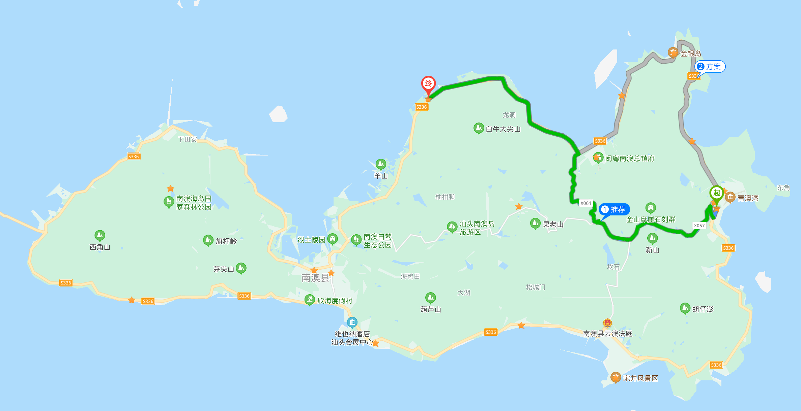
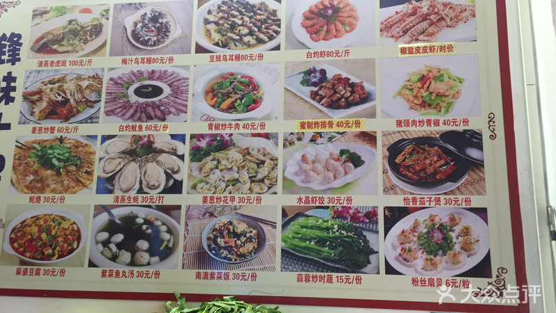

南澳四日游旅游方案

<!-- more --> 

## 需要准备的东西

- 拖鞋×3
- 吐司（当早餐）
- 抗过敏药、止泻药、创可贴、碘伏等常用药
- 清空手机存储准备拍照
- 泳衣

## 6月9日 星期二

| 时间        | 项目                             | 备注                             |
| ----------- | -------------------------------- | -------------------------------- |
| 9:00-15:00  | 前往南澳岛酒店                   | 车程约6小时，服务区麦当劳        |
| 15:00-16:00 | 入住酒店                         | 稍作休息                         |
| 16:00-18:00 | 青澳湾沙滩、北回归线广场附近游玩 | 不游泳                           |
| 18:00-20:00 | 晚餐附近解决                     | 酒店旁边，步行前往，可以都去看看 |
| 20:00-21:30 | 返回酒店休息                     |                                  |
| 21:30-23:00 | 海鲜烧烤                         |                                  |

还需要完成的事：打电话提前一天订渔家乐，如果没有提前电话订到渔家乐，下午可能要开车去码头订第二天的渔家乐

### 晚餐备选

酒店附近的3家店如下

#### 川海一笼

到店点似乎比美团便宜，如果想吃龙虾拼盘需要提前一天预定，但是龙虾不一定划算，当地价格参见下面这家

#### 海潮风味

这家我去过，味道不错，品类多样，就是环境不太好，建议点平常在家吃不到的且在那里便宜的，因为离酒店很近，可以考虑打包回酒店吃。

#### 讨海人 海鲜私厨

环境很好，属于餐厅性质，不是大排档，具体参考大众点评

#### 南蚝小贝海鲜特色餐厅

环境很好，属于餐厅性质，不是大排档，具体参考大众点评

## 6月10日 星期三

| 时间        | 项目                     | 备注     |
| ----------- | ------------------------ | -------- |
| 5:00-6:00   | 房间内or沙滩 拍日出      |          |
| 6:00-7:00   | 回笼觉                   |          |
| 7:00-8:00   | 早餐                     | 自带吐司 |
| 8:00-9:00   | 随便转转，然后前往渔家乐 |          |
| 9:00-11:00  | 渔家乐                   |          |
| 11:00-12:30 | 午饭                     |          |
| 13:00-14:30 | 午休                     |          |
| 14:30-18:00 | 环岛游                   |          |
| 17:00-18:00 | 晚饭                     |          |
| 18:00-21:00 | 酒店休息                 |          |
| 21:00-22:30 | 烧烤夜宵                 | //TODO   |
| 22:30-      | 休息                     |          |

### 前往渔家乐路线

从山上翻过去，看看沿途风景，下午再环岛游

### 渔家乐简介

大约都是500元一条船，一条船最多5人，遇到有两个人来玩的可以邀请拼船。

捞上来的东西让店家做的话还需要收取约50元/人的加工费

**必须要提前一天预定**

### 环岛游简介

按标记出的环岛景点，想去的话就下车去，不想去的就直接开过去

### 晚餐备选

如果中午有剩的，就回酒店煮；没有剩的，就在游客集散中心附近吃

备选餐厅如下

#### 鲜宴 | 海鲜私厨

环境很好的一家店，详见大众点评

#### 锋味十足

不知道为啥大众点评排名就是非常靠前，看菜式好像也不多，有团购，是个大排档

## 6月11日 星期四

| 时间        | 项目                | 备注               |
| ----------- | ------------------- | ------------------ |
| 5:00-6:00   | 房间内or沙滩 拍日出 |                    |
| 6:00-7:00   | 回笼觉              |                    |
| 7:00-8:00   | 早餐                | 出门觅食           |
| 8:00-11:30  | 冗余游玩时间        | 具体去哪灵活调整   |
| 11:30-12:00 | 退房                |                    |
| 12:00-13:00 | 午饭                | 参照6月9日晚餐备选 |
| 13:00-16:00 | 前往潮州            |                    |
| 16:00-16:30 | 广济桥              | 16:00停止入园      |
| 17:00-18:00 | 晚餐                | 潮膳楼             |
| 18:00-20:00 | 牌坊街              | 老魏记潮州小吃     |
| 20:00-21:00 | 夜宵                | 官塘原味鱼生       |
| 21:00-      | 返回酒店休息        |                    |

上午可以选择前往小岛等项目，不过可能要考虑提前退房

## 6月12日 星期五

| 时间        | 项目                   | 备注               |
| ----------- | ---------------------- | ------------------ |
| 7:00-8:00   | 起床出门，可以顺便退房 |                    |
| 8:00-9:00   | 喝早茶                 | 韩上楼大酒楼       |
| 9:00-11:00  | 冗余游玩时间           | 具体去哪灵活调整   |
| 11:30-13:00 | 午餐                   | 没想好，牛肉火锅？ |
| 13:00-17:30 | 返回东莞               |                    |
