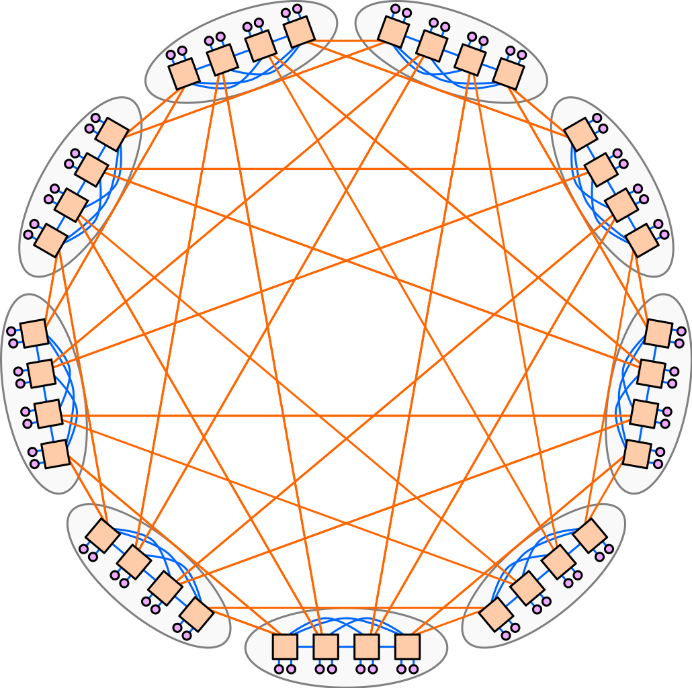
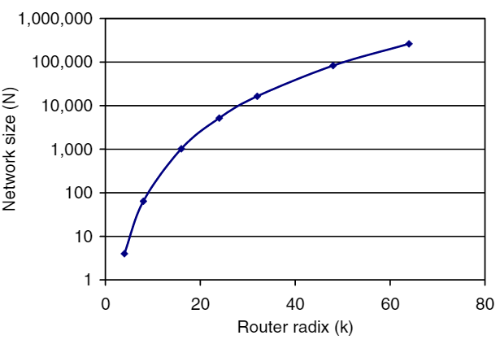
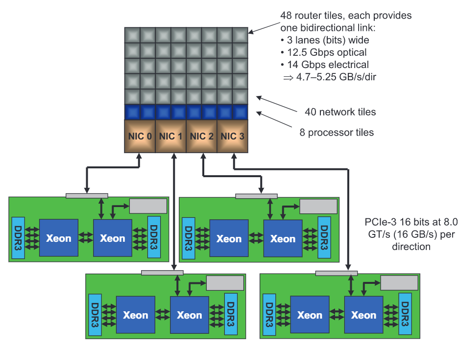
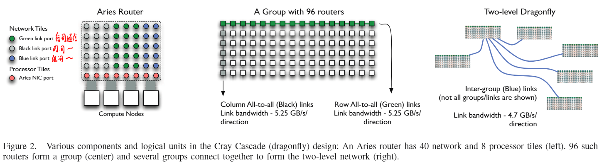
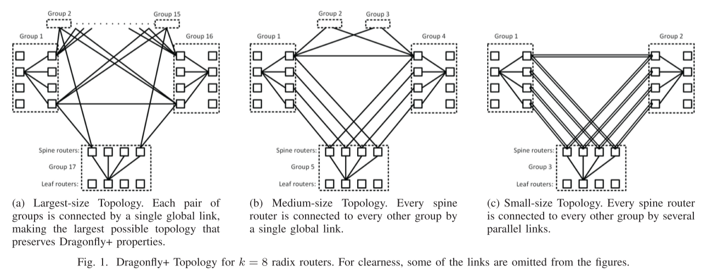
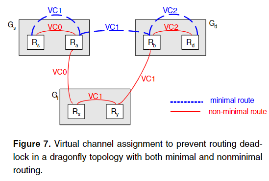
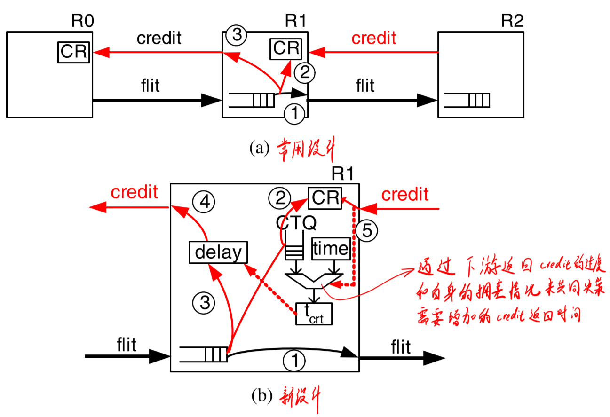

## 简介

Dragonfly是一种现在比较时髦的拓扑结构，它由John Kim等人在2008年的论文[*Technology-Driven, Highly-Scalable Dragonfly Topology*](https://ieeexplore.ieee.org/abstract/document/4556717)中提出，它的特点是网络直径小、成本较低，对于高性能计算有着非常大的优势。现在已经被运用在使用[Cray XC系列网络](https://www.alcf.anl.gov/files/CrayXCNetwork.pdf)的各种超算中[1]，如[2017年11月排名](https://www.top500.org/lists/top500/2017/11/)第3的超算[PIZ DAINT](https://www.cscs.ch/computers/decommissioned/piz-daint-piz-dora/)、[2018年11月排名](https://www.top500.org/lists/top500/2018/11/)第6的超算[TRINITY](https://www.lanl.gov/projects/trinity/specifications.php)、[2016年11月排名](https://www.top500.org/lists/top500/2016/11/)第5的超算[CORI](https://docs.nersc.gov/systems/cori/interconnect/)。未来也将要被应用在使用[Slingshot网络](https://docs.nersc.gov/systems/perlmutter/interconnect/)的许多超算中，如：最新一期[2021年6月排名](https://www.top500.org/lists/top500/2021/06/)第5的[Perlmutter](https://www.top500.org/system/179972)超算。

<!-- more --> 

注[1]：由于部分超算升级过配置，这里列出的是其最高排名

ps. Dragonfly的中文直译是“蜻蜓”，并不是“飞龙”。我竟然“飞龙飞龙”地叫了两年才发现这玩意原来是“蜻蜓”，手动捂脸，英语都还给小学老师了

## 基本定义

一个简单的dragonfly网络如下图所示。

以下遵循John Kim等人在2008年的论文[*Technology-Driven, Highly-Scalable Dragonfly Topology*](https://ieeexplore.ieee.org/abstract/document/4556717)和Md Shafayat Rahman等人在2019年的论文[Topology-Custom UGAL Routing on Dragonfly](https://doi.org/10.1145/3295500.3356208)中的记号表示法，有冲突的部分以严谨为准（以我为准），在大多数论文中也都采用的是这种记号表示法。

Dragonfly的拓扑结构分为三层[2]：Switch层[3]，Group层，System层。

- Switch层：包括一个交换机，及其相连的 **p** 个计算节点
- Group层：包含 **a** 个Switch层，这 **a** 个Switch层的 **a** 个交换机是全连接(All-to-all)的，换言之，每个交换机都有 **a-1** 条链路连接分别连接到其他的 **a-1** 台交换机
- System层：包含 **g** 个Group层，这 **g** 个Group层也是全连接的

*注[2]：在[该论文](https://doi.org/10.1145/3295500.3356208)中仅有2层*

*注[3]：在[该论文](https://ieeexplore.ieee.org/abstract/document/4556717)中称之为Router层*

对于单个switch交换机，它有`p`个端口连接到了计算节点，`a-1`个端口连接到Group内其他交换机，`h`个端口连接到其他Group的交换机

因此，我们可以计算得到网络中的如下属性

- 每个交换机的端口数为 **k**=p+(a-1)+h
- Group的数量为 **g**=ah+1
- 网络中一共有 **N**=ap(ah+1) 个计算节点
- 如果我们把一个Group内的交换机都合成一个，将它们视为一个交换机，那么这个交换机的端口数为 **k‘**=a(p+h)

在一个较小规模的网络中， **g**=ah+1 个group可能会较多，可以将任意两个Group之间的连接数由一条增加为多条，这样任意两个Group之间就有 floor((ah+1)/g) 条链路连接。

不难发现，在确定了 **p**，**a**，**h**，**g** 四个参数之后我们就可以确定一个dragonfly的拓扑，因此一个Dragonfly的拓扑可以用 **dfly(p,a,h,g)** 来表示

一种推荐的较为平衡的配置是方法是：a=2p=2h

使用高阶交换机（端口数较多的交换机）对于提升网络中能容纳的节点数有很大帮助，使用上述的平衡的配置方法，交换机的端口数和网络中能容纳的最大节点数量如下所示

> 参考文献：
>
> [*Technology-Driven, Highly-Scalable Dragonfly Topology*](https://ieeexplore.ieee.org/abstract/document/4556717)
>
> [Topology-Custom UGAL Routing on Dragonfly](https://doi.org/10.1145/3295500.3356208)

## 网络变形

### Cray XC Series Network (Cascade)

【Cray XC 系列】是Cray公司参与美国国防部高级研究计划局(DARPA)高性能计算系统(HPCS)项目的一部分而开发的一系列超算(distributed memory system)。代号为“Cascade”，注意这是这个系列的一个代号，在一些论文里经常会看到“Cascade System”，这并不是指一个叫“Cascade”的超算（虽然确实有叫这个名字的超算，不过它用的网络并不是这里要介绍的网络）。

Aries ASIC是这个系列网络中的网络芯片，由台积电40nm工艺制造，可以把它视为4个张网卡芯片和1个48口交换机芯缝合到了一个芯片上，如下图所示。它的48个端口其中8个端口为一个刀片上的4个计算节点（每个计算节点两个端口）提供网络。

它的网络拓扑将Dragonfly进行了改进，为了方便理解，我将它分为了4层：Switch层、Chassis层、Group层、System层

- Switch层：如前面所说的，一个Switch层有1个Aries ASIC和4个计算节点，物理上是一个刀片式结构
- Chassis层：由一个机架内的16个Switch层构成，并且是全连接(All-to-all)的，物理上通过背板连接的，这些连接使用绿色表示
- Group层：由6个机架内测6个Chassis层构成，并且是全连接(All-to-all)的，物理上是通过铜缆连接的，这些连接使用黑色表示
- System层：最多可以由241个Group层组成，并且是全连接(All-to-all)的，每两个Group之间有4条链路，物理上通过光纤连接，这些连接适用蓝色表示

> 参考文献：
>
> [Cray XC Series Network](https://www.alcf.anl.gov/files/CrayXCNetwork.pdf)
>
> [Cray Cascade: A scalable HPC system based on a Dragonfly network](http://ieeexplore.ieee.org/document/6468518/)
>
> [Maximizing Throughput on a Dragonfly Network](http://ieeexplore.ieee.org/document/7013015/)
>
> [Analyzing Network Health and Congestion in Dragonfly-Based Supercomputers](http://ieeexplore.ieee.org/document/7516005/)

### PERCS

这个是我能找到的Dragonfly在真实大规模系统上的使用虽然[在该论文](https://ieeexplore.ieee.org/abstract/document/5577310)中并没有直接说它是Dragonfly，但是实际上就是的。是一个比较标准的Dragonfly，讲道理不应该放在“网络变形”这一节，但是其他地方感觉有点怪怪的，并且这个东西在很多论文中都出现了，删了也不太好，所以就放在这一节了。详细信息见文献（我也没太仔细看）。

> 参考文献：
>
> [The PERCS High-Performance Interconnect](https://ieeexplore.ieee.org/abstract/document/5577310)
>
> [Collectives on Two-Tier Direct Networks](https://www.semanticscholar.org/paper/Collectives-on-Two-Tier-Direct-Networks-Jain-Lau/a76963be9657e5dfdcc19f596f4424dc457f4deb)

### Dragonfly+

Dragonfly的一个变种，将group内的通信变为了fat-tree

> 参考文献：
>
> [Dragonfly+: Low Cost Topology for Scaling Datacenters](https://ieeexplore.ieee.org/document/7885210)

### TODO

可能还有其他的一些变形，日后会补充

## Deadlock Free

在Dragonfly中，如果使用最短路由，需要2个VC来避免死锁；如果使用非最短路由，需要3个VC来避免死锁。

这一部分如果看不懂的话可以去看一下*Principles and Practices of Interconnection Networks*这本书第十四章，或者看我另一篇博客《[Virtual Channel与Flow Control与Deadlock](/网络/Virtual Channel与Flow Control与Deadlock/)》，这里有对死锁，包括Dragonfly上的死锁问题的更详细的说明。

## 路由

这一节介绍Dragonfly中的一些路由种类，主要是主要根据论文[*Technology-Driven, Highly-Scalable Dragonfly Topology*](https://ieeexplore.ieee.org/abstract/document/4556717)中的工作来介绍，其他的一些论文中的创新会明确指出。注意，下面介绍的是在最朴素的Dragonfly网络，即“基本定义”一节中的拓扑定义，暂不讨论各种变种Dragonfly拓扑中的定义。因此下面提到的 **Global Link** 指Group之间的连接，**Local Link** 指同一个Group内交换机之间的连接。

- Minimal Routing：最短路径的路由，简写为**MIN**。由于拓扑的性质，Minimal Routing中最多只会有1条Global Link和2条Local Link，也就是说最多3跳即可到达。在任由两个Group之间只有一条直连连接时（即**g**=ah+1时），最短路只有一条。

- Non-Minimal Routing：非最短路径的路由，可以简写为**Non-Min**，来自论文[A scheme for fast parallel communication](https://ldhulipala.github.io/readings/ValiantPermutationRouting.pdf)。有的地方叫Valiant algorithm，简写为**VAL**，还有的地方叫Valiant Load-balanced routing，简写为**VLB**。随机选择一个Group，先发到这个Group然后再发到目的地。由于拓扑的性质，VAL最多会经过2条Global Link和3条Local Link，最多5跳即可到达。（这里我也有疑问：①如果随机到的Group就是源节点或者目的节点所在的Group，那不依然是最短路径路由？这样应该叫：Maybe Non-Minimal Routing：可能非最短路径的路由。②如果源节点和目的节点在一个Group，那还要这样绕一圈再回来吗？不过这些问题并不重要，不要放在心上）

- Universal Globally-Adaptive Load-balanced(**UGAL**)：全局自适应负载均衡路由，来自论文[Load-Balanced Routing in Interconnection Networks](https://static.aminer.org/pdf/PDF/000/338/323/balanced_routing.pdf)。当一个数据包到达交换机时，交换机根据 最短路径路由MIN 和 非最短路径的路由VAL 的 路径上所有交换机队列的排队长度的和，来选择路由，见下方公式。
  $$
  TQ_{MIN} ≤ TQ_{VLB} +T
  $$
  

  其中 TQMIN 表示：最短路径路由MIN 的 路径上所有交换机队列的排队长度的和； TQVLB 表示：非最短路径的路由VAL 的 路径上所有交换机队列的排队长度的和。T 是一个偏移量，当想要手动偏向于使用者两种路由中的某一个时可以修改这个值

  因为要获取到全局网络状态信息太难了，所以提出了一系列变种，在Dragonfly中有如下若干种实现方式：

  - UGAL-G：只根据发送节点所在的Group的所有交换机的队列排队长度来进行判断。但是要实现这个依然很难，也是一个非常理想的情况。

  - UGAL-L：只根据本地交换机的队列排队长度来进行判断，这种方式会产生一个问题：当在源Group中进行路由时，如果最短路径和非最短路径都要经过源Group中另一个交换机时，此时这两条路径的出口队列一致，因此总是会选择最短路径。

  - UGAL-LVC：针对UGAL-L的问题进行了一点改进：将最短路径和非最短路径分为两个VC，分别排队来计算长度。但是这样又会导致数据包更偏向选择非最短路由，导致在均匀流量模式下性能不好。

  - UGAL-LVC_H：针对UGAL-LVC的问题又进行了一点改进：只有在MIN和VAL的输出端口不一样的时候，才用VC的队列长度来进行判断，否则还是直接使用队列长度来判断。

  - UGAL-LCR：由于只用本地信息来判断拥塞，在buffer越大时反而造成的延迟越大，因为buffer被填满了之后，上游的交换机才能通过没有credit了感知到。为了克服这个问题，可以通过当前拥塞情况主动增加credit的返回延迟，上游交换机认为返回credit越快的交换机拥塞程度越小。
  
    

在具体的实现上，[Cray Cascade](http://ieeexplore.ieee.org/document/6468518/)使用了4条VC，在路由时会选择2条最短路(MIN)，2条非最短路(Non-Min)，然后根据负载情况来进行选择。

后面也还有一些工作继续对路由算法进行优化

- [progressive adaptive routing](https://dl.acm.org/doi/10.1145/1555815.1555783) (PAR)：依然是根据本地信息来决策走最短路径还是非最短路径，但是消息在出源节点所在的group之前，可以修改策略，中途改走非最短路径；如果已经决定走非最短路径，则中间不可更改。
- [T-UGAL、T-PAR](https://doi.org/10.1145/3295500.3356208)：像刚刚提到的[Cray Cascade](http://ieeexplore.ieee.org/document/6468518/)，在自适应路由选择路径的时候并不是所有可行路径都进行比较的，是要从一个样本空间进行抽样的，这个样本空间一般就是全体路径，这篇工作就是把这个样本空间缩小了，至于是怎么缩小的，有两个出发点：①样本空间缩小不能降低太多网络的吞吐量；②要保证各种链路的负载相对均衡。

什么？你问哪个性能最好？当然是动态路由大法好！

> 参考文献：
>
> [*Technology-Driven, Highly-Scalable Dragonfly Topology*](https://ieeexplore.ieee.org/abstract/document/4556717)
>
> [Topology-Custom UGAL Routing on Dragonfly](https://doi.org/10.1145/3295500.3356208)
>
> [A scheme for fast parallel communication](https://ldhulipala.github.io/readings/ValiantPermutationRouting.pdf)（这篇我没看）
>
> [Load-Balanced Routing in Interconnection Networks](https://static.aminer.org/pdf/PDF/000/338/323/balanced_routing.pdf)（这篇我也没看）
>
> [Cray Cascade: a Scalable HPC System based on a  Dragonfly Network](http://ieeexplore.ieee.org/document/6468518/)
>
> [Indirect adaptive routing on large scale interconnection networks](https://dl.acm.org/doi/10.1145/1555815.1555783)

## 作业调度

这是比较反直觉的一点：一般来说在其他的拓扑如Fat-tree和Torus中，给一个作业分配的节点，一般来说放得进一点有助于通信，可以提高性能。而在Dragonfly中恰恰想法，将一个作业的各个节点分散在各个Group中反而有助于提升通信性能。这是因为两个Group之间的直连链路是很少的，如果两个Group之间有多个节点对需要进行通信，就很容易会导致直连链路饱和，就需要经过其他Group来进行中转，性能就下降了，因此将同一个作业的节点都集中在几个Group中容易导致性能下降。

> 参考文献：
>
> [Analyzing Network Health and Congestion in Dragonfly-Based Supercomputers](http://ieeexplore.ieee.org/document/7516005/)
>
> [Maximizing Throughput on a Dragonfly Network](http://ieeexplore.ieee.org/document/7013015/)
>
> 还有些我一时间找不着了，啊，好困，遇上了再补充叭~TODO

## MPI Collective通信算法

优秀的拓扑自然需要优秀的MPI Collective通信算法来充分发挥它的性能，下面介绍一些相关的工作。

### [Collectives on Two-Tier Direct Networks](https://link.springer.com/chapter/10.1007/978-3-642-33518-1_12)

中根据Dragonfly的层次架构来对Scatter、Gather、Broadcast、Allgather、Reduce、Allreduce来进行了设计，主要的思想基本是：

1. 利用同一个Group中的其他节点来同时对其他Group节点进行通信，来提升吞吐量。（**LLF**: Local Link First）
2. 只对同一个Group中的一个节点进行通信，由这一个节点再和通一个Group中的其他节点进行通信，来大大减少Group之间的通信量。（**GLF**: Global Link First）

但是我觉得这篇工作有一些缺陷：

1. 只针对了大数据包的操作进行了优化；
2. 文中假设全系统中所有节点都参与；
3. 文中假设所有节点都同时开始通信，没有考虑imbalance的情况

### [Evaluation of Topology-Aware Broadcast Algorithms for Dragonfly Networks](https://ieeexplore.ieee.org/abstract/document/7776477)

中把前一个工作中存在的问题②在Bcast算法中优化了，只在LLF算法上做了一点点非常小的改变：在广播到同一个Group内的其他节点之后，原来是依次地再广播到其他的Group，作者改成了在这一步再构造多棵Binomial Tree来进行广播到其他Group。

使得性能在各种场景下都能较为均衡（并没有显著提升，但是各种场景下都不差）。这篇文章亮点是实验做得很严谨全面。

### [Design and Evaluation of Topology-aware Scatter and AllGather Algorithms for Dragonfly Networks](https://hal.inria.fr/hal-01400271/file/poster.pdf)

这篇似乎只是SC16上的一个poster，只找到了一个2页的短篇论文，似乎没有完整的论文？（这个短篇论文我看得云里雾里的，直接只看poster反而懂了）

他用CODES模拟器观察了Dragonfly网络拓扑下Scatter和Allgather的一些算法的性能

- 针对Allgather算法：他们把原来的Ring算法改成了一个Topology Aware Ring算法，在数据包大小大于2KB时可以提升性能
- 针对Scatter算法：他们比较了四种算法：传统的Binomial **TREE**，直接分发的LIN，以及前面提到的**LLF**和**GLF**。发现在各种情况下都是LIN最快，因为LIN不容易引起网络中的拥塞。

我觉得这个工作再次证明了：在Dragonfly中很多东西的设计是挺反直觉的，经常在意料之外，但也在情理之中。
