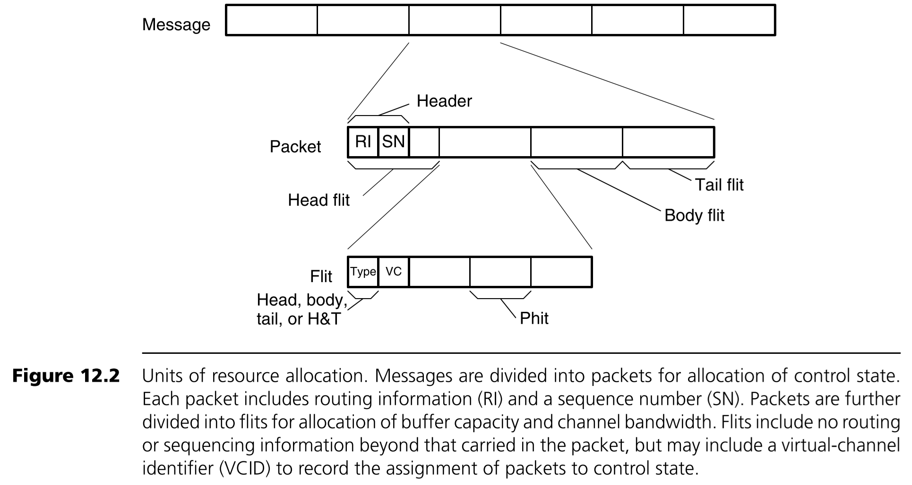
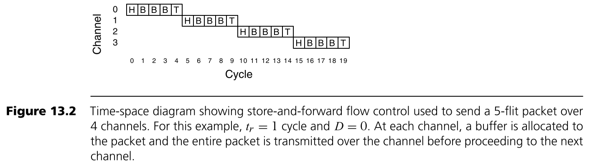
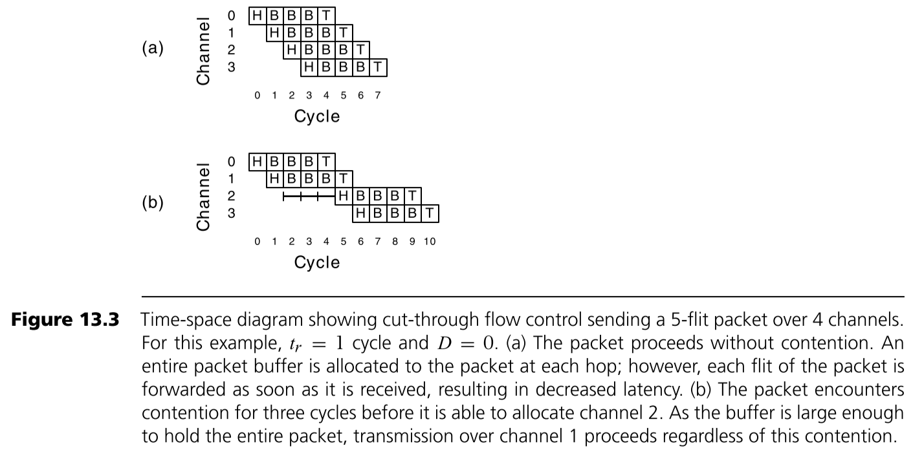
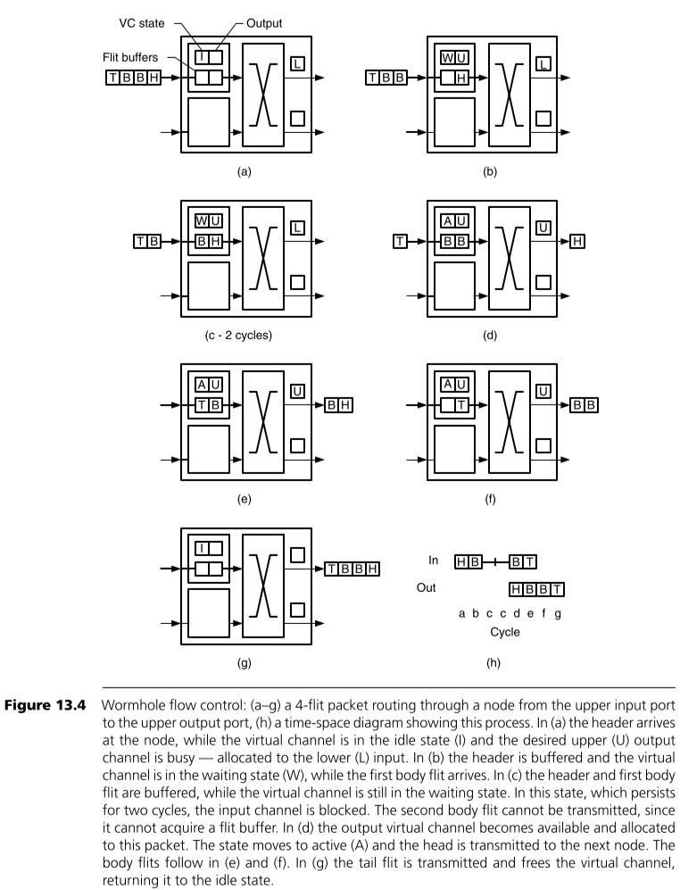
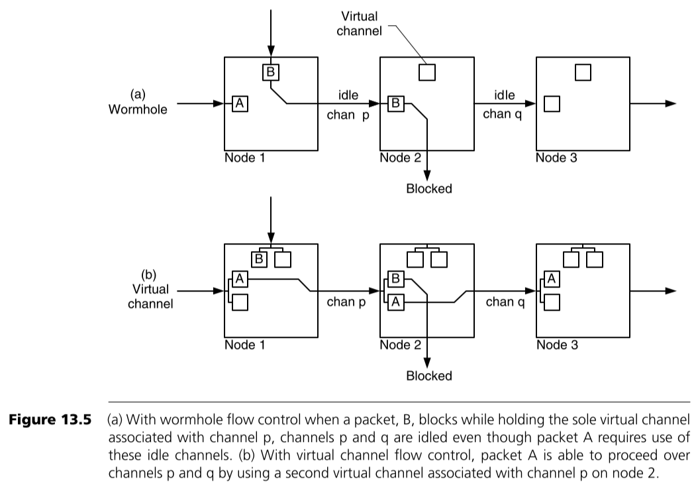
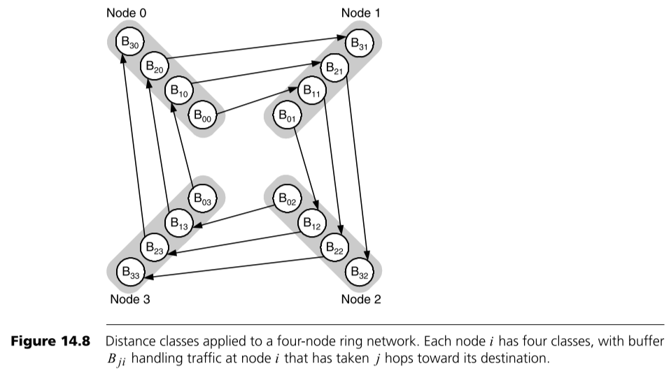
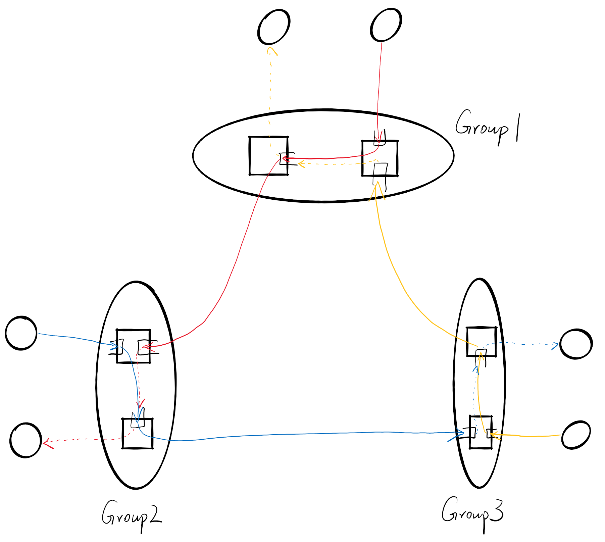
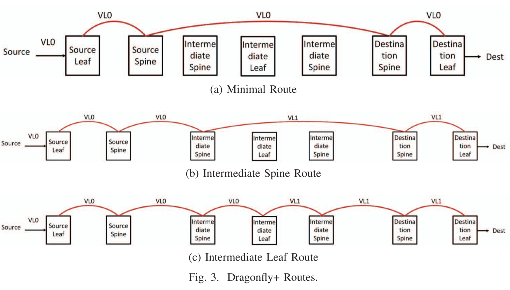
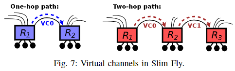

## 摘要

在以太网这样的有损网络中，如果一个数据包到达了一个交换机，发现它的输出端口排队极长，已经把buffer都排满了，那么这个包就会被丢弃。但是在InfiniBand这样的无损网络中，是不允许丢包的（除非超时），所以就需要buffered **flow control**来对数据包的发送进行严格的管理：当且仅当接收方有空闲buffer的时候，才能发送数据包。但是在进行这样的buffered flow control时，有可能会产生死锁(**deadlock**)，会导致网络性能降低。而实现buffered flow control和避免deadlock，都需要**Virtual Channel**的帮助。

本文讲详细介绍Virtual Channel与Flow Control与Deadlock。

<!-- more --> 

## Virtual Channel

Virtual Channel是网络中瑞士军刀，可以用来解决很多问题：①Head-of-line Blocking，②Deadlock，③QoS，④网络隔离，等等。在解决各种网络问题的场景中，你都能见到virtual channel的存在。那它们是一个virtual channel吗？是，也不是。因为virtual channel的本质是很简单的，都是一样的：将buffer资源分成多份；但是通过增加一些额外的规则，就能实现许多功能。

在有一些地方也叫作虚通道(**Virtual Lane**, VL)，是一个东西。

## Buffered Flow Control

流控机制决定着如何管理网络中的各种资源，如带宽、buffer、通道等等。一个好的流控机制可以高效的分配网络中的各种资源， 来实现更高的带宽、更低的延迟。从某种角度来说，也可以把流控视为一个解决网络中资源竞争的问题，毕竟如果资源如果够多，也不需要管理了。

说到流量控制(Flow Control、流控)，其实容易一点歧义，因为在很多情况下，这往往指的是端到端之间流控(end-to-end flow control)，即发送方与接收方之间的关于收发的协商，最常见的就是TCP的滑动窗口协议[[引](https://blog.csdn.net/JMW1407/article/details/107548201)]。与buffered flow control相反还有一种bufferless flow control，它的一个典型代表是在电路交换的网络：在数据包发送之前需要在发送端和接收端之间链路上全都预留好相应的资源。而在本文中，介绍的是buffered flow control，并不讨论end-to-end flow control和bufferless flow control，因此后文中的flow control、流控除非特殊说明，均指代buffered flow control。

首先我们需要知道一个应用产生的一个消息(**Message**)是如何在网络中切分传送的，如下图所示。

其中Message一般来说长度是不确定的，它会被切分成长度固定的数据包(**Packet**)，packet是路由和控制的基本单位。说它是路由和控制的基本单位，是因为一个message中的不同packet可以走不同的路径到达接收方，这样切分可以在网络拥塞时负载更加均衡，速度也更快。

Packet还会再被切成很多的片(**Flit**)，为什么还要切呢？直接以packet作为传输单元不好嘛？真的不太好，因为为了让每一个packet中的有效传输部分（即除了为了message切分而额外添加的头部信息和尾部信息的部分）比例更加多，packet的大小往往不会很小，而以packet的大小作为基本单位在交换机中进行资源的分配实在是太大了，无法对资源进行细粒度的管理，因此需要再将packet切分成flit。而再将Flit切分成**phit**的原因，我猜是涉及到硬件了，我也不清楚，一个phit的典型大小是8bit。

当我们在flow control中使用buffer的话，就可以减少丢包或者大大提升带宽的利用率。因为如果没有buffer的话，数据包到达之后必须立即被转发出去，否则就要被丢弃；如果想要不被丢弃的话，就要提前预留资源给即将到来的数据包，而这样又会造成带宽的浪费。

Buffered Flow Control又分为两种：Packet-Buffer Flow Control 和 Flit-Buffer Flow Control。前以一个packet大小的buffer作为基本单位进行管理，后者以一个flit大小的buffer作为基本单位进行管理。

### Packet-Buffer Flow Control

Packet-Buffer Flow Control又有两种方式：Store-and-forward Flow Control 和 Cut-through Flow Control。前者必须要等到一整个packet都接收到才能开始准备转发，后者则在packet的head flit到了之后就可以开始准备转发。

#### Store-and-forward Flow Control

Store-and-forward Flow Control 会等待一整个packet都接收到才开始准备转发。在真正被转发之前还需要准备好两种资源：①下一跳的交换机已经准备好一个packet大小的buffer，②到下一跳交换机链路的独家使用权。一个例子如下图所示。

#### Cut-through Flow Control

Cut-through Flow Control 在packet的head flit到了之后就可以开始准备转发，但是要注意 Cut-through Flow Control 的buffer分配仍然是以一个packet大小的buffer为基本单位，并且在真正转发之前也需要准备好与Store-and-forward Flow Control相同的两种资源。一个例子如下图所示。

#### 缺点

Packet-Buffer Flow Control的缺点是显然的：①以packet的大小作为buffer管理的基本单位是会造成浪费，特别是在交换机这种由于对buffer速度要求极高因此buffer往往比较小的情况下，buffer的浪费是难以容忍的。②每次一个packet发送时都要占用以整个链路，这导致如果一个更高优先级的packet到来之后必须等待当前packet发送完才可以。因此将flit作为buffer的基本管理单位是非常有必要的。

### Flit-Buffer Flow Control

为了方便理解和简化，后面我们都使用**输入排队交换机**。

#### Wormhole Flow Control

Wormhole Flow Control 是以flit的大小作为分配buffer和带宽的基本单位。在每个packet的head flit到达一个交换机之后需要申请3种资源：①在这一跳交换机上的一个virtual channel，②在这一跳交换机中一个flit大小的buffer，③到下一跳交换机的链路上一个flit大小的带宽资源。在后续到达的每一个body flit都会使用由head flit申请到的这一个flit大小的buffer和带宽。当tail flit离开的时候会自动释放这3种资源。以个例子如下图所示。

需要特别解释一下的是这里的 **virtual channel(VC)** 是个什么玩意？它本质上是一组记录当前packet的状态的存储单元。因为交换机中可能并没有某一个packet的head flit（head flit可能已经被转发出去），所以需要临时存储一下当前这个flit所属的packet的相关信息（从前面的图可以发现flit中是不包含路由信息的，只有一个VC编号）。因此VC中信息至少包括：①当前这个VC的状态(idle, waiting for resources, or active)，②下一跳从哪里发送出去。

#### Virtual-Channel Flow Control

在上面的Wormhole Flow Control我们不难发现，一个输出端口还是一次只能被一个packet占有，如果这个packet在后面几跳中因为没有成功申请到资源而被阻塞住了，那么当前输出端也不能接着发送了，但是当前packet还是占据了当前的发送端，导致其他packet不能发送，这就是Head-of-line Blocking。

为了避免Head-of-line Blocking，可以将每条物理通道(physics channel)划分为多条(virtual channel)。正如前面所说了，这里的一个VC实际上就是交换机输入端口的一组存储当前接收的packet的存储单元。如果有2条VC，就意味着能同时接收2个packet，下一个到来的flit是这两个packet中的任意一个都可以。下图中是一个用VC来解决Head-of-line Blocking的例子。

还有一个要考虑的问题是：如果一个输入端口的buffer数量是一定的，那么是要让每一个virtual channel中能缓存的flit更多，还是要有更多数量的virtual channel呢？答案是相对较多的virtual channel会比较好，具体的原因在这里不展开，有需要可以自己查阅资料。

什么你还有一个问题？无论是哪种buffered flow control，上一跳的交换机是如何知道下一跳的交换机有条件让上一跳发送数据的？这就是Credit-Based flow control，上一跳交换机都持有一些下一跳交换机发送给它的credit，每一个单位的credit都标志着下一跳交换机有一个单位的空闲buffer。具体的细节在这里就不展开讲了。

## Deadlock

在一个无损网络中，丢包的情况是不允许存在的，一个常用的方法是基于信用的流控机制(Credit-based Flow Control)，一台交换机在将一个数据包发送到它下一条的交换机之前必须先得到它的允许，也就是得到credit。那么，如果出现了这样一种情况：数据包a在交换机A排队等待交换机B的credit，数据包b在交换机B等待交换机C的credit，数据包c在交换机C等待交换机A的credit，每一台交换机都必须将自己的数据包发送出去才能给予上游credit，因此形成了死锁。

关于死锁的基本定义请参见[维基百科](https://en.wikipedia.org/wiki/Deadlock)，在这里我们将问题简化，并先强调一个问题：在一个Virtual-Channel Flow Control网络中，什么情况下会产生死锁？

我们将这个问题转换成一个图论问题：将网络中的每一个交换机中的每一个VC中的buffer视为一个有向图G中的一个节点，对于两个相邻的交换机，如果其中一个交换机中的 一个输入端口中的 一个VC的buffer中的flit，**是允许被发送到**另一个交换机中的 一个输入端口中的 一个VC的buffer中的，设这两个buffer在图中对应的节点分别是 u 和 v ，那么图中存在一条边e: u → v 。如果这个有向图中存在着环，那么就说明这个网络中有可能会形成死锁。因为环上的每一个顶点及这个顶点的对应出度表示：可能存在一个flit占用着这个buffer，并等待着下一个buffer的空闲，从而形成环。后文中提到的图，均指代这里经过转化之后形成的图。

解决死锁的方法有两个：死锁恢复(Deadlock Recovery)和死锁避免(Deadlock avoidance)。前者检测死锁的发生并想办法解除死锁，后者直接不让死锁发生。从性能的角度来说，当然后者是更好的。个人认为死锁避免的最佳方法是通过拓扑和路由上的设计来解决：例如在Fat-tree中使用Up/Down Routing，在2D mesh中Dimension Order Routing。但是这种方法是有局限性的，它会对路由的方式产生一些限制。所以这里重点介绍如何利用VC来解决Deadlock问题。

前面在转换成图论问题时，加粗的“是允许被发送到”是有特别含义的。如果不利用VC来进行死锁避免，那么一个交换机的 一个输入端口的 一个VC的buffer中的flit 是可以被发送到 任意相邻交换机的 相应输入端口的 任意VC的buffer中的。而利用VC来进行死锁避免，则是通过增加限制来实现的，一个交换机的 一个输入端口的 一个VC的buffer中的flit **只能被发送到一些** 指定相邻交换机的 相应输入端口的 指定VC的buffer中的。一个简单的例子如下，在这个4个节点形成的网络中，通过将buffer分成了4份，即4类VC，来实现了Deadlock avoidance。

使用VC来解决Deadlock问题的关键在于破除图中的环，在不同的网络拓扑和不同的路由中有不同的方法。

这里插一句：还有一种奇特的方式是设计两套路由，分别走两种VC，只需要其中一套是deadlock free的，当另一套在路由出现阻塞时，换用deadlock free的路由即可。

### Dragonfly中的Deadlock free

Dragonfly这个拓扑详情见我另一篇博客《[Dragonfly拓扑简介](/网络/Dragonfly拓扑简介/)》

#### Minimal Routing

当只使用Minimal Routing的时候，会发现图中也是存在环的，如下图所示，所以可能会形成死锁。如果将group外到达的流量和group内产生的流量分离成两种VC就可以解决这个问题。

#### Non-Minimal Routing

当使用Non-Minimal Routing的时候，则需要3种VC，如下图所示

### Dragonfly+中的Deadlock free

在Dragonfly+中可以将每次一上一下的过程划分为一个VC，由于最多两次一上一下就可到达，因此2条VC也够了。

### Slimfly中的Deadlock free

Slimfly这个拓扑详情见我另一篇博客《Slimfly拓扑学习指引》

在Slimfly中由于最多只有2条就到达目的地了，所以可以直接将第一跳走VC0，第二条走VC1，如下图所示

## 参考

> Principles and Practices of Interconnection Networks
>
> Technology-Driven, Highly-Scalable Dragonfly Topology
>
> Dragonfly+: Low Cost Topology for Scaling Datacenters
>
> Slim fly: a cost effective low-diameter network topology
>
> https://community.mellanox.com/s/article/howto-prevent-infiniband-credit-loops
