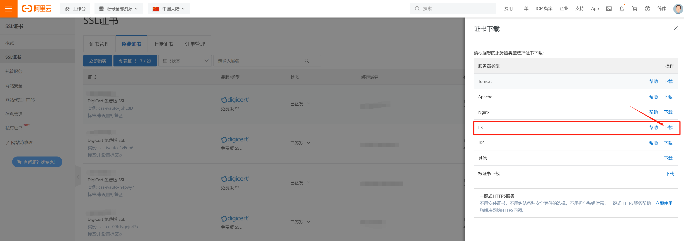
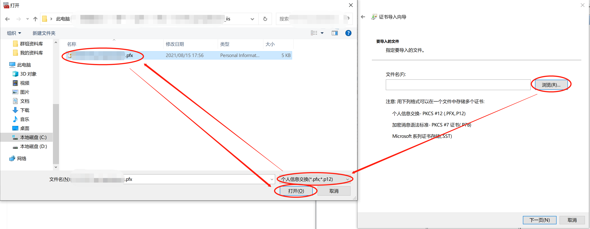
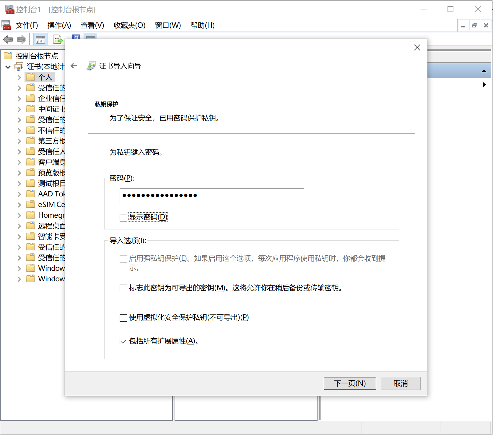
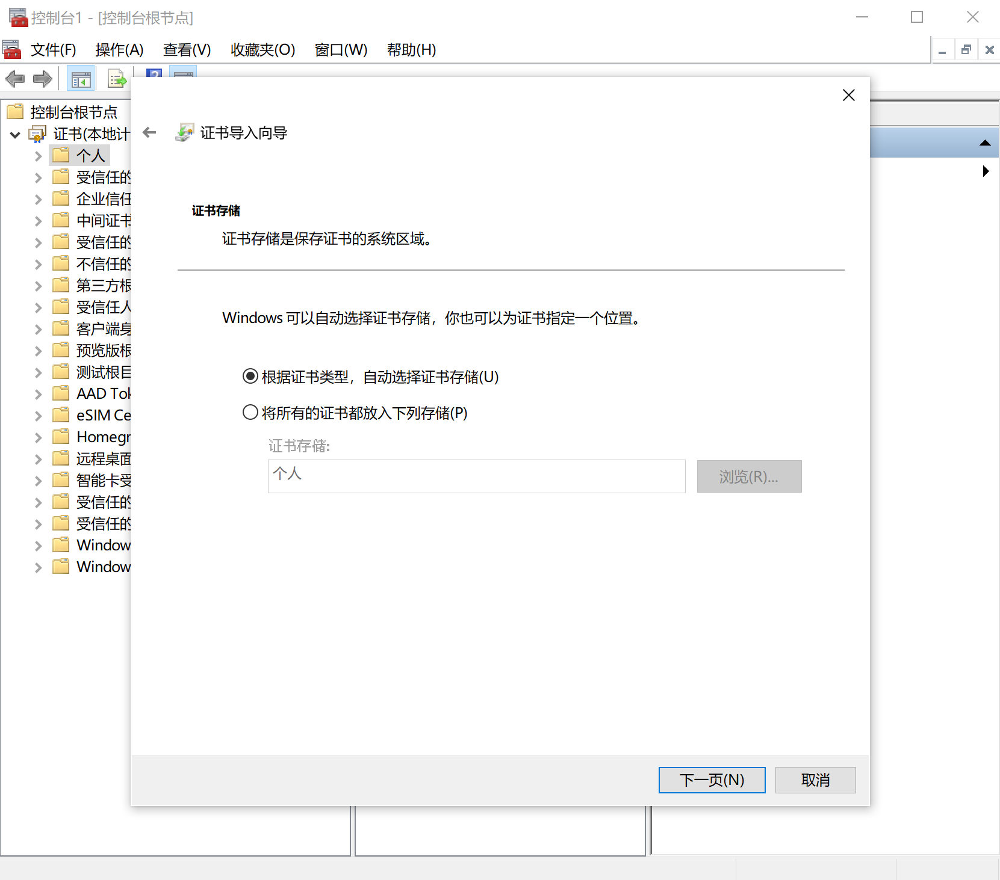
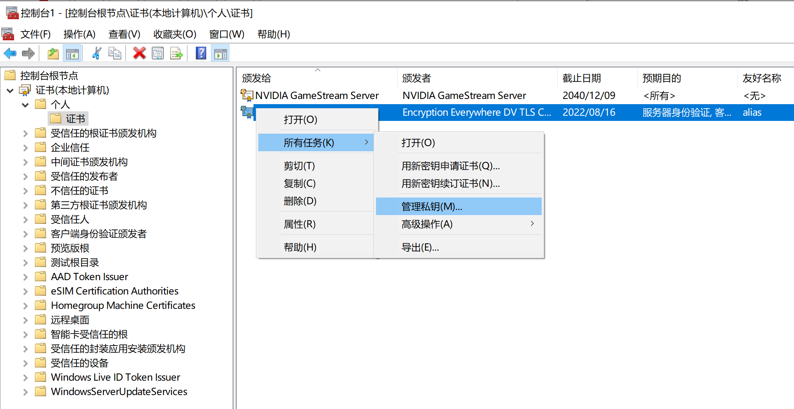
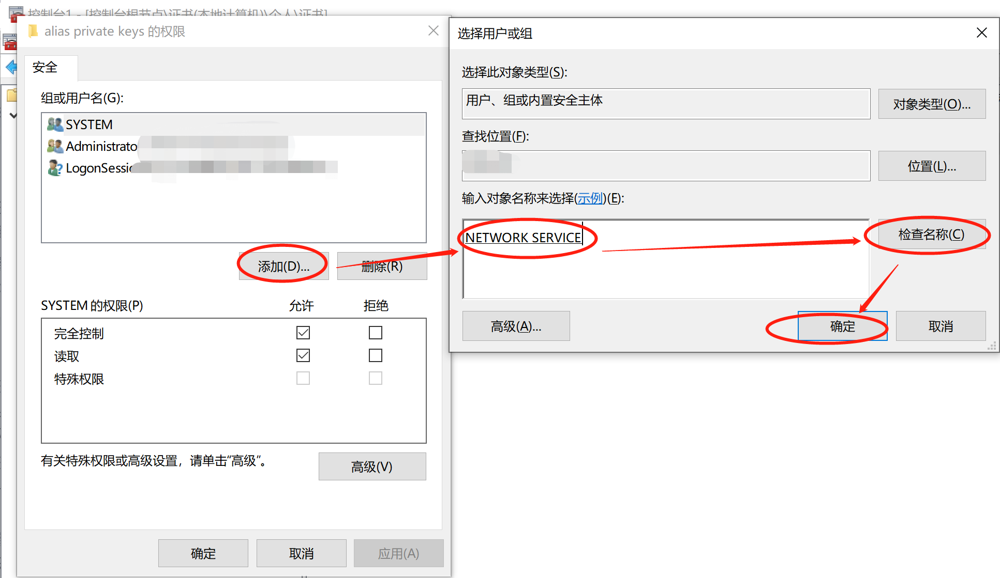
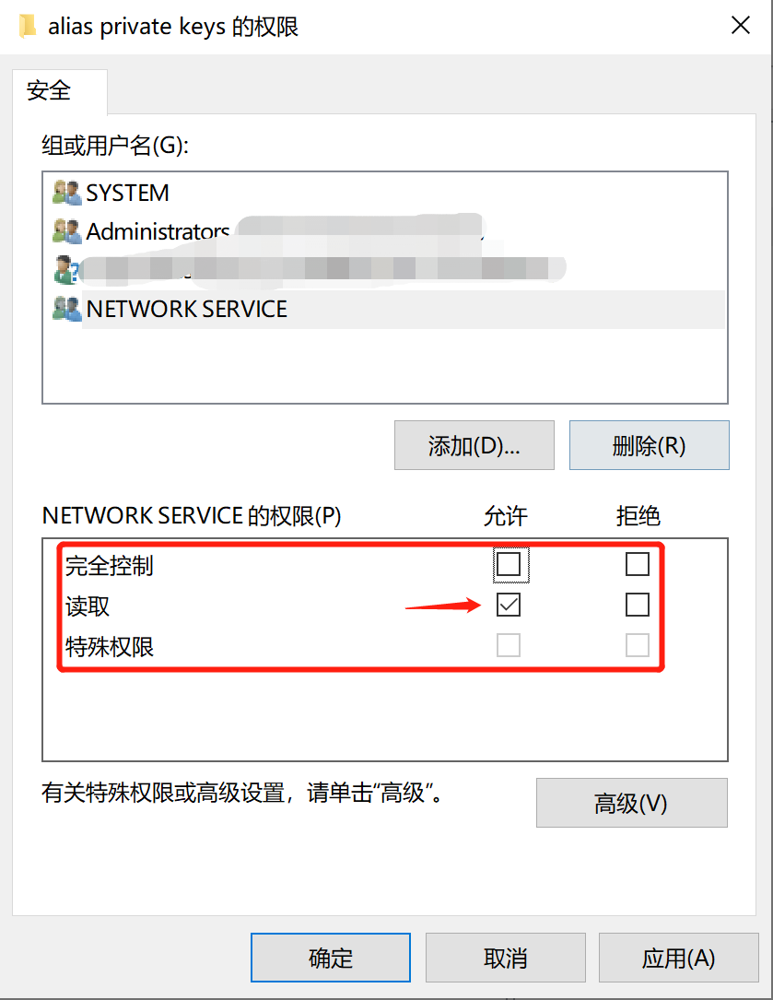
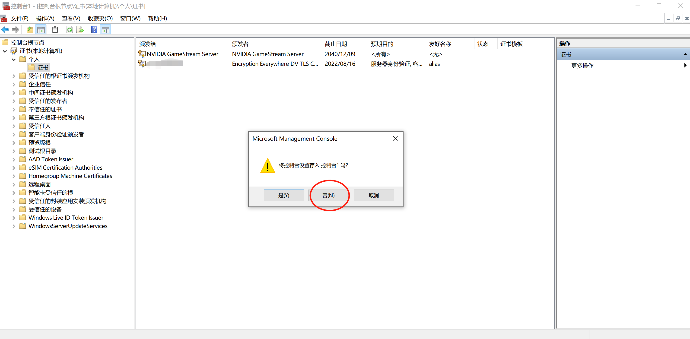
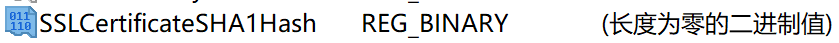
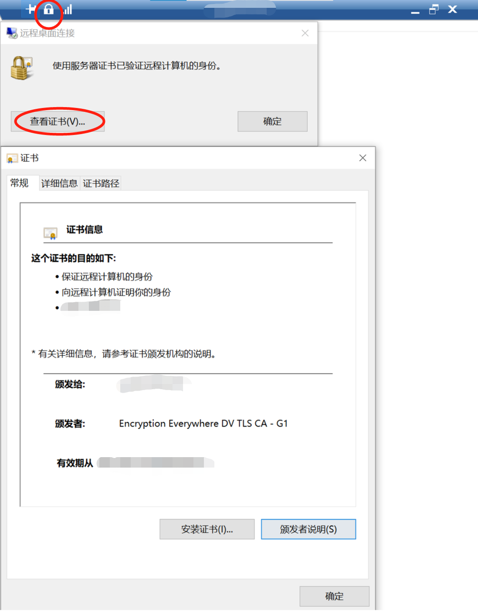

## 摘要

在使用Win10远程桌面的时候经常会提示如下图的“安全证书存在问题”，这代表当前连接确实可能是不安全的，特别是在非私有网络中。本文介绍如何为Win10远程桌面添加SSL证书。

<!-- more --> 

## 申请SSL证书

这一步略，简单说一下我的解决方案：我用的是阿里云的域名，再申请了免费证书之后可以直接下载下载这个 **IIS** 的证书即可

下载下来解压之后有两个文件：一个以`.pfx`结尾，另一个文件名是`pfx-password.txt`，都是一会要用到的

## 添加管理单元

首先按下‘**Win + R**’，进入“运行”，键入“**mmc**”，打开“管理控制台”。

在 **文件** 中选择 **添加/删除管理单元** 。

在左侧选中 **证书** 后点击 **添加** 。

在弹出的对话框中选择 **计算机账户**，点击 下一步 。

之后选择 **本地计算机**（保持默认） 然后点击 **完成** ，再然后点击 **确定** 。

## 导入证书

在 **证书-个人** 上点击 **右键** ，选择 **所有任务-导入** 。

按照向导点击 **下一页** ，按照下图提示选择刚刚我们下载的以`.pfs`结尾的证书文件，然后点击 **下一页**

这里要填密码，密码就是刚刚文件`pfx-password.txt`里的内容，然后点击 **下一页**

然后这里要选择 **根据证书类型，自动选择证书存储** ，然后点击下一步即可，接着再点 **完成** 就结束导入了。

## 管理私钥

“导入证书”之后 **右键 刷新** 一下应该能看到如下图的内容，如果看不到就重新执行一次“添加管理单元的步骤”，然后在新出现的内容上 **右键 所有任务 管理私钥**

然后按照下图所示操作，点击 **添加** ，然后键入 **NETWORK SERVICE**，点击 **检查名称**，然后刚刚键入的NETWORK SERVICE下面会冒出来个下划线，然后点击 **确定**

接着配置一下权限，给它一个 **读取** 权限就好了

然后关掉当前窗口即可，并不用保存。在重新打开，重新执行“添加管理单元”，你会发现东西都在

## 查看证书指纹

**双击** 刚刚你的证书，选择 **详细信息**， 存下下方的 **指纹** 信息一会会用到

*（图片缺失：image-20210815185148922.jpg，旧站时期即为失效引用）*

## 编辑注册列表

首先是按下‘**Win + R**’，进入“运行”，键入“**regedit**”，打开“管理控制台”

展开路径 **HKEY_LOCAL_MACHINE\SYSTEM\CurrentControlSet\Control\Terminal Server\WinStations\RDP-Tcp** ，然后添加名称为 **SSLCertificateSHA1Hash** 的项

添加好了如下图所示

然后**右键 编辑二进制数值**，把刚刚的16进制数值 **敲** 进去，你没看错，必须一个个打进去，并不能复制，至少我这不行，然后点击 **确定**。

## 结果

然后再使用远程桌面连接就不会有安全提示了，并且会有下图所示的标识，还能看到证书信息

## 参考

本文大部分内容及图片参考

https://blog.csdn.net/a549569635/article/details/48831105
