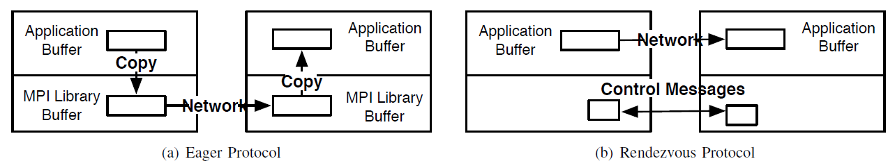
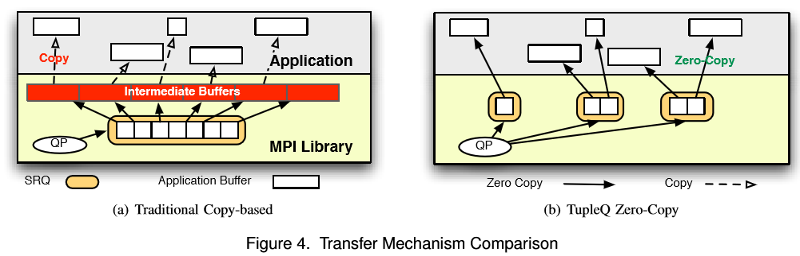
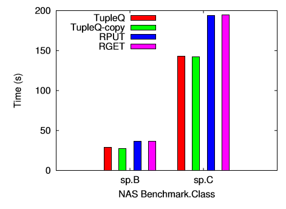
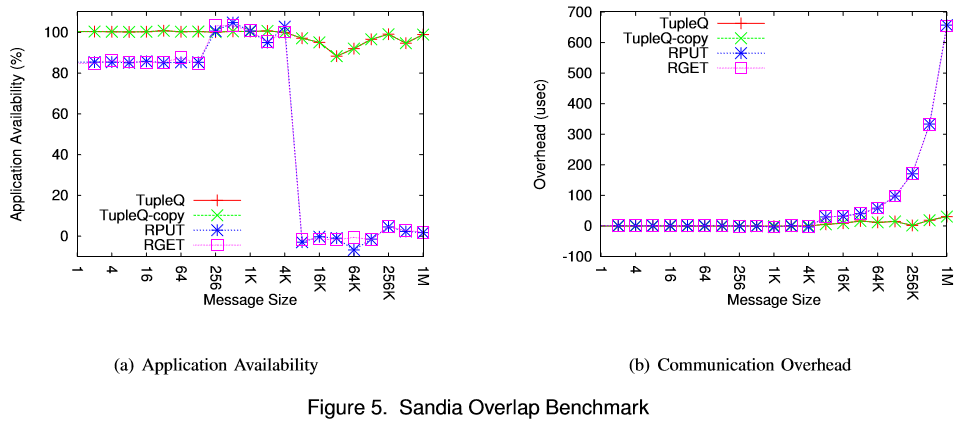

## 摘要

这是2009年发表在IPDPS(B会)的一篇论文
在这篇论文之前，由于IB硬件和接口的限制，还没有一个MPI能实现完全的异步和零拷贝来进行通信。这时IB在`InfiniBand 1.2 specification`新增了`eXtended Reliable Connection (XRC)`和`Shared Receive Queues (SRQs)`两种新特性（然而我并没有在文档中找到……可能是我找错文档了？），作者使用这两种新特性，克服了原先MPI的一些瓶颈，实现了完全异步和零拷贝的MPI

<!-- more --> 

# IB架构
### 通信模式
通信的双方都需要建立一对Queue Pair (QP)，QP里面包含Send Queue (SQ)和Receive Queue (RQ)。每次收发消息都需要建立work requests (WR)来放入队列中。当一个WQ被完成后，就会被放入Completion Queue (CQ)。在接收消息之前，一块buffer必须被分配给QP，这块buffer会按照FIFO的顺序被消耗。
### two types of communication semantics
- Channel模式：像socket一样，通信必须有通信双方都参与其中。
- RDMA模式：可以直接读写通信对端的内存，不过这块内存必须是已经被钉在内存中的

### Shared Receive Queues (SRQs)
这是IB在`InfiniBand 1.2 specification`新增的（虽然我没找到）。
由于每个进程的每个通信对端都要建立一对QP，每个QP又要在内存为其分配buffer。这样当节点上进程数变多，集群规模变大，内存消耗会非常巨大。SRQ可以让多个QP共享一个SRQ，但一个QP只能与一个SRQ相关联。
### eXtended Reliable Connection (XRC)
前面提到的SRQ可以在一个节点上可以有多个，而XRC就是为了在发送时知道要发送到哪一个SRQ。
# 现有的MPI设计模式

### Eager Protocol
发送方发送消息不需要告知接收方，用来发送小消息。由于不知道对方的接收内存地址和接收能力，所以不能使用RDMA。发送方和接收方都要对数据进行一次拷贝。
### Rendezvous Protocol
发送方发送数据之前会现发送Request to Send (RTS)，然后使用RDMA的RPUT或者RGET进行数据传输，最后发送一个finish message (FIN)来结束。使用这种方法可以实现数据的`zero-copy transfer`，但是由于数据并不是马上发送的，所以异步做的并不好。

# 新的设计
## Providing Full Overlap and Zero-Copy
- 使用Channel通信，由于作者发现大家使用tag的频率并不高，并且tag并不会有跟多种，所以为每一个三元组tuple（tag, communicator ID,  rank）建立一个接收队列。如果一个队列还没有绑定一块接收缓存，但是已经接收到了一个消息，则发送方的网卡将会被阻塞直到接收方队列绑定了一块内存。这样就可以由网卡处理所有的发送和接收任务，而不需要CPU的参与。

## Creating Receive Queues
原来的话，需要为每个tuple建立一个QP，而每个QP需要建立一个RC。现在只需要为每个三元组创建一个SRQ，多个SRQ可以共用一个XRC。
RQ是按需求建立的，只有当消息过大的时候，才会建立，然后返回给发送方一个专用SRQ，然后以后往这个SRQ里发送。（这个扩展性太差了吧……万一我的程序就是很多tag呢？）
## Sender-Side Copy
因为MPI_Send完成的标准是buffer能被重用，因此，可以把要发送的数据拷贝到buffer中就返回。
## MPI Wildcards
这种新设计的一个缺陷是，`MPI_ANY_SOURCE`和`MPI_ANY_TAG`。因为，发送方无法同时往多个RQ中发送，接收方收到数据后也不知道往哪放。
解决方案是：遇到这种操作就把其他所有的连接都关闭了，等到这个操作开始传输了，再把别的连接传输恢复。如果这种操作被频繁调用，就完全使用传统的方法。（这个方法有点蠢……）

# 实验结果

在数据包比较大时比较有优势，CPU占用依然低~

# 后记
这篇读起来好迷啊……不知道是我语法太菜还是作者语法太菜……
创新切入点感觉还不错？但是感觉做出来的东西不是很出彩……
看到很迷的时候才去查了下发现是个B会论文……还是尽量去找A会的读吧……
