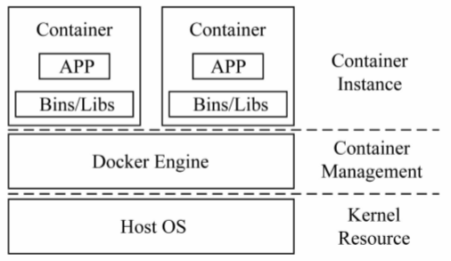

## 摘要

本文是论文《操作系统虚拟化的研究现状与展望》的笔记

<!-- more --> 

## 操作系统虚拟化的技术架构

可以分为三层：容器实例层、容器管理层、内核资源层

## 容器实例层

### 研究要点

- 容器应用场景的适用性
- 容器应用的性能分析

### 适用性

- 能快速部署，提高资源利用率
- 《Skyport – Container-Based Execution Environment Management for Multi-Cloud Scientific Workflows》(2014 无等级 浏览) 解决了科学计算平台的软件部署以及资源利用率低下的的问题：大概也就是个在AWS上部署的框架
- 《Serverless Computation with OpenLambda》（未读）更细粒度的无服务器架构

### 性能分析

- 比传统虚拟化技术性能更好
- 《A performance isolation analysis of disk-intensive workloads on container-based clouds》(2015 无等级 粗读)：cgroups的资源隔离机制有问题，当一个容器爆资源了，会影响其他容器的性能。但是在这篇论文里用LXC容器跑Oracle数据库性能远好于KVM，存在瘦死骆驼比马大的现象。
- 《Performance evaluation of container-based virtualization for high performance computing environment》(2013 浏览)  相当老的一篇论文了，Docker都还没出生。容器性能好，但是只有CPU能较好的隔离，内存、磁盘、网络均不能理想的隔离。文中提到了一个比较有意思的隔离性测试集：IBS (Isolation Benchmark Suite)
- 《A performance study of containers in cloud enviornment》(2016 浏览) ：LXC比Docker更适合IO密集型应用，因为没有花卷文件系统；Docker在延迟上由于多了一次NAT，性能略差于Docker；虚拟机+Docker性能差到难以想象！（怪不得我的阿里云上跑的Docker卡成PPT）

## 容器管理层

### 研究要点

- 镜像管理
- 容器编排：对容器完整生命周期包括容器的准备、部署和监控等多个方面的自动化管理

### 镜像管理

- 容器启动时有76%的时间都是花在了镜像的拉取上
- 有人优化了镜像的拉取策略，先拉取重要的内容
- 也有人优化了镜像的缓存预取策略提高了性能

### 容器编排

- Docker Compose实现了单机多容器应用的管理，它可以根据配置文件自动构建、管理、编排一组容器，为容器应用的定义和运行带来了极大的便捷
- 目前比较流行的解决方案：Kubernets、Docker Swarm、Omega、Borg、Mesos，实现了容器集群的生命周期管理、动态负载均衡、应用配置管理、资源额度管理等内容

## 内核资源层

### 研究要点

- 资源隔离：统计和限制一个容器的资源消耗能力，从而为其他容器保证资源的公平共享，一般用cgroup实现，主要解决容器之间的资源竞争问题。
- 安全隔离：限制容器对逻辑对象的访问，例如文件、内存地址空间、端口号、用户标志、进程标志，使容器之间相互不可见

### 资源隔离

- cgroup是Linux内核提供的一种可以限制、记录、隔离进程组所使用的物理资源的机制，还可以对容器进行挂起和恢复
- 目前有一些研究工作注重对没有得到cgroup支持的资源进行隔离需求分析或者简单隔离
- 《A two-tiered approach to I/O quality of service in Docker containers》(2015 B会 已读) ：使用新的内核功能让IO隔离更加好；让SWARM搜集节点的IO状态，来更好的负载均衡。
- https://linuxcontainers.org/lxcfs/introduction/ (未读)试图利用内核的用户态文件系统模块在容器内实现虚拟/sys和/proc文件系统，以增强容器的资源视图隔离性

### 安全隔离

- 最初是通过chroot实现文件系统的隔离，后来改为使用Linux内核提供的namespace进行隔离
- 《Rapid task provisioning  with serverless-optimized containers》(2018 A会 未读)：namespace会带来额外的性能开销

- 《云计算虚拟化技术的发展与趋势》(2017 未读)：很多云厂商用虚机+docker的形式

#### 利用体系结构技术的方法

使用体系结构来优化namespace的不足是主要趋势

- 《Safe user-level access to privileged CPU features》(2012 未读)：用户直接访问体层硬件
- 《An operating system architecture for intra-kernel privilege separation》(2015 未读)：嵌套内核
- https://github.com/linuxkit/linuxkit/tree/master/projects/okernel (未读)：嵌套内核+扩展页表实现内存地址空间隔离
- 《SCONE: Secure Linux containers with Intel SGX》(2016 OSDI A会 未读)
- KATA Containers(浏览 ❤)
- gVisor (浏览❤)：google做的一个新东西，大概就是基于内核特权指令调用的拦截，但是由于并没有实现所有的拦截，所以对于没有实现的会报错；同时这种拦截的开销似乎挺大的……
- Intel RDT https://www.intel.com/content/www/us/en/architecture-and-technology/resource-director-technology.html (未读❤)

## 一些想法：

有时间把所有内核升级关于namespace和cgroup的内容都刷一遍，看一下有没有能做研究的地方？

从Docker的release note来看，只更新了针对高内核版本的overlay2的优化
