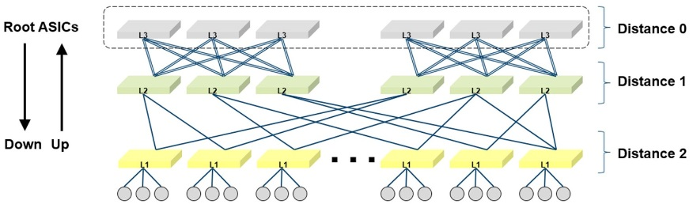
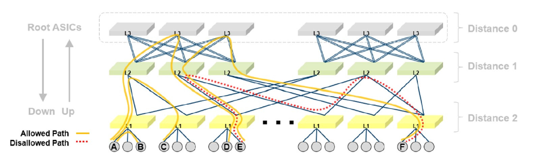
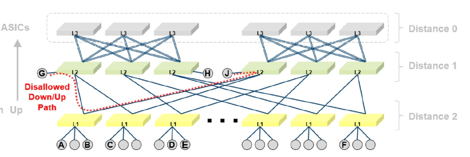
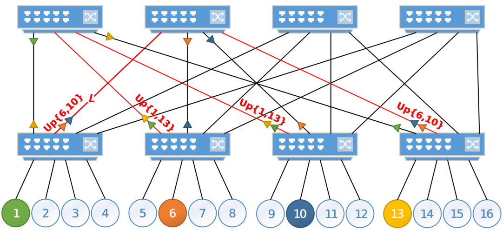
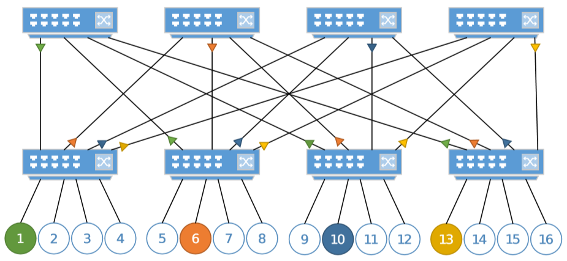

## 摘要

本文学习几种胖树结构下的路由算法的学习笔记（未完待续……）

<!-- more --> 

## Min Hop Algorithm

最小跃点算法，是OpenSM默认选择的算法

算法总共有两步：

1. 在每个交换机上计算最小跳数路由表
2. LFT（Linear Forward Table）输出端口分配，（我猜是写入路由表的意思）

## UPDN Algorithm

参考：https://community.mellanox.com/s/article/understanding-up-down-infiniband-routing-algorithm

`UPDN`还可以写作`Up/Down`、`UpDn`，都是一个东西，这里干脆就译做`单次升降算法`

该算法使用参数`--root_guid_file`指定根交换机的GUID的文件，算法也可以自动发现根交换机GUID，但是强烈建议手动指定，当根交换机被替换时，必须及时修改文件，在每个OpenSM节点上都必须有一份一样的。

记刚刚使用`--root_guid_file`指定的根交换机为`Distance 0`组，与`Distance 0`组距离一跳的，划为`Distance 1`组，距离两跳的再划为`Distance 2`组，算法会不断迭代直到每个交换机都划到一个`Distance x`组中。上图就展示了一个3层链路网路。

UPDN算法首先会调用广度优先生成树算法（BSFP Breadth-First Spanning Tree）。这个过程和以太网中的生成树协议（STP Spanning Tree Protocol）有些类似，但是不同的是：在这里会尽量的寻找尽可能多的可能的路径。所以在BSFP执行完后会得到每一对节点之间的所有可能的最短路径。接着UPDN算法会去掉这些最短路径中包含这样路径的路径：从`Distance N`到`Distance N+1`又到`Distance N`的路径，即含有”下上下“路径的路径。使用这种方法，可以避免环路。最将路径写入路由表。

如上图所示，从E到F有两条路可走，但是红色的路径含有“下上下”的路径，故会被排除。也正是因为这样的特性，所以在有些情况下一对端点可能会没有路径。当OpenSM中的`calculate_missing_routes`属性设置为`TRUE`，OpenSM会自动监控，保证所有端点之间的连通性。下图就是一个例子

根据UPDN算法的计算，点G和J之间会没有路径，当OpenSM中的`calculate_missing_routes`属性设置为`TRUE`，就会自动为其产生特殊路径。但是Mellanox建议您还是最好别这么连~

UPDN算法和胖树结构的**无信用环**属性对于可靠的网络运行至关重要。

由于UPDN算法产生的路由是静态的，不考虑任何的实际负载和网络流量状态，因此在一些情况下可能不是最优的。在UPDN算法和最小跳数算法算法中可以设置一个参数`scatter-ports`可以让为流量随机分配路径，这样往往可以让提高链路的利用率。该参数需要制定一个数作为随机数种子，建议使用质数。

## Fat-tree Routing Algorithm

参考：

https://docs.mellanox.com/display/MLNXOFEDv461000/OpenSM#OpenSM-fatreeroutingalgorithmFat-treeRoutingAlgorithm

Optimized InfinibandTM fat-tree routing for shift all-to-all communication patterns

A Weighted Fat-Tree Routing Algorithm for Efficient Load-Balancing in Infini Band Enterprise Clusters

胖树路由算法，是一种利于进行"shift"通信的算法，应该在网络是一个对称或者几乎对称的胖树结构时使用。胖树路由算法不仅支持”K叉N树“（K- ary-N-Trees），它可以支持非常数K，因为并不是每个叶子上都有节点。和UPDN算法一样，胖树路由算法也可以避免出现信用环和死锁。

该算法以索引为顺序（indexing order）遍历整个网络结构，为每个交换机端口相连的节点的分配LID，从而产生相应的路由。连接到同一个叶交换机的的节点，它们的编号由交换机的端口决定（按端口编号递增）。对于每一个端口，该算法包含一个端口计数器（port usage counter），用来在一条路由被添加时选择一个最少使用的端口。如果有多个端口连接到相同的交换机，那么这些端口将形成一个端口组（port group）。因此，在添加一条路由时，会在所有的端口组中根据端口计数器，选择一个最少使用的端口。

为端口（相连的节点）分配LID由递归的完成，并且是由叶交换机开始。在每次递归一层的时候：该算法遍历每一个节点到该层树根的路，并为每个LID在子树向下传播上行的路由，然后向上传播下行的路由。

**不符合要求的拓扑会导致路由算法回退到最小跃点算法，当出现链路故障时也有可能出现**

请注意，尽管胖树算法支持具有非整数CBB比率的树，但路由不会像整数CBB比率那样平衡。另外，尽管该算法允许叶子交换机具有任意数量的CA，但树越接近完全填充，shift通信模式将越有效。 通常，即使提供了根列表，拓扑也越接近纯对称的胖树，路由将越优化。

该算法还将计算节点的索引顺序缓存了下来，在OpenSM日志文件的旁边。

配置`io_guid_file`选项允许非计算节点配置在非叶交换机上，但是该算法并不赵峥这些节点之间的路由。

## Adaptive Routing (AR)

参考：

https://community.mellanox.com/s/article/How-To-Configure-Adaptive-Routing-and-SHIELD-New

https://docs.mellanox.com/display/MLNXOFEDv451010/OpenSM#OpenSM-AdaptiveRoutingManager

https://community.mellanox.com/s/article/adaptive-routing-and-fall-back-routing

从一定意义上来说，自适应路由并不是OpenSM中支持的路由算法，而是以一个插件的形式存在的，在使用时OpenSM会以动态库的形式将其加载进来。

自适应的路由算法有FLFR(Fast Link Fault Recovery and Notification)功能，从而能快速从故障中自动恢复。

自适应路由让交换机根据端口的实时负载自动地选择路由的端口，在选择的时候有两种模式：

- Free AR: 在选择时不做任何限制
- Bounded AR: 交换机在同一次爆发流量中，路由不会改变，这可以大大减少包的乱序到达。

OpenSM会首先会扫描所有交换机，以确定哪些交换机支持自适应路由，并在这些交换机上配置该功能。

自适应路由管理器支持三种算法，这三种算法会生成AR group和 AR LFT（Linear Forwarding Tables）,从而让交换机在AR group中根据AR LFT和目标LID选择转发端口。三种算法如下：

- LAG：所有连接到同一个交换机的端口在同一个AR group中。该算法适用于任何在交换机之间有多个链路的的任何拓扑，尤其是在x,y,z方向上都有多条链路的3D torus/mesh拓扑。
- TREE：所有到目标点具有相同跳数的端口在同一个AR group中。该算法适用于树结构，例如胖树、quasi fat tree、parallel links fat tree。该算法必须与UPDN routing engine同时使用。
- DF_PLUS：Dragonfly plus 拓扑结构专用算法。

Fast Link Fault Recovery (FLFR) 让交换机能够在某个输出端口状态不正常时，在其他的多个输出端口之间动态选择。该功能能够在发生端口错误和断连时进行快速流量恢复，而不需要OpenSM的参与，同时还能转告相邻的交换机，尽量不把相关流量转发过来。

## 其他路由算法

OpenSM自带的路由算法还有：

- [LASH Routing Algorithm](https://docs.mellanox.com/display/MLNXOFEDv461000/OpenSM#OpenSM-LASHLASHRoutingAlgorithm)
- [DOR Routing Algorithm](https://docs.mellanox.com/display/MLNXOFEDv461000/OpenSM#OpenSM-DORDORRoutingAlgorithm)
- [Torus-2QoS Routing Algorithm](https://docs.mellanox.com/display/MLNXOFEDv461000/OpenSM#OpenSM-Torus-2QoSTorus-2QoSRoutingAlgorithm)

在此忽略

另外[Routing Chains](https://docs.mellanox.com/display/MLNXOFEDv461000/OpenSM#OpenSM-routingchainsRoutingChains)功能还提供了使用其他路由引擎的接口

## Fat-tree 路由算法的改进工作研究

### A Weighted Fat-Tree Routing Algorithm for Efficient Load-Balancing in Infini Band Enterprise Clusters

该论文指出fat-tree算法有两个主要的缺陷：

1. 难以发现的负载不均衡：该算法使用的负载均衡方法未考虑任何的节点流量特征。简单来说，它假设网络中的所有节点都有相同的权重。但是在现代HPC集群，有些节点扮演的特殊角色决定了他们的流量特征。例如存储节点和IO转发节点会比其他节点产生更多的流量。因此与这些特殊节点的通信经常会被阻塞，所以这时候就需要一个带有优先级的负载均衡算法。

2. 不稳定的性能：因为该算法以索引为顺序（indexing order）遍历整个网络结构，然而它的索引顺序是不能被设置的，并且由叶交换机端口号决定。这就导致了以相同方式布线的胖树结构可能会出现不同且不可预测的性能。比如，在一个二层胖树结构，在不同叶交换机上的两个节点共享了同一个索引顺序，那么这两个节点将被路由到相同的根交换机，因此，所有从其他叶交换机发向这两个节点的流量，都将竞争连接到同一个根交换机的一组上行链路，即使有其他的几条通过其他根交换机的轻负载链路。

   在下图中有颜色的节点1、6、10、13是接收节点，将会接收大量的网络流量。每个叶交换机都连接到了4个根交换机。假设索引顺序从左向右递增，节点1-13，6-10在叶交换机有相同的index位置（1和2）。该算法会将这四个节点的流量都路由到左边两个交换机上。这将导致图中标红的4条链路出现较多流量，图中的`Up{a,b}`表示发送到节点a和b的流量会被计入这条链路的带宽。因此，虽然有足够的链路能让发送到节点a和b的流量互不干扰，但是该算法并不会这样选择。

   

   一个理想的情况应该是如下图所示的，各条流量之间都互不干扰。

   

### On the Impact of Routing Algorithms in the Effectiveness of Queuing Schemes in High-Performance Interconnection Networks

[On the Impact of Routing Algorithms in the Effectiveness of Queuing Schemes in High-Performance Interconnection Networks](https://www.semanticscholar.org/paper/On-the-Impact-of-Routing-Algorithms-in-the-of-in-Rocher-Gonzalez-Escudero-Sahuquillo/14d341667c071ad3a4c8729e39c8d38b36e690e5)

貌似是研究交换机中的包的缓存策略的，似乎无关。

### Multistage Switches are not Crossbars: Effects of Static Routing in High-Performance Networks

[Multistage Switches are not Crossbars: Effects of Static Routing in High-Performance Networks](https://www.researchgate.net/publication/221201591_Multistage_Switches_are_not_Crossbars_Effects_of_Static_Routing_in_High-Performance_Networks)

貌似相关，但是非常老，2008年的了，还没看。

## 未读论文

[Efficient Congestion Management for High-Speed Interconnects using Adaptive Routing](https://www.semanticscholar.org/paper/Efficient-Congestion-Management-for-High-Speed-Rocher-Gonzalez-Escudero-Sahuquillo/7c9d45a2063fdba7d3548aaddf2ebc44e1b79871)

[A new proposal to deal with congestion in InfiniBand-based fat-trees](https://www.researchgate.net/publication/259132161_A_new_proposal_to_deal_with_congestion_in_InfiniBand-based_fat-trees)

下载不到

[Efficient Dynamic Isolation of Congestion in Lossless DataCenter Networks](https://www.researchgate.net/publication/335186544_Efficient_Dynamic_Isolation_of_Congestion_in_Lossless_DataCenter_Networks)

[Bandwidth-optimal all-to-all exchanges in fat tree networks](https://www.researchgate.net/publication/262283002_Bandwidth-optimal_all-to-all_exchanges_in_fat_tree_networks)

[Quasi Fat Trees for HPC Clouds and Their Fault-Resilient Closed-Form Routing](https://www.researchgate.net/publication/277648069_Quasi_Fat_Trees_for_HPC_Clouds_and_Their_Fault-Resilient_Closed-Form_Routing)

[Optimized Routing for Large-Scale InfiniBand Networks](https://www.researchgate.net/publication/232618040_Optimized_Routing_for_Large-Scale_InfiniBand_Networks)

[Congestion avoidance on manycore high performance computing systems](https://www.researchgate.net/publication/230802101_Congestion_avoidance_on_manycore_high_performance_computing_systems) - Panda

[Multi-homed Fat-Tree Routing with InfiniBand](https://www.researchgate.net/publication/261961220_Multi-homed_Fat-Tree_Routing_with_InfiniBand)

[Achieving Predictable High Performance in Imbalanced Fat Trees](https://www.researchgate.net/publication/221041288_Achieving_Predictable_High_Performance_in_Imbalanced_Fat_Trees)

[Combining Source-adaptive and Oblivious Routing with Congestion Control in High-performance Interconnects using Hybrid and Direct Topologies](https://www.researchgate.net/publication/332532491_Combining_Source-adaptive_and_Oblivious_Routing_with_Congestion_Control_in_High-performance_Interconnects_using_Hybrid_and_Direct_Topologies)

[Preliminary Performance Analysis of Multi-rail Fat-Tree Networks](https://www.researchgate.net/publication/318409269_Preliminary_Performance_Analysis_of_Multi-rail_Fat-Tree_Networks)

[Scheduling-Aware Routing for Supercomputers](https://www.researchgate.net/publication/315365328_Scheduling-Aware_Routing_for_Supercomputers)

[The impact of network noise at large-scale communication performance](https://www.researchgate.net/publication/220953591_The_impact_of_network_noise_at_large-scale_communication_performance)
